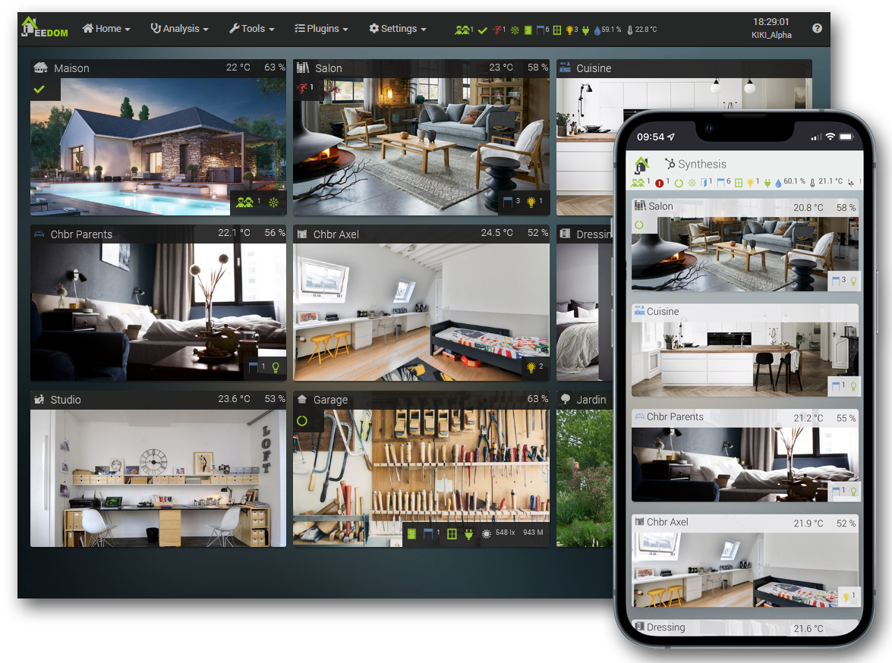

  🇬🇧 <strong>English</strong> | 🇫🇷 <a href="README.fr.md">Français</a>

# Jeedom - Innovative Home Automation

  <a href="https://jeedom.com">Website</a>  -
  <a href="https://doc.jeedom.com">Documentation</a>  -
  <a href="https://community.jeedom.com">Forum</a>  -
  <a href="https://blog.jeedom.com">Blog</a>  -
  <a href="https://market.jeedom.com">Market</a>
  

Jeedom is a free, open source, multi-protocol home automation software that lets you centralize and manage your connected devices to make your home truly smart. It does not require access to external servers to function, guaranteeing complete privacy.

Thanks to intuitive, easy-to-use scenarios, you can create automations that reflect who you are. Widgets, views and designs make it easy to build the interface of your choice.

## Plugins

Jeedom is built around the core, which acts as the central engine providing the base functions, and plugins that use it to offer features tailored to your hardware and your needs.

Plugins can come from different sources *(official or third-party)*, the main one being the [Jeedom Market](https://market.jeedom.com). Jeedom's decentralized architecture also makes it easy to quickly create your own plugin tailored to your requirements *(see the [General documentation - Plugin development](#general-documentation) section)*.

## Documentation

The complete documentation is available at: https://doc.jeedom.com/home/en_US. It is made up of several sections grouped together on this site to provide all the information you need in one place.

### General documentation

General documentation covers universal topics that aren't specific to the core or to plugins, such as:

- [**Installation**](https://doc.jeedom.com/installation/en_US/): guides for installing Jeedom on any 64-bit Debian Linux system.
- [**Overview**](https://doc.jeedom.com/presentation/en_US/): an overview of the software and its main features.
- [**Concepts**](https://doc.jeedom.com/concept/en_US/): an overview of the usage concepts and possibilities offered by Jeedom.
- [**Beta testing and contributions**](https://doc.jeedom.com/contribute/en_US/beta): detailed procedure for beta testers and contributors.
- [**Plugin development**](https://doc.jeedom.com/dev/en_US/): guides covering the different stages of developing a Jeedom plugin.

### Core documentation

Documentation specific to Jeedom's core is available both locally in the [docs/en_US](docs/en_US/) folder and in the **User manuals** and **Configuration manuals** sections of the documentation site.

#### User manuals

Each Jeedom feature has its own detailed user manual, for example:

- [**Changelog**](https://doc.jeedom.com/core/changelog): the changelog lists the changes made in each version of Jeedom.
- [**Plugins**](https://doc.jeedom.com/core/plugin): install, configure and make the most of Jeedom plugins.
- [**Scenarios**](https://doc.jeedom.com/core/scenario): details all the possibilities for setting up custom automations.
- [**Widgets**](https://doc.jeedom.com/core/widgets): lets you customize how commands are displayed in the interface.
- [**FAQ**](https://doc.jeedom.com/core/faq): answers to the most frequently asked questions.

#### Configuration manuals

Guides in this category explain how to configure Jeedom to suit your own criteria:

- [**Administration**](https://doc.jeedom.com/core/administration): brings together most of Jeedom's configurable settings.
- [**Users**](https://doc.jeedom.com/core/user): lets you manage Jeedom users and configure their access and permissions.
- [**Preferences**](https://doc.jeedom.com/core/profils): customization of the interface and security for the current user.
- [**Advanced customization**](https://doc.jeedom.com/core/custom): advanced interface customization *(`CSS` and/or `Javascript`)*.
- [**Backups**](https://doc.jeedom.com/core/backup): configuring local and remote Jeedom backups.

### Plugin documentation

Each Jeedom plugin has its own documentation and changelog, accessible by category *(Home protocol, Energy, Monitoring, Security, Programming, etc.)* in the **Official plugins** section for those developed by the Jeedom team, or **Third-party plugins** for those from external developers.

---

<small>*Jeedom is a free, open source, privacy-respecting and multi-protocol home automation solution since 2014*</small>
