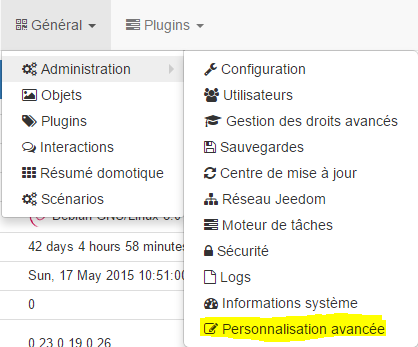
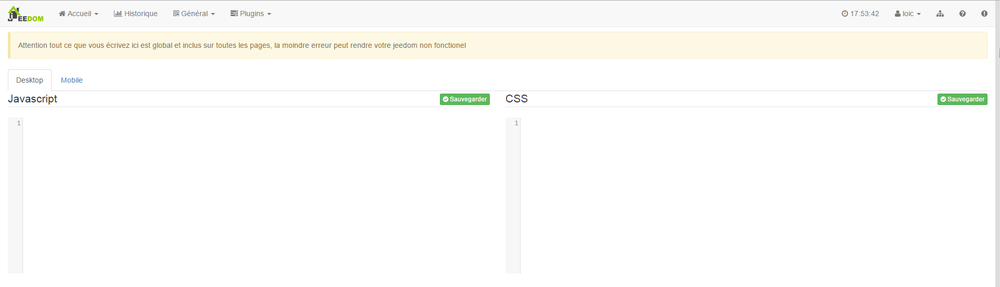

Réservé aux experts, cette page permet d’ajouter des script CSS ou JS en plus dans Jeedom, qui sont exécutés sur chaque page

Erreichbar unter Einstellungen → Erweiterte Anpassung

Sobald sie darauf sind, sehen sie :

Vous pouvez donc à partir de cette page ajouter des scripts JS et CSS executés partout dans Jeedom en distinguant la version desktop de la version mobile

> **Important**
>
> Jeder Fehler in einem dieser Skripte kann Jeedom völlig unerreichbar machen und mann muß sich via SSH verbinden um die geänderten Dateien zu löschen und zurückbekommen zu können

