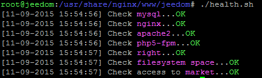

Ich habe eine leere Seite  
Sie müssen eine Verbindung über SSH zu Jeedom herstellen, und führen sie dann ein Selbsttest-Skript aus :

<!-- -->

    sudo chmod +x /usr/share/nginx/www/jeedom/health.sh;sudo /usr/share/nginx/www/jeedom/health.sh

Hier ist das Ergebnis, wenn alles gut ist :

Wenn es Probleme gibt, versucht das Skript sie zu korrigieren, wenn das nicht funktioniert, werden sie informiert.

Sie können auch das Protokoll ansehen /usr/share/nginx/www/jeedom/log/nginx.error, sehr oft zeigt dieses die Probleme an

Ich habe ein Problem mit der BDD-Kennung  
Sie müssen diese Zurücksetzen

<!-- -->

    bdd_password=$(cat /dev/urandom | tr -cd 'a-f0-9' | head -c 15)
    echo "DROP USER 'jeedom'@'localhost'" | mysql -uroot -p
    echo "CREATE USER 'jeedom'@'localhost' IDENTIFIED BY '${bdd_password}';" | mysql -uroot -p
    echo "GRANT ALL PRIVILEGES ON jeedom.* TO 'jeedom'@'localhost';" | mysql -uroot -p
    cd /usr/share/nginx/www/jeedom
    sudo cp core/config/common.config.sample.php core/config/common.config.php
    sudo sed -i -e "s/#PASSWORD#/${bdd_password}/g" core/config/common.config.php
    sudo chown www-data:www-data core/config/common.config.php

Ich habe überall {{…}}  
La cause la plus fréquente est l’utilisation d’un plugin en version beta, et Jeedom en stable, ou l’inverse

Bei einem Befehl habe ich ein Rad, das sich dreht, ohne stehen zu bleiben  
Wiederum, das kommt oft von einem Beta-Plugin, während Jeedom jedoch stabil ist

Ich habe keinen Zugriff auf Jeedom oder SSH  
Dieser Fehler ist nicht in Jeedom, aber es besteht ein Problem mit dem System. Wenn es nach einer Neuinstallation fortbesteht, ist es ratsam, mit dem Service die Hardware-Probleme anzusehen

Mein Szenario hört nicht mehr auf  
Er wird empfohlen die Befehle anzusehen, die das Scenario ausführen, oft kommt das von einem Befehl, der nicht endet.

Mon scénario est lent à se déclencher  
Wenn es im Szenario keine Pause gibt, wird geraten das Kontrollkästchen "so schnell wie möglich auszuführen" anzukreuzen (verfügbar im Experten-Modus)

Ich habe keine Fehler in dem nginx.error Protokoll dennoch den Fehler 500  
In SSH : Editez le fichier /etc/php5/fpm/pool.d/www.conf et décommantez la ligne ";catch\_worket\_process=yes" (supression du ;) und php neustarten "sudo service php5-fpm restart"

Ich habe Instabilitäten oder Fehler 504  
Vérifiez si votre système de fichiers n’est pas corrompu, en ssh la commande est : "sudo dmesg | grep error"

Ich sehe nicht, alle meine Geräte auf dem Armaturenbrett  
Oft ist es die Tatsache, dass das Gerät an ein Objekt zugeordnet ist, das nicht der Sohn oder das Objekt selbst des ersten Objekts in der Baumstruktur auf der linken Seite ausgewählt wurde (Sie können in ihrem Profile dieses konfigurieren)

Bei der Verbindung vom Master mit den Slave habe ich einen Fehler  
Vergewissern Sie sich, das sie "/jeedom" direkt nach der Jeedom-IP verwenden (Oft ist es bei der DIY Installation der Fall)

Ich habe die folgende Fehlermeldung: SQLSTATE [HY000] [2002] Kann nicht auf lokalen MySQL-Server verbinden */var/run/mysqld/mysqld.sock*  
Dass ist MySQL-Code der sich aufgehängt hat, das ist nicht normal, die üblichen Probleme sind :

-   souci de place sur le système de fichiers (peut être vérifié en faisant la commande "df -h", en ssh)

-   problème de corruption de fichier(s), arrive souvent suite à un arrêt non propre de Jeedom (coupure de courant)

Leider gibt es nicht viel Auswahl, wenn dies der zweite Fall ist, am besten ist es ein Backup abzurufen (standardmäßig in /usr/share/nginx/www/jeedom/backup verfügbar), de réinstaller Jeedom et de restaurer le backup. Sie könne auch mit SSH sehen warum mysql nicht startet.

    sudo su -
    service mysql stop
    mysqld --verbose

Oder in das Protokoll sehen : /var/log/mysql/error.log

Les boutons Eteindre/Redémarrer ne fonctionnent pas  
Auf einer DIY Installation ist das normal, man muss daher unter SSH den Befehl visudo eingeben und am Ende der Datei müssen sie hinzufügen : www-data ALL=(ALL) NOPASSWD: ALL.

Ich habe oft "502 bad gateway"  
Sie müssen (Experten Modus) in die Jeedom Konfiguration gehen, System-OS und klicken sie dann auf Start. Klicken sie auf "PHP log", wenn sie die Nachricht "server reached pm.max\_clidren" bekommen, liegt es an nicht genug php-fpm-Prozesse, es müssen mehr autorisiert werden. Dafür muß man folgendes machen :

<!-- -->

    sudo su -
    cd /etc/php5/fpm/pool.d/
    vim www.conf

Die Zeile "pm.max\_children" ändern in "pm.max\_children = 20"

Starten sie einfach php5-fpm neu

    sudo service php5-fpm restart

Je ne vois pas certains plugins du Market  
Ce genre de cas arrive si votre Jeedom n’est pas compatible avec le plugin, en général une mise à jour de jeedom corrige le souci

