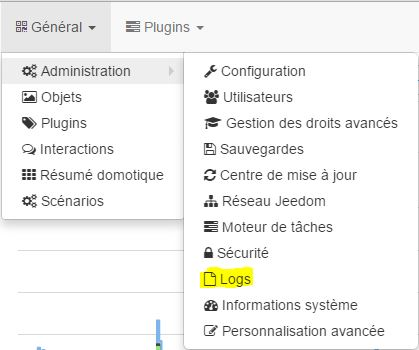
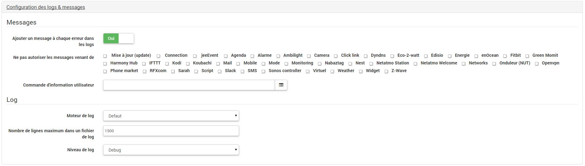
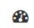
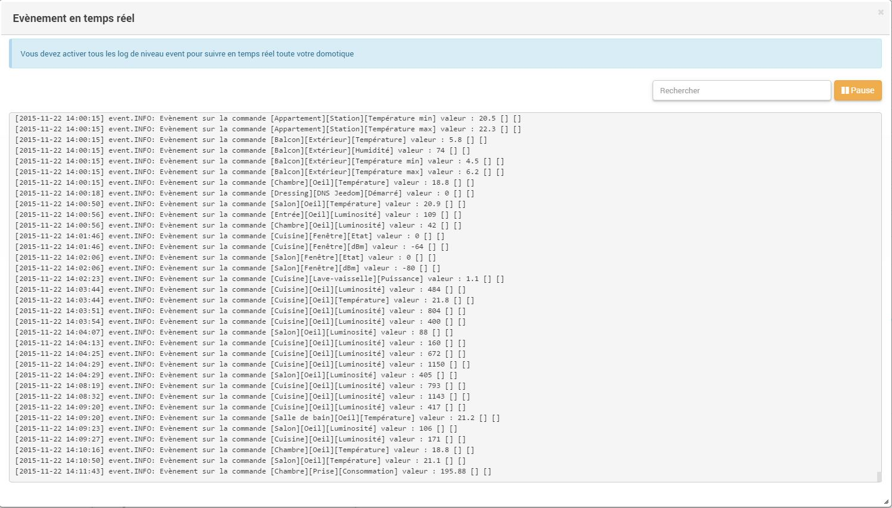

Ansicht
=======

Im Logs-Menü können Sie verfolgen, was in der Home-Automation geschieht. In den meisten Fällen wird das Protokoll verwendet, um die Fehlersuche und Problemlösung durch das Support-Team durchzuführen. Dieses Menü ist nur im Experten-Modus verfügbar.

Pour y accèder il faut aller dans Administration → Logs :

Hier finden Sie :

Die Logs-Seite ist ganz einfach, oben links ist ein Dropdown-Menü, dass die Auswahl der Logs ermöglicht und oberen rechts sind 5 Schaltflächen :

-   **Aktualisieren** : Aktualisiert das aktuelle Protokoll,

-   **Herunterladen** : zum herunterladen des aktuellen Protokolls ,

-   **Leeren** : wird verwendet, um das aktuelle Protokoll zu löschen,

-   **Löschen** : Löscht das aktuelle Protokoll, wenn Jeedom es benötigt, wird es automatisch neu erstellt,

-   **Alle Protokolle löschen** : Löscht alle vorhandene Protokolle.

> **Tip**
>
> Man beachte, daß das Protokoll nginx.error nicht gelöscht werden kann. Es ist unbedingt erforderlich! Wenn sie es entfernen (zum Beispiel in der Befehlszeile) wird es nicht neu erstellt, dazu muß Jeedom neu gestartet werden.

Konfiguration
=============

Es gibt bestimmte Konfigurations Parameter der Logs (zugänglich durch Administation - \> Konfiguration dann der Teil „Logs & Nachrichten Konfiguration“).

Hier haben Sie folgende Möglichkeiten :

-   **Nachricht**

    -   **Eine Nachricht zu jedem Fehler in den Logs hinzufügen** : wenn ein Plugin oder Jeedom eine Fehlermeldung in ein Protokoll schreibt, fügt Jeedom automatisch eine Nachricht in die Nachrichtenzentrale (zumindest sind sie sicher, dass sie am Ende nichts verpassen)

    -   **Ne pas autoriser les messages venant de** : permet d’interdire certains messages venant d’un plugin ou autre

    -   **Commande d’information utilisateur** : erlaubt, ein oder mehrere Befehle (ist durch && zu trennen) vom Typ Nachricht auszuwählen, die bei neuen Nachrichten benutzt werden (ermöglicht, gleich benachrichtigt zu werden )

-   **Log**

    -   **Protokoll Engine** : ermöglicht, die Protokoll Engine auszuwechseln, um sie zum Beispiel an einem syslog(d) Dämon zu senden

    -   **Maximale Anzahl der Zeilen in einer Log-Datei** : Legt die maximale Anzahl der Zeilen in einer Log-Datei fest, es wird empfohlen, diesen Wert nicht zu ändern, weil ein zu großer Wert auf das Dateisystem überfüllen könnte und/oder Jeedom ist nicht mehr in der Lage das Protokoll zu sehen.

    -   **Logs actifs** : permet de définir les niveaux de log actif. Attention : plus il y a de niveaux actifs, plus Jeedom peut être lent ! Cela entraîne aussi une usure prématurée de la carte SD. Il est conseillé de n’activer que le niveau "Error". "Event" peut être activé aussi car il est nécessaire pour voir en temps réel ce qui se passe sur sa domotique (bien sûr c’est seulement si vous en avez besoin).

Das Protokoll "Ereignis" und die Protokollebene "Ereignis"
==========================================================

Le log "Event" est un peu particulier. Tout d’abord pour qu’il fonctionne, il faut activer le niveau de log "Info" ou plus, ensuite celui-ci recense tous les évènements ou actions qui se passent sur la domotique. Pour y accéder, il faut cliquer sur la petite icône "compteur" en bas à droite dans Jeedom :

Sobald sie darauf klicken, erhalten sie ein Fenster, das jede Sekunde aktualisiert wird und alle Ereignisse in Ihrer Home-Automation anzeigt.

Oben rechts haben sie ein Suchfelder (funktioniert nur, wenn sie nicht angehalten haben) und eine Schaltfläche für die Pause (nützlich zum Beispiel für Kopieren/Einfügen).

> **Important**
>
> Pour que cela fonctionne il faut absolument avoir activé le niveau de log "Info" ou plus (voir paragraphe précédent)

