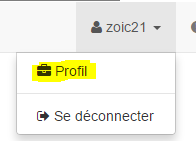
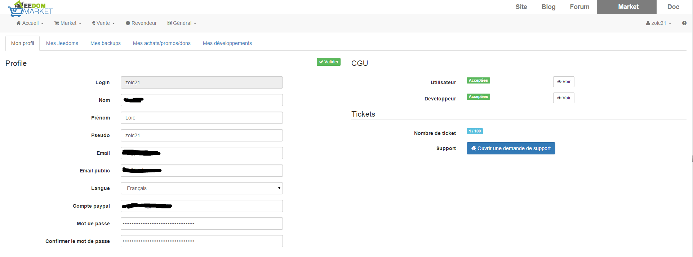
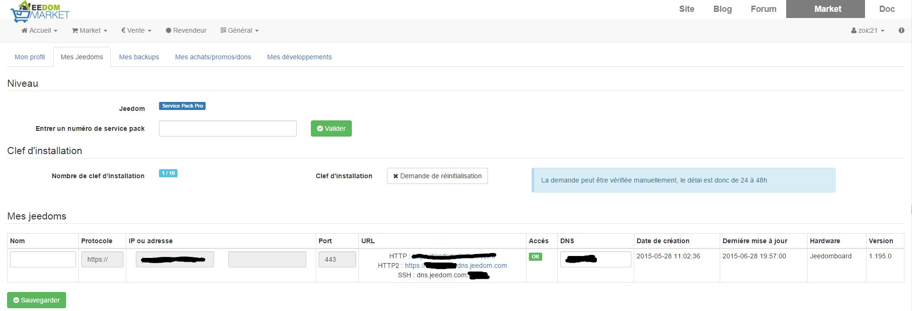
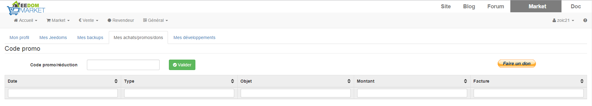
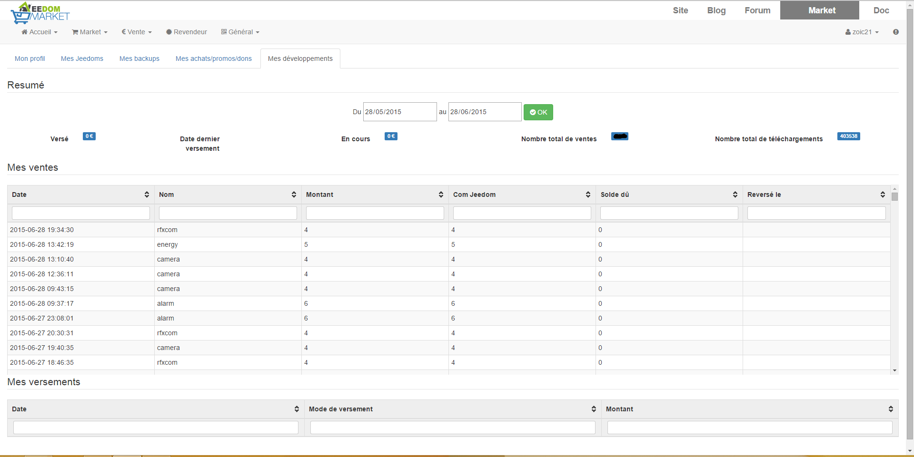

Doc un peu particulière car elle va traiter uniquement de votre page profil du market.

Disponible en allant sur votre nom d’utilisateur puis profil à partir du market (un peu comme sur Jeedom) :

Er besteht aus mehreren Teilen :

Mein Profil
===========

Hier können sie verschiedene Einstellungen Ihres Profiles anpassen :

-   **Profil**

    -   **Login** : Ihre Anmeldung auf dem Markt, es kann nicht geändert werden.

    -   **Name** : Ihren Namen (Diese Information ist sinnvoll, um freundliche E-Mails zubekommen)

    -   **Vorname** : Ihren Vorname (Diese Information ist sinnvoll, um freundliche E-Mails zubekommen)

    -   **Pseudo** : Votre pseudo (uniquement pour les développeurs)

    -   **Email** : Ihre E-Mail

    -   **Email public** : Non utilisé pour le moment mais ça pourrait être un email de contact pour les développeurs si un jour on met en place ce genre de service

    -   **Sprache** : Ihre Sprache

    -   **Compte paypal** : Votre mail de compte Paypal (uniquement utilisé pour payer les developpeurs)

    -   **Passwort && Passwort bestätigen** : Um ihr Passwort zu ändern.

-   **CGU** : AGB (allgemeine Geschäftsbedingungen)

    -   **Utilisateur** : conditions générales d’utilisation (attention à bien les lire car elles vous engage)

    -   **Entwickler** : Allgemeine Geschäftsbedingungen für Entwickler

-   **Gutscheine**

    -   **Gutschein Anzahl** : Anzahl der Gutscheine für den laufenden Monat, sowie Ihr Limit

    -   **Support** : Schaltfläche, um eine Support-Anfrage zu senden (auch zugänglich durch das Ausrufezeichen am rechten oberen Rand auf dem Markt oder auf ihr Jeedom).

> **Tip**
>
> Vergessen Sie nicht, zu speichern.

Mein Jeedom
===========

Hier haben sie :

-   **Niveau**

    -   **Jeedom** : Ihr Service Pack Niveau

    -   **Eine Service-Pack Nummer eingeben** : Ihre Service-Pack Nummer eingeben (sie ist in der E-Mail, die bei der Bestellung, von Jeedom geschickt wird)

-   **Installationsschlüssel**

    -   **Nombre de clefs d’installation** : affiche le nombre d’installations Jeedom actuellement liées à votre compte ainsi que la limite autorisée

    -   **Clef d’installation** : vous pouvez demander ici une réinitialisation des clefs Jeedom liées à votre compte. Attention, dépassé les 2 demandes dans le mois, une vérification manuelle a lieu, la demande peut donc prendre plus de temps.

> **Tip**
>
> Il est possible que le market vous demande parfois de remettre à zéro vos clefs d’installation, c’est normal, il suffit de suivre ce qu’il vous demande \* **Mes Jeedoms** : c’est ici que sont listés tous vos Jeedom ****Name** : Der Name, den sie ihr Jeedom geben wollen (findet sich im Namen des Backup wieder, wenn Sie das Cloud Backup Abonnement haben)** **Protokolle** : Protokoll, mit dem sie ihre Jeedom verbinden (konfiguriert von Jeedom) ****IP ou adresse** : IP ou addresse de ce Jeedom, se configure dans Jeedom, si vous ne mettez rien ça sera la dernière IP connue** **Port** : port utilisé pour joindre le Jeedom (se configure a partir de Jeedom) ****URL** : liste les différentes URL d’accès au Jeedom ainsi que le port pour le SSH. Attention, si vous n’avez pas de service pack power ou plus, vous n’avez pas le service DNS Jeedom, vous aurez donc moins de valeur dans ce champ** **Zugriff** : Jeedom sagt Ihnen, ob die DNS-OK ist ****DNS** : Sie können hier ihre Jeedom DNS anpassen** **Erstellungsdatum** : Erstellungsdatum dieses Jeedom auf Ihrem Markt Konto (zur Erinnerung, das macht es automatisch, wenn Sie es mit dem Markt verknüpfen) ****Zuletzt aktualisiert** : die letzte Kommunikation von Jeedom mit dem Markt** **Hardware** : Name der Jeedom Hardware **\* \*Version** : installierte Jeedom Version

> **Tip**
>
> Vergessen Sie nicht, zu speichern.

Meine Backups
=============

Auf dieser Registerkarte können sie die vorhandenen Sicherungen auf dem Markt ansehen und herunterladen. Im folgenden haben sie Zugriff auf die Links, zum kauf von einem 1,3,6 oder 12-Monats-Abonnement für die Backup Cloud.

Meine Einkäufe/Gutscheine/Spenden
=================================

Ici vous retrouvez tous vos achats et vous pouvez demander le renvoi du mail de facture ou de reçu

> **Important**
>
> Si vous achetez un plugin officiel vous recevez une facture. En revanche pour un plugin tiers c’est un reçu, pour la facture il faut la demander au développeur

Sie können auch darin einen Gutscheincode eingeben (zum Beispiel ein Code für ein Plugin, dass der Entwickler an sie weitergegeben hat) und eine Spende machen.

Meine Entwicklungen
===================

Wenn sie Entwickler sind finden sie hier eine Liste aller Verkäufe über einen Zeitraum, die Liste der Zahlungen und eine Übersicht über die Anzahl der Downloads, die Zahl der Verkäufe …

