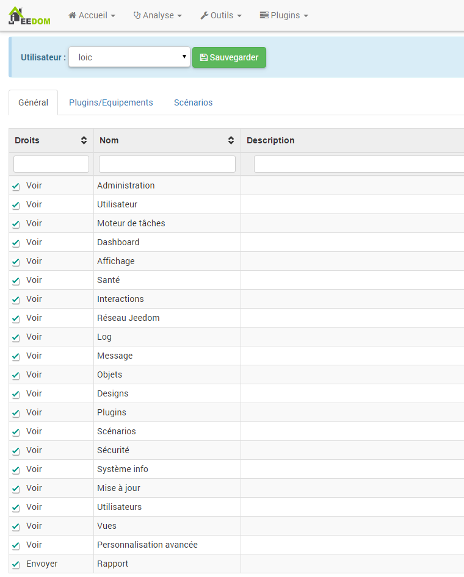
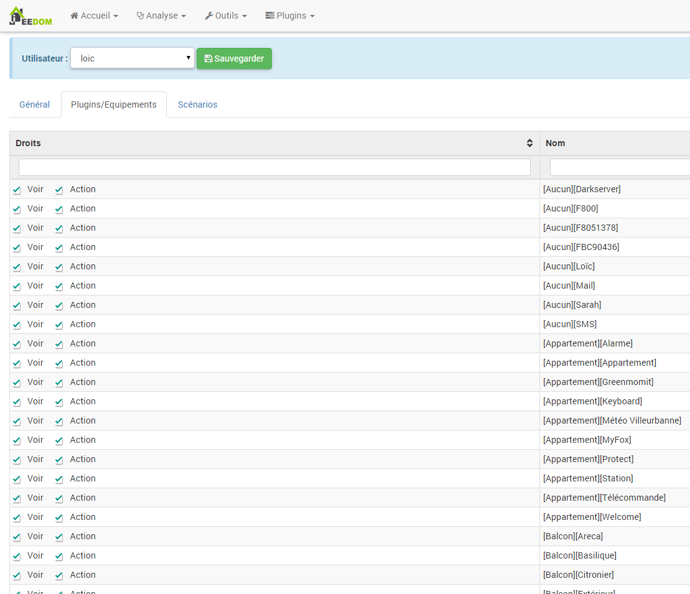
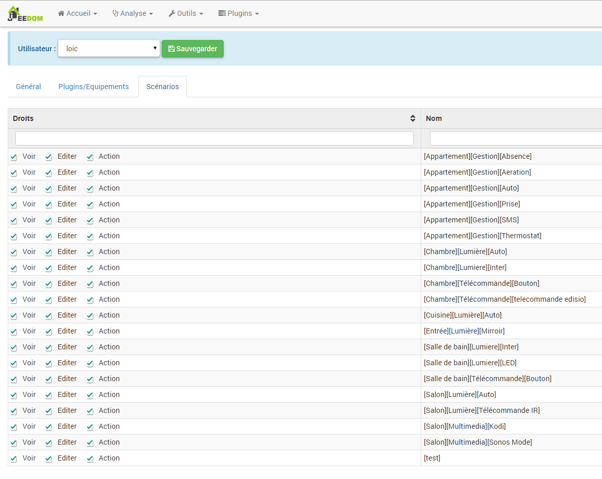

Hier können sie genau die Benutzerrechte auf den Seiten, die Geräte und Szenarien verwalten.

Erreichbar unter Verwaltung → Erweiterte Rechteverwaltung :

Einmal auf die Seite gelangt, gliedert sie sich in 3 Teile : Allgemein, Plugins/Geräte und Szenarios.

Oben finden sie den Login des Benutzers, für den sie die Rechte ändern wollen und die Speichern Schaltfläche.

> **Important**
>
> Wenn der Benutzer ein Admin ist, können sie ihm seine Rechte nicht beschränken. Man muß zuerst seine Admin Rechte deaktivieren.

Allgemein
=========

Hier ist nichts kompliziert, sie aktivieren oder deaktivieren das Recht auf Zugang zu der Seite oder die Funktionalität für den Benutzer.

Plugins/Geräte
==============

Hier können sie für jedes Gerät entscheiden, ob der Benutzer das Recht hat um das Amaturenbrett/Ansicht/Design zu sehen (Recht sehen) und ob er eine Aktion ausführen darf (Recht Aktion).

Szenario
========

Hier können sie die Rechte des Benutzers für die Szenarios festlegen :

-   **Ansicht** : Recht um das Szenario auf dem Armaturenbrett/Ansicht/Design zu sehen

-   **Bearbeiten** :

-   **Aktion** : Recht, die Ausführung des Szenarios auf dem Armaturenbrett/Ansicht/Design zu erzwingen

