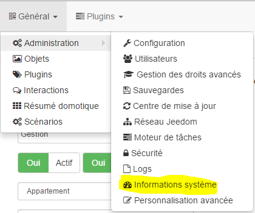
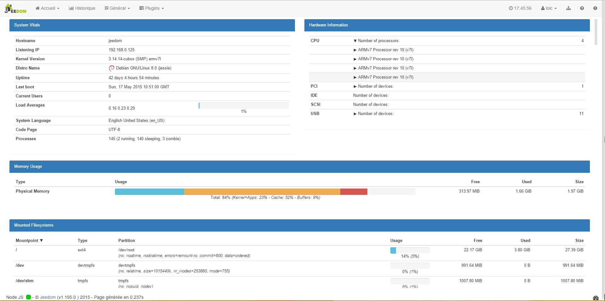

La page Informations système vous permet d’avoir un résumé général sur votre système (hardware + OS)

Sie ist über das Menü Analyse → System Information erreichbar :

Sobald sie darauf sind, sehen sie :

Hier wird nicht alles im Einzelnen beschrieben, diese Seite ist mehr, um beim Support zu helfen. Das, was man kennen muss :

-   Ein mit 100 % voller Speicher ist unter Linux normal, er leert ihn wenn er ihn braucht.

-   Man kann ganz unten auf der Seite die Belegung der Speichermediums sehen

