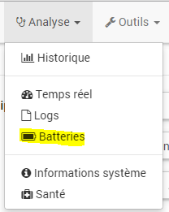
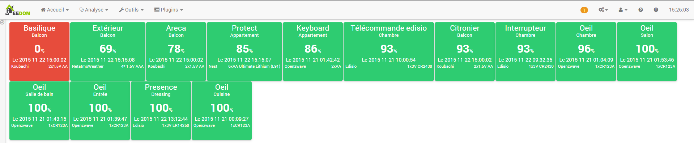

La page Batteries vous permet de voir d’un seul coup le statut de tous vos équipements. Elle est accessible par le menu Analyse → Batteries :

Once above, you get:

Vous pouvez voir sur cette page la liste de vos modules sur batterie, le niveau restant (la couleur de la tuile dépend de ce niveau), le type et le nombre de piles qu’il faut mettre dans le module, le type du module ainsi que la date à laquelle l’information du niveau de batterie a été mise à jour.

> **Tip**
>
> Les seuils d’alerte/warning sur les niveaux des batteries sont configurables de manière globale dans la configuration de Jeedom (Administration → Configuration puis partie "Configuration des équipements"), ou par équipement sur la page de configuration avancée de ceux-ci.

En mettant votre souris tout à gauche vous avez accès à un menu de filtre avancé pour rechercher précisément un type de module, une alerte….

