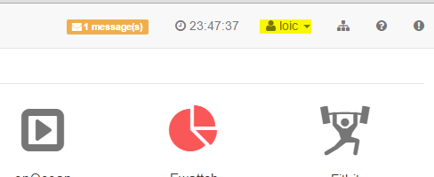
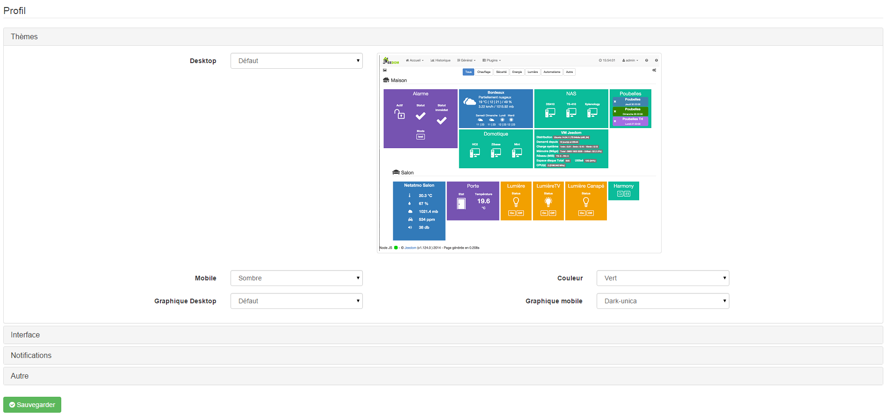
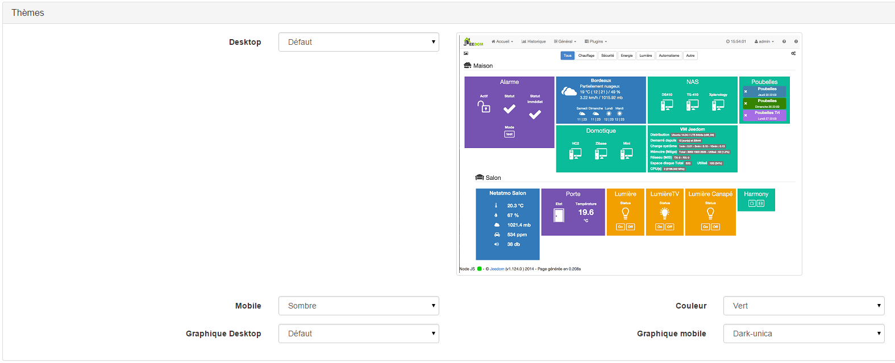
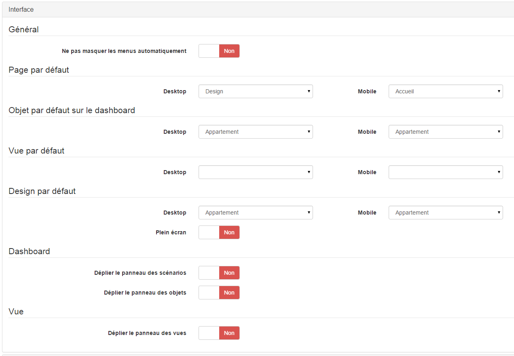
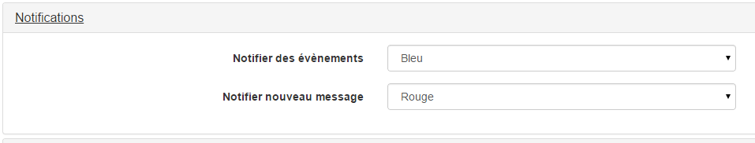
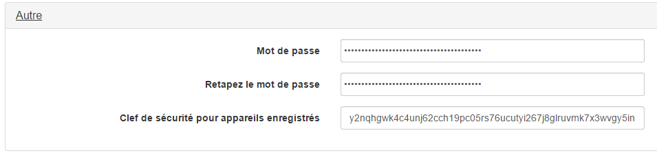

La page profils vous permet de configurer certains comportements de Jeedom spécifiques à l’utilisateur : page d’accueil, thèmes de la version desktop, de la version mobile, des graphiques… Elle permet aussi de changer votre mot de passe et de passer en mode expert permettant une configuration plus poussée de Jeedom.

Profiles menu
=============

Vous retrouvez en haut à droite sur chaque page de Jeedom le menu Profil :

Vous retrouvez à coté de ce menu Profil, une information sur le nombre de messages dans le centre de messages (ces messages sont importants sinon Jeedom ne vous les remonterait pas), l’heure Jeedom (attention c’est bien l’heure de Jeedom et non de votre PC), le menu Profil, une icône indiquant la connexion (ici filaire, mais il est possible si vous êtes en wifi d’avoir celle-ci), l’icône pour l’accès à l’aide de la page en cours et l’icône pour faire une demande de support.

Si vous cliquez sur le menu Profil vous obtenez :

A partir de ce menu vous avez accès à la page Profil, à l’activation ou non du mode expert, au redémarrage de Jeedom, à l’arrêt de Jeedom, au passage en version mobile et un bouton pour se déconnecter.

> **Important**
>
> En DIY les actions de redémarrage et d’arrêt ne fonctionnent que si vous avez bien réalisé les actions visudo, voir link:https://jeedom.com/doc/documentation/installation/fr\_FR/doc-installation.html\#\_etape\_4\_définition\_des\_droits\_root\_à\_jeedom[ici]

Page Profil
===========

La page Profil ressemble à ca :

Vous retrouvez ici différents panneaux qui vous permettront de configurer Jeedom, tous ces réglages sont uniquement liés à votre utilisateur, il vous sont donc propres

Thèmes
------

Le panneau thèmes vous permet de régler des paramètres d’interface :

-   **Desktop** : thèmes à utiliser en mode desktop, attention seul le thème par défaut est officiellement supporté par Jeedom

-   **Mobile** : permet de légèrement configurer le thème mobile (ici tout est supporté), soit clair soit sombre, ainsi que la couleur dominante de celui-ci

-   **Graphique Desktop** : permet de définir le thème par défaut des graphiques en mode desktop

-   **Graphique Mobile** : permet de définir le thème par défaut des graphiques en mode mobile

Interface
---------

Vous permet de définir certains comportements de l’interface :

-   **General**

    -   **Ne pas masquer les menus automatiquement** : indique à Jeedom de ne pas masquer le panneau de gauche, lorsqu’il existe, pour rappel ce panneau est disponible sur la plupart des pages des plugins, ainsi que la page des scénarios, des interactions, des objets….

-   **Page by default**

    -   **Desktop** : page par défaut à afficher lors de la connexion en desktop

    -   **Mobile** : page par défaut à afficher lors de la connexion en mobile

-   **Objet par défaut sur le dashboard** : objet à afficher par défaut lors de l’arrivée sur le dashboard

-   **Vue par défaut** : vue à afficher par défaut lors de l’arrivée sur le dashboard

-   **Design par défaut** : design à afficher par défaut lors de l’arrivée sur le dashboard

    -   **Plein écran** : affichage par défaut en plein écran lors de l’arrivée sur les designs

-   **Dashboard**

    -   **Déplier le panneau des scénarios** : permet de rendre visible par défaut le menu des scénarios (à droite) sur le dashboard

    -   **Déplier le panneau des objets** : permet de rendre visible par défaut le menu des objets (à gauche) sur le dashboard

-   **View**

    -   **Déplier le panneau des vues** : permet de rendre visible par défaut le menu des vues (à gauche) sur les vues

Notifications
-------------

Ici vous pouvez régler la couleur des notifications qui arrivent sur l’interface

Sécurité
--------

C’est ici que vous pouvez changer votre mot de passe ainsi que la clef de sécurité pour les appareils enregistrés (ordinateur,téléphone…). Un changement de cette clef obligera tous les péripheriques se connectant automatiquement avec votre compte à se réauthentifier

