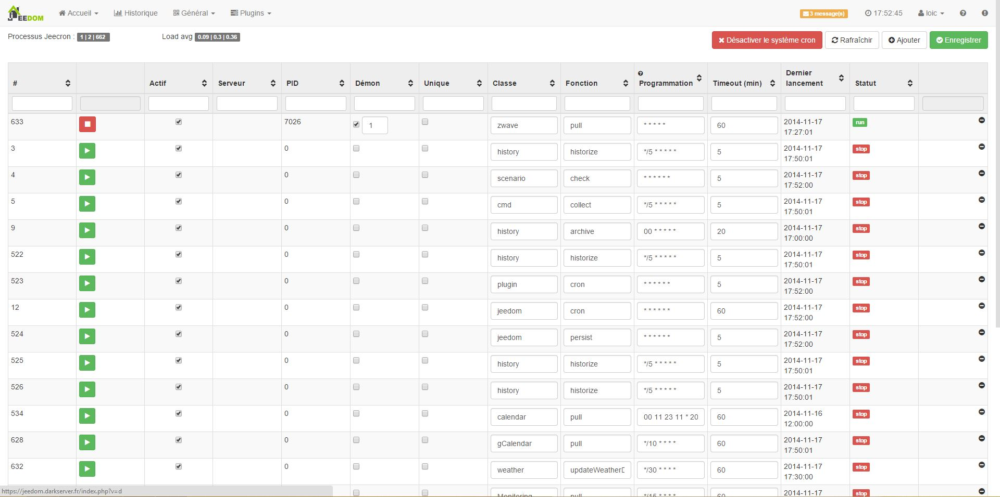
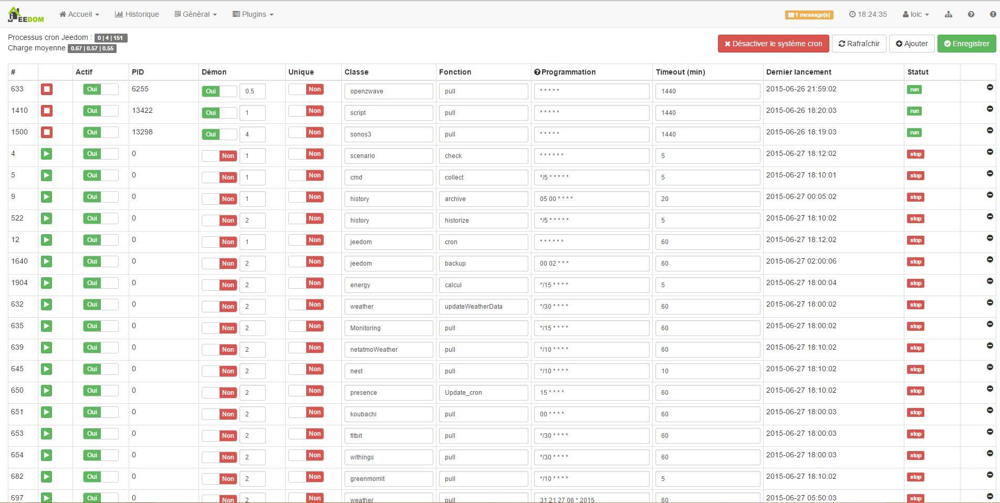

El menú de motor de tareas está disponible en modo experto. Se informa de todas las tareas de aplicación Jeedom a ejecutar en el servidor. Este menú se utiliza con conocimiento de causa, o a petición de soporte técnico.

En el caso de manejo inadecuado en esta página, cualquier solicitud de soporte puede ser rechazada.

Para acceder debe ir a Administración → motor de tareas:

Una vez arriba se obtiene:

En haut à droite vous retrouvez un résumé des processus Jeedom. Le premier chiffre indique le nombre de tâches principales (doit toujours être égal à 0 ou 1), le second le nombre de tâches secondaires et le dernier le nombre de tâches totales sur le système (Jeedom et hors Jeedom). En-dessous vous avez les chiffres de la charge moyenne de votre système, il est recommandé que ce chiffre soit inférieur au nombre total de coeurs du processeur de la machine.

A droite, vous avez un bouton pour désactiver ou réactiver toutes les tâches (si vous les désactivez toutes, plus rien ne sera fonctionnel sur votre Jeedom), un bouton pour rafraîchir le tableau des tâches (juste en-dessous), un bouton pour ajouter une tâche et un bouton pour enregistrer vos modifications.

Enfin, en-dessous vous avez le tableau de toutes les tâches existantes (attention certaines tâches peuvent lancer des sous-tâches, il est donc vivement recommandé de ne jamais modifier d’informations sur cette page). Dans ce tableau on retrouve :

-   \#\*: El ID de la tarea, puede ser útil para hacer enlazar el funcionamiento de un proceso y lo que realmente hace

-   Acción \*: un botón para iniciar o detener la tarea dependiendo de su estado

-   Activo \*: indica si la tarea está activa (puede ser lanzado por Jeedom) o no

-   PID \*: indica el ID actual del proceso

-   Demonio \*: Si esta chequeado el *sí* a continuación, la tarea debe ser siempre la actual. A continuación encontrará la frecuencia del demonio, es aconsejable no tocar este valor y sobre todo nunca disminuirlo

    -   \*'Unico \*: si esta chequeado el ' sí ', entonces la tarea se ejecutará una sola vez y se eliminará.

    -   \* Clase \*: Llamada a la clase PHP para realizar la tarea (puede estar vacío)

    -   **Fonction** : fonction PHP appelée dans la classe appelée (ou non si la classe est vide)

    -   \* Tiempo de espera \*: duración máxima de la tarea. Si la tarea es un demonio, entonces se detendrá automáticamente y reiniciará al final del tiempo de espera

-   Último lanzamiento \*: última fecha de ejecución de la tarea

    -   \* Estado\* : estado actual de la tarea (como recordatorio un tarea en un demonio siempre sera "run")

    -   \* Eliminar \* : permite eliminar la tarea

