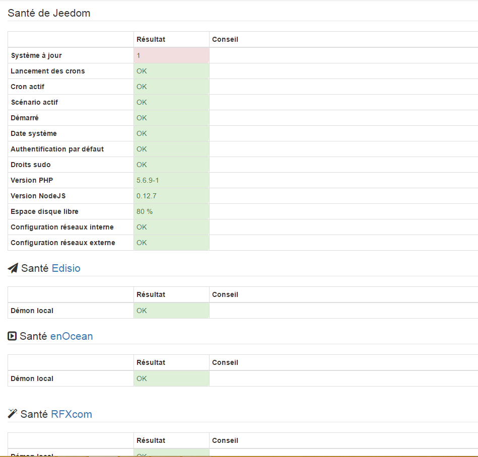

La página de Salud de Jeedom le permite tener una rápida visión del estado de salud de su Jeedom. Asimismo, se indica (según plugins utilizados), el estado de salud del plugin

Es accesible a través de Análisis → Salud

Una vez dentro esto es lo que verá:

Vous retrouvez ici un tableau qui donne une description de ce que Jeedom vérifie et du statut de celle-ci dans la 2ème colonne, enfin la dernière colonne peut vous donner des conseils de résolution si la vérification n’est pas OK

A continuación encontrará la misma tabla pero para el plugin (si el plugin es compatible). Haga clic en el nombre del plugin, le lleva directamente a su página de configuración

Ayuda resolución
================

Versión PHP
-----------

Por el momento en la versión 5.5 de php no es necesario, usted puede dejar todo tal y como esta. El día que la versión 5.5 sea obligatoria, se le avisará

Configuración nginx
-------------------

Mi configuración de nginx esta NOK, esto puede ser normal si ha cambiado el archivo/etc/nginx/sitios-disponible/default, en caso contrario haga desde SSH:

-Si estás en un mini/mini+ o que usted no usa /jeedom :

    sudo su -
    cp /usr/share/nginx/www/jeedom/install/nginx_default_without_jeedom /etc/nginx/sites-available/defaut
    service nginx restart

-   Si usted utiliza /jeedom

<!-- -->

    sudo su -
    cp /usr/share/nginx/www/jeedom/install/nginx_default /etc/nginx/sites-available/defaut
    service nginx restart
