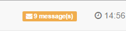
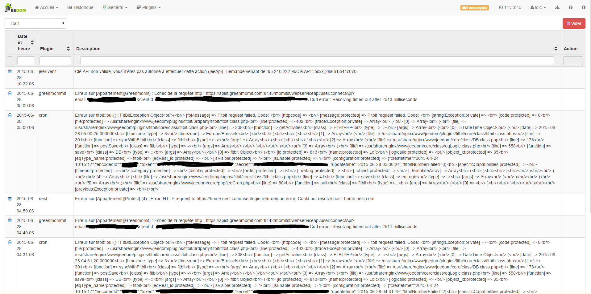

El centro de mensajes reúne todos los mensajes importantes que necesita mirar.

Es accesible sólo cuando hay mensajes, haciendo clic en el número de mensajes:

Aquí un ejemplo:

Es muy simple. Muestra la fecha y hora del mensaje, el plugin que lo ha emitido y el mensaje en cuestión. Se puede, pulsando el botón al principio de la línea de un mensaje, borrar el mensaje en cuestión (volverá si el problema sigue siendo relevante).

En la parte superior, encontramos a un selector de filtro de mensajes en un plugin en particular y a la derecha un botón para purgar todos los mensajes.

> **Tip**
>
> Lorsque vous avez une erreur dans le centre des messages, essayez d’abord de supprimer le message puis voir si l’erreur revient avant de contacter le support. Il arrive (comme sur la capture ici) que ce soit juste dû à un souci de connexion réseau.

