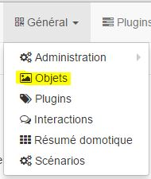
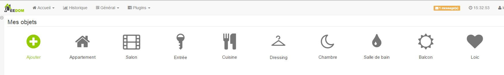
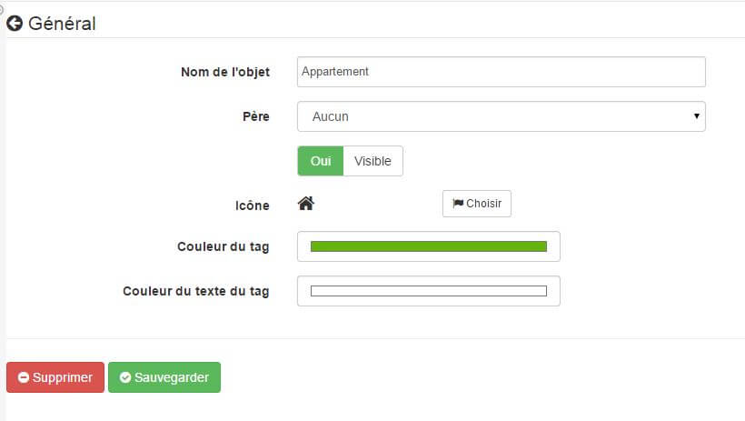
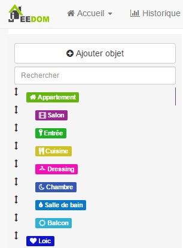

Le sous-menu Objets, permet de définir l’arborescence de sa domotique. Elle se fait en créant des objets. Accessible à partir de là :

Para hacer libre elección para la personalización, puede nombrar estos objetos como desee. Pero en la mayoría de los casos definirá las diferentes partes de su casa, como el nombre de las partes (esta es la configuración recomendada).

En arrivant sur la page vous obtenez (ici avec déjà quelques objets) :

> **Tip**
>
> Al igual que en muchos lugares en Jeedom, situar el ratón en la zona la izquierda mostrará un menú de acceso rápido (se puede mostrar como "siempre visible" desde la configuración de su perfil).

Una vez que su objeto se añade o después de hacer clic en un objeto existente, se obtiene:

A partir de ahí tienes varias opciones:

-   **Nombre del objeto** : el nombre del objeto

-   **Père** : l’objet père de l’objet courant, cela permet de définir une hiérarchie type, le salon est le fils de l’appartement. Un objet ne peut avoir qu’un seul père mais il peut avoir autant de fils qu’il le veut.

-   **Visible** : permite definir si este objeto es visible en el dashboard o no

-   **Icono** : permite elegir un icono para el objeto

-   \*Color de la etiqueta \*: permite elegir el color del objeto (por ejemplo, este color se utiliza en la página Resumen domótica)

-   \*color del texto de la etiqueta \*: permite elegir el color del texto del objeto (por ejemplo, este color se utiliza en la página Resumen domótica)

Si pones el puntero del ratón a la izquierda podrá abrir el siguiente menú:

Con él usted puede cambiar el orden de los objetos ahora haga clic en la flecha doble en el comienzo de la línea y arrastrando el objeto hasta la posición deseada.

