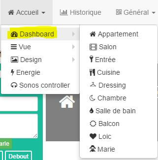
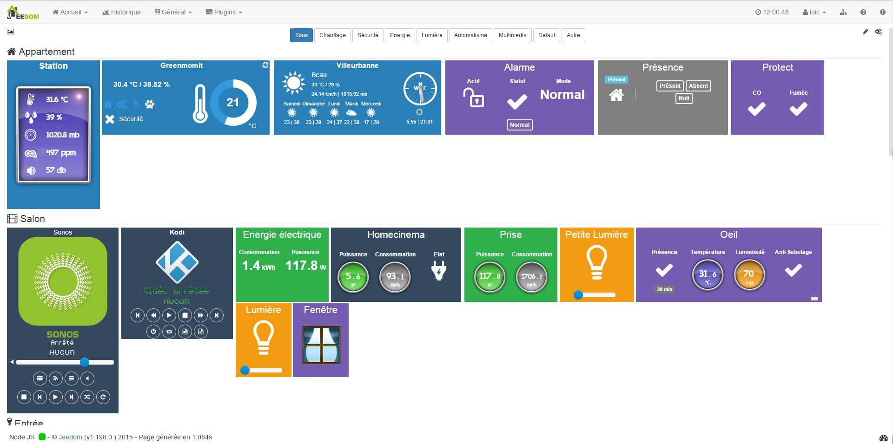
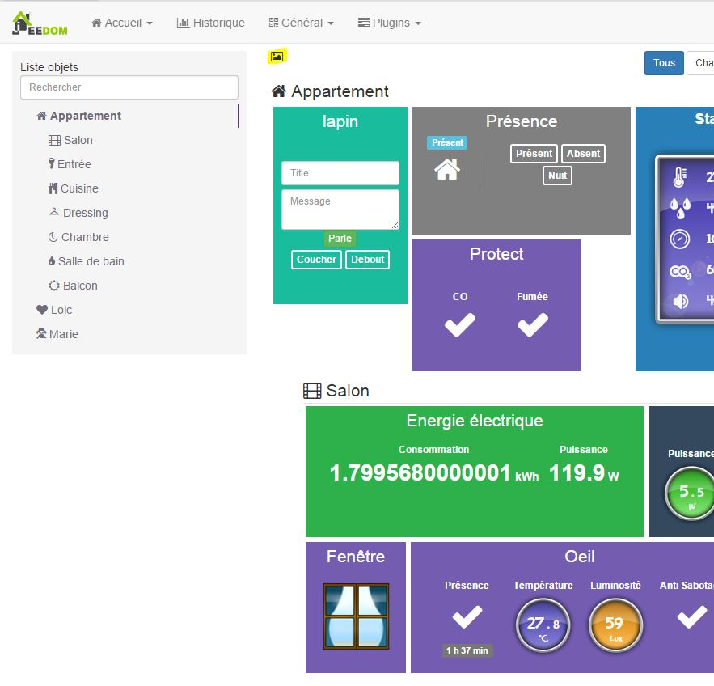
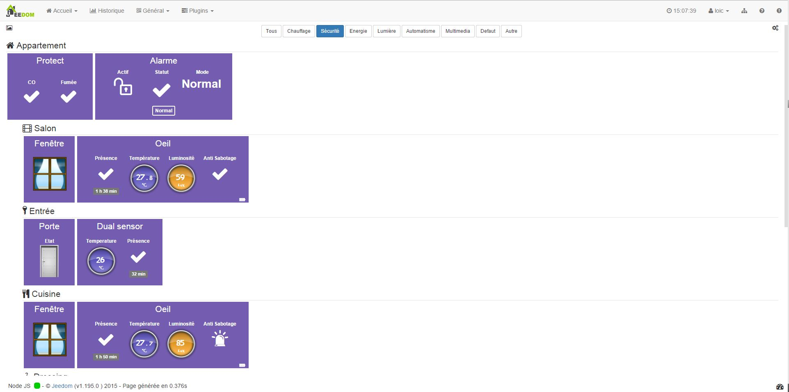
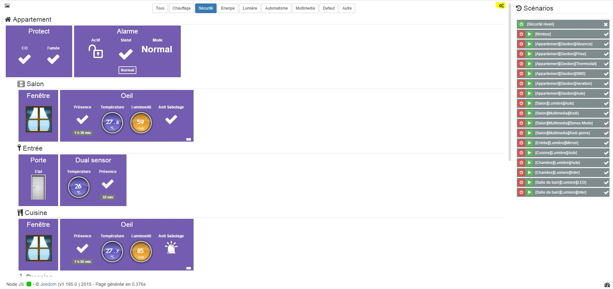

Une des pages principales de Jeedom affiche un compte-rendu de toute
votre domotique. Ce compte-rendu (contrairement aux vues et design) est
auto-généré par Jeedom.

Il est accessible en cliquant sur Accueil → Dashboard

> **Tip**
>
> Comme vous pouvez le voir sur la capture il est possible d’aller
> directement sur un objet de votre domotique. Cela permet de n’avoir
> que les équipements qui vous intéressent et donc de charger la page
> plus rapidement

Voici un exemple de dashboard

Vous avez en haut à gauche une petite icône pour faire afficher/masquer
l’arbre des objets :

Au milieu vous pouvez choisir de ne filtrer que sur certains types
d'équipements :

A droite un premier bouton pour passer en mode édition, pour par exemple
modifier l’ordre des widgets (à l’aide d’un cliqué déposé sur le
widget), vous pouvez aussi dans ce mode édition redimensionner certains
widgets et réorganiser l’ordre des commandes à l’intérieur de celui-ci

Puis un bouton pour afficher/masquer les scénarios :

> **Tip**
>
> Il est possible à partir de votre profil de configurer Jeedom pour que
> l’arbre des objets et/ou les scénarios soit visible par défaut lorsque
> vous arrivez sur le Dashboard

