# Interaktionen
**Tools → Interaktionen**

Das Interaktionssystem in Jeedom ermöglicht es, Aktionen über Text- oder Sprachbefehle auszuführen.

Diese Befehle können wie folgt aufgerufen werden:

- SMS: Senden Sie eine SMS, um Befehle auszuführen (Aktion) oder eine Frage zu stellen (Info).
- Chat: Telegram, Slack usw.
- Sprachsteuerung: Diktieren Sie einen Satz mit Siri, Google Now, SARAH usw., um Befehle (Aktionen) auszulösen oder eine Frage (Info) zu stellen.
- HTTP: Eine HTTP-URL mit dem Text (z. B. Tasker, Slack) aufrufen, um Befehle (Aktion) auszuführen oder eine Frage (Info) zu stellen.

Der Vorteil dieser Interaktionen liegt in der einfachen Integration in andere Systeme wie Smartphones, Tablets, andere Hausautomations-Boxen usw.

> **Tipp**
>
> Sie können eine Interaktion wie folgt starten:
> - Klicken Sie auf eine davon.
> - Strg-Klick oder mittlerer Mausklick, um die Seite in einem neuen Browser-Tab zu öffnen.

Ihnen steht eine Suchfunktion zur Verfügung, mit der Sie die Anzeige der Interaktionen filtern können. Mit der Esc-Taste brechen Sie die Suche ab.
Rechts neben dem Suchfeld befinden sich drei Schaltflächen, die an mehreren Stellen in Jeedom zu finden sind:
- Das Kreuz zum Abbrechen der Suche.
- Der Ordner ist geöffnet, um alle Registerkarten aufzuklappen und alle Interaktionen anzuzeigen.
- Der Ordner ist geschlossen, um alle Paneele einzuklappen.

Sobald Sie sich in der Konfiguration einer Interaktion befinden, steht Ihnen bei einem Rechtsklick auf die Registerkarten der Interaktion ein Kontextmenü zur Verfügung. Sie können auch Strg+Klick oder den mittleren Mausknopf verwenden, um eine andere Interaktion direkt in einem neuen Browser-Tab zu öffnen.

## Interaktionen

Oben auf der Seite befinden sich drei Schaltflächen:

- **Hinzufügen**: Ermöglicht das Erstellen neuer Interaktionen.
- **Neu generieren**: Alle Interaktionen neu erstellen (kann sehr lange dauern > 5 Min.).
- **Testen**: Öffnet ein Dialogfeld, in dem Sie einen Satz eingeben und testen können.

> **Tipp**
>
> Wenn Sie eine Interaktion haben, die beispielsweise Befehle für die Beleuchtung generiert, und Sie ein neues Modul zur Lichtsteuerung hinzufügen, müssen Sie entweder alle Interaktionen neu generieren oder die betreffende Interaktion aufrufen und erneut speichern, um die Befehle für dieses neue Modul zu erstellen.

## Prinzip

Das Prinzip der Erstellung ist recht einfach: Wir definieren einen generierenden Muster-Satz, anhand dessen Jeedom einen oder mehrere hundert weitere Sätze erstellen kann, die mögliche Kombinationen des Musters darstellen.

Auf die gleiche Weise werden Antworten anhand einer Vorlage definiert (dadurch kann Jeedom mehrere Antworten auf ein und dieselbe Frage bereitstellen).

Man kann auch einen Befehl definieren, der ausgeführt werden soll, wenn die Interaktion beispielsweise nicht mit einer Aktion, sondern mit einer Information verbunden ist oder wenn man nach dieser Interaktion eine bestimmte Aktion ausführen möchte (es ist auch möglich, ein Szenario auszuführen, mehrere Befehle zu steuern …).

## Konfiguration

Die Konfigurationsseite besteht aus mehreren Registerkarten und Schaltflächen:

- **Sätze**: Zeigt die Anzahl der Sätze der Interaktion an (ein Klick darauf zeigt sie an).
- **Aufzeichnen**: Zeichnet die aktuelle Interaktion auf.
- **Löschen**: Löscht die aktuelle Interaktion.
- **Duplizieren**: Dupliziert die aktuelle Interaktion.

### Registerkarte „Allgemein“

- **Name**: Name der Interaktion (kann leer sein; der Name ersetzt den Text der Anfrage in der Liste der Interaktionen).
- **Gruppe**: Interaktionsgruppe, dient zur Organisation der Elemente (kann leer sein, wird dann der Gruppe „Keine“ zugeordnet).
- **Aktiv**: Ermöglicht das Aktivieren oder Deaktivieren der Interaktion.
- **Anfrage**: Der generierende Muster-Satz (obligatorisch).
- **Synonym**: Ermöglicht die Definition von Synonymen für Befehlsnamen.
- **Antwort**: Die zu gebende Antwort.
- **Vor der Antwort warten (s)**: Ermöglicht es, eine Verzögerung von X Sekunden einzufügen, bevor die Antwort generiert wird. So kann beispielsweise abgewartet werden, bis die Statusrückmeldung einer Lampe vorliegt, bevor geantwortet wird.
- **Binärkonvertierung**: Ermöglicht die Umwandlung von Binärwerten beispielsweise in „offen/geschlossen“ (gilt nur für Befehle vom Typ „Binärinfo“).
- **Autorisierte Benutzer**: Beschränkt die Interaktion auf bestimmte Benutzer (die Benutzernamen sind durch \| voneinander getrennt).

### Registerkarte „Filter“

- **Auf Befehlstypen beschränken**: Ermöglicht es, nur die Typen „Aktionen“, „Infos“ oder beide Typen zu verwenden.
- **Auf Befehle mit dem Untertyp beschränken**: Ermöglicht es, die Generierung auf einen oder mehrere Untertypen zu beschränken.
- **Auf Befehle mit der Einheit** beschränken: Ermöglicht es, die Generierung auf eine oder mehrere Einheiten zu beschränken (Jeedom erstellt die Liste automatisch anhand der in Ihren Befehlen definierten Einheiten).
- **Auf Befehle des Objekts beschränken**: Ermöglicht es, die Generierung auf ein oder mehrere Objekte zu beschränken (Jeedom erstellt die Liste automatisch anhand der von Ihnen erstellten Objekte).
- **Auf Plugin beschränken**: Ermöglicht es, die Generierung auf ein oder mehrere Plugins zu beschränken (Jeedom erstellt die Liste automatisch anhand der installierten Plugins).
- **Auf Kategorie beschränken**: Ermöglicht es, die Generierung auf eine oder mehrere Kategorien zu beschränken.
- **Auf Geräte beschränken**: Ermöglicht es, die Generierung auf ein einzelnes Gerät/Modul zu beschränken (Jeedom erstellt die Liste automatisch anhand der Geräte/Module, die Sie haben).

### Registerkarte „Aktionen“

Verwenden Sie diese Option, wenn Sie einen oder mehrere bestimmte Befehle ansprechen oder bestimmte Parameter übergeben möchten.

#### Beispiele

> **Hinweis**
>
> Die Screenshots können je nach Weiterentwicklung abweichen.

#### Einfache Bedienung

Der einfachste Weg, eine Interaktion zu konfigurieren, besteht darin, ihr ein starres Generierungsmodell ohne Variationsmöglichkeiten zuzuweisen. Diese Methode zielt sehr präzise auf einen Befehl oder ein Szenario ab.

Im folgenden Beispiel ist im Feld „Anfrage“ der genaue Satz zu sehen, der eingegeben werden muss, um die Interaktion auszulösen. In diesem Fall, um die Deckenbeleuchtung im Wohnzimmer einzuschalten.

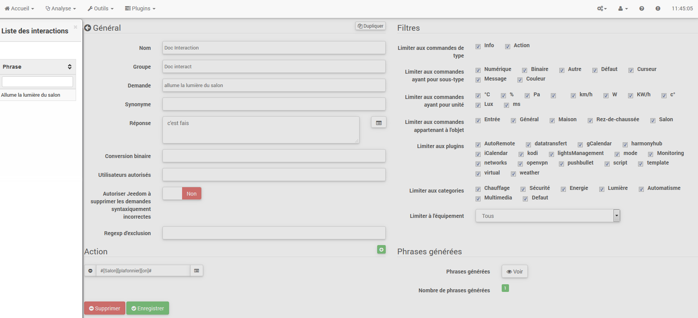

Auf diesem Screenshot ist die Konfiguration für eine Interaktion im Zusammenhang mit einer bestimmten Aktion zu sehen. Diese Aktion wird im Abschnitt „Aktion“ der Seite definiert.

Man kann sich gut vorstellen, dasselbe mit mehreren Aktionen zu tun, um mehrere Lampen im Wohnzimmer einzuschalten, wie im folgenden Beispiel:

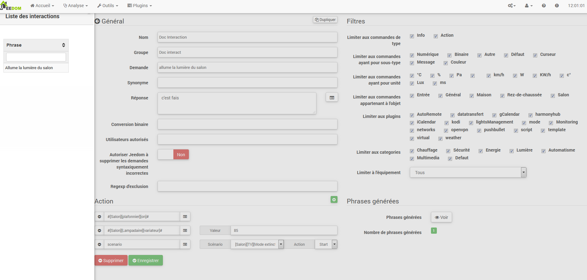

In den beiden obigen Beispielen ist der Modellsatz identisch, doch die daraus resultierenden Aktionen ändern sich je nach den Einstellungen im Abschnitt „Aktion“. So lassen sich bereits mit einer einfachen Interaktion mit einem einzigen Satz kombinierte Aktionen zwischen verschiedenen Befehlen und Szenarien vorstellen (Szenarien können auch im Abschnitt „Aktion“ der Interaktionen ausgelöst werden).

> **Tipp**
>
> Um ein Szenario hinzuzufügen, erstellen Sie eine neue Aktion, geben Sie „scenario“ (ohne Akzent) ein und drücken Sie die Tabulatortaste auf Ihrer Tastatur, um die Szenarioauswahl anzuzeigen.

#### Interaktion mehrerer Befehle

Hier werden wir sehen, wie nützlich und leistungsstark Interaktionen sind: Mit einem Muster-Satz können wir Sätze für eine ganze Gruppe von Befehlen generieren.

Wir greifen nun an die oben beschriebenen Schritte an, löschen die zuvor hinzugefügten Aktionen und verwenden anstelle des festen Satzes im Feld „Anfrage“ die Tags **\#Befehl\#** und **\#Gerät\#**. Jeedom ersetzt diese Tags dann durch den Namen des Befehls und den Namen des Geräts (hier zeigt sich, wie wichtig es ist, einheitliche Befehls- und Gerätenamen zu verwenden).

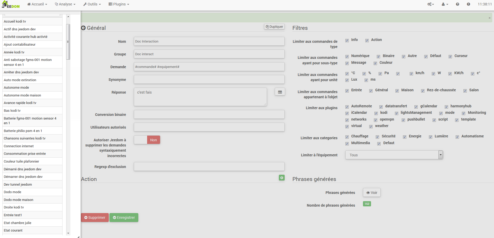

Man kann hier also feststellen, dass Jeedom anhand unseres Modells 152 Sätze generiert hat. Diese sind jedoch nicht besonders gut formuliert und es ist ein bisschen von allem dabei.

Um hier Ordnung zu schaffen, nutzen wir die Filter (auf der rechten Seite unserer Konfigurationsseite). In diesem Beispiel möchten wir Sätze zum Einschalten von Lampen generieren. Wir können also den Befehlstyp „Info“ deaktivieren (wenn ich speichere, bleiben mir nur noch 95 generierte Sätze), und dann in den Untertypen nur noch „Standard“ aktiviert lassen, was der Aktionsschaltfläche entspricht (es bleiben also nur noch 16 Sätze übrig).

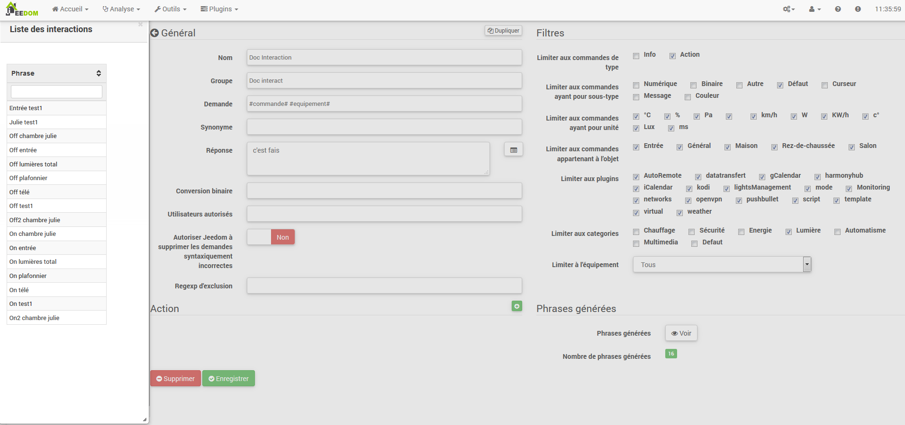

Das ist schon besser, aber es lässt sich noch natürlicher gestalten. Nehmen wir das generierte Beispiel „Am Eingang“: Es wäre gut, wenn man diesen Satz in „Schalte den Eingang ein“ oder „Den Eingang einschalten“ umwandeln könnte. Dazu verfügt Jeedom unter dem Feld „Anfrage“ über ein Feld „Synonym“, mit dem wir die Befehle in unseren „generierten“ Sätzen anders benennen können. Hier ist es „on“, ich habe sogar „on2“ in den Modulen, die zwei Ausgänge steuern können.

Unter „Synonyme“ geben wir also den Namen des Befehls und das bzw. die zu verwendenden Synonyme an:

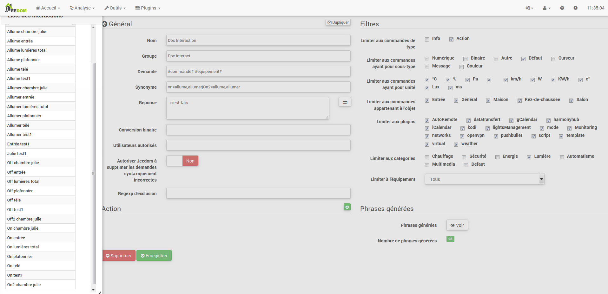

Hier sehen wir eine etwas neue Syntax für Synonyme. Ein Befehlsname kann mehrere Synonyme haben; in diesem Fall hat „on“ die Synonyme „allume“ und „allumer“. Die Syntax lautet also „*Befehlsname*“ ***=*** „*Synonym 1*“***,*** „*Synonym 2*“ (man kann beliebig viele Synonyme angeben). Um Synonyme für einen anderen Befehlsnamen hinzuzufügen, fügt man nach dem letzten Synonym einfach einen senkrechten Strich „*\|*“ ein, gefolgt von dem Befehl, für den Synonyme definiert werden sollen – genau wie im ersten Teil, usw.

Das ist schon besser, aber bei dem Befehl „on“ fehlt noch „Eingang“ sowie bei anderen Befehlen „la“, „le“ oder „un“ usw. Man könnte den Namen des Geräts ändern, um diese Begriffe hinzuzufügen – das wäre eine Lösung. Ansonsten kann man die Varianten in der Anfrage verwenden. Dabei wird eine Reihe möglicher Wörter an einer bestimmten Stelle im Satz aufgelistet, sodass Jeedom Sätze mit diesen Varianten generiert.

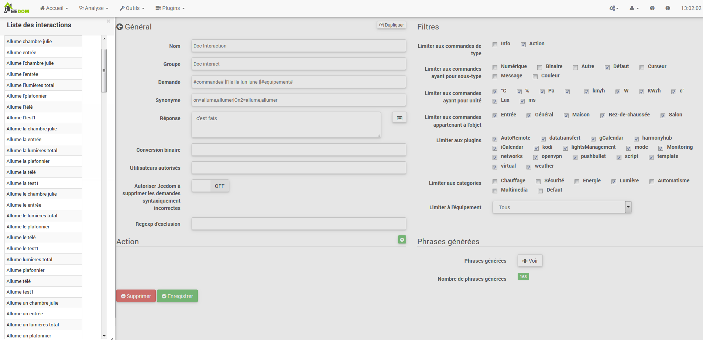

Wir haben nun etwas korrektere Sätze, aber auch Sätze, die nicht ganz richtig sind, wie in unserem Beispiel „on“ und „Eingang“. So finden wir also „Eingang einschalten“, „einen Eingang einschalten“, „eine Eingang einschalten“, „den Eingang einschalten“ usw. Wir haben also alle möglichen Varianten mit dem, was wir zwischen den „\[ \]“ hinzugefügt haben, und zwar für jedes Synonym, was schnell zu einer großen Anzahl von Sätzen führt (hier 168).

Um die Ergebnisse zu verfeinern und unwahrscheinliche Befehle wie „Schalte den Fernseher ein“ zu vermeiden, kann man Jeedom erlauben, syntaktisch falsche Befehle zu entfernen. Das System filtert somit alles heraus, was zu weit von der tatsächlichen Syntax eines Satzes abweicht. In unserem Fall reduziert sich die Anzahl der Sätze von 168 auf 130.

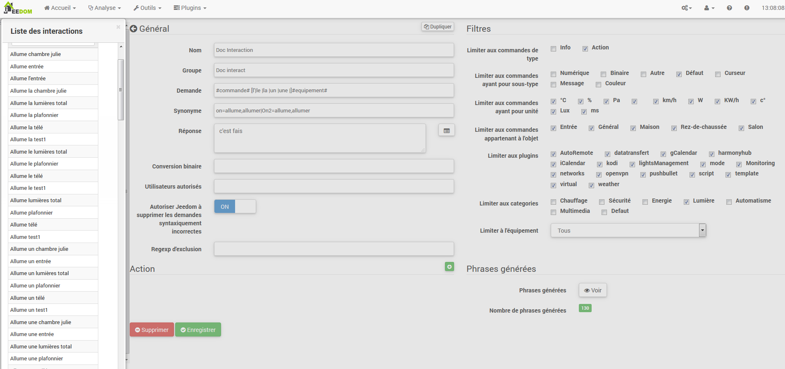

Es ist daher wichtig, die Muster- und Synonym-Sätze sorgfältig zu formulieren und die richtigen Filter auszuwählen, um nicht zu viele unnötige Sätze zu generieren. Ich persönlich finde es interessant, wenn es ein paar Unstimmigkeiten wie „un entrée“ gibt, denn wenn bei Ihnen zu Hause jemand zu Gast ist, der nicht richtig Französisch spricht, funktionieren die Interaktionen trotzdem.

### Antworten anpassen

Bisher erhielten wir als Antwort auf eine Interaktion nur einen einfachen Satz, der nicht viel aussagte, außer dass etwas passiert ist. Die Idee wäre, dass Jeedom uns etwas genauer mitteilt, was es getan hat. Hier kommt das Antwortfeld ins Spiel, in dem wir die Rückmeldung je nach ausgeführter Befehlsaktion individuell anpassen können.

Dazu verwenden wir erneut die Jeedom-Tags. Für unsere Beleuchtung können wir einen Satz wie den folgenden verwenden: Ich habe \#equipement\# eingeschaltet (siehe Screenshot unten).

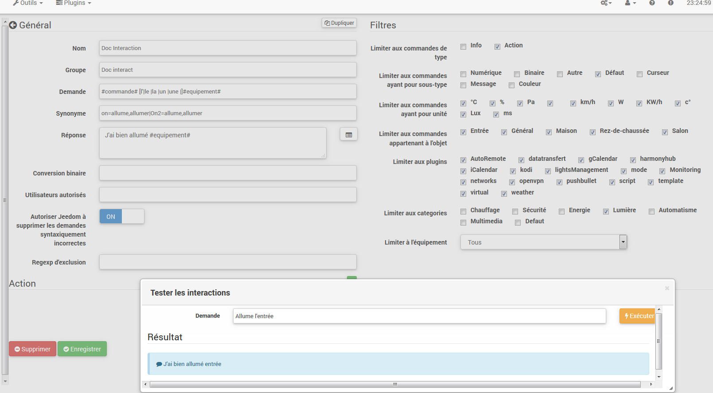

Man kann auch beliebige Werte aus einem anderen Befehl hinzufügen, wie beispielsweise eine Temperatur, eine Personenzahl usw.

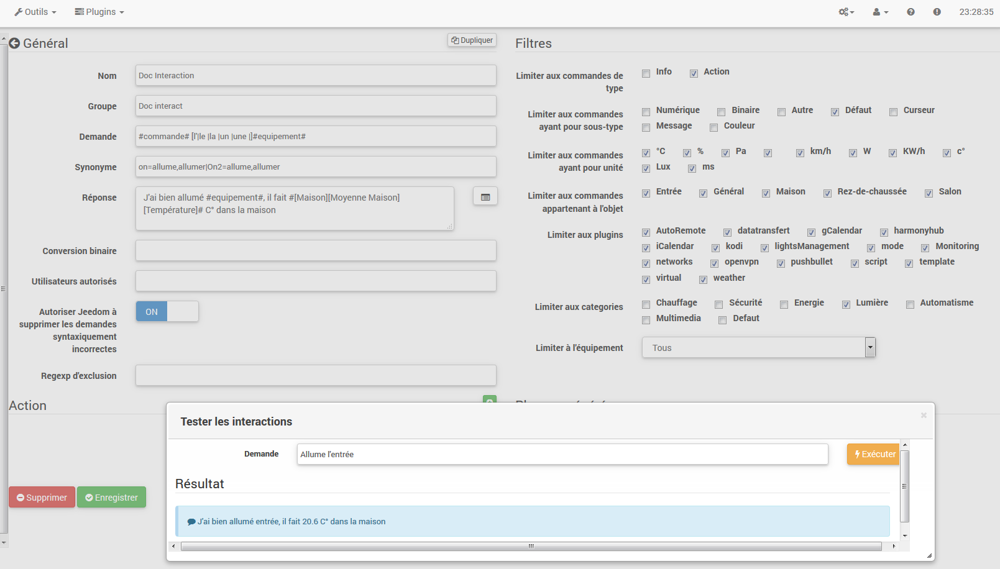

### Binärumwandlung

Binäre Umwandlungen gelten für Befehle vom Typ „Info“, deren Untertyp „binär“ ist (gibt ausschließlich 0 oder 1 zurück). Daher müssen die richtigen Filter aktiviert werden, wie auf dem Screenshot etwas weiter unten zu sehen ist (bei den Kategorien können alle angekreuzt werden; im Beispiel habe ich nur „Beleuchtung“ ausgewählt).

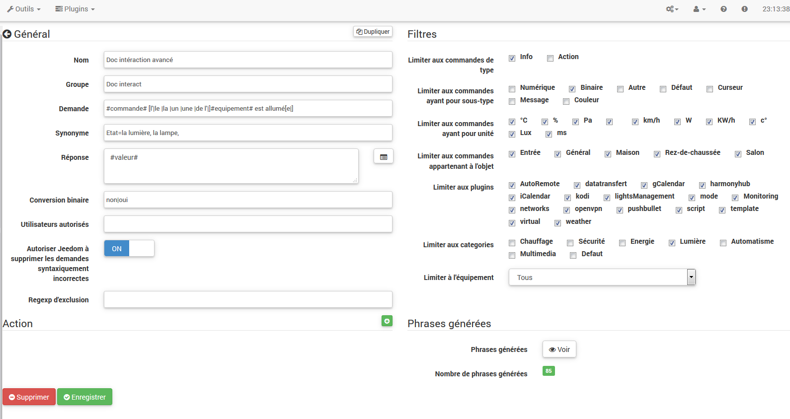

Wie man hier sehen kann, habe ich die Struktur der Anfrage fast unverändert beibehalten (das ist bewusst so gewählt, um den Fokus auf die Besonderheiten zu legen). Natürlich habe ich die Synonyme angepasst, um ein einheitliches Ergebnis zu erzielen. Bei der Antwort ist es hingegen **unbedingt erforderlich**, ausschließlich \#Wert\# anzugeben, was für die 0 oder 1 steht, die Jeedom durch die nachfolgende binäre Umwandlung ersetzt.

Das Feld **Binärkonvertierung** muss zwei Antworten enthalten: zunächst die Antwort, wenn der Wert des Befehls 0 ist, dann einen vertikalen Strich „\|“ als Trennzeichen und schließlich die Antwort, wenn der Wert des Befehls 1 ist. Hier lauten die Antworten einfach „nein“ und „ja“, aber man könnte auch einen etwas längeren Satz eingeben.

> **Warnung**
>
> Tags funktionieren in binären Konvertierungen nicht.

### Autorisierte Benutzer

Über das Feld „Autorisierte Benutzer“ können Sie festlegen, dass nur bestimmte Personen den Befehl ausführen dürfen. Sie können mehrere Profile angeben, indem Sie diese durch ein „\|“ trennen.

Beispiel: Person1\|Person2

Man kann sich vorstellen, dass ein Alarm von einem Kind oder einem Nachbarn aktiviert oder deaktiviert werden könnte, der in Ihrer Abwesenheit die Pflanzen gießt.

### Ausschluss-Regexp

Es ist möglich, [Regexp](https://fr.wikipedia.org/wiki/Expression_rationnelle) Ausschluss: Wenn ein generierter Satz diesem Regexp entspricht, wird er gelöscht. Der Vorteil besteht darin, dass man Fehlalarme beseitigen kann, d. h. einen von Jeedom generierten Satz, der etwas auslöst, das nicht dem entspricht, was man möchte, oder der eine andere Interaktion stören würde, die einen ähnlichen Satz enthält.

Es gibt zwei Stellen, an denen ein Regexp angewendet werden kann:
- In der Interaktion selbst im Feld „Ausschluss-Regexp“.
- Im Menü „Verwaltung“ → „Konfiguration“ → „Interaktionen“ → Feld „Allgemeiner Ausschluss-Regexp für Interaktionen“.

Für das Feld „Allgemeiner Ausschluss-Regex für Interaktionen“ gilt diese Regel für alle Interaktionen, die in Zukunft neu erstellt oder erneut gespeichert werden. Wenn man sie auf alle bestehenden Interaktionen anwenden möchte, müssen die Interaktionen neu generiert werden. In der Regel wird sie verwendet, um falsch formulierte Sätze zu entfernen, die in den meisten generierten Interaktionen vorkommen.

Im Feld „Ausschluss-Regexp“ auf der Konfigurationsseite jeder Interaktion kann ein spezifischer Regexp eingegeben werden, der ausschließlich auf die jeweilige Interaktion wirkt. Damit können Sie eine Interaktion gezielter löschen. Dies kann auch dazu dienen, eine Interaktion für eine bestimmte Bestellung zu löschen, für die diese Möglichkeit im Rahmen der Erstellung mehrerer Bestellungen nicht angeboten werden soll.

Der folgende Screenshot zeigt die Interaktion ohne den Regexp. In der Liste auf der linken Seite filtere ich die Sätze, um Ihnen nur diejenigen anzuzeigen, die gelöscht werden sollen. Tatsächlich wurden mit der Konfiguration der Interaktion 76 Sätze generiert.

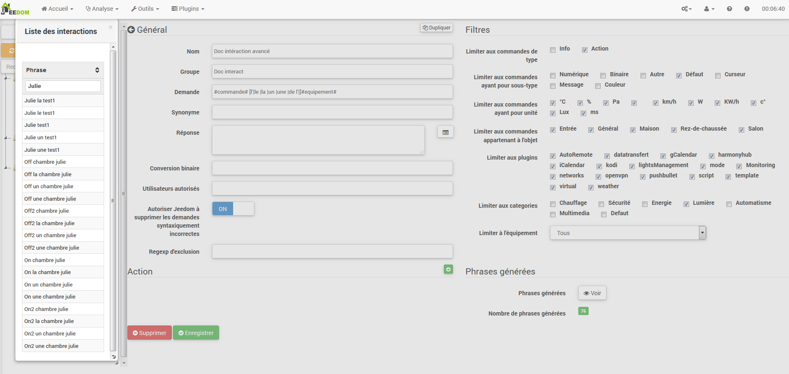

Wie Sie auf dem folgenden Screenshot sehen können, habe ich einen einfachen regulären Ausdruck hinzugefügt, der in den generierten Sätzen nach dem Wort „Julie“ sucht und diese Sätze entfernt. In der Liste auf der linken Seite ist jedoch zu sehen, dass es immer noch Sätze mit dem Wort „julie“ gibt. In regulären Ausdrücken ist „Julie“ nicht gleich „julie“ – man spricht hier von Groß-/Kleinschreibung, d. h., ein Großbuchstabe unterscheidet sich von einem Kleinbuchstaben. Wie auf dem folgenden Screenshot zu sehen ist, sind nur noch 71 Sätze übrig; die 5 mit „Julie“ wurden entfernt.

Ein regulärer Ausdruck setzt sich wie folgt zusammen:

- Zunächst ein Trennzeichen, in diesem Fall ein Schrägstrich „/“, der am Anfang und am Ende des Ausdrucks steht.
- Das Zeichen nach dem Schrägstrich steht für ein beliebiges Zeichen, ein Leerzeichen oder eine Zahl.
- Das „\*“ hingegen gibt an, dass das vorangestellte Zeichen – in diesem Fall ein Punkt – nullmal oder mehrmals vorkommen kann, also im Klartext: ein beliebiges Element.
- Dann „Julie“, das gesuchte Wort (Wort oder ein anderes Ausdrucksmuster), gefolgt von einem Punkt und einem Schrägstrich.

Wenn man diesen Ausdruck in einen Satz übersetzt, würde das so lauten: „Suche nach dem Wort ‚Julie‘, dem irgendetwas vorangestellt ist und auf das irgendetwas folgt.“

Das ist eine extrem vereinfachte Version regulärer Ausdrücke, die aber dennoch schon sehr schwer zu verstehen ist. Ich habe eine Weile gebraucht, um ihre Funktionsweise zu begreifen. Als etwas komplexeres Beispiel hier ein regulärer Ausdruck zur Überprüfung einer URL:

/\^(https?:\\/\\/)?(\[\\da-z\\.-\]+)\\.(\[a-z\\.\]{2,6})(\[\\/\\w\\.-\]\*)\*\\/?\$/

Sobald Sie das schreiben können, haben Sie reguläre Ausdrücke verstanden.

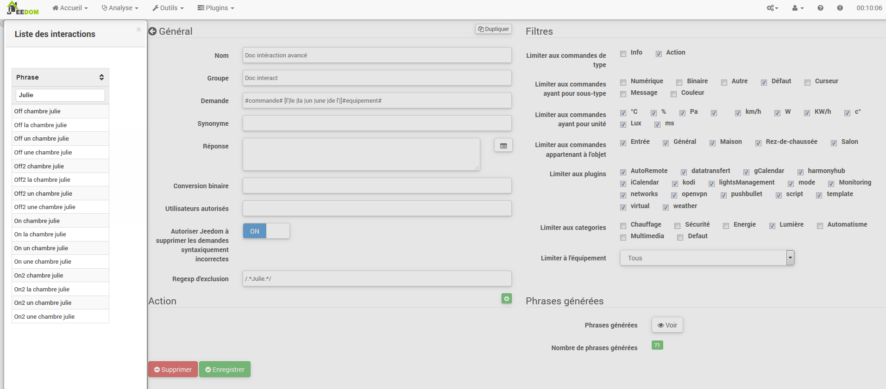

Um das Problem der Groß- und Kleinschreibung zu lösen, können wir unserem Ausdruck eine Option hinzufügen, die ihn groß- und kleinschreibungsunabhängig macht, oder anders gesagt, die Kleinbuchstaben als Großbuchstaben behandelt; dazu müssen wir einfach am Ende unseres Ausdrucks ein „i“ hinzufügen.

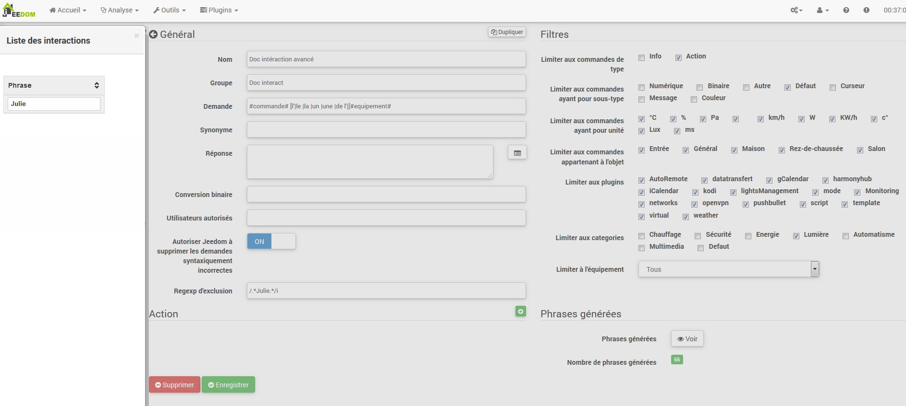

Wenn man die Option „i“ hinzufügt, stellt man fest, dass nur noch 55 generierte Sätze übrig sind, und in der Liste auf der linken Seite mit dem Filter „julie“ zur Suche nach Sätzen, die dieses Wort enthalten, sieht man, dass es deutlich mehr sind.

Da es sich um ein äußerst komplexes Thema handelt, werde ich hier nicht näher darauf eingehen. Im Internet gibt es genügend Anleitungen, die euch weiterhelfen, und vergesst nicht, dass Google auch euer Freund ist – denn ja, es ist mein Freund; es war Google, das mir beigebracht hat, Regexps zu verstehen und sogar zu programmieren. Wenn es mir also geholfen hat, kann es auch euch helfen, wenn ihr euch nur ein wenig Mühe gebt.

Nützliche Links:

- <http://www.commentcamarche.net/contents/585-javascript-l-objet-regexp>
- <https://www.lucaswillems.com/fr/articles/25/tutoriel-pour-maitriser-les-expressions-regulieres>
- <https://openclassrooms.com/courses/concevez-votre-site-web-avec-php-et-mysql/les-expressions-regulieres-partie-1-2>

### Antwort mit mehreren Informationen

Es ist auch möglich, mehrere Info-Befehle in eine Antwort einzufügen, beispielsweise um eine Zusammenfassung der Situation zu erhalten.

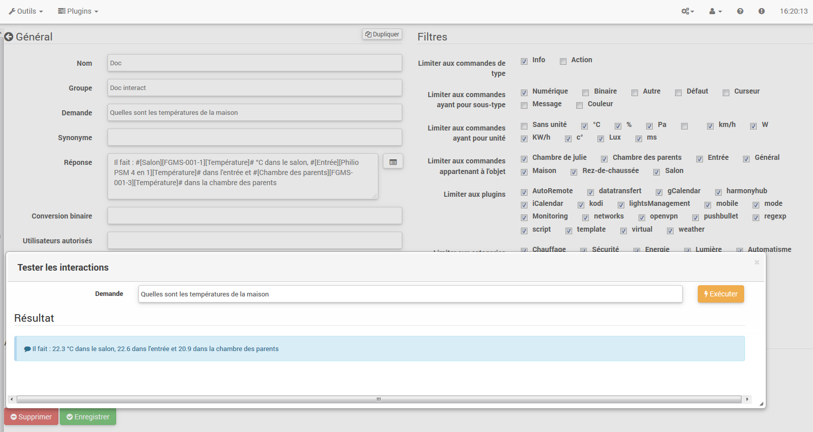

In diesem Beispiel sehen wir einen einfachen Satz, der uns eine Antwort mit drei verschiedenen Temperaturen zurückgibt. Man kann hier also so ziemlich alles eingeben, was man möchte, um alle Informationen auf einmal zu erhalten.

### Ist jemand im Zimmer?

#### Basisversion

- Die Frage lautet also: „Ist jemand im Zimmer?“
- Die Antwort lautet entweder „Nein, es ist niemand im Zimmer“ oder „Ja, es ist jemand im Zimmer“.
- Der entsprechende Befehl lautet „\#\[Julies Zimmer\]\[FGMS-001-2\]\[Anwesenheit\]\#“

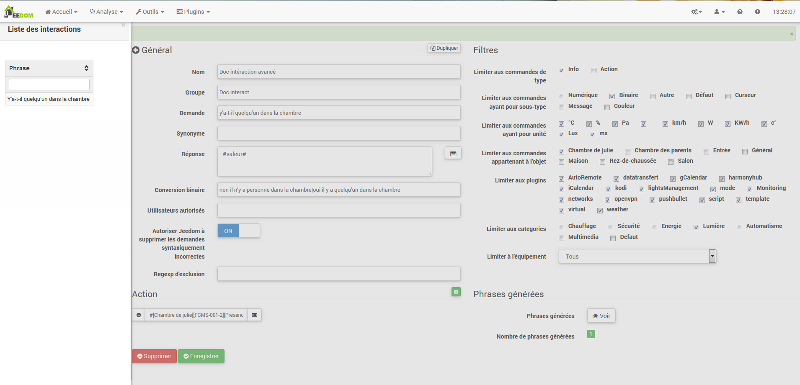

Dieses Beispiel zielt genau auf ein bestimmtes Gerät ab, wodurch eine personalisierte Antwort möglich ist. Man könnte sich also vorstellen, die Antwort aus dem Beispiel durch „Nein, es ist niemand in *julies* Zimmer\|Ja, es ist jemand in *julies* Zimmer“ zu ersetzen.

#### Entwicklung

- Die Frage lautet also „#Befehl# [im | in] #Objekt#“
- Die Antwort lautet entweder „Nein, es ist niemand im Raum“ oder „Ja, es ist jemand im Raum“.
- Im Bereich „Aktion“ gibt es keinen Befehl, der dem entspricht, da es sich um eine Interaktion mit mehreren Befehlen handelt.
- Durch Hinzufügen eines regulären Ausdrucks kann man die Befehle herausfiltern, die man nicht sehen möchte, sodass nur die Sätze zu den „Anwesenheit“-Befehlen übrig bleiben.

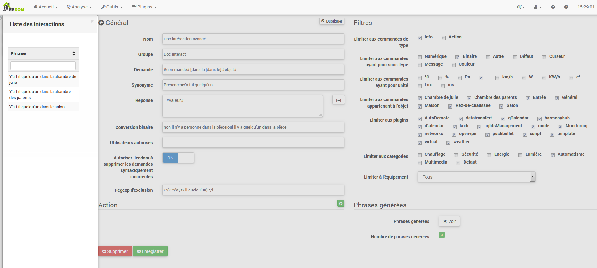

Ohne den Regexp erhält man hier 11 Sätze, doch das Ziel meiner Interaktion ist es, ausschließlich Sätze zu generieren, mit denen gefragt wird, ob sich jemand in einem Raum befindet. Daher benötige ich keine Informationen zum Lampenstatus oder zu anderen Dingen wie Steckdosen, was sich mit einem Regexp-Filter lösen lässt. Um das Ganze noch flexibler zu gestalten, kann man Synonyme hinzufügen, aber in diesem Fall darf man nicht vergessen, den Regexp anzupassen.

### Temperatur, Luftfeuchtigkeit und Helligkeit erfassen

#### Basisversion

Man könnte den Satz wörtlich formulieren, zum Beispiel „Wie hoch ist die Temperatur im Wohnzimmer?“, aber dann müsste man für jeden Temperatur-, Helligkeits- und Feuchtigkeitssensor einen eigenen Satz erstellen. Mit dem Satzgenerator von Jeedom lassen sich daher mit einer einzigen Interaktion die Sätze für alle Sensoren dieser drei Messarten generieren.

Hier ein allgemeines Beispiel, mit dem man die Temperatur, Luftfeuchtigkeit und Helligkeit in den verschiedenen Räumen (Objekt im Sinne von Jeedom) abfragen kann.

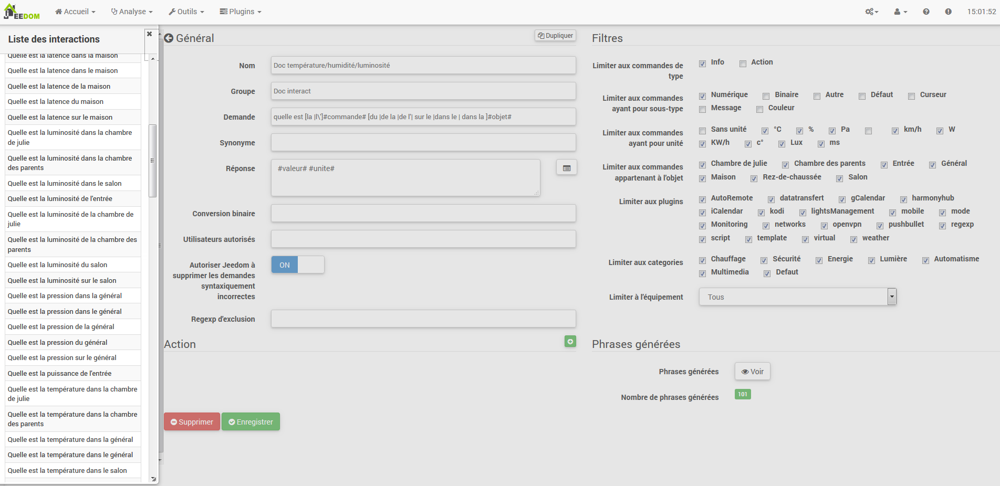

- Man sieht also, dass ein allgemeiner Satz wie „Wie hoch ist die Temperatur im Wohnzimmer?“ oder „Wie hell ist es im Schlafzimmer?“ wie folgt umgewandelt werden kann: „Wie ist \[die \|l\\'\]\#Befehl\# Objekt“ (die Verwendung von \[Wort1 \| Wort2\] ermöglicht es, zwischen dieser und jener Möglichkeit zu wählen, um alle möglichen Varianten des Satzes mit Wort1 oder Wort2 zu generieren). Bei der Generierung erzeugt Jeedom alle möglichen Satzkombinationen mit allen vorhandenen Befehlen (abhängig von den Filtern), wobei \#Befehl\# durch den Namen des Befehls und \#Objekt\# durch den Namen des Objekts ersetzt wird.
- Die Antwort lautet beispielsweise „21 °C“ oder „200 Lux“. Geben Sie einfach Folgendes ein: \#Wert\# \#Einheit\# (die Einheit muss in der Konfiguration jedes Befehls ergänzt werden, für den eine Einheit festgelegt werden soll)
- Dieses Beispiel generiert also einen Satz für alle Befehle vom Typ „numerische Information“, die eine Einheit enthalten. Man kann daher im Filter auf der rechten Seite, der auf den gewünschten Typ beschränkt ist, Einheiten abwählen.

#### Entwicklung

Man kann also dem Befehlsnamen Synonyme hinzufügen, um eine natürlichere Formulierung zu erzielen, und einen regulären Ausdruck einfügen, um Befehle herauszufiltern, die nichts mit unserer Interaktion zu tun haben.

Durch das Hinzufügen eines Synonyms kann man Jeedom mitteilen, dass ein Befehl namens „X“ auch „Y“ heißen kann. Wenn wir also in unserem Satz „Schalte Y ein“ sagen, weiß Jeedom, dass damit „Schalte X ein“ gemeint ist. Diese Methode ist sehr praktisch, um Befehlsnamen umzubenennen, die, wenn sie auf dem Bildschirm angezeigt werden, auf eine Weise geschrieben sind, die sprachlich oder in einem geschriebenen Satz unnatürlich wirkt, wie beispielsweise „ON“. Eine Schaltfläche mit dieser Bezeichnung ist zwar völlig logisch, aber nicht im Kontext eines Satzes.

Man kann auch einen Regexp-Filter hinzufügen, um einige Befehle zu entfernen. Wenn wir das einfache Beispiel noch einmal betrachten, sehen wir Ausdrücke wie „Batterie“ oder „Latenz“, die nichts mit unserer Interaktion zwischen Temperatur, Luftfeuchtigkeit und Helligkeit zu tun haben.

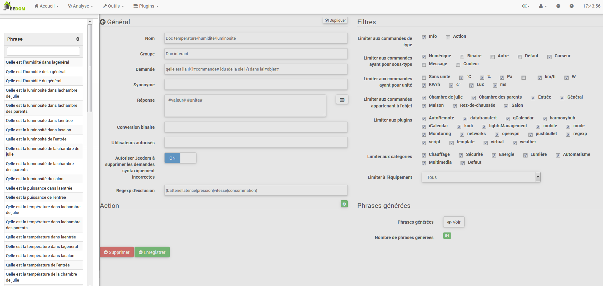

Man kann sich also einen regulären Ausdruck vorstellen:

**(Batterie\|Latenz\|Druck\|Geschwindigkeit\|Verbrauch)**

Damit lassen sich alle Befehle entfernen, die eines dieser Wörter im Satz enthalten

> **Hinweis**
>
> Der Regexp hier ist eine vereinfachte Version für eine einfache Verwendung. Man kann also entweder die herkömmlichen Ausdrücke oder die vereinfachten Ausdrücke wie in diesem Beispiel verwenden.

### Einen Dimmer oder einen Thermostat (Schieberegler) steuern

#### Basisversion

Mit Interaktionen lassen sich eine Lampe prozentual (Dimmer) oder ein Thermostat steuern. Hier ein Beispiel für die Steuerung eines Dimmers für eine Lampe mithilfe von Interaktionen:

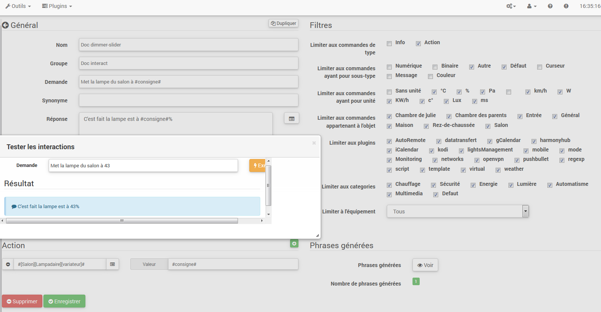

Wie man sieht, enthält die Anfrage hier das Tag **\#consigne\#** (man kann hier einen beliebigen Namen eingeben), das im Befehl an den Dimmer übernommen wird, um den gewünschten Wert anzuwenden. Dazu gibt es drei Teile: \* Anfrage: Hier erstellen wir ein Tag, das den Wert darstellt, der an die Interaktion gesendet wird. \* Antwort: Wir verwenden das Tag erneut in der Antwort, um sicherzustellen, dass Jeedom die Anfrage korrekt verstanden hat. \* Aktion: Wir legen eine Aktion für die Lampe fest, die wir steuern möchten, und übergeben ihr im Wert unser Tag *consigne*.

> **Hinweis**
>
> Es können beliebige Tags verwendet werden, mit Ausnahme derjenigen, die bereits von Jeedom verwendet werden. Es können mehrere Tags verwendet werden, um beispielsweise mehrere Befehle zu steuern. Beachten Sie außerdem, dass alle Tags an die durch die Interaktion gestarteten Szenarien übergeben werden (das Szenario muss sich jedoch im Modus „Im Vordergrund ausführen“ befinden).

#### Entwicklung

Möglicherweise möchte man alle Schieberegler mit einer einzigen Interaktion steuern. Mit dem folgenden Beispiel können wir daher mehrere Dimmer mit einer einzigen Interaktion steuern und somit eine Reihe von Sätzen zur Steuerung dieser Dimmer generieren.

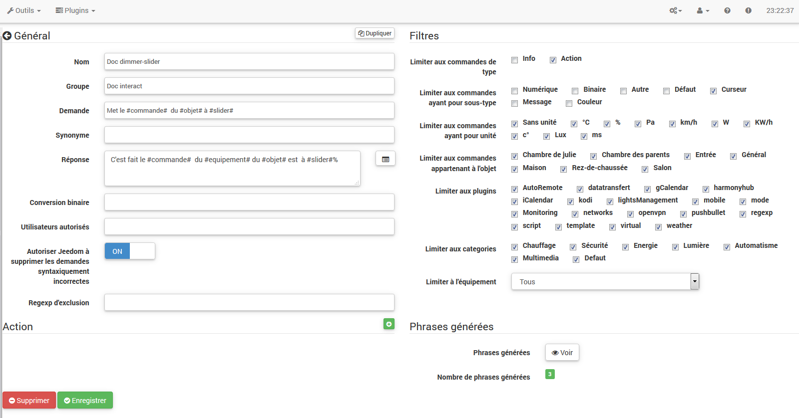

In dieser Interaktion gibt es keinen Befehl im Aktionsteil; Jeedom generiert die Liste der Sätze anhand der Tags. Man sieht das Tag **\#slider\#**. Dieses Tag muss für Anweisungen in einer Interaktion mit mehreren Befehlen unbedingt verwendet werden; es muss nicht unbedingt das letzte Wort des Satzes sein. Im Beispiel ist außerdem zu sehen, dass man in der Antwort ein Tag verwenden kann, das nicht Teil der Anfrage ist. Die meisten Tags, die in Szenarien verfügbar sind, stehen auch in Interaktionen zur Verfügung und können daher in einer Antwort verwendet werden.

Ergebnis der Interaktion:

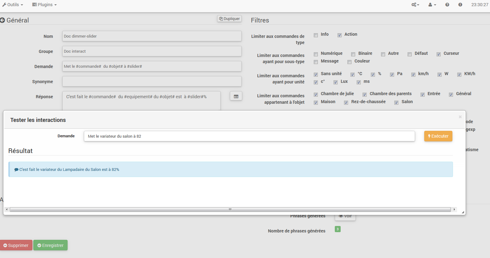

Es ist festzustellen, dass das Tag **\#equipement\#**, das in der Anfrage nicht verwendet wird, in der Antwort dennoch ausgefüllt ist.

### Die Farbe eines LED-Bandes steuern

Es ist möglich, eine Farbsteuerung über Interaktionen zu steuern, indem man beispielsweise Jeedom anweist, ein LED-Band blau leuchten zu lassen. Hier ist die dafür erforderliche Interaktion:

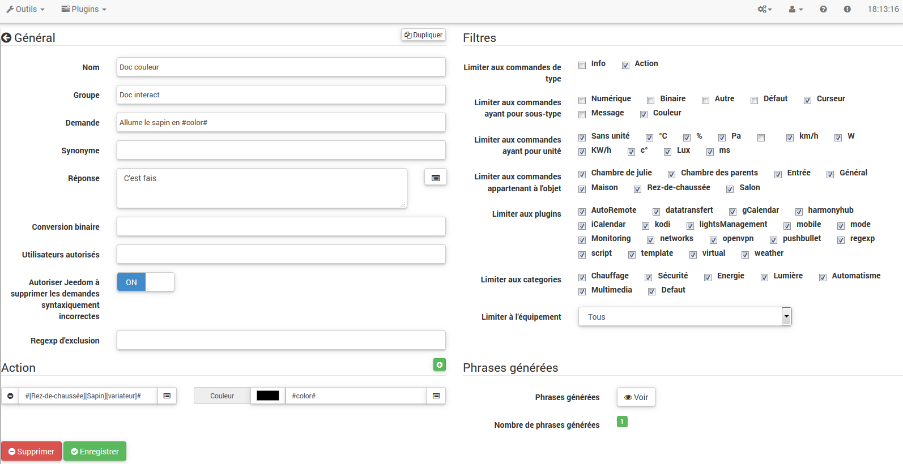

Bis hierhin ist das alles nicht besonders kompliziert, allerdings müssen Sie die Farben in Jeedom konfiguriert haben, damit es funktioniert; gehen Sie dazu ins Menü → Konfiguration (oben rechts) und dann in den Bereich „Konfiguration der Interaktionen“:

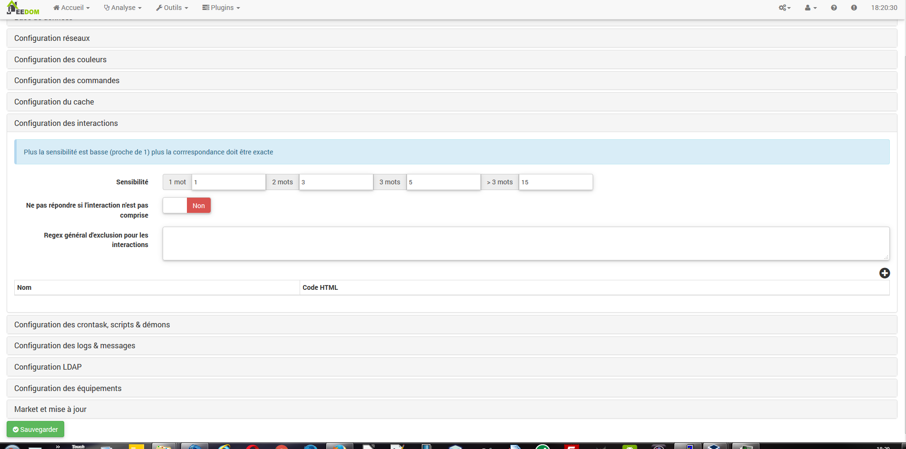

Wie auf dem Screenshot zu sehen ist, ist noch keine Farbe konfiguriert. Sie müssen also über das „+“ auf der rechten Seite Farben hinzufügen. Der Name der Farbe ist der Name, den Sie der Interaktion zuweisen werden. Im rechten Bereich (Spalte „HTML-Code“) können Sie durch Klicken auf die schwarze Farbe eine neue Farbe auswählen.

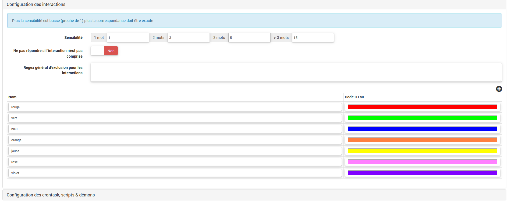

Man kann so viele hinzufügen, wie man möchte, und jedem einen beliebigen Namen geben. So könnte man beispielsweise jedem Familienmitglied eine Farbe als Namen zuweisen.

Sobald die Konfiguration abgeschlossen ist, sagen Sie „Schalte den Weihnachtsbaum auf grün“, und Jeedom sucht in der Anfrage nach einer Farbe und wendet diese auf den Befehl an.
### Verwendung in Verbindung mit einem Szenario

#### Basisversion

Es ist möglich, eine Interaktion mit einem Szenario zu verknüpfen, um etwas komplexere Aktionen auszuführen als die Ausführung einer einfachen Aktion oder einer Informationsanfrage.

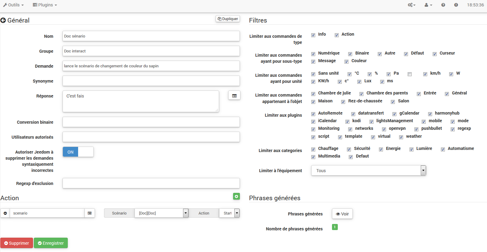

Mit diesem Beispiel lässt sich also das Szenario starten, das im Abschnitt „Aktion“ verknüpft ist; natürlich kann man auch mehrere davon haben.

### Programmierung einer Aktion mit Interaktionen

Mit Interaktionen lassen sich insbesondere viele Dinge realisieren. Sie können eine Aktion dynamisch programmieren. Beispiel: „Stelle die Heizung um 14:50 Uhr auf 22 ein“. Das ist ganz einfach: Verwenden Sie dazu die Tags \#time\# (wenn Sie eine bestimmte Uhrzeit festlegen) oder \#duration\# (für eine bestimmte Zeitspanne, z. B. in 1 Stunde):

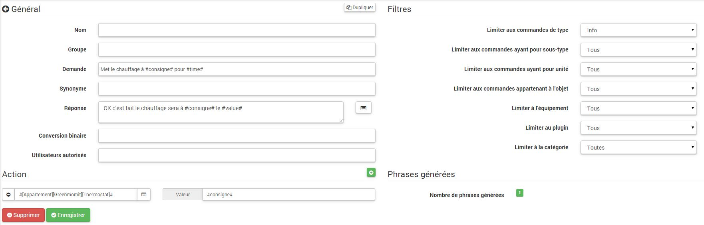

> **Hinweis**
>
> Sie werden in der Antwort das Tag \#value\# bemerken. Dieses enthält im Falle einer programmierten Interaktion den tatsächlichen Programmierzeitpunkt.
