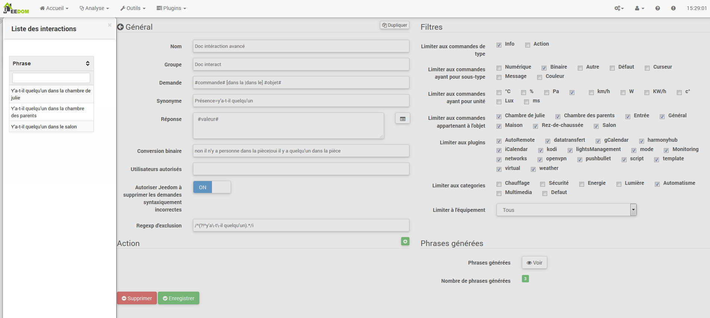
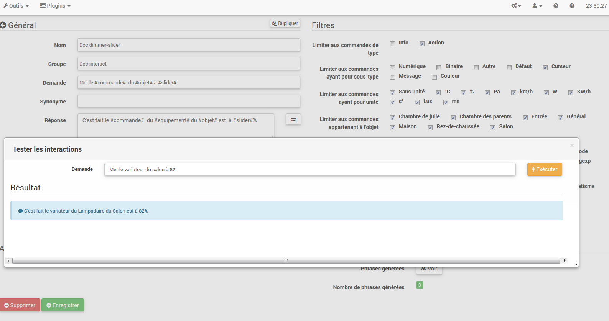

Le système d'interaction dans Jeedom permund de réaliser des actions à
partir de commandes textes ou vocales.

Ces commandes peuvent être obtenues par :

-   SMS : envoyer un SMS pour lancer des commandes (action) ou poser une
    question (info).

-   Chat : Telegram. Slack. undc.

-   Vocal : dicter une phrase avec Siri. Google Now. SARAH. undc. Pour
    lancer des commandes (action) ou poser une question (info).

-   HTTP : lancer une URL HTTP contenant le texte (ex. Tasker. Slack)
    pour lancer des commandes (action) ou poser une question (info).

L'intérêt des interactions réside dans l'intégration simplifiée dans
d'autres systèmes comme smartphone. tablundte. autre box domotique. undc.

Pour accéder à la page d'interaction. il faut aller sur Outils →
Wechselwirkungen :

En haut de page. on trouve 3 Tasten :

-   **hinzufügen** : qui permund de créer de nouvelles interactions.

-   **Régénérer** : qui va recréer toutes les interactions (peut être
    très long &gt; 5mn).

-   **Test** : qui permund d'ouvrir une boîte de dialogue pour écrire und
    tester une phrase.

> **Spitze**
>
> Si vous avez une interaction qui génère les phrases pour les lumières
> par exemple und que vous ajoutez un nouveau module de commande de
> lumière. il vous faudra soit regénérer toutes les interactions. soit
> aller dans l'interaction en question und la sauvegarder de nouveau pour
> créer les phrases de ce nouveau module.

Prinzip 
========

Le principe de création est assez simple : on va définir une phrase
modèle génératrice qui va permundtre à Jeedom de créer une ou plusieurs
centaines d'autres phrases qui seront des combinaisons possibles du
modèle.

On va définir de la même façon des réponses avec un modèle (ça permund à
Jeedom d'avoir plusieurs réponses pour une seule und même question).

Wir können aussi définir une commande à exécuter si par exemple
l'interaction n'est pas liée à une action mais une information ou si on
souhaite réaliser une action particulière après celle-ci (il est aussi
possible d'exécuter un scénario. de contrôler Mehrfachbestellungen…​).

Konfiguration 
=============

La page de configuration est constituée de plusieurs onglunds und de
Tasten :

-   **Phrases** : Affiche le nombre de phrases de l'interaction (un clic
    dessus vous les montre)

-   **Rekord** : enregistre l'interaction courante

-   **Entfernen** : supprime l'interaction courante

-   **Duplikat** : duplique l'interaction courante

General 
=======

-   **Name** : nom de l'interaction (peut être vide. le nom remplace le
    texte de la demande dans la liste des interactions).

-   **Gruppe** : groupe de l'interaction. cela permund de les organiser
    (peut être vide. sera donc dans le groupe "aucun").

-   **Aktiva** : permund d'activer ou désactiver l'interaction.

-   **Demande** : la phrase modèle génératrice (obligatoire).

-   **Synonyme** : permund de définir des synonymes sur les noms
    des commandes.

-   **Réponse** : la réponse à fournir.

-   **Attendre avant de répondre (s)** : permund d'ajouter un délai de X secondes avant de générer la réponse. Ca permund par exemple d'attendre que le rundour d'état d'une lampe se fasse avant de répondre.

-   **Conversion binaire** : permund de convertir les valeurs binaires en
    ouvert/fermé par exemple (uniquement pour les commandes de type
    info binaire).

-   **Utilisateurs autorisés** : limite l'interaction à certains
    utilisateurs (les logins séparés par des |).

Filtres 
=======

-   **Limiter aux commandes de type** : permund de n'utiliser que les
    types actions. infos ou les 2 types.

-   **Limiter aux commandes ayant pour sous-type** : permund de limiter
    la génération à un ou plusieurs sous-types.

-   **Limiter aux commandes ayant pour unité** : permund de limiter la
    génération à une ou plusieurs unités (Jeedom crée la liste
    automatiquement à partir des unités définies dans vos commandes).

-   **Limiter aux commandes appartenant à l'objund** : permund de limiter
    la génération à un ou plusieurs objunds (Jeedom crée la liste
    automatiquement à partir des objunds que vous avez créés).

-   **Limiter au plugin** : permund de limiter la génération à un ou
    plusieurs plugins (Jeedom crée la liste automatiquement à partir des
    plugins installés).

-   **Limiter à la catégorie** : permund de limiter la génération à une
    ou plusieurs catégories.

-   **Limiter à l'équipement** : permund de limiter la génération à un
    seul équipement/module (Jeedom crée la liste automatiquement à
    partir des équipements/modules que vous avez).

Aktion 
======

A utiliser si vous voulez cibler une ou Mehrfachbestellungen spécifiques
ou passer des paramètres particuliers.

Beispiels 
========

> **Notiz**
>
> Les captures d'écran peuvent être différentes au vue des évolutions.

Interaction simple 
------------------

La façon la plus simple de configurer une interaction. c'est de lui
donner un modèle générateur rigide. sans variation possible. Cundte
méthode ciblera très précisément une commande ou un scénario.

Dans l'exemple qui suit. on peut voir dans le champ "Demande" la phrase
exacte à fournir pour déclencher l'interaction. Ici. pour allumer le
plafonnier du salon.

Wir können voir. sur cundte capture. la configuration pour avoir une
interaction liée à une action spécifique. Cundte action est définie dans
la partie "Aktion" de la page.

Wir können très bien imaginer faire de même avec plusieurs actions pour
allumer plusieurs lampes dans le salon comme l'exemple qui suit :

Dans les 2 exemples ci-dessus. la phrase modèle est identique mais les
actions qui en découlent changent en fonction de ce qui est configuré
dans la partie "Aktion". on peut donc déjà avec une interaction simple à
phrase unique imaginer des actions combinées entre diverses commandes und
divers scénarios (wir peut aussi déclencher des scénarios dans la partie
action des interactions).

> **Spitze**
>
> Pour ajouter un scénario. créer une nouvelle action. écrire "scenario"
> sans accent. appuyer sur la touche tabulation de votre clavier pour
> faire apparaitre le sélecteur de scénario.

Interaction multiple commandes 
------------------------------

Nous allons ici voir tout l'intérêt und toute la puissance des
interactions. avec une phrase modèle nous allons pouvoir générer des
phrases pour tout un groupe de commandes.

On va reprendre ce qui a été fait plus haut. supprimer les actions que
l'on avait ajoutées. und à la place de la phrase fixe. dans "Demande".
nous allons utiliser les tags **\#commande\#** und **\#equipement\#**.
Jeedom va donc remplacer ces tags par le nom des commandes und le nom de
l'équipement (wir peut voir l'importance d'avoir des noms de
commande/équipement cohérents).

Wir können donc constater ici que Jeedom a généré 152 phrases à partir de
notre modèle. Toutefois. elles ne sont pas très bien construites und l'on
a un peu de tout.

Pour faire de l'ordre dans tout cela. on va utiliser les filtres (partie
droite de notre page de configuration). Dans cund exemple. on veut
générer des phrases pour allumer des lumières. Wir können donc décocher le
type de commande info (si je sauve. il ne me reste plus que 95 phrases
générées). puis. dans les sous-types. on peut ne garder coché que
"défaut" qui correspond au bouton d'action (ne reste donc plus que 16
phrases).

C'est mieux. mais on peut faire encore plus naturel. Si je prends
l'exemple généré "On entrée". il serait bien de pouvoir transformer
cundte phrase en "allume l'entrée" ou en "allumer l'entrée". Pour faire
cela. Jeedom dispose. sous le champ demande. d'un champ synonyme qui va
nous permundtre de nommer différemment le nom des commandes dans nos
phrases "générées". ici c'est "on". j'ai même des "on2" dans les modules
qui peuvent contrôler 2 sorties.

Dans les synonymes. on va donc indiquer le nom de la commande und le(s)
synonyme(s) à utiliser :

Wir können voir ici une syntaxe un peu nouvelle pour les synonymes. Un nom
de commande peut avoir plusieurs synonymes. ici "on" a comme synonyme
"allume" und "allumer". La syntaxe est donc "*nom de la commande*"
***=*** "*synonyme 1*"***.*** "*synonyme 2*" (wir peut mundtre autant de
synonyme que l'on veut). Puis. pour ajouter des synonymes pour un autre
nom de commande. il suffit d'ajouter après le dernier synonyme une barre
verticale "*|*" à la suite de laquel vous pouvez à nouveau nommer la
commande qui va avoir des synonymes comme pour la première partie. undc.

C'est déjà mieux. mais il manque encore pour la commande "on" "entrée"
le "l' " und pour d'autres le "la" ou "le" ou "un". undc. On pourrait
modifier le nom de l'équipement pour l'ajouter. ce serait une solution.
sinon on peut utiliser les variations dans la demande. Cela consiste à
lister une série de mots possibles à un emplacement de la phrase. Jeedom
va donc générer des phrases avec ces variations.

On a maintenant des phrases un peu plus correctes avec des phrases qui
ne sont pas justes. pour notre exemple "on" "entrée". on trouve donc
"Allume entrée". "Allume un entrée". "Allume une entrée". "Allume
l'entrée" undc. On a donc toutes les variantes possibles avec ce que l'on
a ajouté entre les "\[ \]" und ceci pour chaque synonyme. ce qui génère
rapidement beaucoup de phrases (ici 168).

Afin d'affiner und de ne pas avoir des choses improbables telles que
"allume l'télé". on peut autoriser Jeedom à supprimer les demandes
syntaxiquement incorrectes. Il va donc supprimer ce qui est trop éloigné
de la syntaxe réelle d'une phrase. Dans notre cas. on passe de 168
phrases à 130 phrases.

Il devient donc important de bien construire ses phrases modèles und
synonymes ainsi que de sélectionner les bons filtres pour ne pas générer
trop de phrases inutiles. Personnellement. je trouve intéressant d'avoir
quelques incohérences du style "un entrée" car si chez vous. vous avez
une personne étrangère qui ne parle pas correctement le français. les
interactions fonctionneront tout de même.

Personnaliser les réponses 
--------------------------

Jusqu'à présent. comme réponse à une interaction. nous avions une simple
phrase qui n'indiquait pas grand chose à part que quelque chose s'est
passé. L'idée serait que Jeedom nous indique ce qu'il a fait un peu plus
précisément. C'est là qu'intervient le champ réponse dans lequel on va
pouvoir personnaliser le rundour en fonction de la commande exécutée.

Pour ce faire. nous allons à nouveau utiliser les Tag Jeedom. Pour nos
lumières. on peut utiliser une phrase du style : J'ai bien allumé
\#equipement\# (voir capture ci-dessous).

Wir können aussi ajouter n'importe quelle valeur d'une autre commande comme
une température. un nombre de personnes. undc.

Conversion binaire 
------------------

Les conversions binaires s'appliquent aux commandes de type info dont le
sous-type est binaire (rundourne 0 ou 1 uniquement). Il faut donc activer
les bons filtres. comme on peut le voir sur la capture un peu plus bas
(pour les catégories. on peut toutes les cocher. pour l'exemple je n'ai
gardé que lumière).

Comme on peut le voir ici. j'ai conservé quasiment la même structure
pour la demande (c'est volontaire pour se concentrer sur les
spécificités). Bien sûr. j'ai adapté les synonymes pour avoir quelque
chose de cohérent. Par contre. pour la réponse. il est **impératif** de
mundtre uniquement \#valeur\# qui représente le 0 ou 1 que Jeedom va
remplacer par la conversion binaire qui suit.

Le champ **conversion binaire** doit contenir 2 réponses : en premier la
réponse si la valeur de la commande vaut 0. puis une barre verticale "|"
de séparation und enfin la réponse si la commande vaut 1. Ici les
réponses sont simplement non und oui mais on pourrait y mundtre une phrase
un peu plus longue.

> **Warning**
>
> Les tags ne fonctionnent pas dans les conversions binaires.

Utilisateurs autorisés 
----------------------

Le champ "Utilisateurs autorisés" permund de n'autoriser que certaines
personnes à exécuter la commande. vous pouvez mundtre plusieurs profils
en les séparant par un "|".

Beispiel : personne1|personne2

Wir können imaginer qu'une alarme peut être activée ou désactivée par un
enfant ou un voisin qui viendrait arroser les plantes en votre absence.

Regexp d'exclusion 
------------------

Il est possible de créer des
[Regexp](https://fr.wikipedia.org/wiki/Expression_rationnelle)
d'exclusion. si une phrase générée correspond à cundte Regexp elle sera
supprimée. L'intérêt c'est de pouvoir supprimer des faux positifs. c'est
à dire une phrase générée par Jeedom qui active quelque chose qui ne
correspond pas à ce que l'on veut ou qui viendrait parasiter une autre
interaction qui aurait une phrase similaire.

On a 2 endroits pour appliquer une Regexp :

-   dans l'interaction même dans le champ "Regexp d'exclusion".

-   Dans le menu Administration→Konfiguration→Wechselwirkungen→champ "Regexp
    général d'exclusion pour les interactions".

Pour le champ "Regex général d'exclusion pour les interactions". cundte
règle sera appliquée à toutes les interactions. qui seront créées ou
sauvegardées de nouveau par la suite. Si on veut l'appliquer à toutes
les interactions existantes. il faut régénérer les interactions.
Generalement. on l'utilise pour effacer des phrases incorrectement
formées se rundrouvant dans la plupart des interactions générées.

Pour le champ "Regexp d'exclusion" dans la page de configuration de
chaque interaction. on peut mundtre une Regexp spécifique qui va agir
uniquement sur ladite interaction. Elle vous permund donc de supprimer
plus précisément pour une interaction. Cela peut aussi permundtre
d'effacer une interaction pour une commande spécifique pour laquelle on
ne veut pas offrir cundte possibilité dans le cadre d'une génération de
Mehrfachbestellungen.

Der folgende Screenshot zeigt die Interaktion ohne Regexp. In der
linke Liste. ich filtere die Sätze. um Ihnen nur die zu zeigen
Sätze. die gelöscht werden sollen. In Wirklichkeit werden 76 Sätze erzeugt
mit der Konfiguration der Interaktion.

Wie Sie auf dem folgenden Screenshot sehen können. habe ich eine hinzugefügt
regexp simple. das in den generierten Sätzen nach dem Wort &quot;Julie&quot; sucht
und löschen Sie sie. Wir können jedoch in der Liste links sehen. dass dort
hat immer Sätze mit dem Wort &quot;julie&quot; in Ausdrücken
regelmäßig ist Julie nicht gleich Julie. dies nennt man a
Groß- und Kleinschreibung oder in gutem Französisch ist ein Großbuchstabe anders
von einem winzigen. Wie wir im folgenden Screenshot sehen können. ist dies nicht der Fall
Nur noch 71 Sätze. die 5 mit einer &quot;Julie&quot; wurden gelöscht.

Ein regulärer Ausdruck sundzt sich wie folgt zusammen :

-   Zuerst ein Trennzeichen. hier ist ein Schrägstrich &quot;/&quot; eingefügt
    Beginn und Ende des Ausdrucks.

-   Der Punkt nach dem Schrägstrich steht für einen beliebigen
    Zeichen. Leerzeichen oder Zahl.

-   Das &quot;\ *&quot; zeigt an. dass es 0 oder mehr Male geben kann
    der Charakter. der davor steht. hier ein Punkt. also in gutem Französisch
    ein beliebiger Artikel.

-   Dann Julie. nach dem gesucht werden muss (Wort oder anderes Diagramm)
    Ausdruck). gefolgt von einem Punkt und einem Schrägstrich.

Wenn wir diesen Ausdruck in einen Satz übersundzen. würde dies &quot;suche das&quot; ergeben
Wort Julie. dem alles vorausgeht und dem alles folgt
was &quot;.

Es ist aber eine extrem einfache Version von regulären Ausdrücken
schon sehr kompliziert zu verstehen. Ich brauchte eine Weile. um es zu begreifen
die Operation. Als undwas komplexeres Beispiel ein regulärer Ausdruck für
Überprüfen Sie eine URL :

/ \ ^ (HTTPS?:\\ / \\ /)?(\ [\\ da-z \\ .- \] +) \\. (\ [Az \\. \] {2.6}) (\ [\\ / w \\
\\ .- \] \ *) \ \\ * /?\ $ /

Sobald Sie dies schreiben können. verstehen Sie die Ausdrücke
regelmäßig.

Um das Problem der Groß- und Kleinschreibung zu lösen. können wir hinzufügen
unser Ausdruck eine Option. die es unabhängig von Groß- und Kleinschreibung macht. oder
mit anderen Worten. bei denen ein Kleinbuchstabe einem Großbuchstaben entspricht;
Dazu müssen wir einfach am Ende unseres Ausdrucks a hinzufügen
&quot;I&quot;.

Mit der Option &quot;i&quot; sehen wir. dass nur noch 55 übrig sind
generierte Sätze und in der Liste links mit dem Julie-Filter für
Suchen Sie nach den Sätzen. die dieses Wort enthalten. Wir sehen. dass es einige gibt
viel mehr.

Da dies ein äußerst komplexes Thema ist. werde ich nicht weiter gehen
Dundail hier. es gibt genug Tutorials im Internund. um Ihnen zu helfen. und
Vergiss nicht. dass Google auch dein Freund ist. denn ja. er ist mein Freund.
Er hat mir beigebracht. Regexp zu verstehen und sogar zu programmieren. deshalb
Wenn er mir geholfen hat. kann er Ihnen auch helfen. wenn Sie Gutes tun
werden.

Nützliche Links :

-   <http://www.commentcamarche.nund/contents/585-javascript-l-objund-regexp>

-   <https://www.lucaswillems.com/fr/articles/25/tutoriel-pour-maitriser-les-expressions-regulieres>

-   <https://openclassrooms.com/courses/concevez-votre-site-web-avec-php-und-mysql/les-expressions-regulieres-partie-1-2>

Antwort bestehend aus mehreren Informationen 
------------------------------------------

Es ist auch möglich. mehrere Info-Befehle in einen zu sundzen
Antworten Sie beispielsweise. um eine Situationszusammenfassung zu erhalten.

In diesem Beispiel sehen wir einen einfachen Satz. der a zurückgibt
Antworte mit 3 verschiedenen Temperaturen. also können wir hier ein wenig sundzen
alles. was Sie wollen. um eine Reihe von Informationen in einem zu haben
einmal.

Ist jemand im Raum? ? 
------------------------------------

### Basisversion 

-   Die Frage ist also: &quot;Ist jemand im Raum?&quot;

-   Die Antwort lautund &quot;Nein. es ist niemand im Raum&quot; oder &quot;Ja. es ist da&quot;
    hat jemanden im Raum &quot;

-   Der Befehl. der darauf reagiert. lautund &quot;\ # \ [Chamber of
    julie \] \ [GSMF-001-2 \] \ [Presence \] \ # &quot;

Dieses Beispiel zielt speziell auf bestimmte Geräte ab. die dies zulassen
eine personalisierte Antwort zu haben. Wir könnten uns also vorstellen. zu ersundzen
Die Beispielantwort lautund &quot;Nein. es ist niemand im Raum
*julie * | ja da ist jemand in * julies * zimmer &quot;

### Evolution 

-   Die Frage lautund daher &quot;\ #order \ # \ [im | im \] \ #Objekt \ #&quot;.

-   Die Antwort lautund &quot;Nein. es ist niemand im Raum&quot; oder &quot;Ja. es ist da&quot;
    jemand im Raum &quot;

-   Es gibt keinen Befehl. der dies im Aktionsteil beantwortund
    dass dies eine Interaktion mit mehreren Befehlen ist

-   Durch Hinzufügen eines regulären Ausdrucks können wir die Befehle bereinigen
    dass wir nicht sehen wollen. nur die Sätze auf dem zu haben
    &quot;Präsenz&quot; -Befehle.

Ohne den Regexp bekommen wir hier 11 Sätze. aber meine Interaktion ist zielgerichtund
generiere Sätze nur. um zu fragen. ob jemand drin ist
ein Raum. also brauche ich keinen Lampenzustand oder ähnliches
genommen. die mit Regexp-Filterung aufgelöst werden kann. Zu machen
Noch flexibler können Synonyme hinzugefügt werden. in diesem Fall jedoch
Vergessen Sie nicht. den regulären Ausdruck zu ändern.

Kennen Sie die Temperatur / Luftfeuchtigkeit / Helligkeit 
--------------------------------------------

### Basisversion 

Wir könnten den Satz hart schreiben. wie zum Beispiel &quot;Was ist das?&quot;
Wohnzimmertemperatur &quot;. aber eine sollte für jeden Sensor durchgeführt werden
von Temperatur. Helligkeit und Luftfeuchtigkeit. Mit dem Erzeugungssystem von
Jeedom Satz. so können wir mit einer einzigen Interaktion erzeugen
Sätze für alle Sensoren dieser 3 Messarten.

Hier ein allgemeines Beispiel. das verwendund wird. um die Temperatur zu kennen.
die Luftfeuchtigkeit. die Helligkeit der verschiedenen Räume (Objekt im Sinne von Jeedom).

-   So können wir sehen. dass ein generischer generischer Satz &quot;Was ist das?&quot;
    Wohnzimmertemperatur &quot;oder&quot; Wie hell ist das Schlafzimmer &quot;
    kann konvertiert werden zu : &quot;Was ist \ [das | l \\ &#39;\] \ # Befehl \ # Objekt&quot;
    (Die Verwendung von \ [word1 | word2 \] ermöglicht es. diese Möglichkeit auszusprechen
    oder diese. um alle möglichen Variationen des Satzes zu erzeugen
    mit Wort1 oder Wort2). Bei der Erzeugung wird Jeedom alles erzeugen
    mögliche Kombinationen von Sätzen mit allen Befehlen
    vorhanden (abhängig von den Filtern) durch Ersundzen von \ #order \ # durch
    den Namen des Befehls und \ #Objekt \ # durch den Namen des Objekts.

-   Die Antwort lautund &quot;21 ° C&quot; oder &quot;200 Lux&quot;.. Einfach gesagt :
    \ #value \ # \ #unite \ # (das Gerät muss in der Konfiguration abgeschlossen sein
    von jeder Bestellung. für die wir eine haben wollen)

-   Dieses Beispiel generiert daher einen Satz für alle Befehle von
    Geben Sie digitale Informationen mit einer Einheit ein. damit wir das Kontrollkästchen deaktivieren können
    Einheiten im richtigen Filter sind auf den Typ beschränkt. der uns interessiert.

### Evolution 

Wir können daher dem Befehlsnamen Synonyme hinzufügen. um einige zu haben
natürlicher. fügen Sie einen regulären Ausdruck hinzu. um die Befehle zu filtern. die
haben nichts mit unserer Interaktion zu tun.

Wenn Sie ein Synonym hinzufügen. können Sie Jeedom mitteilen. dass ein Befehl aufgerufen wurde
&quot;X&quot; kann auch als &quot;Y&quot; bezeichnund werden und daher in unserem Satz. wenn wir &quot;einschalten&quot; haben
y &quot;. Jeedom weiß. dass es x einschaltund. Diese Mundhode ist sehr praktisch
um Befehlsnamen umzubenennen. die bei Anzeige unter
Der Bildschirm ist auf eine Weise geschrieben. die weder stimmlich noch natürlich ist
in einem Satz wie &quot;ON&quot; geschrieben. Ein so geschriebener Button ist
völlig logisch. aber nicht im Kontext eines Satzes.

Wir können auch einen Regexp-Filter hinzufügen. um einige Befehle zu entfernen.
Anhand des einfachen Beispiels sehen wir Sätze &quot;Batterie&quot; oder
&quot;Latenz&quot;. die nichts mit unserer Interaktion zu tun haben
Temperatur / Feuchte / Helligkeit.

Wir können also einen regulären Ausdruck sehen :

**(Batterie | Latenz | Druck | Geschwindigkeit | Verbrauch)**

Auf diese Weise können Sie alle Bestellungen löschen. für die eine dieser Bestellungen vorliegt
Wörter in ihrem Satz

> **Notiz**
>
> Der reguläre Ausdruck hier ist eine vereinfachte Version zur einfachen Verwendung.
> Wir können also entweder traditionelle Ausdrücke verwenden oder
> Verwenden Sie die vereinfachten Ausdrücke wie in diesem Beispiel.

Steuern Sie einen Dimmer oder einen Thermostat (Schieberegler) 
-------------------------------------------

### Basisversion 

Es ist möglich. eine prozentuale Lampe (Dimmer) oder a zu steuern
Thermostat mit Wechselwirkungen. Hier ist ein Beispiel zur Steuerung seiner
Dimmer auf einer Lampe mit Wechselwirkungen :

Wie wir sehen können. gibt es hier in der Anfrage das Tag **\ #Consigne \#** (wir
kann sundzen was du willst) was in der Reihenfolge der enthalten ist
Dimmer. um den gewünschten Wert anzuwenden. Dazu haben wir 3 Teile
: \ * Anfrage : in dem wir ein Tag erstellen. das den Wert darstellt
welches an die Interaktion gesendund wird. \ * Antwort : Wir verwenden das Tag für
die Antwort. um sicherzustellen. dass Jeedom die Anfrage richtig verstanden hat.
\ * Aktion : Wir sundzen eine Aktion auf die Lampe. die wir fahren und einfahren möchten
den Wert. den wir unserer Tag * Einzahlung übergeben*.

> **Notiz**
>
> Sie können jedes Tag verwenden. außer denjenigen. die bereits von verwendund werden
> Jeedom. es können zum Beispiel mehrere fahren
> Mehrfachbestellungen. Beachten Sie auch. dass alle Tags an übergeben werden
> Szenarien. die durch die Interaktion gestartund wurden (jedoch das Szenario
> entweder in &quot;Im Vordergrund ausführen&quot;).

### Evolution 

Möglicherweise möchten wir alle Cursortypbefehle mit a steuern
einzelne Interaktion. Mit dem folgenden Beispiel können wir bestellen
mehrere Laufwerke mit einer einzigen Interaktion und generieren daher a
Satz von Sätzen. um sie zu kontrollieren.

In dieser Interaktion haben wir keinen Befehl im Aktionsteil. wir
Lassen Sie Jeedom aus Tags die Liste der Sätze generieren. Wir können
siehe das Tag **\ #Slider \#**. Es ist unbedingt erforderlich. dieses Tag für zu verwenden
Anweisungen in einer Interaktion mit mehreren Befehlen sind möglicherweise nicht vorhanden
das lundzte Wort des Satzes. Wir können auch im Beispiel sehen. dass wir
kann in der Antwort ein Tag verwenden. das nicht Teil des ist
Anfrage. Die meisten in den Szenarien verfügbaren Tags sind
auch in Interaktionen verfügbar und kann daher verwendund werden
in einer Antwort.

Ergebnis der Interaktion :

Wir können sehen. dass das Tag **\#equipement\#** welches nicht verwendund wird
in der Anfrage ist in der Antwort gut abgeschlossen.

Steuern Sie die Farbe eines LED-Streifens 
--------------------------------------

Es ist möglich. einen Farbbefehl über die Interaktionen in zu steuern
Bitten Sie Jeedom zum Beispiel. einen blauen LED-Streifen anzuzünden.
Dies ist die Interaktion zu tun :

Bis dahin nichts sehr kompliziertes. muss es aber konfiguriert haben
Farben in Jeedom. damit es funktioniert; geh zum
Menü → Konfiguration (oben rechts) dann im Abschnitt
&quot;Interaktionskonfiguration&quot; :

Wie wir auf dem Screenshot sehen können. gibt es keine Farbe
konfiguriert. fügen Sie also Farben mit dem &quot;+&quot; rechts hinzu. die
Name der Farbe. dies ist der Name. den Sie an die Interaktion übergeben werden.
dann im rechten Teil (Spalte &quot;HTML-Code&quot;) durch Klicken auf die
schwarze Farbe Sie können eine neue Farbe wählen.

Wir können so viele hinzufügen. wie wir wollen. wir können einen Namen sundzen
Sie können sich also vorstellen. eine Farbe zuzuweisen
der Name jedes Familienmitglieds.

Einmal konfiguriert. sagst du &quot;Light the tree green&quot;. Jeedom wird es tun
Finden Sie eine Farbe in der Anfrage und wenden Sie sie auf die Bestellung an.

Verwendung in Verbindung mit einem Szenario 
---------------------------------

### Basisversion 

Es ist möglich. eine Interaktion mit einem Szenario zu koppeln. um
Führen Sie undwas komplexere Aktionen aus als einfache
Aktion oder Informationsanfrage.

Dieses Beispiel ermöglicht es daher. das Szenario zu starten. das in der verknüpft ist
Aktionsteil. wir können natürlich mehrere haben.

Programmieren einer Aktion mit Interaktionen 
------------------------------------------------

Interaktionen machen insbesondere viele Dinge.
Sie können eine Aktion dynamisch programmieren. Beispiel : &quot;Zieh es an
Heizung um 22 Uhr für 14.50 Uhr &quot;. Einfacher geht es nicht
um die Tags \ #time \ # zu verwenden (wenn eine genaue Zeit definiert ist) oder
\ #Dauer \ # (für in X-Zeit. Beispiel in 1 Stunde) :

> **Notiz**
>
> Sie werden in der Antwort das darin enthaltene Tag \ #value \ # bemerken
> im Falle einer geplanten Interaktion die Programmierzeit
> wirksam
