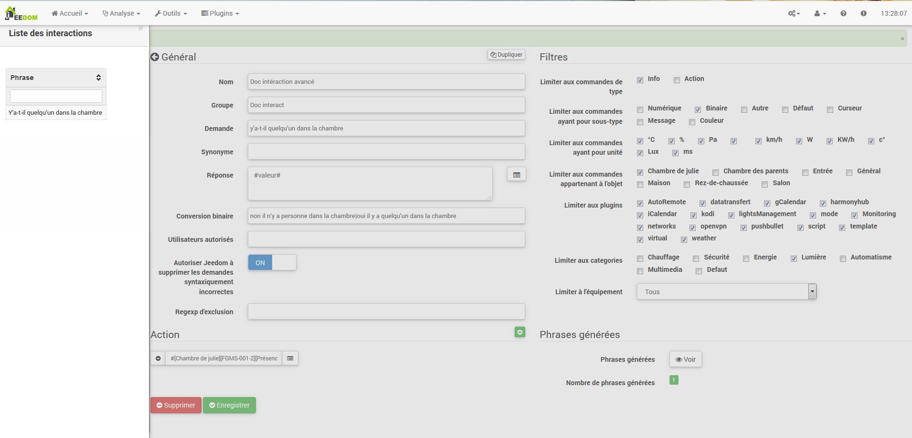
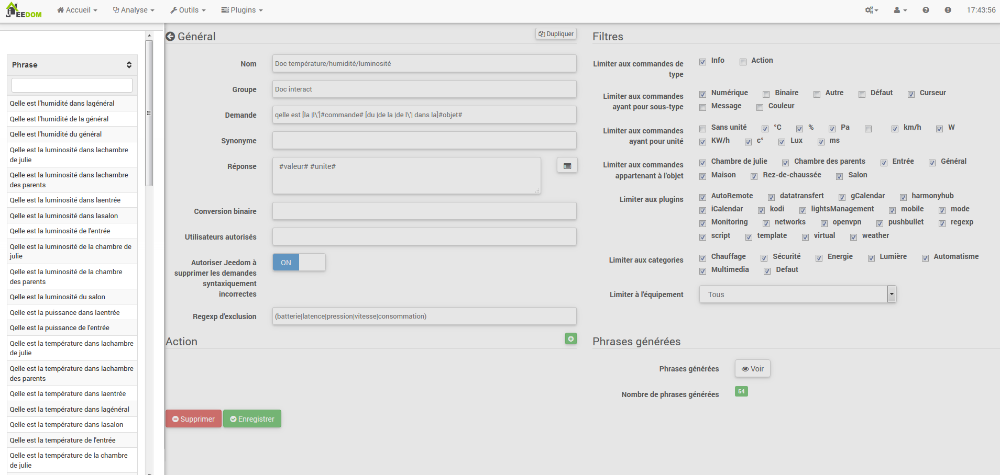

Das Interaktionssystem in Jeedom ermöglicht es, Aktionen auszuführen
von Text- oder Sprachbefehlen.

Diese Bestellungen erhalten Sie von :

-   SMS : Senden Sie eine SMS, um Befehle (Aktion) zu starten, oder fragen Sie a
    Frage (Info).

-   Katze : Telegramm, Slack usw.

-   Vokal : diktieren Sie eine Phrase mit Siri, Google Now, SARAH usw. für
    Befehle starten (Aktion) oder eine Frage stellen (Info).

-   Http : Starten Sie eine HTTP-URL, die den Text enthält (z. Tasker, Slack)
    Befehle starten (Aktion) oder eine Frage stellen (Info).

Das Interesse an Interaktionen liegt in der vereinfachten Integration in
andere Systeme wie Smartphone, Tablet, andere Hausautomationsbox usw.

Um auf die Interaktionsseite zuzugreifen, gehen Sie zu Extras →
Wechselwirkungen :

Am oberen Rand der Seite befinden sich 3 Schaltflächen :

-   **Hinzufügen** : Dadurch können neue Interaktionen erstellt werden.

-   **Regenerat** : Dadurch werden alle Interaktionen wiederhergestellt (möglicherweise
    très long &gt; 5mn).

-   **Test** : das öffnet einen Dialog zum Schreiben und
    teste einen Satz.

> **Spitze**
>
> Wenn Sie eine Interaktion haben, die die Sätze für die Lichter generiert
> Zum Beispiel und Sie fügen ein neues Befehlsmodul von hinzu
> Licht, müssen Sie entweder alle Interaktionen regenerieren, oder
> Gehen Sie zu der betreffenden Interaktion und speichern Sie sie erneut für
> Erstellen Sie die Sätze für dieses neue Modul.

Prinzip 
========

Das Prinzip der Schöpfung ist recht einfach : Wir werden einen Satz definieren
Generatormodell, mit dem Jeedom eines oder mehrere erstellen kann
Hunderte anderer Sätze, die mögliche Kombinationen der sein werden
Modell.

Wir werden Antworten auf die gleiche Weise mit einem Modell definieren (dies ermöglicht
Jeedom, um mehrere Antworten auf eine einzelne Frage zu haben).

Wir können auch einen Befehl definieren, der ausgeführt werden soll, wenn zum Beispiel
Die Interaktion ist nicht an eine Handlung gebunden, sondern an Informationen oder wenn wir
möchte danach eine bestimmte Aktion ausführen (es ist auch
möglich, ein Szenario auszuführen, mehrere Befehle zu steuern).

Konfiguration 
=============

Die Konfigurationsseite besteht aus mehreren Registerkarten und
Tasten :

-   **Sätze** : Zeigt die Anzahl der Sätze in der Interaktion an (ein Klick
    oben zeigt sie dir)

-   **Rekord** : zeichnet die aktuelle Interaktion auf

-   **Entfernen** : aktuelle Interaktion löschen

-   **Duplikat** : Dupliziere die aktuelle Interaktion

General 
=======

-   **Name** : Name der Interaktion (kann leer sein, der Name ersetzt den
    Anforderungstext in der Interaktionsliste).

-   **Gruppe** : Interaktionsgruppe, es hilft, sie zu organisieren
    (kann leer sein, wird also in der Gruppe "keine" sein").

-   **Aktiva** : ermöglicht das Aktivieren oder Deaktivieren der Interaktion.

-   **Anwendung** : Der generierende Modellsatz (erforderlich).

-   **Synonym** : ermöglicht das Definieren von Synonymen für Namen
    Bestellungen.

-   **Antwort** : die Antwort zu geben.

-   **Warten Sie, bevor Sie antworten (s)** : Fügen Sie eine Verzögerung von X Sekunden hinzu, bevor Sie die Antwort generieren. So können Sie beispielsweise auf die Rückkehr eines Lampenstatus warten, bevor Sie beantwortet werden.

-   **Binäre Konvertierung** : konvertiert Binärwerte in
    Zum Beispiel öffnen / schließen (nur für Typbefehle
    binäre Info).

-   **Autorisierte Benutzer** : begrenzt die Interaktion auf bestimmte
    Benutzer (Anmeldungen getrennt durch |).

Filter 
=======

-   **Beschränken Sie sich auf die Eingabe von Befehlen** : erlaubt nur die zu verwenden
    Arten von Aktionen, Informationen oder beide Arten.

-   **Beschränken Sie sich auf Bestellungen mit Subtyp** : erlaubt zu begrenzen
    Erzeugung zu einem oder mehreren Untertypen.

-   **Beschränkung auf Bestellungen mit Einheit** : ermöglicht die Begrenzung der
    Generation mit einer oder mehreren Einheiten (Jeedom erstellt die Liste
    automatisch aus den in Ihren Bestellungen definierten Einheiten).

-   **Beschränkung auf Bestellungen, die zum Objekt gehören** : erlaubt zu begrenzen
    Generierung zu einem oder mehreren Objekten (Jeedom erstellt die Liste
    automatisch aus den von Ihnen erstellten Objekten).

-   **Beschränken Sie sich auf das Plugin** : begrenzt die Erzeugung auf einen oder mehrere
    mehrere Plugins (Jeedom erstellt automatisch die Liste aus
    Plugins installiert).

-   **Beschränkung auf Kategorie** : begrenzt die Erzeugung auf eins
    oder mehr Kategorien.

-   **Beschränkung auf Ausrüstung** : begrenzt die Erzeugung auf eins
    Einzelausrüstung / Modul (Jeedom erstellt die Liste automatisch unter
    von den Geräten / Modulen, die Sie haben).

Aktion 
======

Verwenden Sie diese Option, wenn Sie einen oder mehrere bestimmte Befehle als Ziel festlegen möchten
oder bestimmte Parameter übergeben.

Beispiele 
========

> **Notiz**
>
> Die Screenshots können im Hinblick auf Entwicklungen unterschiedlich sein.

Einfache Interaktion 
------------------

Der einfachste Weg, eine Interaktion einzurichten, besteht darin, sie zu verwenden
Geben Sie ein starres Generatormodell ohne mögliche Abweichungen an. diese
Die Methode zielt sehr genau auf einen Befehl oder ein Szenario ab.

Im folgenden Beispiel sehen wir im Feld &quot;Request&quot; den Satz
genau bereitzustellen, um Interaktion auszulösen. Hier, um das einzuschalten
Wohnzimmer Deckenleuchte.

Wir können auf dieser Aufnahme die Konfiguration sehen, um eine zu haben
Interaktion mit einer bestimmten Aktion verbunden. Diese Aktion ist in definiert
der &quot;Aktion&quot; Teil der Seite.

Wir können uns sehr gut vorstellen, dasselbe mit mehreren Aktionen zu tun
Schalten Sie im folgenden Beispiel mehrere Lampen im Wohnzimmer ein :

In den beiden obigen Beispielen ist der Modellsatz identisch, aber der
Die resultierenden Aktionen ändern sich je nach Konfiguration
Im &quot;Action&quot; Teil können wir daher schon mit einer einfachen Interaktion auf
einzelner Satz stellen sich kombinierte Aktionen zwischen verschiedenen Befehlen und vor
verschiedene Szenarien (wir können auch Szenarien im Spiel auslösen
Aktion von Interaktionen).

> **Spitze**
>
> Um ein Szenario hinzuzufügen, erstellen Sie eine neue Aktion und schreiben Sie "Szenario""
> Drücken Sie ohne Akzent die Tabulatortaste auf Ihrer Tastatur, um
> Rufen Sie den Szenario-Selektor auf.

Interaktion mit mehreren Befehlen 
------------------------------

Hier werden wir all das Interesse und die ganze Kraft von sehen
Interaktionen mit einem Modellsatz, den wir generieren können
Sätze für eine ganze Gruppe von Befehlen.

Wir werden das oben Gesagte fortsetzen und die Aktionen löschen, die
wir hatten und anstelle des festen Satzes in "Anfrage",
Wir werden die Tags verwenden **\.#commande\.#** und **\.#equipement\.#**.
Jeedom ersetzt diese Tags durch den Namen der Befehle und den Namen von
Ausrüstung (wir können sehen, wie wichtig es ist, Namen von zu haben
konsequente Kontrolle / Ausrüstung).

Wir können hier also sehen, dass Jeedom 152 Sätze daraus generiert hat
unser Modell. Sie sind jedoch nicht sehr gut gebaut und wir
hat ein bisschen von allem.

Um Ordnung in all dem zu schaffen, werden wir die Filter (Teil) verwenden
rechts von unserer Konfigurationsseite). In diesem Beispiel wollen wir
Sätze generieren, um Lichter einzuschalten. So können wir das deaktivieren
Befehlstyp info (wenn ich speichere, habe ich nur noch 95 Sätze übrig
generiert), dann können wir in den Untertypen nur überprüft bleiben
"Standard ", der der Aktionsschaltfläche entspricht (so bleiben nur 16 übrig
phrases).

Es ist besser, aber wir können es noch natürlicher machen. Wenn ich nehme
Im generierten Beispiel &quot;Bei Eingabe&quot; wäre es schön, transformieren zu können
Dieser Satz in "Eintrag einschalten" oder in "Eintrag einschalten"". Zu tun
Jeedom hat unter dem Anforderungsfeld auch ein Feld, das dies tun wird
Erlauben Sie uns, Bestellungen in unserem anders zu benennen
&quot;generierte&quot; Sätze, hier ist es &quot;on&quot;, ich habe sogar &quot;on2&quot; in den Modulen
welches 2 Ausgänge steuern kann.

In Synonymen geben wir daher den Namen des Befehls und die (s) an)
zu verwendende Synonyme :

Wir können hier eine etwas neue Syntax für Synonyme sehen. Ein Name
kann mehrere Synonyme haben, hier hat &quot;on&quot; als Synonym
"einschalten "und" einschalten". Die Syntax lautet daher "*Name der Bestellung*"
***=*** "*Synonym 1*"***,*** "*Synonym 2*" (wir können so viele setzen
Synonym, das wir wollen). Fügen Sie dann Synonyme für ein anderes hinzu
Befehlsname, fügen Sie einfach nach dem letzten Synonym einen Balken hinzu
vertikal "*|*" Danach können Sie die erneut benennen
Befehl, der Synonyme wie für den ersten Teil usw. hat.

Es ist bereits besser, aber es fehlt immer noch für den Eingabebefehl "Ein""
das &quot;l&quot; und für andere das &quot;das&quot; oder &quot;das&quot; oder &quot;a&quot; usw. Wir könnten
Es wäre eine Lösung, den Namen des Geräts zu ändern, um es hinzuzufügen,
Andernfalls können wir Nachfrageschwankungen verwenden. Es besteht aus
Listen Sie eine Reihe möglicher Wörter an einer Stelle im Satz Jeedom auf
erzeugt Sätze mit diesen Variationen.

Wir haben jetzt etwas korrektere Sätze mit Sätzen, die
sind nicht fair, für unser Beispiel "on" "Eintrag". so finden wir
"Eingang einschalten "," Eingang einschalten "," Eingang einschalten "," Einschalten "
der Eintrag &quot;etc. Wir haben also alle möglichen Varianten mit dem, was wir haben
hinzugefügt zwischen &quot;\ [\]&quot; und diesem für jedes Synonym, das generiert
schnell viele Sätze (hier 168).

Um zu verfeinern und keine unwahrscheinlichen Dinge wie zu haben
"Fernseher einschalten ", können wir Jeedom autorisieren, Anfragen zu löschen
syntaktisch falsch. Es wird also gelöscht, was zu weit entfernt ist
die tatsächliche Syntax eines Satzes. In unserem Fall gehen wir von 168
130 Satzsätze.

Es wird daher wichtig, dass Sie Ihre Modellsätze gut und gut aufbauen
Synonyme sowie die Auswahl der richtigen Filter, um nicht zu generieren
zu viele unnötige Sätze. Persönlich finde ich es interessant zu haben
Einige Inkonsistenzen des Stils &quot;ein Eintrag&quot;, denn wenn Sie zu Hause sind, haben Sie
eine ausländische Person, die nicht richtig Französisch spricht,
Interaktionen werden weiterhin funktionieren.

Passen Sie die Antworten an 
--------------------------

Bisher hatten wir als Antwort auf eine Interaktion eine einfache
Satz, der nicht viel sagte, außer dass etwas passiert ist
Vergangenheit. Die Idee wäre, dass Jeedom uns erzählt, was er ein bisschen mehr getan hat
genau. Hier kommt das Antwortfeld ins Spiel
Möglichkeit, die Rücksendung basierend auf der ausgeführten Bestellung anzupassen.

Dazu verwenden wir wieder das Jeedom Tag. Für unsere
Lichter können wir einen Satz wie verwenden : Ich habe gut beleuchtet
\.#equipement\.# (siehe Screenshot unten).

Sie können auch einen beliebigen Wert aus einem anderen Befehl wie hinzufügen
Temperatur, Anzahl der Personen usw.

Binäre Konvertierung 
------------------

Binäre Konvertierungen gelten für Bestellungen vom Typ Info, deren
Der Subtyp ist binär (gibt nur 0 oder 1 zurück). Also musst du aktivieren
die richtigen Filter, wie Sie im folgenden Screenshot sehen können
(Für die Kategorien können wir alle überprüfen, für das Beispiel, das ich habe
hielt das Licht).

Wie Sie hier sehen können, habe ich fast die gleiche Struktur beibehalten
für die Nachfrage (es ist freiwillig, sich darauf zu konzentrieren
Besonderheiten). Natürlich habe ich die Synonyme angepasst, um einige zu haben
kohärente Sache. Für die Antwort ist es jedoch **Imperativ** de
setze nur \#valeur\.# was die 0 oder 1 darstellt, die Jeedom geht
durch folgende binäre Konvertierung ersetzen.

Das Feld **Binäre Konvertierung** muss 2 Antworten enthalten : zuerst die
Antwort, wenn der Wert des Befehls 0 ist, dann ein vertikaler Balken "|"
Trennung und schließlich die Antwort, wenn der Befehl 1 wert ist. Hier die
Antworten sind einfach nein und ja, aber wir könnten einen Satz setzen
etwas länger.

> **Warnung**
>
> Tags funktionieren nicht in binären Konvertierungen.

Autorisierte Benutzer 
----------------------

Im Feld &quot;Autorisierte Benutzer&quot; können Sie nur bestimmte autorisieren
Personen, um den Befehl auszuführen, können Sie mehrere Profile setzen
trenne sie mit a "|".

Beispiel : personne1|personne2

Man kann sich vorstellen, dass ein Alarm durch a aktiviert oder deaktiviert werden kann
Kind oder ein Nachbar, der in Ihrer Abwesenheit kommen würde, um die Pflanzen zu gießen.

Regexp-Ausschluss 
------------------

Es ist möglich zu erstellen
[Regexp](https://fr.wikipedia.org/wiki/Expression_rationnelle)
Ausschluss, wenn ein generierter Satz diesem Regexp entspricht, wird es sein
gelöscht. Es geht darum, Fehlalarme entfernen zu können
einen von Jeedom erzeugten Satz zu sagen, der etwas aktiviert, was nicht
entspricht nicht dem, was wir wollen oder was einen anderen stören würde
Interaktion, die einen ähnlichen Satz haben würde.

Wir haben 2 Stellen, an denen Sie einen Regexp anwenden können :

-   in der Interaktion auch im Feld "Regexp-Ausschluss"".

-   Im Menü Administration → Konfiguration → Interaktionen → Feld &quot;Regexp&quot;
    allgemeiner Ausschluss für Interaktionen".

Für das Feld &quot;Allgemeiner Ausschluss-Regex für Interaktionen&quot; ist dies
Regel wird auf alle Interaktionen angewendet, die erstellt werden oder
danach wieder gespeichert. Wenn wir es auf alle anwenden wollen
Bestehende Wechselwirkungen, Wechselwirkungen müssen regeneriert werden.
Normalerweise wird es verwendet, um Sätze falsch zu löschen
in den meisten erzeugten Wechselwirkungen gefunden.

Für das Feld &quot;Regexp-Ausschluss&quot; auf der Konfigurationsseite von
Bei jeder Interaktion können wir einen bestimmten Regexp einfügen, der funktioniert
nur auf diese Interaktion. So können Sie löschen
genauer für eine Interaktion. Es kann auch erlauben
Löschen Sie eine Interaktion für einen bestimmten Befehl, für den
will diese Gelegenheit nicht als Teil einer Generation von anbieten
Mehrfachbestellungen.

Der folgende Screenshot zeigt die Interaktion ohne Regexp. In der
linke Liste, ich filtere die Sätze, um Ihnen nur die zu zeigen
Sätze, die gelöscht werden sollen. In Wirklichkeit werden 76 Sätze erzeugt
mit der Konfiguration der Interaktion.

Wie Sie auf dem folgenden Screenshot sehen können, habe ich eine hinzugefügt
regexp simple, das in den generierten Sätzen nach dem Wort &quot;Julie&quot; sucht
und löschen Sie sie. Wir können jedoch in der Liste links sehen, dass dort
hat immer Sätze mit dem Wort &quot;julie&quot; in Ausdrücken
regelmäßig ist Julie nicht gleich Julie, dies nennt man a
Groß- und Kleinschreibung oder in gutem Französisch ist ein Großbuchstabe anders
von einem winzigen. Wie wir im folgenden Screenshot sehen können, ist dies nicht der Fall
Nur noch 71 Sätze, die 5 mit einer &quot;Julie&quot; wurden gelöscht.

Ein regulärer Ausdruck setzt sich wie folgt zusammen :

-   Zuerst ein Trennzeichen, hier ist ein Schrägstrich &quot;/&quot; eingefügt
    Beginn und Ende des Ausdrucks.

-   Der Punkt nach dem Schrägstrich steht für einen beliebigen
    Zeichen, Leerzeichen oder Zahl.

-   Das &quot;\*&quot; zeigt an, dass es 0 oder mehr Male geben kann
    der Charakter, der davor steht, hier ein Punkt, also in gutem Französisch
    ein beliebiger Artikel.

-   Dann Julie, nach dem gesucht werden muss (Wort oder anderes Diagramm)
    Ausdruck), gefolgt von einem Punkt und einem Schrägstrich.

Wenn wir diesen Ausdruck in einen Satz übersetzen, würde dies &quot;suche das&quot; ergeben
Wort Julie, dem alles vorausgeht und dem alles folgt
quoi".

Es ist aber eine extrem einfache Version von regulären Ausdrücken
schon sehr kompliziert zu verstehen. Ich brauchte eine Weile, um es zu begreifen
die Operation. Als etwas komplexeres Beispiel ein regulärer Ausdruck für
Überprüfen Sie eine URL :

/\.^(https?:\\ / \\ /)?(\ [\\ da-z \\ .- \] +) \\. (\ [az \\. \] {2,6}) (\ [\\ / \\ w
\\ .- \] \*)\.*\\ /?\ $ /

Sobald Sie dies schreiben können, verstehen Sie die Ausdrücke
regelmäßig.

Um das Problem der Groß- und Kleinschreibung zu lösen, können wir hinzufügen
unser Ausdruck eine Option, die es unabhängig von Groß- und Kleinschreibung macht, oder
mit anderen Worten, bei denen ein Kleinbuchstabe einem Großbuchstaben entspricht;
Dazu müssen wir einfach am Ende unseres Ausdrucks a hinzufügen
"i".

Mit der Option &quot;i&quot; sehen wir, dass nur noch 55 übrig sind
generierte Sätze und in der Liste links mit dem Julie-Filter für
Suchen Sie nach den Sätzen, die dieses Wort enthalten. Wir sehen, dass es einige gibt
viel mehr.

Da dies ein äußerst komplexes Thema ist, werde ich nicht weiter gehen
Detail hier, es gibt genug Tutorials im Internet, um Ihnen zu helfen, und
Vergiss nicht, dass Google auch dein Freund ist, denn ja, er ist mein Freund,
Er hat mir beigebracht, Regexp zu verstehen und sogar zu programmieren. deshalb
Wenn er mir geholfen hat, kann er Ihnen auch helfen, wenn Sie Gutes tun
volonté.

Nützliche Links :

-   <http://www.commentcamarche.net/contents/585-javascript-l-objet-regexp>

-   <https://www.lucaswillems.com/fr/articles/25/tutoriel-pour-maitriser-les-expressions-regulieres>

-   <https://openclassrooms.com/courses/concevez-votre-site-web-avec-php-et-mysql/les-expressions-regulieres-partie-1-2>

Antwort bestehend aus mehreren Informationen 
------------------------------------------

Es ist auch möglich, mehrere Info-Befehle in einen zu setzen
Antworten Sie beispielsweise, um eine Situationszusammenfassung zu erhalten.

In diesem Beispiel sehen wir einen einfachen Satz, der a zurückgibt
Antworte mit 3 verschiedenen Temperaturen, also können wir hier ein wenig setzen
alles, was Sie wollen, um eine Reihe von Informationen in einem zu haben
einmal.

Ist jemand im Raum? ? 
------------------------------------

### Basisversion 

-   Die Frage ist also: "Ist jemand im Raum?"

-   Die Antwort lautet &quot;Nein, es ist niemand im Raum&quot; oder &quot;Ja, es ist da&quot;
    hat jemanden im Raum"

-   Der Befehl, der darauf reagiert, lautet &quot;\# \ [Chamber of
    julie \] \ [GSMF-001-2 \] \ [Presence \] \#"

Dieses Beispiel zielt speziell auf bestimmte Geräte ab, die dies zulassen
eine personalisierte Antwort zu haben. Wir könnten uns also vorstellen, zu ersetzen
Die Beispielantwort lautet &quot;Nein, es ist niemand im Raum
*Julie*|Ja, da ist jemand im Raum *Julie*"

### Evolution 

-   Die Frage ist also "\#commande\.# \ [in der |in der \] \#objet\.#"

-   Die Antwort lautet &quot;Nein, es ist niemand im Raum&quot; oder &quot;Ja, es ist da&quot;
    jemand im Raum"

-   Es gibt keinen Befehl, der dies im Aktionsteil beantwortet
    dass dies eine Interaktion mit mehreren Befehlen ist

-   Durch Hinzufügen eines regulären Ausdrucks können wir die Befehle bereinigen
    dass wir nicht sehen wollen, nur die Sätze auf dem zu haben
    Anwesenheitsbefehle".

Ohne den Regexp bekommen wir hier 11 Sätze, aber meine Interaktion ist zielgerichtet
generiere Sätze nur, um zu fragen, ob jemand drin ist
ein Raum, also brauche ich keinen Lampenzustand oder ähnliches
genommen, die mit Regexp-Filterung aufgelöst werden kann. Zu machen
Noch flexibler können Synonyme hinzugefügt werden, in diesem Fall jedoch
Vergessen Sie nicht, den regulären Ausdruck zu ändern.

Kennen Sie die Temperatur / Luftfeuchtigkeit / Helligkeit 
--------------------------------------------

### Basisversion 

Wir könnten den Satz hart schreiben, wie zum Beispiel &quot;Was ist das?&quot;
Wohnzimmertemperatur &quot;, aber eine sollte für jeden Sensor durchgeführt werden
von Temperatur, Helligkeit und Luftfeuchtigkeit. Mit dem Erzeugungssystem von
Jeedom Satz, so können wir mit einer einzigen Interaktion erzeugen
Sätze für alle Sensoren dieser 3 Messarten.

Hier ein allgemeines Beispiel, anhand dessen die Temperatur ermittelt wird,
die Luftfeuchtigkeit, die Helligkeit der verschiedenen Räume (Objekt im Sinne von Jeedom).

-   So können wir sehen, dass ein generischer generischer Satz &quot;Was ist das?&quot;
    Wohnzimmertemperatur "oder" Wie hell ist das Schlafzimmer"
    kann konvertiert werden zu : "was ist \ [the |l \\ '\] \#commande\.# objet"
    (die Verwendung von \ [word1 | mot2 \] sagen wir diese Möglichkeit
    oder diese, um alle möglichen Variationen des Satzes zu erzeugen
    mit word1 oder word2). Bei der Erzeugung wird Jeedom alles erzeugen
    mögliche Kombinationen von Sätzen mit allen Befehlen
    vorhanden (abhängig von Filtern) durch Ersetzen von \#commande\.# par
    den Namen des Befehls und \#objet\.# durch den Namen des Objekts.

-   Die Antwort lautet "21 ° C" oder "200 Lux"". Einfach gesagt :
    \.#valeur\.# \.#unite\.# (Das Gerät ist in der Konfiguration zu vervollständigen
    von jeder Bestellung, für die wir eine haben wollen)

-   Dieses Beispiel generiert daher einen Satz für alle Befehle von
    Geben Sie digitale Informationen mit einer Einheit ein, damit wir das Kontrollkästchen deaktivieren können
    Einheiten im richtigen Filter sind auf den Typ beschränkt, der uns interessiert.

### Evolution 

Wir können daher dem Befehlsnamen Synonyme hinzufügen, um einige zu haben
natürlicher, fügen Sie einen regulären Ausdruck hinzu, um die Befehle zu filtern, die
haben nichts mit unserer Interaktion zu tun.

Wenn Sie ein Synonym hinzufügen, können Sie Jeedom mitteilen, dass ein Befehl aufgerufen wurde
"X" kann auch "Y" genannt werden und daher in unserem Satz, wenn wir "einschalten" haben
y &quot;, Jeedom weiß, dass es x einschaltet. Diese Methode ist sehr praktisch
um Befehlsnamen umzubenennen, die bei Anzeige unter
Der Bildschirm ist auf eine Weise geschrieben, die weder stimmlich noch natürlich ist
in einem Satz geschrieben wie "ON". Ein so geschriebener Button ist
völlig logisch, aber nicht im Kontext eines Satzes.

Wir können auch einen Regexp-Filter hinzufügen, um einige Befehle zu entfernen.
Anhand des einfachen Beispiels sehen wir Sätze &quot;Batterie&quot; oder
"Latenz ", die nichts mit unserer Interaktion zu tun haben
Temperatur / Feuchte / Helligkeit.

Wir können also einen regulären Ausdruck sehen :

**(batterie|latence|pression|vitesse|consommation)**

Auf diese Weise können Sie alle Bestellungen löschen, für die eine dieser Bestellungen vorliegt
Wörter in ihrem Satz

> **Notiz**
>
> Der reguläre Ausdruck hier ist eine vereinfachte Version zur einfachen Verwendung.
> Wir können also entweder traditionelle Ausdrücke verwenden oder
> Verwenden Sie die vereinfachten Ausdrücke wie in diesem Beispiel.

Steuern Sie einen Dimmer oder einen Thermostat (Schieberegler)) 
-------------------------------------------

### Basisversion 

Es ist möglich, eine prozentuale Lampe (Dimmer) oder a zu steuern
Thermostat mit Wechselwirkungen. Hier ist ein Beispiel zur Steuerung seiner
Dimmer auf einer Lampe mit Wechselwirkungen :

Wie wir sehen können, gibt es hier in der Anfrage das Tag **\.#consigne\.#** (on
kann setzen was du willst) was in der Reihenfolge der enthalten ist
Dimmer, um den gewünschten Wert anzuwenden. Dazu haben wir 3 Teile
: \* Anfrage : in dem wir ein Tag erstellen, das den Wert darstellt
welches an die Interaktion gesendet wird. \* Antwort : Wir verwenden das Tag für
die Antwort, um sicherzustellen, dass Jeedom die Anfrage richtig verstanden hat.
\* Aktion : Wir setzen eine Aktion auf die Lampe, die wir fahren und einfahren möchten
den Wert, den wir unserem Tag übergeben *Anleitung*.

> **Notiz**
>
> Sie können jedes Tag verwenden, außer denjenigen, die bereits von verwendet werden
> Jeedom, es können zum Beispiel mehrere fahren
> Mehrfachbestellungen. Beachten Sie auch, dass alle Tags an übergeben werden
> Szenarien, die durch die Interaktion gestartet wurden (jedoch das Szenario
> entweder in "Im Vordergrund ausführen").

### Evolution 

Möglicherweise möchten wir alle Cursortypbefehle mit a steuern
einzelne Interaktion. Mit dem folgenden Beispiel können wir bestellen
mehrere Laufwerke mit einer einzigen Interaktion und generieren daher a
Satz von Sätzen, um sie zu kontrollieren.

In dieser Interaktion haben wir keinen Befehl im Aktionsteil, wir
Lassen Sie Jeedom aus Tags die Liste der Sätze generieren. Wir können
siehe das Tag **\.#slider\.#**. Es ist unbedingt erforderlich, dieses Tag für zu verwenden
Anweisungen in einer Interaktion mit mehreren Befehlen sind möglicherweise nicht vorhanden
das letzte Wort des Satzes. Wir können auch im Beispiel sehen, dass wir
kann in der Antwort ein Tag verwenden, das nicht Teil des ist
Anfrage. Die meisten in den Szenarien verfügbaren Tags sind
auch in Interaktionen verfügbar und kann daher verwendet werden
in einer Antwort.

Ergebnis der Interaktion :

Wir können sehen, dass das Tag **\.#equipement\.#** welches nicht verwendet wird
in der Anfrage ist in der Antwort gut abgeschlossen.

Steuern Sie die Farbe eines LED-Streifens 
--------------------------------------

Es ist möglich, einen Farbbefehl über die Interaktionen in zu steuern
Bitten Sie Jeedom zum Beispiel, einen blauen LED-Streifen anzuzünden.
Dies ist die Interaktion zu tun :

Bis dahin nichts sehr kompliziertes, muss es aber konfiguriert haben
Farben in Jeedom, damit es funktioniert; geh zum
Menü → Konfiguration (oben rechts) dann im Abschnitt
"Interaktionen konfigurieren" :

Wie wir auf dem Screenshot sehen können, gibt es keine Farbe
konfiguriert, fügen Sie also Farben mit dem &quot;+&quot; rechts hinzu. die
Farbname, dies ist der Name, den Sie an die Interaktion übergeben werden,
dann im rechten Teil (Spalte &quot;HTML-Code&quot;) durch Klicken auf die
schwarze Farbe Sie können eine neue Farbe wählen.

Wir können so viele hinzufügen, wie wir wollen, wir können einen Namen setzen
Sie können sich also vorstellen, eine Farbe zuzuweisen
der Name jedes Familienmitglieds.

Einmal konfiguriert, sagst du &quot;Light the tree green&quot;, Jeedom wird es tun
Finden Sie eine Farbe in der Anfrage und wenden Sie sie auf die Bestellung an.

Verwendung in Verbindung mit einem Szenario 
---------------------------------

### Basisversion 

Es ist möglich, eine Interaktion mit einem Szenario zu koppeln, um
Führen Sie etwas komplexere Aktionen aus als einfache
Aktion oder Informationsanfrage.

Dieses Beispiel ermöglicht es daher, das Szenario zu starten, das in der verknüpft ist
Aktionsteil, wir können natürlich mehrere haben.

Programmieren einer Aktion mit Interaktionen 
------------------------------------------------

Interaktionen machen insbesondere viele Dinge.
Sie können eine Aktion dynamisch programmieren. Beispiel : "Setzen Sie die
Erhitzen um 22 Uhr für 14:50 Uhr". Einfacher geht es nicht
Tags verwenden \#time\.# (wenn eine bestimmte Zeit definiert ist) oder
\.#duration\.# (für in X-Zeit, Beispiel in 1 Stunde) :

> **Notiz**
>
> Sie werden in der Antwort das Tag \ bemerken#value\.# dieser enthält
> im Falle einer geplanten Interaktion die Programmierzeit
> effective
