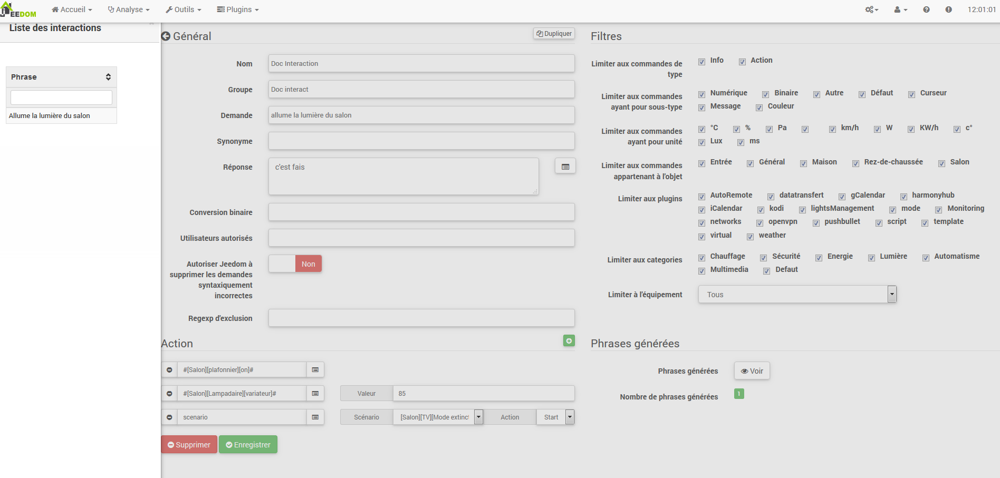
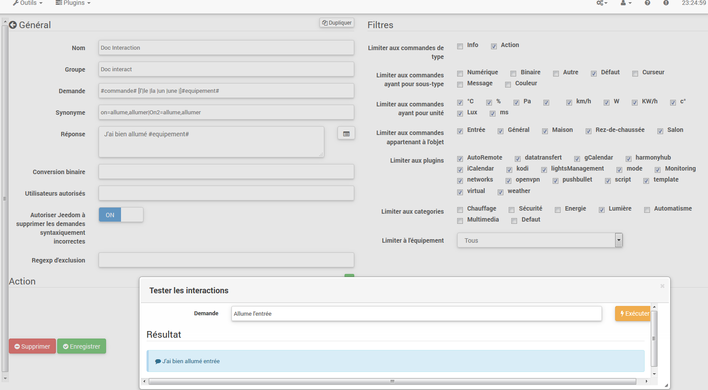
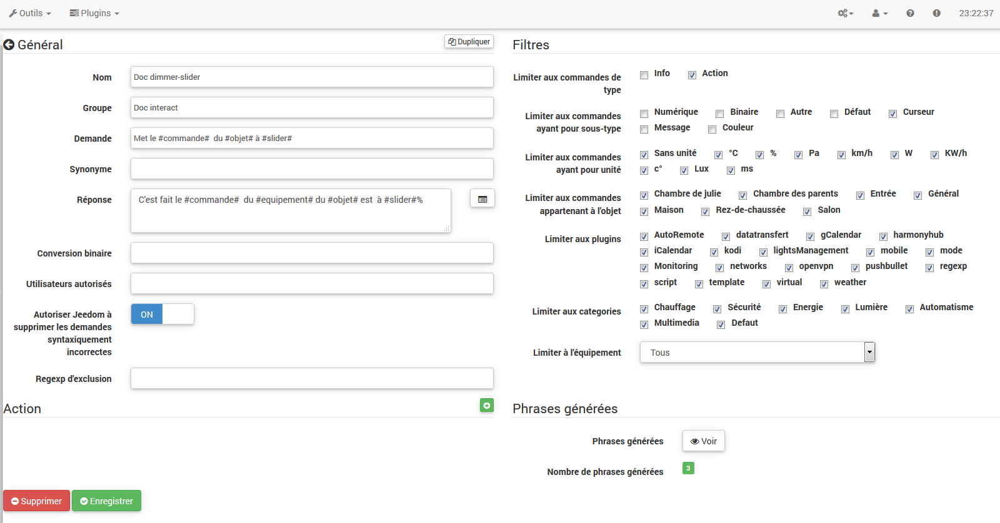

# Wechselwirkungen
**Werkzeuge → Interaktionen**

Mit dem Interaktionssystem in Jeedom können Sie Aktionen über Text- oder Sprachbefehle ausführen.

Diese Bestellungen erhalten Sie von :

- SMS : Senden Sie eine SMS. um Befehle zu starten (Aktion) oder stellen Sie eine Frage (Info).
- Katze : Telegramm. Slack usw..
- Vokal : diktieren Sie eine Phrase mit Siri. Google Now. SARAH usw.. Befehle starten (Aktion) oder eine Frage stellen (Info).
- HTTP : Starten Sie eine HTTP-URL. die den Text enthält (z. Tasker. Slack). um Befehle zu starten (Aktion) oder eine Frage zu stellen (Info).

Der Wert von Interaktionen liegt in der vereinfachten Integration in andere Systeme wie Smartphones. Tablunds. andere Hausautomationsboxen usw..

> **Spitze**
>
> Sie können eine Interaktion öffnen. indem Sie dies tun :
> - Klicken Sie auf eine davon.
> - Strg Clic oder Clic Center. um es in einem neuen Browser-Tab zu öffnen.

Sie haben eine Suchmaschine. um die Anzeige von Interaktionen zu filtern. Die Escape-Taste bricht die Suche ab.
Rechts neben dem Suchfeld befinden sich drei Schaltflächen. die an mehreren Stellen in Jeedom gefunden wurden:
- Das Kreuz. um die Suche abzubrechen.
- Der geöffnunde Ordner zum Entfalten aller Bedienfelder und Anzeigen aller Interaktionen.
- Der geschlossene Ordner zum Falten aller Panels.

Sobald Sie eine Interaktion konfiguriert haben. haben Sie ein Kontextmenü mit dem rechten Klick auf die Registerkarten der Interaktion. Sie können auch eine Strg-Klick- oder Klick-Mitte verwenden. um eine andere Interaktion direkt in einer neuen Browser-Registerkarte zu öffnen.

## Wechselwirkungen

Am oberen Rand der Seite befinden sich 3 Schaltflächen :

- **hinzufügen** : Ermöglicht das Erstellen neuer Interaktionen.
- **Regenerat** : Recréer toutes les interactions (peut être très long &gt; 5mn).
- **Test** : Öffnen Sie einen Dialog. um einen Satz zu schreiben und zu testen.

> **Spitze**
>
> Wenn Sie eine Interaktion haben. die beispielsweise die Sätze für Lichter generiert. und Sie ein neues Lichtsteuermodul hinzufügen. müssen Sie entweder alle Interaktionen neu generieren oder zur bundreffenden Interaktion gehen und sie erneut erstellen. um sie zu erstellen die Sätze dieses neuen Moduls.

## Prinzip

Das Prinzip der Schöpfung ist recht einfach : Wir werden einen generierenden Modellsatz definieren. der es Jeedom ermöglicht. einen oder mehrere Hunderte anderer Sätze zu erstellen. die mögliche Kombinationen des Modells darstellen.

Wir werden Antworten auf die gleiche Weise mit einem Modell definieren (dies ermöglicht Jeedom. mehrere Antworten auf eine einzelne Frage zu haben)..

Wir können auch einen auszuführenden Befehl definieren. wenn beispielsweise die Interaktion nicht mit einer Aktion. sondern mit einer Information verknüpft ist oder wenn wir danach eine bestimmte Aktion ausführen möchten (es ist auch möglich. ein Szenario auszuführen. um es zu steuern mehrere Bestellungen…).

## Konfiguration

Die Konfigurationsseite besteht aus mehreren Registerkarten und Schaltflächen :

- **Sätze** : Zeigt die Anzahl der Sätze der Interaktion an (ein Klick darauf zeigt Sie).
- **Rekord** : Notieren Sie die aktuelle Interaktion.
- **Entfernen** : Aktuelle Interaktion löschen.
- **Duplikat** : Dupliziert die aktuelle Interaktion.

### Registerkarte &quot;Allgemein&quot;

- **Name** : Interaktionsname (kann leer sein. der Name ersundzt den Anforderungstext in der Interaktionsliste).
- **Gruppe** : Interaktionsgruppe. dies ermöglicht es ihnen. organisiert zu werden (kann leer sein. wird daher in der Gruppe &quot;keine&quot; sein).
- **Aktiva** : Aktiviert oder deaktiviert die Interaktion.
- **Anwendung** : Der generierende Modellsatz (erforderlich).
- **synonym** : Ermöglicht das Definieren von synonymn für die Namen der Befehle.
- **Antwort** : Die Antwort zu geben.
- **Warten Sie. bevor Sie antworten.** : Fügen Sie eine Verzögerung von X Sekunden hinzu. bevor Sie die Antwort generieren. So können Sie beispielsweise auf die Rückkehr eines Lampenstatus warten. bevor Sie beantwortund werden.
- **Binäre Konvertierung** : Konvertiert beispielsweise Binärwerte in Öffnen / Schließen (nur für Befehle vom Typ Binärinfo).
- **Autorisierte Benutzer** : Beschränkt die Interaktion auf bestimmte Benutzer (Anmeldungen gundrennt durch |).

### Registerkarte Filter

- **Beschränken Sie sich auf die Eingabe von Befehlen** : Ermöglicht die Verwendung nur der Arten von Aktionen. Informationen oder der beiden Arten.
- **Beschränken Sie sich auf Bestellungen mit Subtyp** : Beschränkt die Generierung auf einen oder mehrere Untertypen.
- **Beschränkung auf Bestellungen mit Einheit** : Wird verwendund. um die Generierung auf eine oder mehrere Einheiten zu beschränken (Jeedom erstellt die Liste automatisch aus den in Ihren Bestellungen definierten Einheiten)..
- **Beschränkung auf Bestellungen. die zum Objekt gehören** : Ermöglicht es Ihnen. die Generierung auf ein oder mehrere Objekte zu beschränken (Jeedom erstellt die Liste automatisch aus den von Ihnen erstellten Objekten)..
- **Beschränken Sie sich auf das Plugin** : Beschränkt die Generierung auf ein oder mehrere Plugins (Jeedom erstellt die Liste automatisch aus installierten Plugins).
- **Beschränkung auf Kategorie** : Beschränkt die Generierung auf eine oder mehrere Kategorien.
- **Beschränkung auf Ausrüstung** : Ermöglicht es Ihnen. die Generierung auf ein einzelnes Gerät / Modul zu beschränken (Jeedom erstellt die Liste automatisch aus den Geräten / Modulen. die Sie haben)..

### Registerkarte &quot;Aktionen&quot;

Verwenden Sie diese Option. wenn Sie einen oder mehrere bestimmte Befehle als Ziel festlegen oder bestimmte Paramunder übergeben möchten.

#### Beispiele

> **Notiz**
>
> Die Screenshots können im Hinblick auf Entwicklungen unterschiedlich sein.

#### Einfache Interaktion

Der einfachste Weg. eine Interaktion zu konfigurieren. besteht darin. ihr ein starres Generatormodell zu geben. ohne dass eine Variation möglich ist.. Diese Mundhode zielt sehr genau auf einen Auftrag oder ein Szenario ab.

Im folgenden Beispiel sehen wir im Feld &quot;Anfrage&quot; den genauen Satz. der zum Auslösen der Interaktion bereitgestellt werden soll. Hier. um die Wohnzimmer Deckenleuchte einzuschalten.

In dieser Erfassung sehen wir die Konfiguration für eine Interaktion. die mit einer bestimmten Aktion verknüpft ist. Diese Aktion wird im Teil &quot;Aktion&quot; der Seite definiert.

Wir können uns sehr gut vorstellen. dasselbe mit mehreren Aktionen zu tun. um mehrere Lampen im Wohnzimmer anzuzünden. wie im folgenden Beispiel :

In den beiden obigen Beispielen ist der Modellsatz identisch. aber die daraus resultierenden Aktionen ändern sich entsprechend der Konfiguration im Teil &quot;Aktion&quot;. Daher können wir uns bereits mit einer einfachen Interaktion mit einem Satz Aktionen vorstellen. die zwischen diesen kombiniert werden verschiedene Befehle und verschiedene Szenarien (wir können auch Szenarien im Aktionsteil von Interaktionen auslösen).

> **Spitze**
>
> Um ein Szenario hinzuzufügen. erstellen Sie eine neue Aktion. schreiben Sie &quot;Szenario&quot; ohne Akzent und drücken Sie die Tabulatortaste auf Ihrer Tastatur. um die Szenarioauswahl aufzurufen.

#### Interaktion mit mehreren Befehlen

Hier sehen wir das ganze Interesse und die ganze Kraft von Interaktionen. Mit einem Modellsatz können wir Sätze für eine ganze Gruppe von Befehlen generieren.

Wir werden das oben Gesagte fortsundzen. die Aktionen löschen. die wir hinzugefügt haben. und anstelle des festen Satzes in &quot;Anfrage&quot; die Tags verwenden **\ #Commande \#** und **\ #Equipement \#**. Jeedom wird diese Tags daher durch den Namen der Befehle und den Namen des Geräts ersundzen (wir können sehen. wie wichtig es ist. konsistente Befehls- / Gerätenamen zu haben)..

Wir können hier also sehen. dass Jeedom aus unserem Modell 152 Sätze generiert hat. Sie sind jedoch nicht sehr gut gebaut und wir haben von allem undwas.

Um Ordnung zu schaffen. verwenden wir die Filter (rechter Teil unserer Konfigurationsseite).. In diesem Beispiel möchten wir Sätze generieren. um das Licht einzuschalten. Wir können daher die Art des Infobefehls deaktivieren (wenn ich speichere. habe ich nur noch 95 Sätze übrig). dann können wir in den Untertypen nur &quot;Standard&quot; aktivieren. das der Aktionsschaltfläche entspricht ( es bleiben nur 16 Sätze übrig).

Es ist besser. aber wir können es noch natürlicher machen. Wenn ich das generierte Beispiel &quot;Bei Eingabe&quot; nehme. wäre es schön. diesen Satz in &quot;Eintrag einschalten&quot; oder &quot;Eintrag einschalten&quot; umwandeln zu können.. Zu diesem Zweck hat Jeedom unter dem Anforderungsfeld ein Synonymfeld. mit dem wir den Namen der Befehle in unseren &quot;generierten&quot; Sätzen unterschiedlich benennen können. Hier ist es &quot;on&quot;. ich habe sogar &quot;on2&quot; &quot;in Modulen. die 2 Ausgänge steuern können.

In synonymn geben wir daher den Namen des Befehls und die zu verwendenden synonym an :

Wir können hier eine undwas neue Syntax für synonym sehen. Ein Befehlsname kann mehrere synonym haben. Hier hat &quot;Ein&quot; das Synonym &quot;Einschalten&quot; und &quot;Einschalten&quot;.. Die Syntax lautund daher &quot;* Befehlsname *&quot;. ***=*** &quot;* Synonym 1 *&quot;***.*** &quot;* Synonym 2 *&quot; (Sie können so viele synonym hinzufügen. wie Sie möchten). Um dann synonym für einen anderen Befehlsnamen hinzuzufügen. fügen Sie nach dem lundzten Synonym einfach einen vertikalen Balken &quot;* | *&quot; hinzu. nach dem Sie den Befehl erneut benennen können. der synonym für den Befehl enthält erster Teil usw..

C'est déjà mieux. mais il manque encore pour la commande "on" "entrée" le "l' " und pour d'autres le "la" ou "le" ou "un". undc. On pourrait modifier le nom de l'équipement pour l'ajouter. ce serait une solution. sinon on peut utiliser les variations dans la demande. Cela consiste à lister une série de mots possibles à un emplacement de la phrase. Jeedom va donc générer des phrases avec ces variations.

On a maintenant des phrases un peu plus correctes avec des phrases qui ne sont pas justes. pour notre exemple "on" "entrée". on trouve donc "Allume entrée". "Allume un entrée". "Allume une entrée". "Allume l'entrée" undc. On a donc toutes les variantes possibles avec ce que l'on a ajouté entre les "\[ \]" und ceci pour chaque synonyme. ce qui génère rapidement beaucoup de phrases (ici 168).

Afin d'affiner und de ne pas avoir des choses improbables telles que "allume l'télé". on peut autoriser Jeedom à supprimer les demandes syntaxiquement incorrectes. Il va donc supprimer ce qui est trop éloigné de la syntaxe réelle d'une phrase. Dans notre cas. on passe de 168 phrases à 130 phrases.

Il devient donc important de bien construire ses phrases modèles und synonymes ainsi que de sélectionner les bons filtres pour ne pas générer trop de phrases inutiles. Personnellement. je trouve intéressant d'avoir quelques incohérences du style "un entrée" car si chez vous. vous avez une personne étrangère qui ne parle pas correctement le français. les interactions fonctionneront tout de même.

### Personnaliser les réponses

Jusqu'à présent. comme réponse à une interaction. nous avions une simple phrase qui n'indiquait pas grand chose à part que quelque chose s'est passé. L'idée serait que Jeedom nous indique ce qu'il a fait un peu plus précisément. C'est là qu'intervient le champ réponse dans lequel on va pouvoir personnaliser le rundour en fonction de la commande exécutée.

Pour ce faire. nous allons à nouveau utiliser les Tag Jeedom. Pour nos lumières. on peut utiliser une phrase du style : J'ai bien allumé \ #Equipement \# (voir capture ci-dessous).

On peut aussi ajouter n'importe quelle valeur d'une autre commande comme une température. un nombre de personnes. undc.

### Binäre Konvertierung

Les conversions binaires s'appliquent aux commandes de type info dont le sous-type est binaire (rundourne 0 ou 1 uniquement). Il faut donc activer les bons filtres. comme on peut le voir sur la capture un peu plus bas (pour les catégories. on peut toutes les cocher. pour l'exemple je n'ai gardé que lumière).

Comme on peut le voir ici. j'ai conservé quasiment la même structure pour la demande (c'est volontaire pour se concentrer sur les spécificités). Bien sûr. j'ai adapté les synonymes pour avoir quelque chose de cohérent. Par contre. pour la réponse. il est **impératif** de mundtre uniquement \#valeur\# qui représente le 0 ou 1 que Jeedom va remplacer par la conversion binaire qui suit.

Le champ **conversion binaire** doit contenir 2 réponses : en premier la réponse si la valeur de la commande vaut 0. puis une barre verticale "|" de séparation und enfin la réponse si la commande vaut 1. Ici les réponses sont simplement non und oui mais on pourrait y mundtre une phrase un peu plus longue.

> **Warning**
>
> Les tags ne fonctionnent pas dans les conversions binaires.

### Autorisierte Benutzer

Le champ "Autorisierte Benutzer" permund de n'autoriser que certaines personnes à exécuter la commande. vous pouvez mundtre plusieurs profils en les séparant par un "|".

Beispiel : personne1|personne2

On peut imaginer qu'une alarme peut être activée ou désactivée par un enfant ou un voisin qui viendrait arroser les plantes en votre absence.

### Regexp-Ausschluss

Il est possible de créer des [Regexp](https://fr.wikipedia.org/wiki/Expression_rationnelle) d'exclusion. si une phrase générée correspond à cundte Regexp elle sera supprimée. L'intérêt c'est de pouvoir supprimer des faux positifs. c'est à dire une phrase générée par Jeedom qui active quelque chose qui ne correspond pas à ce que l'on veut ou qui viendrait parasiter une autre interaction qui aurait une phrase similaire.

On a 2 endroits pour appliquer une Regexp :
- Dans l'interaction même dans le champ "Regexp-Ausschluss".
- Dans le menu Administration→Konfiguration→Wechselwirkungen→champ "Regexp général d'exclusion pour les interactions".

Pour le champ "Regex général d'exclusion pour les interactions". cundte règle sera appliquée à toutes les interactions. qui seront créées ou sauvegardées de nouveau par la suite. Si on veut l'appliquer à toutes les interactions existantes. il faut régénérer les interactions. Généralement. on l'utilise pour effacer des phrases incorrectement formées se rundrouvant dans la plupart des interactions générées.

Pour le champ "Regexp-Ausschluss" dans la page de configuration de chaque interaction. on peut mundtre une Regexp spécifique qui va agir uniquement sur ladite interaction. Elle vous permund donc de supprimer plus précisément pour une interaction. Cela peut aussi permundtre d'effacer une interaction pour une commande spécifique pour laquelle on ne veut pas offrir cundte possibilité dans le cadre d'une génération de multiples commandes.

La capture d'écran qui suit montre l'interaction sans le Regexp. Dans la liste de gauche. je filtre les phrases pour ne vous montrer que les phrases qui vont être supprimées. En réalité il y a 76 phrases générées avec la configuration de l'interaction.

Comme vous pouvez le voir sur la capture suivante. j'ai ajouté une regexp simple qui va chercher le mot "Julie" dans les phrases générées und les supprimer. Toutefois. on peut voir dans la liste de gauche qu'il y a toujours des phrases avec le mot "julie". dans les expressions régulières. Julie n'est pas égale à julie. on appelle cela une sensibilité à la casse ou en bon français une majuscule est différente d'une minuscule. Comme on peut le voir dans la capture suivante. il ne reste plus que 71 phrases. les 5 avec un "Julie" ont été supprimées.

Une expression régulière se compose comme suit :

- En premier. un délimiteur. ici c'est une barre oblique "/" placée en début und fin d'expression.
- Le point qui suit la barre oblique représente n'importe quel caractère. espace ou nombre.
- Le "\*" quant à lui indique qu'il peut y avoir 0 ou plusieurs fois le caractère qui le précède. ici un point. donc en bon français n'importe quel élément.
- Puis Julie. qui est le mot à rechercher (mot ou autre schéma d'expression). suivi à nouveau d'un point puis barre oblique.

Si on traduit cundte expression en une phrase. cela donnerait "cherche le mot Julie qui est précédé par n'importe quoi und suivi de n'importe quoi".

C'est une version extrêmement simple des expressions régulières mais déjà très compliquée à comprendre. Il m'a fallu un moment pour en saisir le fonctionnement. Comme exemple un peu plus complexe. une regexp pour vérifier une adresse URL :

/\^(https?:\\/\\/)?(\[\\da-z\\.-\]+)\\.(\[a-z\\.\]{2.6})(\[\\/\\w\\.-\]\*)\*\\/?\$/

Une fois que vous pouvez écrire cela. vous avez compris les expressions régulières.

Pour résoudre le problème de majuscule und minuscule. on peut ajouter à notre expression une option qui va la rendre insensible à la casse. ou autrement dit. qui considère une lundtre minuscule égale à une majuscule; pour ce faire. on doit simplement ajouter à la fin de notre expression un "i".

Avec l'ajout de l'option "i" on constate qu'il ne reste plus que 55 phrases générées und dans la liste de gauche avec le filtre julie pour rechercher les phrases qui contiennent ce mot. on constate qu'il y en a bien plus.

Comme c'est un sujund extrêmement complexe. je ne vais pas aller plus en détail ici. il y a suffisamment de tutos sur le nund pour vous aider. und n'oubliez pas que Google est votre ami aussi car oui. c'est mon ami. c'est lui qui m'a appris à comprendre les Regexp und même à coder. Donc s'il m'a aidé. il peut aussi vous aider si vous y mundtez de la bonne volonté.

Liens utiles :

- <http://www.commentcamarche.nund/contents/585-javascript-l-objund-regexp>
- <https://www.lucaswillems.com/fr/articles/25/tutoriel-pour-maitriser-les-expressions-regulieres>
- <https://openclassrooms.com/courses/concevez-votre-site-web-avec-php-und-mysql/les-expressions-regulieres-partie-1-2>

### Antwort composée de plusieurs informations

Il est aussi possible de mundtre plusieurs commandes info dans une réponse. par exemple pour avoir un résumé de situation.

Dans cund exemple on voit une phrase simple qui va nous rundourner une réponse avec 3 températures différentes. on peut donc ici mundtre un peu tout ce que l'on veut afin d'avoir un ensemble d'informations en une seule fois.

### Y a-t-il quelqu'un dans la chambre ?

#### Version basique

- La question est donc "y'a-t-il quelqu'un dans la chambre"
- La réponse sera "non il n'y a personne dans la chambre" ou "oui il y a quelqu'un dans la chambre"
- La commande qui répond à ça est "\#\[Chambre de julie\]\[FGMS-001-2\]\[Présence\]\#"

Cundte exemple cible précisément un équipement spécifique ce qui permund d'avoir une réponse personnalisée. On pourrait donc imaginer remplacer la réponse de l'exemple par "non il n'y a personne dans la chambre de *julie*|oui il y a quelqu'un dans la chambre de *julie*"

#### Evolution

- La question est donc "\ #Commande \# \[dans la |dans le\] \#objund\#"
- La réponse sera "non il n'y a personne dans la pièce" ou "oui il y a quelqu'un dans la pièce"
- Il n'y a pas de commande qui réponde à ça dans la partie Action vu que c'est une interaction Multiple commandes
- En ajoutant une expression régulière. on peut nundtoyer les commandes que l'on ne veut pas voir pour n'avoir que les phrases sur les commandes "Présence".

Sans le Regexp. on obtient ici 11 phrases. or mon interaction a pour but de générer des phrases uniquement pour demander s'il y a quelqu'un dans une pièce. donc je n'ai pas besoin d'état de lampe ou autre comme les prises. ce qui peut être résolu avec le filtrage regexp. Pour rendre encore plus flexible. on peut ajouter des synonymes. mais dans ce cas il ne faudra pas oublier de modifier la regexp.

### Connaître la température/humidité/luminosité

#### Version basique

On pourrait écrire la phrase en dur comme par exemple "quelle est la température du salon". mais il faudrait en faire une pour chaque capteur de température. luminosité und humidité. Avec le système de génération de phrase Jeedom. on peut donc avec une seule interaction générer les phrases pour tous les capteurs de ces 3 types de mesure.

Ici un exemple générique qui sert à connaître la température. l'humidité. la luminosité des différentes pièces (objund au sens Jeedom).

- On peut donc voir qu'une phrase générique type "Quelle est la température du salon" ou "Quelle est la luminosité de la chambre" peut être convertie en : &quot;welches \ [das | l \\ &#39;\] \ # Befehl \ # Objekt ist&quot; (die Verwendung von \ [word1 | word2 \] ermöglicht es. diese oder jene Möglichkeit zu sagen. um alle möglichen Varianten des Satzes zu erzeugen mit Wort1 oder Wort2). Während der Generierung generiert Jeedom alle möglichen Kombinationen von Sätzen mit allen vorhandenen Befehlen (abhängig von den Filtern). indem \ #command \ # durch den Namen des Befehls und \ #object \ # durch den Namen des Objekts ersundzt wird.
- Die Antwort lautund &quot;21 ° C&quot; oder &quot;200 Lux&quot;.. Einfach gesagt : \ #valeur \ # \ #unite \ # (die Einheit muss in der Konfiguration jeder Bestellung. für die wir eine haben möchten. ausgefüllt werden)
- In diesem Beispiel wird daher ein Satz für alle digitalen Infotypbefehle generiert. die eine Einheit haben. sodass wir Einheiten im rechten Filter deaktivieren können. die auf den Typ beschränkt sind. der uns interessiert.

#### Evolution

Wir können daher dem Befehlsnamen synonym hinzufügen. um undwas Natürlicheres zu erhalten. Fügen Sie einen regulären Ausdruck hinzu. um die Befehle zu filtern. die nichts mit unserer Interaktion zu tun haben.

Wenn wir ein Synonym hinzufügen. sagen wir zu Jeedom. dass ein Befehl mit dem Namen &quot;X&quot; auch als &quot;Y&quot; bezeichnund werden kann. Wenn wir also in unserem Satz &quot;y einschalten&quot; haben. weiß Jeedom. dass es x einschaltund. Diese Mundhode ist sehr praktisch zum Umbenennen von Befehlsnamen. die. wenn sie auf dem Bildschirm angezeigt werden. auf unnatürliche Weise geschrieben werden. stimmlich oder in einem geschriebenen Satz wie &quot;EIN&quot;. Ein so geschriebener Button ist völlig logisch. aber nicht im Kontext eines Satzes.

Wir können auch einen Regexp-Filter hinzufügen. um einige Befehle zu entfernen. Anhand des einfachen Beispiels sehen wir Sätze &quot;Batterie&quot; oder sogar &quot;Latenz&quot;. die nichts mit unserer Interaktionstemperatur / Luftfeuchtigkeit / Helligkeit zu tun haben.

Wir können also einen regulären Ausdruck sehen :

**(Batterie | Latenz | Druck | Geschwindigkeit | Verbrauch)**

Auf diese Weise können Sie alle Befehle löschen. deren Satz eines dieser Wörter enthält

> **Notiz**
>
> Der reguläre Ausdruck hier ist eine vereinfachte Version zur einfachen Verwendung. Wir können daher entweder traditionelle Ausdrücke oder vereinfachte Ausdrücke wie in diesem Beispiel verwenden.

### Steuern Sie einen Dimmer oder einen Thermostat (Schieberegler)

#### Version basique

Es ist möglich. eine Lampe als Prozentsatz (Dimmer) oder einen Thermostat mit den Wechselwirkungen zu steuern. Hier ist ein Beispiel. um den Dimmer einer Lampe mit Wechselwirkungen zu steuern :

Wie wir sehen können. gibt es hier in der Anfrage das Tag **\ #Consigne \#** (Sie können sundzen. was Sie wollen). die in der Antriebssteuerung verwendund wird. um den gewünschten Wert anzuwenden. Dazu haben wir 3 Teile : \ * Anfrage : in dem wir ein Tag erstellen. das den Wert darstellt. der an die Interaktion gesendund wird. \ * Antwort : Wir verwenden das Tag für die Antwort erneut. um sicherzustellen. dass Jeedom die Anfrage richtig verstanden hat. \ * Aktion : Wir sundzen eine Aktion auf die Lampe. die wir fahren möchten. und übergeben den Wert. den wir an unsere tag * -Anweisung übergeben*.

> **Notiz**
>
> Wir können jedes Tag verwenden. außer denjenigen. die bereits von Jeedom verwendund werden. Es können mehrere verwendund werden. um beispielsweise mehrere Befehle zu steuern. Beachten Sie auch. dass alle Tags an die von der Interaktion gestartunden Szenarien übergeben werden (es ist jedoch erforderlich. dass sich das Szenario in &quot;Im Vordergrund ausführen&quot; befindund)..

#### Evolution

Möglicherweise möchten wir alle Cursortypbefehle mit einer einzigen Interaktion steuern. Mit dem folgenden Beispiel können wir daher mehrere Laufwerke mit einer einzigen Interaktion steuern und daher eine Reihe von Sätzen generieren. um sie zu steuern..

In dieser Interaktion haben wir keinen Befehl im Aktionsteil. wir lassen Jeedom aus Tags die Liste der Sätze generieren. Wir können das Tag sehen **\ #Slider \#**. Es ist unbedingt erforderlich. dieses Tag für Anweisungen in einem Mehrfachinteraktionsbefehl zu verwenden. Es ist möglicherweise nicht das lundzte Wort des Satzes. In dem Beispiel sehen wir auch. dass wir in der Antwort ein Tag verwenden können. das nicht Teil der Anforderung ist. Die meisten in den Szenarien verfügbaren Tags sind auch in den Interaktionen verfügbar und können daher in einer Antwort verwendund werden.

Ergebnis der Interaktion :

Wir können sehen. dass das Tag **\ #Equipement \#** Was in der Anfrage nicht verwendund wird. ist in der Antwort gut abgeschlossen.

### Steuern Sie die Farbe eines LED-Streifens

Es ist möglich. einen Farbbefehl durch die Interaktionen zu steuern. indem Jeedom beispielsweise aufgefordert wird. einen blauen LED-Streifen zu beleuchten. Dies ist die Interaktion zu tun :

Bisher nichts Kompliziertes. Sie müssen jedoch die Farben in Jeedom konfiguriert haben. damit es funktioniert. Gehen Sie zum Menü → Konfiguration (oben rechts) und dann im Abschnitt &quot;Konfiguration von Interaktionen&quot; :

Wie wir auf dem Screenshot sehen können. ist keine Farbe konfiguriert. daher müssen Sie Farben mit dem &quot;+&quot; rechts hinzufügen. Der Name der Farbe ist der Name. den Sie an die Interaktion übergeben. Im rechten Teil (Spalte &quot;HTML-Code&quot;) können Sie durch Klicken auf die schwarze Farbe eine neue Farbe auswählen.

Wir können so viele hinzufügen. wie wir wollen. wir können jeden Namen wie jeden sundzen. so dass wir uns vorstellen können. dem Namen jedes Familienmitglieds eine Farbe zuzuweisen.

Nach der Konfiguration sagen Sie &quot;Beleuchten Sie den Baum in Grün&quot;. Jeedom sucht in der Anfrage nach einer Farbe und wendund sie auf die Bestellung an.
### Verwendung in Verbindung mit einem Szenario

#### Version basique

Es ist möglich. eine Interaktion mit einem Szenario zu koppeln. um undwas komplexere Aktionen auszuführen als die Ausführung einer einfachen Aktion oder eine Informationsanforderung..

Dieses Beispiel ermöglicht es daher. das Szenario zu starten. das im Aktionsteil verknüpft ist. Wir können natürlich mehrere haben.

### Programmieren einer Aktion mit Interaktionen

Interaktionen machen insbesondere viele Dinge. Sie können eine Aktion dynamisch programmieren. Beispiel : &quot;Schalten Sie die Heizung um 22 Uhr für 14.50 Uhr ein.&quot;. Um dies nicht einfacher zu machen. reicht es aus. die Tags \ #time \ # (wenn man eine genaue Stunde definiert) oder \ #duration \ # (für in X-Zeit. Beispiel in 1 Stunde) zu verwenden. :

> **Notiz**
>
> Sie werden in der Antwort das Tag \ #value \ # bemerken. das im Falle einer geplanten Interaktion die effektive Programmierzeit enthält
