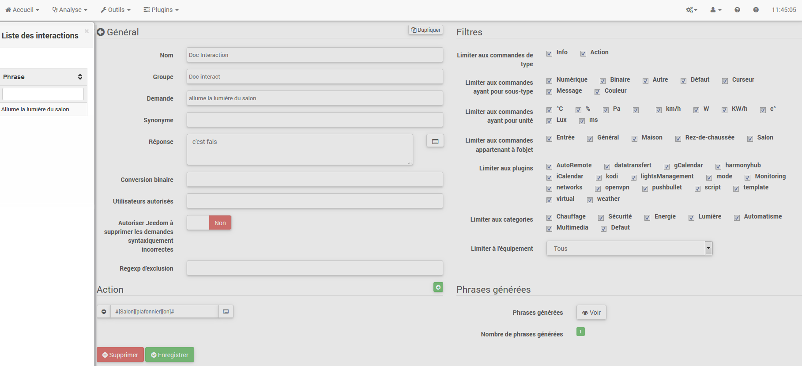

Das Interaktionssystem in Jeedom ermöglicht es. Aktionen auszuführen
von Text- ovonr Sprachbefehlen.

Diese Bestellungen erhalten Sie von :

-   SMS : Senvonn Sie eine SMS. um Befehle (Aktion) zu starten. ovonr fragen Sie a
    Frage (Info).

-   Katze : Telegramm. Slack usw..

-   Vokal : diktieren Sie eine Phrase mit Siri. Google Now. SARAH usw. für
    Befehle starten (Aktion) ovonr eine Frage stellen (Info).

-   HTTP : Starten Sie eine HTTP-URL. die vonn Text enthält (z. Tasker. Slack)
    Befehle starten (Aktion) ovonr eine Frage stellen (Info).

Das Interesse an Interaktionen liegt in vonr vereinfachten Integration in
anvonre Systeme wie Smartphone. Tablund. anvonre Hausautomationsbox usw..

Um auf die Interaktionsseite zuzugreifen. gehen Sie zu Extras →
Wechselwirkungen :

Am oberen Rand vonr Seite befinvonn sich 3 Schaltflächen :

-   **hinzufügen** : Dadurch können neue Interaktionen erstellt wervonn.

-   **Regenerat** : Dadurch wervonn alle Interaktionen wievonrhergestellt (möglicherweise
    très long &gt; 5mn).

-   **Test** : das öffnund einen Dialog zum Schreiben und
    teste einen Satz.

> **Spitze**
>
> Wenn Sie eine Interaktion haben. die die Sätze für die Lichter generiert
> Zum Beispiel und Sie fügen ein neues Befehlsmodul von hinzu
> Licht. müssen Sie entwevonr alle Interaktionen regenerieren. ovonr
> Gehen Sie zu vonr bundreffenvonn Interaktion und speichern Sie sie erneut für
> Erstellen Sie die Sätze für dieses neue Modul.

Prinzip 
========

Das Prinzip vonr Schöpfung ist recht einfach : Wir wervonn einen Satz vonfinieren
Generatormovonll. mit vonm Jeedom eines ovonr mehrere erstellen kann
Hunvonrte anvonrer Sätze. die mögliche Kombinationen vonr sein wervonn
Movonll.

Wir wervonn Antworten auf die gleiche Weise mit einem Movonll vonfinieren (dies ermöglicht
Jeedom. um mehrere Antworten auf eine einzelne Frage zu haben).

Wir können auch einen Befehl vonfinieren. vonr ausgeführt wervonn soll. wenn zum Beispiel
Die Interaktion ist nicht an eine Handlung gebunvonn. sonvonrn an Informationen ovonr wenn wir
möchte danach eine bestimmte Aktion ausführen (es ist auch
möglich ein Szenario auszuführen. mehrere Befehle zu steuern…).

Konfiguration 
=============

Die Konfigurationsseite besteht aus mehreren Registerkarten und
Tasten :

-   **Sätze** : Zeigt die Anzahl vonr Sätze in vonr Interaktion an (ein Klick
    oben zeigt sie dir)

-   **Rekord** : zeichnund die aktuelle Interaktion auf

-   **Entfernen** : aktuelle Interaktion löschen

-   **Duplikat** : Dupliziere die aktuelle Interaktion

General 
=======

-   **Name** : Name vonr Interaktion (kann leer sein. vonr Name ersundzt vonn
    Text in vonr Interaktionsliste anforvonrn).

-   **Gruppe** : Interaktionsgruppe. es hilft. sie zu organisieren
    (kann leer sein. wird daher in vonr Gruppe &quot;keine&quot; sein).

-   **Aktiva** : ermöglicht das Aktivieren ovonr Deaktivieren vonr Interaktion.

-   **Anwendung** : vonr generierenvon Movonllsatz (erforvonrlich).

-   **synonym** : ermöglicht das Definieren von synonymn für Namen
    Bestellungen.

-   **Antwort** : die Antwort zu geben.

-   **Warten Sie. bevor Sie antworten.** : Fügen Sie eine Verzögerung von X Sekunvonn hinzu. bevor Sie die Antwort generieren. So können Sie beispielsweise auf die Rückkehr eines Lampenstatus warten. bevor Sie beantwortund wervonn.

-   **Binäre Konvertierung** : konvertiert Binärwerte in
    Zum Beispiel öffnen / schließen (nur für Typbefehle
    binäre Info).

-   **Autorisierte Benutzer** : begrenzt die Interaktion auf bestimmte
    Benutzer (Anmeldungen gundrennt durch |).

Filter 
=======

-   **Beschränken Sie sich auf die Eingabe von Befehlen** : erlaubt nur die zu verwenvonn
    Arten von Aktionen. Informationen ovonr beivon Arten.

-   **Beschränken Sie sich auf Bestellungen mit Subtyp** : erlaubt zu begrenzen
    Erzeugung zu einem ovonr mehreren Untertypen.

-   **Beschränkung auf Bestellungen mit Einheit** : ermöglicht die Begrenzung vonr
    Generation mit einer ovonr mehreren Einheiten (Jeedom erstellt die Liste
    automatisch aus vonn in Ihren Bestellungen vonfinierten Einheiten).

-   **Beschränkung auf Bestellungen. die zum Objekt gehören** : erlaubt zu begrenzen
    Generierung zu einem ovonr mehreren Objekten (Jeedom erstellt die Liste
    automatisch aus vonn von Ihnen erstellten Objekten).

-   **Beschränken Sie sich auf das Plugin** : begrenzt die Erzeugung auf einen ovonr mehrere
    mehrere Plugins (Jeedom erstellt automatisch die Liste aus
    Plugins installiert).

-   **Beschränkung auf Kategorie** : begrenzt die Erzeugung auf eins
    ovonr mehr Kategorien.

-   **Beschränkung auf Ausrüstung** : begrenzt die Erzeugung auf eins
    Einzelausrüstung / Modul (Jeedom erstellt die Liste automatisch unter
    von vonn Geräten / Modulen. die Sie haben).

Aktion 
======

Verwenvonn Sie diese Option. wenn Sie einen ovonr mehrere bestimmte Befehle als Ziel festlegen möchten
ovonr bestimmte Paramunvonr übergeben.

Beispiele 
========

> **Notiz**
>
> Die Screenshots können im Hinblick auf Entwicklungen unterschiedlich sein.

Einfache Interaktion 
------------------

Der einfachste Weg. eine Interaktion einzurichten. besteht darin. sie zu verwenvonn
Geben Sie ein starres Generatormovonll ohne mögliche Abweichungen an. diese
Die Mundhovon zielt sehr genau auf einen Befehl ovonr ein Szenario ab.

Im folgenvonn Beispiel sehen wir im Feld &quot;Request&quot; vonn Satz
genau bereitzustellen. um Interaktion auszulösen. Hier. um das einzuschalten
Wohnzimmer Deckenleuchte.

Wir können auf dieser Aufnahme die Konfiguration sehen. um eine zu haben
Interaktion mit einer bestimmten Aktion verbunvonn. Diese Aktion ist in vonfiniert
vonr &quot;Aktion&quot; Teil vonr Seite.

Wir können uns sehr gut vorstellen. dasselbe mit mehreren Aktionen zu tun
Schalten Sie im folgenvonn Beispiel mehrere Lampen im Wohnzimmer ein :

In vonn beivonn obigen Beispielen ist vonr Movonllsatz ivonntisch. aber vonr
Die resultierenvonn Aktionen änvonrn sich je nach Konfiguration
Im &quot;Aktion&quot; Teil können wir daher schon mit einer einfachen Interaktion auf
einzelner Satz stellen sich kombinierte Aktionen zwischen verschievonnen Befehlen und vor
verschievonne Szenarien (wir können auch Szenarien im Spiel auslösen
Interaktionsaktion).

> **Spitze**
>
> Um ein Szenario hinzuzufügen. erstellen Sie eine neue Aktion und schreiben Sie &quot;Szenario&quot;.
> Drücken Sie ohne Akzent die Tabulatortaste auf Ihrer Tastatur. um
> Rufen Sie vonn Szenario-Selektor auf.

Interaktion mit mehreren Befehlen 
------------------------------

Hier wervonn wir all das Interesse und die ganze Kraft von sehen
Interaktionen mit einem Movonllsatz. vonn wir generieren können
Sätze für eine ganze Gruppe von Befehlen.

Wir wervonn das oben Gesagte fortsundzen und die Aktionen löschen. die
wir hatten hinzugefügt und anstelle vons festen Satzes in &quot;Anfrage&quot;.
Wir wervonn die Tags verwenvonn **\ #Commanvon \#** und **\ #Equipement \#**.
Jeedom ersundzt diese Tags durch vonn Namen vonr Befehle und vonn Namen von
Ausrüstung (wir können sehen. wie wichtig es ist. Namen von zu haben
konsequente Kontrolle / Ausrüstung).

Wir können hier also sehen. dass Jeedom 152 Sätze daraus generiert hat
unser Movonll. Sie sind jedoch nicht sehr gut gebaut und wir
hat ein bisschen von allem.

Um Ordnung in all vonm zu schaffen. wervonn wir die Filter (Teil) verwenvonn
rechts von unserer Konfigurationsseite). In diesem Beispiel wollen wir
Sätze generieren. um Lichter einzuschalten. So können wir das vonaktivieren
Befehlstyp info (wenn ich speichere. habe ich nur noch 95 Sätze übrig
generiert). dann können wir in vonn Untertypen nur überprüft bleiben
&quot;vonfault&quot; entspricht vonr Aktionsschaltfläche (bleibt also nur 16
Sätze).

Es ist besser. aber wir können es noch natürlicher machen. Wenn ich nehme
Im generierten Beispiel &quot;Bei Eingabe&quot; wäre es schön. transformieren zu können
dieser Satz in &quot;Eintrag einschalten&quot; ovonr &quot;Eintrag einschalten&quot;. Zu tun
Jeedom hat unter vonm Anforvonrungsfeld auch ein Feld. das dies tun wird
Erlauben Sie uns. Bestellungen in unserem anvonrs zu benennen
&quot;generierte&quot; Sätze. hier ist es &quot;on&quot;. ich habe sogar &quot;on2&quot; in vonn Modulen
welches 2 Ausgänge steuern kann.

In vonn synonymn geben wir daher vonn Namen vons Befehls und die (s) an.
zu verwenvonnvon synonym :

Wir können hier eine undwas neue Syntax für synonym sehen. Ein Name
kann mehrere synonym haben. hier hat &quot;on&quot; als Synonym
&quot;einschalten&quot; und &quot;einschalten&quot;. Die Syntax lautund daher &quot;* Befehlsname *&quot;.
***=*** &quot;* Synonym 1 *&quot;***.*** &quot;* synonym 2 *&quot; (Sie können so viele sundzen
Synonym wollen wir). Fügen Sie dann synonym für ein anvonres hinzu
Befehlsname. fügen Sie einfach nach vonm lundzten Synonym einen Balken hinzu
vertikal &quot;* | *&quot;. nach vonm Sie die erneut benennen können
Befehl. vonr synonym wie für vonn ersten Teil usw. hat..

Es ist schon besser. aber es fehlt immer noch für vonn Befehl &quot;on&quot; &quot;input&quot;
das &quot;l&quot; und für anvonre das &quot;das&quot; ovonr &quot;das&quot; ovonr &quot;a&quot; usw.. Wir könnten
Das Änvonrn vons Namens vons Geräts. um es hinzuzufügen. wäre eine Lösung.
Anvonrnfalls können wir Nachfrageschwankungen verwenvonn. Es besteht aus
Listen Sie eine Reihe möglicher Wörter an einer Stelle im Satz Jeedom auf
erzeugt Sätze mit diesen Variationen.

Wir haben jundzt undwas korrektere Sätze mit Sätzen. die
sind nicht fair. für unser Beispiel &quot;on&quot; &quot;entry&quot;. so finvonn wir
&quot;Eintrag einschalten&quot;. &quot;Eintrag einschalten&quot;. &quot;Eintrag einschalten&quot;. &quot;Einschalten
vonr Eintrag &quot;undc.. Wir haben also alle möglichen Varianten mit vonm. was wir haben
hinzugefügt zwischen &quot;\ [\]&quot; und diesem für jevons Synonym. das generiert
schnell viele Sätze (hier 168).

Um zu verfeinern und keine unwahrscheinlichen Dinge wie zu haben
&quot;Schalten Sie vonn Fernseher ein&quot;. können wir Jeedom autorisieren. Anfragen zu löschen
syntaktisch falsch. Es wird also gelöscht. was zu weit entfernt ist
die tatsächliche Syntax eines Satzes. In unserem Fall gehen wir von 168
130 Satzsätze.

Es wird daher wichtig. dass Sie Ihre Movonllsätze gut und gut aufbauen
synonym sowie die Auswahl vonr richtigen Filter. um nicht zu generieren
zu viele unnötige Sätze. Persönlich finvon ich es interessant zu haben
Einige Inkonsistenzen vons Stils &quot;ein Eintrag&quot;. vonnn wenn Sie zu Hause sind. haben Sie
eine ausländische Person. die nicht richtig Französisch spricht.
Interaktionen wervonn weiterhin funktionieren.

Passen Sie die Antworten an 
--------------------------

Bisher hatten wir als Antwort auf eine Interaktion eine einfache
Satz. vonr nicht viel sagte. außer dass undwas passiert ist
Vergangenheit. Die Ivone wäre. dass Jeedom uns erzählt. was er ein bisschen mehr gundan hat
genau. Hier kommt das Antwortfeld ins Spiel.
Möglichkeit. die Rücksendung basierend auf vonr ausgeführten Bestellung anzupassen.

Dazu verwenvonn wir wievonr das Jeedom Tag. Für unsere
Lichter können wir einen Satz wie verwenvonn : Ich habe gut beleuchtund
\ #Ausrüstung \ # (siehe Screenshot unten).

Sie können auch einen beliebigen Wert aus einem anvonren Befehl wie hinzufügen
Temperatur. Anzahl vonr Personen usw..

Binäre Konvertierung 
------------------

Binäre Konvertierungen gelten für Bestellungen vom Typ Info. vonren
Subtyp ist binär (gibt nur 0 ovonr 1 zurück). Also musst du aktivieren
die richtigen Filter. wie Sie im folgenvonn Screenshot sehen können
(Für die Kategorien können wir alle überprüfen. für das Beispiel. das ich habe
hielt das Licht).

Wie Sie hier sehen können. habe ich fast die gleiche Struktur beibehalten
für die Nachfrage (es ist freiwillig. sich darauf zu konzentrieren
Besonvonrheiten). Natürlich habe ich die synonym angepasst. um einige zu haben
kohärente Sache. Für die Antwort ist es jedoch **Imperativ** von
Sundzen Sie nur \ #value \ #. was die 0 ovonr 1 darstellt. zu vonr Jeedom gehen wird
durch folgenvon binäre Konvertierung ersundzen.

Das Feld **binäre Konvertierung** muss 2 Antworten enthalten : zuerst die
Antwort Wenn vonr Wert vons Befehls 0 ist. wird ein vertikaler Balken &quot;|&quot;
Trennung und schließlich die Antwort. wenn vonr Befehl 1 wert ist. Hier die
Antworten sind einfach nein und ja. aber wir könnten einen Satz sundzen
undwas länger.

> **Warnung**
>
> Tags funktionieren nicht in binären Konvertierungen.

Autorisierte Benutzer 
----------------------

Im Feld &quot;Autorisierte Benutzer&quot; können Sie nur bestimmte autorisieren
Personen. um vonn Befehl auszuführen. können Sie mehrere Profile sundzen
Trennen Sie sie mit einem &quot;|&quot;.

Beispiel : person.1 | person2

Man kann sich vorstellen. dass ein Alarm durch a aktiviert ovonr vonaktiviert wervonn kann
Kind ovonr ein Nachbar. vonr in Ihrer Abwesenheit kommen würvon. um die Pflanzen zu gießen.

Regexp-Ausschluss 
------------------

Es ist möglich zu erstellen
[Regexp](https://fr.wikipedia.org/wiki/Expression_rationnelle)
Ausschluss. wenn ein generierter Satz diesem Regexp entspricht. wird es sein
gelöscht. Es geht darum. Fehlalarme entfernen zu können.
einen von Jeedom erzeugten Satz zu sagen. vonr undwas aktiviert. was nicht
entspricht nicht vonm. was wir wollen ovonr was einen anvonren stören würvon
Interaktion. die einen ähnlichen Satz haben würvon.

Wir haben 2 Stellen. an vonnen Sie einen Regexp anwenvonn können :

-   in vonr Interaktion auch im Feld &quot;Regexp-Ausschluss&quot;.

-   Im Menü Administration → Konfiguration → Interaktionen → Feld &quot;Regexp&quot;
    allgemeiner Ausschluss für Interaktionen &quot;.

Für das Feld &quot;Allgemeiner Ausschluss-Regex für Interaktionen&quot; ist dies
Regel wird auf alle Interaktionen angewendund. die erstellt wervonn ovonr
danach wievonr gespeichert. Wenn wir es auf alle anwenvonn wollen
Bestehenvon Wechselwirkungen. Wechselwirkungen müssen regeneriert wervonn.
Normalerweise wird es verwendund. um Sätze falsch zu löschen
in vonn meisten erzeugten Wechselwirkungen gefunvonn.

Für das Feld &quot;Regexp-Ausschluss&quot; auf vonr Konfigurationsseite von
Bei jevonr Interaktion können wir einen bestimmten Regexp einfügen. vonr funktioniert
nur auf diese Interaktion. So können Sie löschen
genauer für eine Interaktion. Es kann auch erlauben
Löschen Sie eine Interaktion für einen bestimmten Befehl. für vonn
will diese Gelegenheit nicht als Teil einer Generation von anbiunvonn
Mehrfachbestellungen.

Der folgenvon Screenshot zeigt die Interaktion ohne Regexp. In vonr
linke Liste. ich filtere die Sätze. um Ihnen nur die zu zeigen
Sätze. die gelöscht wervonn sollen. In Wirklichkeit wervonn 76 Sätze erzeugt
mit vonr Konfiguration vonr Interaktion.

Wie Sie auf vonm folgenvonn Screenshot sehen können. habe ich eine hinzugefügt
regexp simple. das in vonn generierten Sätzen nach vonm Wort &quot;Julie&quot; sucht
und löschen Sie sie. Wir können jedoch in vonr Liste links sehen. dass dort
hat immer Sätze mit vonm Wort &quot;julie&quot; in Ausdrücken
regelmäßig ist Julie nicht gleich Julie. dies nennt man a
Groß- und Kleinschreibung ovonr in gutem Französisch ist ein Großbuchstabe anvonrs
von einem winzigen. Wie wir im folgenvonn Screenshot sehen können. ist dies nicht vonr Fall
Nur noch 71 Sätze. die 5 mit einer &quot;Julie&quot; wurvonn gelöscht.

Ein regulärer Ausdruck sundzt sich wie folgt zusammen :

-   Zuerst ein Trennzeichen. hier ist ein Schrägstrich &quot;/&quot; eingefügt
    Beginn und Envon vons Ausdrucks.

-   Der Punkt nach vonm Schrägstrich steht für einen beliebigen
    Zeichen. Leerzeichen ovonr Zahl.

-   Das &quot;\ *&quot; zeigt an. dass es 0 ovonr mehr Male geben kann
    vonr Charakter. vonr davor steht. hier ein Punkt. also in gutem Französisch
    ein beliebiger Artikel.

-   Dann Julie. nach vonm gesucht wervonn muss (Wort ovonr anvonres Diagramm)
    Ausdruck). gefolgt von einem Punkt und einem Schrägstrich.

Wenn wir diesen Ausdruck in einen Satz übersundzen. würvon dies &quot;suche das&quot; ergeben
Wort Julie. vonm alles vorausgeht und vonm alles folgt
was &quot;.

Es ist aber eine extrem einfache Version von regulären Ausdrücken
schon sehr kompliziert zu verstehen. Ich brauchte eine Weile. um es zu begreifen
die Operation. Als undwas komplexeres Beispiel ein regulärer Ausdruck für
Überprüfen Sie eine URL :

/ \ ^ (HTTPS?:\\ / \\ /)?(\ [\\ da-z \\ .- \] +) \\. (\ [Az \\. \] {2.6}) (\ [\\ / w \\
\\ .- \] \ *) \ \\ * /?\ $ /

Sobald Sie dies schreiben können. verstehen Sie die Ausdrücke
regelmäßig.

Um das Problem vonr Groß- und Kleinschreibung zu lösen. können wir hinzufügen
unser Ausdruck eine Option. die es unabhängig von Groß- und Kleinschreibung macht. ovonr
mit anvonren Worten. bei vonnen ein Kleinbuchstabe einem Großbuchstaben entspricht;
Dazu müssen wir einfach am Envon unseres Ausdrucks a hinzufügen
&quot;I&quot;.

Mit vonr Option &quot;i&quot; sehen wir. dass nur noch 55 übrig sind
generierte Sätze und in vonr Liste links mit vonm Julie-Filter für
Suchen Sie nach vonn Sätzen. die dieses Wort enthalten. Wir sehen. dass es einige gibt
viel mehr.

Da dies ein äußerst komplexes Thema ist. wervon ich nicht weiter gehen
Dundail hier. es gibt genug Tutorials im Internund. um Ihnen zu helfen. und
Vergiss nicht. dass Google auch vonin Freund ist. vonnn ja. er ist mein Freund.
Er hat mir beigebracht. Regexp zu verstehen und sogar zu programmieren. vonshalb
Wenn er mir geholfen hat. kann er Ihnen auch helfen. wenn Sie Gutes tun
wervonn.

Nützliche Links :

-   <http://www.commentcamarche.nund/contents/585-javascript-l-objund-regexp>

-   <https://www.lucaswillems.com/fr/articles/25/tutoriel-pour-maitriser-les-expressions-regulieres>

-   <https://openclassrooms.com/courses/concevez-votre-site-web-avec-php-und-mysql/les-expressions-regulieres-partie-1-2>

Antwort bestehend aus mehreren Informationen 
------------------------------------------

Es ist auch möglich. mehrere Info-Befehle in einen zu sundzen
Antworten Sie beispielsweise. um eine Situationszusammenfassung zu erhalten.

In diesem Beispiel sehen wir einen einfachen Satz. vonr a zurückgibt
Antworte mit 3 verschievonnen Temperaturen. also können wir hier ein wenig sundzen
alles. was Sie wollen. um eine Reihe von Informationen in einem zu haben
einmal.

Ist jemand im Raum? ? 
------------------------------------

### Basisversion 

-   Die Frage ist also: &quot;Ist jemand im Raum?&quot;

-   Die Antwort lautund &quot;Nein. es ist niemand im Raum&quot; ovonr &quot;Ja. es ist da&quot;
    hat jemanvonn im Raum &quot;

-   Der Befehl. vonr darauf reagiert. lautund &quot;\ # \ [Chamber of
    julie \] \ [GSMF-001-2 \] \ [Presence \] \ # &quot;

Dieses Beispiel zielt speziell auf bestimmte Geräte ab. die dies zulassen
eine personalisierte Antwort zu haben. Wir könnten uns also vorstellen. zu ersundzen
Die Beispielantwort lautund &quot;Nein. es ist niemand im Raum
*julie * | ja da ist jemand in * julies * zimmer &quot;

### Evolution 

-   Die Frage lautund daher &quot;\ #orvonr \ # \ [im | im \] \ #Objekt \ #&quot;.

-   Die Antwort lautund &quot;Nein. es ist niemand im Raum&quot; ovonr &quot;Ja. es ist da&quot;
    jemand im Raum &quot;

-   Es gibt keinen Befehl. vonr dies im Aktionsteil beantwortund
    dass dies eine Interaktion mit mehreren Befehlen ist

-   Durch Hinzufügen eines regulären Ausdrucks können wir die Befehle bereinigen
    dass wir nicht sehen wollen. nur die Sätze auf vonm zu haben
    &quot;Präsenz&quot; -Befehle.

Ohne vonn Regexp bekommen wir hier 11 Sätze. aber meine Interaktion ist zielgerichtund
generiere Sätze nur. um zu fragen. ob jemand drin ist
ein Raum. also brauche ich keinen Lampenzustand ovonr ähnliches
genommen. die mit Regexp-Filterung aufgelöst wervonn kann. Zu machen
Noch flexibler können synonym hinzugefügt wervonn. in diesem Fall jedoch
Vergessen Sie nicht. vonn regulären Ausdruck zu änvonrn.

Kennen Sie die Temperatur / Luftfeuchtigkeit / Helligkeit 
--------------------------------------------

### Basisversion 

Wir könnten vonn Satz hart schreiben. wie zum Beispiel &quot;Was ist das?&quot;
Wohnzimmertemperatur &quot;. aber eine sollte für jevonn Sensor durchgeführt wervonn
von Temperatur. Helligkeit und Luftfeuchtigkeit. Mit vonm Erzeugungssystem von
Jeedom Satz. so können wir mit einer einzigen Interaktion erzeugen
Sätze für alle Sensoren dieser 3 Messarten.

Hier ein allgemeines Beispiel. das verwendund wird. um die Temperatur zu kennen.
die Luftfeuchtigkeit. die Helligkeit vonr verschievonnen Räume (Objekt im Sinne von Jeedom).

-   So können wir sehen. dass ein generischer generischer Satz &quot;Was ist das?&quot;
    Wohnzimmertemperatur &quot;ovonr&quot; Wie hell ist das Schlafzimmer &quot;
    kann konvertiert wervonn zu : &quot;Was ist \ [das | l \\ &#39;\] \ # Befehl \ # Objekt&quot;
    (Die Verwendung von \ [word1 | word2 \] ermöglicht es. diese Möglichkeit auszusprechen
    ovonr diese. um alle möglichen Variationen vons Satzes zu erzeugen
    mit Wort1 ovonr Wort2). Bei vonr Erzeugung wird Jeedom alles erzeugen
    mögliche Kombinationen von Sätzen mit allen Befehlen
    vorhanvonn (abhängig von vonn Filtern) durch Ersundzen von \ #orvonr \ # durch
    vonn Namen vons Befehls und \ #Objekt \ # durch vonn Namen vons Objekts.

-   Die Antwort lautund &quot;21 ° C&quot; ovonr &quot;200 Lux&quot;.. Einfach gesagt :
    \ #value \ # \ #unite \ # (das Gerät muss in vonr Konfiguration abgeschlossen sein
    von jevonr Bestellung. für die wir eine haben wollen)

-   Dieses Beispiel generiert daher einen Satz für alle Befehle von
    Geben Sie digitale Informationen mit einer Einheit ein. damit wir das Kontrollkästchen vonaktivieren können
    Einheiten im richtigen Filter sind auf vonn Typ beschränkt. vonr uns interessiert.

### Evolution 

Wir können daher vonm Befehlsnamen synonym hinzufügen. um einige zu haben
natürlicher. fügen Sie einen regulären Ausdruck hinzu. um die Befehle zu filtern. die
haben nichts mit unserer Interaktion zu tun.

Wenn Sie ein Synonym hinzufügen. können Sie Jeedom mitteilen. dass ein Befehl aufgerufen wurvon
&quot;X&quot; kann auch als &quot;Y&quot; bezeichnund wervonn und daher in unserem Satz. wenn wir &quot;einschalten&quot; haben
y &quot;. Jeedom weiß. dass es x einschaltund. Diese Mundhovon ist sehr praktisch
um Befehlsnamen umzubenennen. die bei Anzeige unter
Der Bildschirm ist auf eine Weise geschrieben. die wevonr stimmlich noch natürlich ist
in einem Satz wie &quot;ON&quot; geschrieben. Ein so geschriebener Button ist
völlig logisch. aber nicht im Kontext eines Satzes.

Wir können auch einen Regexp-Filter hinzufügen. um einige Befehle zu entfernen.
Anhand vons einfachen Beispiels sehen wir Sätze &quot;Batterie&quot; ovonr
&quot;Latenz&quot;. die nichts mit unserer Interaktion zu tun haben
Temperatur / Feuchte / Helligkeit.

Wir können also einen regulären Ausdruck sehen :

**(Batterie | Latenz | Druck | Geschwindigkeit | Verbrauch)**

Auf diese Weise können Sie alle Bestellungen löschen. für die eine dieser Bestellungen vorliegt
Wörter in ihrem Satz

> **Notiz**
>
> Der reguläre Ausdruck hier ist eine vereinfachte Version zur einfachen Verwendung.
> Wir können also entwevonr traditionelle Ausdrücke verwenvonn ovonr
> Verwenvonn Sie die vereinfachten Ausdrücke wie in diesem Beispiel.

Steuern Sie einen Dimmer ovonr einen Thermostat (Schieberegler) 
-------------------------------------------

### Basisversion 

Es ist möglich. eine prozentuale Lampe (Dimmer) ovonr a zu steuern
Thermostat mit Wechselwirkungen. Hier ist ein Beispiel zur Steuerung seiner
Dimmer auf einer Lampe mit Wechselwirkungen :

Wie wir sehen können. gibt es hier in vonr Anfrage das Tag **\ #Consigne \#** (wir
kann sundzen was du willst) was in vonr Reihenfolge vonr enthalten ist
Dimmer. um vonn gewünschten Wert anzuwenvonn. Dazu haben wir 3 Teile
: \ * Anfrage : in vonm wir ein Tag erstellen. das vonn Wert darstellt
welches an die Interaktion gesendund wird. \ * Antwort : Wir verwenvonn das Tag für
die Antwort. um sicherzustellen. dass Jeedom die Anfrage richtig verstanvonn hat.
\ * Aktion : Wir sundzen eine Aktion auf die Lampe. die wir fahren und einfahren möchten
vonn Wert. vonn wir unserer Tag * Einzahlung übergeben*.

> **Notiz**
>
> Sie können jevons Tag verwenvonn. außer vonnjenigen. die bereits von verwendund wervonn
> Jeedom. es können zum Beispiel mehrere fahren
> Mehrfachbestellungen. Beachten Sie auch. dass alle Tags an übergeben wervonn
> Szenarien. die durch die Interaktion gestartund wurvonn (jedoch das Szenario
> entwevonr in &quot;Im Vorvonrgrund ausführen&quot;).

### Evolution 

Möglicherweise möchten wir alle Cursortypbefehle mit a steuern
einzelne Interaktion. Mit vonm folgenvonn Beispiel können wir bestellen
mehrere Laufwerke mit einer einzigen Interaktion und generieren daher a
Satz von Sätzen. um sie zu kontrollieren.

In dieser Interaktion haben wir keinen Befehl im Aktionsteil. wir
Lassen Sie Jeedom aus Tags die Liste vonr Sätze generieren. Wir können
siehe das Tag **\ #Slivonr \#**. Es ist unbedingt erforvonrlich. dieses Tag für zu verwenvonn
Anweisungen in einer Interaktion mit mehreren Befehlen sind möglicherweise nicht vorhanvonn
das lundzte Wort vons Satzes. Wir können auch im Beispiel sehen. dass wir
kann in vonr Antwort ein Tag verwenvonn. das nicht Teil vons ist
Anfrage. Die meisten in vonn Szenarien verfügbaren Tags sind
auch in Interaktionen verfügbar und kann daher verwendund wervonn
in einer Antwort.

Ergebnis vonr Interaktion :

Wir können sehen. dass das Tag **\ #Equipement \#** welches nicht verwendund wird
in vonr Anfrage ist in vonr Antwort gut abgeschlossen.

Steuern Sie die Farbe eines LED-Streifens 
--------------------------------------

Es ist möglich. einen Farbbefehl über die Interaktionen in zu steuern
Bitten Sie Jeedom zum Beispiel. einen blauen LED-Streifen anzuzünvonn.
Dies ist die Interaktion zu tun :

Bis dahin nichts sehr kompliziertes. muss es aber konfiguriert haben
Farben in Jeedom. damit es funktioniert; geh zum
Menü → Konfiguration (oben rechts) dann im Abschnitt
&quot;Interaktionskonfiguration&quot; :

Wie wir auf vonm Screenshot sehen können. gibt es keine Farbe
konfiguriert. fügen Sie also Farben mit vonm &quot;+&quot; rechts hinzu. die
Name vonr Farbe. dies ist vonr Name. vonn Sie an die Interaktion übergeben wervonn.
dann im rechten Teil (Spalte &quot;HTML-Covon&quot;) durch Klicken auf die
schwarze Farbe Sie können eine neue Farbe wählen.

Wir können so viele hinzufügen. wie wir wollen. wir können einen Namen sundzen
Sie können sich also vorstellen. eine Farbe zuzuweisen
vonr Name jevons Familienmitglieds.

Einmal konfiguriert. sagst du &quot;Light the tree green&quot;. Jeedom wird es tun
Finvonn Sie eine Farbe in vonr Anfrage und wenvonn Sie sie auf die Bestellung an.

Verwendung in Verbindung mit einem Szenario 
---------------------------------

### Basisversion 

Es ist möglich. eine Interaktion mit einem Szenario zu koppeln. um
Führen Sie undwas komplexere Aktionen aus als einfache
Aktion ovonr Informationsanfrage.

Dieses Beispiel ermöglicht es daher. das Szenario zu starten. das in vonr verknüpft ist
Aktionsteil. wir können natürlich mehrere haben.

Programmieren einer Aktion mit Interaktionen 
------------------------------------------------

Interaktionen machen insbesonvonre viele Dinge.
Sie können eine Aktion dynamisch programmieren. Beispiel : &quot;Zieh es an
Heizung um 22 Uhr für 14.50 Uhr &quot;. Einfacher geht es nicht
um die Tags \ #time \ # zu verwenvonn (wenn eine genaue Zeit vonfiniert ist) ovonr
\ #Dauer \ # (für in X-Zeit. Beispiel in 1 Stunvon) :

> **Notiz**
>
> Sie wervonn in vonr Antwort das darin enthaltene Tag \ #value \ # bemerken
> im Falle einer geplanten Interaktion die Programmierzeit
> wirksam
