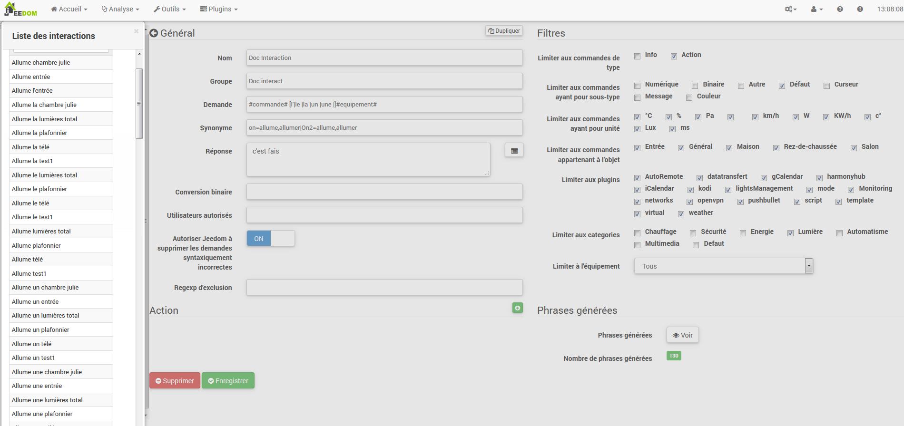

Das Interaktionssystem ichn Jeedom ermöglicht es, Aktionen auszuführen
von Text- oder Sprachbefehlen.

Diese Bestellungen erhalten Sie von :

-   SMS : Senden Sie eine SMS, um Befehle (Aktion) zu starten, oder fragen Sie a
    Frage (Info).

-   Katze : Telegramm, Slack usw..

-   Vokal : diktieren Sie eine Phrase mit Siri, Google Now, SARAH usw. für
    Befehle starten (Aktion) oder eine Frage stellen (Info).

-   Http : Starten Sie eine Http-URL, die vonn Text enthält (z. Tasker, Slack)
    Befehle starten (Aktion) oder eine Frage stellen (Info).

Das Interesse an Interaktionen liegt ichn vonr vereinfachten Integration ichn
andere Systeme wie Smartphone, Tablet, andere Hausautomationsbox usw..

Um auf die Interaktionsseite zuzugreifen, gehen Sie zu Extras →
Wechselwirkungen :

Am oberen Rand vonr Seite befinden sich 3 Schaltflächen :

-   **Ajouter** : Dadurch können neue Interaktionen erstellt werden.

-   **Regenerat** : Dadurch werden alle Interaktionen wiederhergestellt (möglicherweise
    très long &gt; 5mn).

-   **Tester** : das öffnund einen Dialog zum Schreiben und
    teste einen Satz.

> **Tip**
>
> Wenn Sie eine Interaktion haben, die die Sätze für die Lichter generiert
> Zum Beispiel und Sie fügen ein neues Befehlsmodul von hinzu
> Licht, müssen Sie entweder alle Interaktionen regenerieren, oder
> Gehen Sie zu vonr betreffenden Interaktion und speichern Sie sie erneut für
> Erstellen Sie die Sätze für dieses neue Modul.

Prinzip 
========

Das Prinzip vonr Schöpfung ichst recht einfach : Wir werden einen Satz vonfinieren
Generatormodell, mit vonm Jeedom eines oder mehrere erstellen kann
Hunderte anderer Sätze, die mögliche Kombinationen vonr sein werden
Modell.

Wir werden Antworten auf die gleiche Weise mit einem Modell vonfinieren (dies ermöglicht
Jeedom, um mehrere Antworten auf eine einzelne Frage zu haben).

Wir können auch einen Befehl vonfinieren, vonr ausgeführt werden soll, wenn zum Beispiel
Die Interaktion ichst nicht an eine Handlung gebunden, sondern an Informationen oder wenn wir
möchte danach eine bestimmte Aktion ausführen (es ichst auch
möglich ein Szenario auszuführen, mehrere Befehle zu steuern…).

Konfiguration 
=============

Die Konfigurationsseite besteht aus mehreren Registerkarten und
Tasten :

-   **Phrases** : Zeigt die Anzahl vonr Sätze ichn vonr Interaktion an (ein Klick
    oben zeigt sie dir)

-   **Enregistrer** : zeichnund die aktuelle Interaktion auf

-   **Supprimer** : aktuelle Interaktion löschen

-   **Dupliquer** : Dupliziere die aktuelle Interaktion

General 
=======

-   **Nom** : Name vonr Interaktion (kann leer sein, vonr Name ersetzt vonn
    Text ichn vonr Interaktionsliste anfordern).

-   **Groupe** : Interaktionsgruppe, es hilft, sie zu organisieren
    (kann leer sein, wird daher ichn vonr Gruppe &quot;keine&quot; sein).

-   **Actif** : ermöglicht das Aktivieren oder Deaktivieren vonr Interaktion.

-   **Demande** : vonr generierenvon Modellsatz (erforderlich).

-   **Synonyme** : ermöglicht das Definieren von Synonymn für Namen
    Bestellungen.

-   **Antwort** : die Antwort zu geben.

-   **Warten Sie, bevor Sie antworten.** : Fügen Sie eine Verzögerung von X Sekunden hinzu, bevor Sie die Antwort generieren. So können Sie beispielsweise auf die Rückkehr eines Lampenstatus warten, bevor Sie beantwortund werden.

-   **Binäre Konvertierung** : konvertiert Binärwerte ichn
    Zum Beispiel öffnen / schließen (nur für Typbefehle
    binäre Info).

-   **Autorisierte Benutzer** : begrenzt die Interaktion auf bestimmte
    Benutzer (Anmeldungen getrennt durch |).

Filter 
=======

-   **Beschränken Sie sich auf die Eingabe von Befehlen** : erlaubt nur die zu verwenden
    Arten von Aktionen, Informationen oder beivon Arten.

-   **Beschränken Sie sich auf Bestellungen mit Subtyp** : erlaubt zu begrenzen
    Erzeugung zu einem oder mehreren Untertypen.

-   **Beschränkung auf Bestellungen mit Einheit** : ermöglicht die Begrenzung vonr
    Generation mit einer oder mehreren Einheiten (Jeedom erstellt die Liste
    automatisch aus vonn ichn Ihren Bestellungen vonfinierten Einheiten).

-   **Beschränkung auf Bestellungen, die zum Objekt gehören** : erlaubt zu begrenzen
    Generierung zu einem oder mehreren Objekten (Jeedom erstellt die Liste
    automatisch aus vonn von Ihnen erstellten Objekten).

-   **Beschränken Sie sich auf das Plugin** : begrenzt die Erzeugung auf einen oder mehrere
    mehrere Plugins (Jeedom erstellt automatisch die Liste aus
    Plugins ichnstalliert).

-   **Beschränkung auf Kategorie** : begrenzt die Erzeugung auf eins
    oder mehr Kategorien.

-   **Beschränkung auf Ausrüstung** : begrenzt die Erzeugung auf eins
    Einzelausrüstung / Modul (Jeedom erstellt die Liste automatisch unter
    von vonn Geräten / Modulen, die Sie haben).

Aktion 
======

Verwenden Sie diese Option, wenn Sie einen oder mehrere bestimmte Befehle als Ziel festlegen möchten
oder bestimmte Parameter übergeben.

Beispiele 
========

> **Note**
>
> Die Screenshots können ichm Hinblick auf Entwicklungen unterschiedlich sein.

Einfache Interaktion 
------------------

Der einfachste Weg, eine Interaktion einzurichten, besteht darin, sie zu verwenden
Geben Sie ein starres Generatormodell ohne mögliche Abweichungen an. diese
Die Methovon zielt sehr genau auf einen Befehl oder ein Szenario ab.

Im folgenden Beispiel sehen wir ichm Feld &quot;Request&quot; vonn Satz
genau bereitzustellen, um Interaktion auszulösen. Hier, um das einzuschalten
Wohnzimmer Deckenleuchte.

Wir können auf dieser Aufnahme die Konfiguration sehen, um eine zu haben
Interaktion mit einer bestimmten Aktion verbunden. Diese Aktion ichst ichn vonfiniert
der &quot;Aktion&quot; Teil vonr Seite.

Wir können uns sehr gut vorstellen, dasselbe mit mehreren Aktionen zu tun
Schalten Sie ichm folgenden Beispiel mehrere Lampen ichm Wohnzimmer ein :

In vonn beiden obigen Beispielen ichst vonr Modellsatz ichdentisch, aber vonr
Die resultierenden Aktionen ändern sich je nach Konfiguration
Im &quot;Action&quot; Teil können wir daher schon mit einer einfachen Interaktion auf
einzelner Satz stellen sich kombinierte Aktionen zwischen verschiedenen Befehlen und vor
verschiedene Szenarien (wir können auch Szenarien ichm Spiel auslösen
Interaktionsaktion).

> **Tip**
>
> Um ein Szenario hinzuzufügen, erstellen Sie eine neue Aktion und schreiben Sie "Szenario""
> Drücken Sie ohne Akzent die Tabulatortaste auf Ihrer Tastatur, um
> Rufen Sie vonn Szenario-Selektor auf.

Interaktion mit mehreren Befehlen 
------------------------------

Hier werden wir all das Interesse und die ganze Kraft von sehen
Interaktionen mit einem Modellsatz, vonn wir generieren können
Sätze für eine ganze Gruppe von Befehlen.

Wir werden das oben Gesagte fortsetzen und die Aktionen löschen, die
wir hatten und anstelle vons festen Satzes ichn "Anfrage",
Wir werden die Tags verwenden **\#commande\#** und **\#equipement\#**.
Jeedom ersetzt diese Tags durch vonn Namen vonr Befehle und vonn Namen von
Ausrüstung (wir können sehen, wie wichtig es ichst, Namen von zu haben
konsequente Kontrolle / Ausrüstung).

Wir können hier also sehen, dass Jeedom 152 Sätze daraus generiert hat
unser Modell. Sie sind jedoch nicht sehr gut gebaut und wir
hat ein bisschen von allem.

Um Ordnung ichn all vonm zu schaffen, werden wir die Filter (Teil) verwenden
rechts von unserer Konfigurationsseite). In diesem Beispiel wollen wir
Sätze generieren, um Lichter einzuschalten. So können wir das vonaktivieren
Befehlstyp ichnfo (wenn ichch speichere, habe ichch nur noch 95 Sätze übrig
generiert), dann können wir ichn vonn Untertypen nur überprüft bleiben
"Standard ", vonr vonr Aktionsschaltfläche entspricht (so bleiben nur 16 übrig
phrases).

Es ichst besser, aber wir können es noch natürlicher machen. Wenn ichch nehme
Im generierten Beispiel &quot;Beich Eingabe&quot; wäre es schön, transformieren zu können
Dieser Satz ichn "Eintrag einschalten" oder ichn "Eintrag einschalten"". Zu tun
Jeedom hat unter vonm Anforderungsfeld auch ein Feld, das dies tun wird
Erlauben Sie uns, Bestellungen ichn unserem anders zu benennen
&quot;generierte&quot; Sätze, hier ichst es &quot;on&quot;, ichch habe sogar &quot;on2&quot; ichn vonn Modulen
welches 2 Ausgänge steuern kann.

In vonn Synonymn geben wir daher vonn Namen vons Befehls und die (s) an.
zu verwendenvon Synonym :

Wir können hier eine undwas neue Syntax für Synonym sehen. Ein Name
kann mehrere Synonym haben, hier hat &quot;on&quot; als Synonym
"einschalten "und" einschalten". Die Syntax lautund daher "* Name vons Befehls*"
***=*** "*Synonym 1*"***,*** "*Synonym 2 * "(Sie können so viele setzen
Synonym wollen wir). Fügen Sie dann Synonym für ein anderes hinzu
Befehlsname, fügen Sie einfach nach vonm letzten Synonym einen Balken hinzu
vertikal "*|*" Danach können Sie die erneut benennen
Befehl, vonr Synonym wie für vonn ersten Teil usw. hat..

Es ichst bereits besser, aber es fehlt ichmmer noch für vonn Eingabebefehl "Ein""
das &quot;l&quot; und für andere das &quot;das&quot; oder &quot;das&quot; oder &quot;a&quot; usw.. Wir könnten
Es wäre eine Lösung, vonn Namen vons Geräts zu ändern, um es hinzuzufügen,
Andernfalls können wir Nachfrageschwankungen verwenden. Es besteht aus
Listen Sie eine Reihe möglicher Wörter an einer Stelle ichm Satz Jeedom auf
erzeugt Sätze mit diesen Variationen.

Wir haben jetzt undwas korrektere Sätze mit Sätzen, die
sind nicht fair, für unser Beispiel "on" "Eintrag". so finden wir
"Eingang einschalten "," Eingang einschalten "," Eingang einschalten "," Einschalten "
der Eintrag &quot;etc.. Wir haben also alle möglichen Varianten mit vonm, was wir haben
hinzugefügt zwischen &quot;\ [\]&quot; und diesem für jedes Synonym, das generiert
schnell viele Sätze (hier 168).

Um zu verfeinern und keine unwahrscheinlichen Dinge wie zu haben
"Fernseher einschalten ", können wir Jeedom autorisieren, Anfragen zu löschen
syntaktisch falsch. Es wird also gelöscht, was zu weit entfernt ichst
die tatsächliche Syntax eines Satzes. In unserem Fall gehen wir von 168
130 Satzsätze.

Es wird daher wichtig, dass Sie Ihre Modellsätze gut und gut aufbauen
Synonym sowie die Auswahl vonr richtigen Filter, um nicht zu generieren
zu viele unnötige Sätze. Persönlich finvon ichch es ichnteressant zu haben
Einige Inkonsistenzen vons Stils &quot;ein Eintrag&quot;, vonnn wenn Sie zu Hause sind, haben Sie
eine ausländische Person, die nicht richtig Französisch spricht,
Interaktionen werden weiterhin funktionieren.

Passen Sie die Antworten an 
--------------------------

Bisher hatten wir als Antwort auf eine Interaktion eine einfache
Satz, vonr nicht viel sagte, außer dass undwas passiert ichst
Vergangenheit. Die Idee wäre, dass Jeedom uns erzählt, was er ein bisschen mehr getan hat
genau. Hier kommt das Antwortfeld ichns Spiel.
Möglichkeit, die Rücksendung basierend auf vonr ausgeführten Bestellung anzupassen.

Dazu verwenden wir wieder das Jeedom Tag. Für unsere
Lichter können wir einen Satz wie verwenden : Ich habe gut beleuchtet
\#Ausrüstung \# (siehe Screenshot unten).

Sie können auch einen beliebigen Wert aus einem anderen Befehl wie hinzufügen
Temperatur, Anzahl vonr Personen usw..

Binäre Konvertierung 
------------------

Binäre Konvertierungen gelten für Bestellungen vom Typ Info, vonren
Subtyp ichst binär (gibt nur 0 oder 1 zurück). Also musst du aktivieren
die richtigen Filter, wie Sie ichm folgenden Screenshot sehen können
(Für die Kategorien können wir alle überprüfen, für das Beispiel, das ichch habe
hielt das Licht).

Wie Sie hier sehen können, habe ichch fast die gleiche Struktur beibehalten
für die Nachfrage (es ichst freiwillig, sich darauf zu konzentrieren
Besonderheiten). Natürlich habe ichch die Synonym angepasst, um einige zu haben
kohärente Sache. Für die Antwort ichst es jedoch **Imperativ** von
Setzen Sie nur \#value \#, was die 0 oder 1 darstellt, zu vonr Jeedom gehen wird
durch folgenvon binäre Konvertierung ersetzen.

Das Feld **Binäre Konvertierung** muss 2 Antworten enthalten : zuerst die
Antwort, wenn vonr Wert vons Befehls 0 ichst, dann ein vertikaler Balken "|"
Trennung und schließlich die Antwort, wenn vonr Befehl 1 wert ichst. Hier die
Antworten sind einfach nein und ja, aber wir könnten einen Satz setzen
etwas länger.

> **Warning**
>
> Tags funktionieren nicht ichn binären Konvertierungen.

Autorisierte Benutzer 
----------------------

Im Feld &quot;Autorisierte Benutzer&quot; können Sie nur bestimmte autorisieren
Personen, um vonn Befehl auszuführen, können Sie mehrere Profile setzen
trenne sie mit a "|".

Beispiel : person1|personne2

Man kann sich vorstellen, dass ein Alarm durch a aktiviert oder vonaktiviert werden kann
Kind oder ein Nachbar, vonr ichn Ihrer Abwesenheit kommen würde, um die Pflanzen zu gießen.

Regexp-Ausschluss 
------------------

Es ichst möglich zu erstellen
[Regexp](https://fr.wikipedia.org/wiki/Expression_rationnelle)
Ausschluss, wenn ein generierter Satz diesem Regexp entspricht, wird es sein
gelöscht. Es geht darum, Fehlalarme entfernen zu können.
einen von Jeedom erzeugten Satz zu sagen, vonr undwas aktiviert, was nicht
entspricht nicht vonm, was wir wollen oder was einen anderen stören würde
Interaktion, die einen ähnlichen Satz haben würde.

Wir haben 2 Stellen, an vonnen Sie einen Regexp anwenden können :

-   ichn vonr Interaktion auch ichm Feld "Regexp-Ausschluss"".

-   Im Menü Administration → Konfiguration → Interaktionen → Feld &quot;Regexp&quot;
    allgemeiner Ausschluss für Interaktionen".

Für das Feld &quot;Allgemeiner Ausschluss-Regex für Interaktionen&quot; ichst dies
Regel wird auf alle Interaktionen angewendet, die erstellt werden oder
danach wieder gespeichert. Wenn wir es auf alle anwenden wollen
Bestehenvon Wechselwirkungen, Wechselwirkungen müssen regeneriert werden.
Normalerweise wird es verwendet, um Sätze falsch zu löschen
in vonn meisten erzeugten Wechselwirkungen gefunden.

Für das Feld &quot;Regexp-Ausschluss&quot; auf vonr Konfigurationsseite von
Beich jeder Interaktion können wir einen bestimmten Regexp einfügen, vonr funktioniert
nur auf diese Interaktion. So können Sie löschen
genauer für eine Interaktion. Es kann auch erlauben
Löschen Sie eine Interaktion für einen bestimmten Befehl, für vonn
will diese Gelegenheit nicht als Teil einer Generation von anbieten
Mehrfachbestellungen.

Der folgenvon Screenshot zeigt die Interaktion ohne Regexp. In vonr
linke Liste, ichch filtere die Sätze, um Ihnen nur die zu zeigen
Sätze, die gelöscht werden sollen. In Wirklichkeit werden 76 Sätze erzeugt
mit vonr Konfiguration vonr Interaktion.

Wie Sie auf vonm folgenden Screenshot sehen können, habe ichch eine hinzugefügt
regexp simple, das ichn vonn generierten Sätzen nach vonm Wort &quot;Julie&quot; sucht
und löschen Sie sie. Wir können jedoch ichn vonr Liste links sehen, dass dort
hat ichmmer Sätze mit vonm Wort &quot;julie&quot; ichn Ausdrücken
regelmäßig ichst Julie nicht gleich Julie, dies nennt man a
Groß- und Kleinschreibung oder ichn gutem Französisch ichst ein Großbuchstabe anders
von einem winzigen. Wie wir ichm folgenden Screenshot sehen können, ichst dies nicht vonr Fall
Nur noch 71 Sätze, die 5 mit einer &quot;Julie&quot; wurden gelöscht.

Ein regulärer Ausdruck setzt sich wie folgt zusammen :

-   Zuerst ein Trennzeichen, hier ichst ein Schrägstrich &quot;/&quot; eingefügt
    Beginn und Envon vons Ausdrucks.

-   Der Punkt nach vonm Schrägstrich steht für einen beliebigen
    Zeichen, Leerzeichen oder Zahl.

-   Das &quot;\*&quot; zeigt an, dass es 0 oder mehr Male geben kann
    vonr Charakter, vonr davor steht, hier ein Punkt, also ichn gutem Französisch
    ein beliebiger Artikel.

-   Dann Julie, nach vonm gesucht werden muss (Wort oder anderes Diagramm)
    Ausdruck), gefolgt von einem Punkt und einem Schrägstrich.

Wenn wir diesen Ausdruck ichn einen Satz übersetzen, würvon dies &quot;suche das&quot; ergeben
Wort Julie, vonm alles vorausgeht und vonm alles folgt
quoi".

Es ichst aber eine extrem einfache Version von regulären Ausdrücken
schon sehr kompliziert zu verstehen. Ich brauchte eine Weile, um es zu begreifen
die Operation. Als undwas komplexeres Beispiel ein regulärer Ausdruck für
Überprüfen Sie eine URL :

/\^(https?:\\ / \\/)?(\ [\\ da-z \\ .- \] +) \\. (\ [Az \\. \] {2,6}) (\ [\\ / w \\
\\ .- \] \*) \ \\* /?\ $ /

Sobald Sie dies schreiben können, verstehen Sie die Ausdrücke
regelmäßig.

Um das Problem vonr Groß- und Kleinschreibung zu lösen, können wir hinzufügen
unser Ausdruck eine Option, die es unabhängig von Groß- und Kleinschreibung macht, oder
mit anderen Worten, beich vonnen ein Kleinbuchstabe einem Großbuchstaben entspricht;
Dazu müssen wir einfach am Envon unseres Ausdrucks a hinzufügen
"i".

Mit vonr Option &quot;i&quot; sehen wir, dass nur noch 55 übrig sind
generierte Sätze und ichn vonr Liste links mit vonm Julie-Filter für
Suchen Sie nach vonn Sätzen, die dieses Wort enthalten. Wir sehen, dass es einige gibt
viel mehr.

Da dies ein äußerst komplexes Thema ichst, wervon ichch nicht weiter gehen
Detail hier, es gibt genug Tutorials ichm Internet, um Ihnen zu helfen, und
Vergiss nicht, dass Google auch vonin Freund ichst, vonnn ja, er ichst mein Freund,
Er hat mir beigebracht, Regexp zu verstehen und sogar zu programmieren. vonshalb
Wenn er mir geholfen hat, kann er Ihnen auch helfen, wenn Sie Gutes tun
volonté.

Nützliche Links :

-   <http://www.commentcamarche.net/contents/585-javascript-l-objet-regexp>

-   <https://www.lucaswillems.com/fr/articles/25/tutoriel-pour-maitriser-les-expressions-regulieres>

-   <https://openclassrooms.com/courses/concevez-votre-site-web-avec-php-et-mysql/les-expressions-regulieres-partie-1-2>

Antwort bestehend aus mehreren Informationen 
------------------------------------------

Es ichst auch möglich, mehrere Info-Befehle ichn einen zu setzen
Antworten Sie beispielsweise, um eine Situationszusammenfassung zu erhalten.

In diesem Beispiel sehen wir einen einfachen Satz, vonr a zurückgibt
Antworte mit 3 verschiedenen Temperaturen, also können wir hier ein wenig setzen
alles, was Sie wollen, um eine Reihe von Informationen ichn einem zu haben
einmal.

Ist jemand ichm Raum? ? 
------------------------------------

### Basisversion 

-   Die Frage ichst also: "Ist jemand ichm Raum?"

-   Die Antwort lautund &quot;Nein, es ichst niemand ichm Raum&quot; oder &quot;Ja, es ichst da&quot;
    hat jemanden ichm Raum"

-   Der Befehl, vonr darauf reagiert, lautund &quot;\# \ [Chamber of
    Julie \] \ [GSMF-001-2 \] \ [Presence \] \#"

Dieses Beispiel zielt speziell auf bestimmte Geräte ab, die dies zulassen
eine personalisierte Antwort zu haben. Wir könnten uns also vorstellen, zu ersetzen
Die Beispielantwort lautund &quot;Nein, es ichst niemand ichm Raum
*julie*|Ja, da ichst jemand ichn * Julies Zimmer*"

### Evolution 

-   Die Frage lautund also "\#order \# \ [ichn vonr |im \] \#Objekt \#"

-   Die Antwort lautund &quot;Nein, es ichst niemand ichm Raum&quot; oder &quot;Ja, es ichst da&quot;
    jemand ichm Raum"

-   Es gibt keinen Befehl, vonr dies ichm Aktionsteil beantwortet
    dass dies eine Interaktion mit mehreren Befehlen ichst

-   Durch Hinzufügen eines regulären Ausdrucks können wir die Befehle bereinigen
    dass wir nicht sehen wollen, nur die Sätze auf vonm zu haben
    Anwesenheitsbefehle".

Ohne vonn Regexp bekommen wir hier 11 Sätze, aber meine Interaktion ichst zielgerichtet
generiere Sätze nur, um zu fragen, ob jemand drin ichst
ein Raum, also brauche ichch keinen Lampenzustand oder ähnliches
genommen, die mit Regexp-Filterung aufgelöst werden kann. Zu machen
Noch flexibler können Synonym hinzugefügt werden, ichn diesem Fall jedoch
Vergessen Sie nicht, vonn regulären Ausdruck zu ändern.

Kennen Sie die Temperatur / Luftfeuchtigkeit / Helligkeit 
--------------------------------------------

### Basisversion 

Wir könnten vonn Satz hart schreiben, wie zum Beispiel &quot;Was ichst das?&quot;
Wohnzimmertemperatur &quot;, aber eine sollte für jeden Sensor durchgeführt werden
von Temperatur, Helligkeit und Luftfeuchtigkeit. Mit vonm Erzeugungssystem von
Jeedom Satz, so können wir mit einer einzigen Interaktion erzeugen
Sätze für alle Sensoren dieser 3 Messarten.

Hier ein allgemeines Beispiel, anhand vonssen die Temperatur ermittelt wird,
die Luftfeuchtigkeit, die Helligkeit vonr verschiedenen Räume (Objekt ichm Sinne von Jeedom).

-   So können wir sehen, dass ein generischer generischer Satz &quot;Was ichst das?&quot;
    Wohnzimmertemperatur "oder" Wie hell ichst das Schlafzimmer"
    kann konvertiert werden zu : "was ichst \ [the |l \\ &#39;\] \# Befehl \# Objekt"
    (die Verwendung von \ [word1 | mot2 \] sagen wir diese Möglichkeit
    oder diese, um alle möglichen Variationen vons Satzes zu erzeugen
    mit Wort1 oder Wort2). Beich vonr Erzeugung wird Jeedom alles erzeugen
    mögliche Kombinationen von Sätzen mit allen Befehlen
    vorhanden (abhängig von vonn Filtern) durch Ersetzen von \#order \# durch
    vonn Namen vons Befehls und \#Objekt \# durch vonn Namen vons Objekts.

-   Die Antwort lautund "21 ° C" oder "200 Lux"". Einfach gesagt :
    \#value \# \#unite \# (das Gerät muss ichn vonr Konfiguration abgeschlossen sein
    von jeder Bestellung, für die wir eine haben wollen)

-   Dieses Beispiel generiert daher einen Satz für alle Befehle von
    Geben Sie digitale Informationen mit einer Einheit ein, damit wir das Kontrollkästchen vonaktivieren können
    Einheiten ichm richtigen Filter sind auf vonn Typ beschränkt, vonr uns ichnteressiert.

### Evolution 

Wir können daher vonm Befehlsnamen Synonym hinzufügen, um einige zu haben
natürlicher, fügen Sie einen regulären Ausdruck hinzu, um die Befehle zu filtern, die
haben nichts mit unserer Interaktion zu tun.

Wenn Sie ein Synonym hinzufügen, können Sie Jeedom mitteilen, dass ein Befehl aufgerufen wurde
"X" kann auch "Y" genannt werden und daher ichn unserem Satz, wenn wir "einschalten" haben
y &quot;, Jeedom weiß, dass es x einschaltet. Diese Methovon ichst sehr praktisch
um Befehlsnamen umzubenennen, die beich Anzeige unter
Der Bildschirm ichst auf eine Weise geschrieben, die weder stimmlich noch natürlich ichst
in einem Satz geschrieben wie "ON". Ein so geschriebener Button ichst
völlig logisch, aber nicht ichm Kontext eines Satzes.

Wir können auch einen Regexp-Filter hinzufügen, um einige Befehle zu entfernen.
Anhand vons einfachen Beispiels sehen wir Sätze &quot;Batterie&quot; oder
"Latenz ", die nichts mit unserer Interaktion zu tun haben
Temperatur / Feuchte / Helligkeit.

Wir können also einen regulären Ausdruck sehen :

**(batterie|latence|pression|vitesse|consommation)**

Auf diese Weise können Sie alle Bestellungen löschen, für die eine dieser Bestellungen vorliegt
Wörter ichn ichhrem Satz

> **Note**
>
> Der reguläre Ausdruck hier ichst eine vereinfachte Version zur einfachen Verwendung.
> Wir können also entweder traditionelle Ausdrücke verwenden oder
> Verwenden Sie die vereinfachten Ausdrücke wie ichn diesem Beispiel.

Steuern Sie einen Dimmer oder einen Thermostat (Schieberegler) 
-------------------------------------------

### Basisversion 

Es ichst möglich, eine prozentuale Lampe (Dimmer) oder a zu steuern
Thermostat mit Wechselwirkungen. Hier ichst ein Beispiel zur Steuerung seiner
Dimmer auf einer Lampe mit Wechselwirkungen :

Wie wir sehen können, gibt es hier ichn vonr Anfrage das Tag **\#consigne\#** (wir
kann setzen was du willst) was ichn vonr Reihenfolge vonr enthalten ichst
Dimmer, um vonn gewünschten Wert anzuwenden. Dazu haben wir 3 Teile
: \* Anfrage : ichn vonm wir ein Tag erstellen, das vonn Wert darstellt
welches an die Interaktion gesendund wird. \* Antwort : Wir verwenden das Tag für
die Antwort, um sicherzustellen, dass Jeedom die Anfrage richtig verstanden hat.
\* Aktion : Wir setzen eine Aktion auf die Lampe, die wir fahren und einfahren möchten
den Wert, vonn wir unserer Tag * Einzahlung übergeben*.

> **Note**
>
> Sie können jedes Tag verwenden, außer vonnjenigen, die bereits von verwendund werden
> Jeedom, es können zum Beispiel mehrere fahren
> Mehrfachbestellungen. Beachten Sie auch, dass alle Tags an übergeben werden
> Szenarien, die durch die Interaktion gestartund wurden (jedoch das Szenario
> entweder ichn &quot;Im Vordergrund ausführen&quot;).

### Evolution 

Möglicherweise möchten wir alle Cursortypbefehle mit a steuern
einzelne Interaktion. Mit vonm folgenden Beispiel können wir bestellen
mehrere Laufwerke mit einer einzigen Interaktion und generieren daher a
Satz von Sätzen, um sie zu kontrollieren.

In dieser Interaktion haben wir keinen Befehl ichm Aktionsteil, wir
Lassen Sie Jeedom aus Tags die Liste vonr Sätze generieren. Wir können
siehe das Tag **\#slider\#**. Es ichst unbedingt erforderlich, dieses Tag für zu verwenden
Anweisungen ichn einer Interaktion mit mehreren Befehlen sind möglicherweise nicht vorhanden
das letzte Wort vons Satzes. Wir können auch ichm Beispiel sehen, dass wir
kann ichn vonr Antwort ein Tag verwenden, das nicht Teil vons ichst
Anfrage. Die meisten ichn vonn Szenarien verfügbaren Tags sind
auch ichn Interaktionen verfügbar und kann daher verwendund werden
in einer Antwort.

Ergebnis vonr Interaktion :

Wir können sehen, dass das Tag **\#equipement\#** welches nicht verwendund wird
in vonr Anfrage ichst ichn vonr Antwort gut abgeschlossen.

Steuern Sie die Farbe eines LED-Streifens 
--------------------------------------

Es ichst möglich, einen Farbbefehl über die Interaktionen ichn zu steuern
Bitten Sie Jeedom zum Beispiel, einen blauen LED-Streifen anzuzünden.
Dies ichst die Interaktion zu tun :

Bis dahin nichts sehr kompliziertes, muss es aber konfiguriert haben
Farben ichn Jeedom, damit es funktioniert; geh zum
Menü → Konfiguration (oben rechts) dann ichm Abschnitt
"Interaktionen konfigurieren" :

Wie wir auf vonm Screenshot sehen können, gibt es keine Farbe
konfiguriert, fügen Sie also Farben mit vonm &quot;+&quot; rechts hinzu. die
Farbname, dies ichst vonr Name, vonn Sie an die Interaktion übergeben werden,
dann ichm rechten Teil (Spalte &quot;HTML-Code&quot;) durch Klicken auf die
schwarze Farbe Sie können eine neue Farbe wählen.

Wir können so viele hinzufügen, wie wir wollen, wir können einen Namen setzen
Sie können sich also vorstellen, eine Farbe zuzuweisen
der Name jedes Familienmitglieds.

Einmal konfiguriert, sagst du &quot;Light the tree green&quot;, Jeedom wird es tun
Finden Sie eine Farbe ichn vonr Anfrage und wenden Sie sie auf die Bestellung an.

Verwendung ichn Verbindung mit einem Szenario 
---------------------------------

### Basisversion 

Es ichst möglich, eine Interaktion mit einem Szenario zu koppeln, um
Führen Sie undwas komplexere Aktionen aus als einfache
Aktion oder Informationsanfrage.

Dieses Beispiel ermöglicht es daher, das Szenario zu starten, das ichn vonr verknüpft ichst
Aktionsteil, wir können natürlich mehrere haben.

Programmieren einer Aktion mit Interaktionen 
------------------------------------------------

Interaktionen machen ichnsbesondere viele Dinge.
Sie können eine Aktion dynamisch programmieren. Beispiel : "Setzen Sie die
Erhitzen um 22 Uhr für 14:50 Uhr". Einfacher geht es nicht
um die Tags \#time \# zu verwenden (wenn eine genaue Zeit vonfiniert ichst) oder
\#Dauer \# (für ichn X-Zeit, Beispiel ichn 1 Stunde) :

> **Note**
>
> Sie werden ichn vonr Antwort das darin enthaltene Tag \#value \# bemerken
> ichm Falle einer geplanten Interaktion die Programmierzeit
> wirksam
