 # Remplacer

## Warum so ein Tool ?

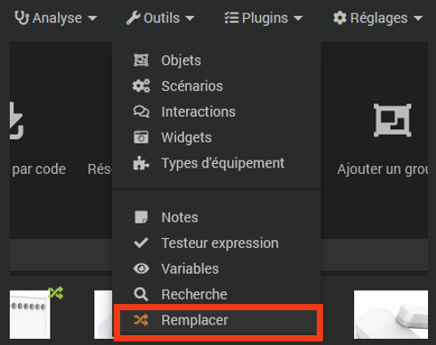

Jeedom bietet seit Version 4.3 an.2 ein neues <kbd>Austauschtool</kbd> , das im Falle eines Problems oder der Notwendigkeit, physische oder virtuelle Geräte (einen Temperatur- oder Anwesenheitssensor, einen Lautstärkeregler, einen Wasserstand usw.) zu ersetzen, das Kopieren aller Befehle, Informationen, erweiterte Parameter und Geschichte dieses Geräts bis hin zu neuen Geräten. 
Es ist auch dafür verantwortlich, die ID der alten Ausrüstung in allen darauf verweisenden Szenarien, Designs, virtuellen usw. durch die neue zu ersetzen.

Wenn das alte Gerät gelöscht wird, wird nämlich der Verweis auf seine ursprüngliche ID-Nummer dauerhaft gelöscht. Anschließend müssen alle Befehle neu erstellt und in alle Designs, Widgets usw. für das neue Modul integriert werden, auch wenn es genau vom gleichen Typ wie das Original ist oder sogar vom gleichen Typ, aber mit einer anderen ID. 
Außerdem warnt Jeedom vor jeder Löschung von Geräten in einem Warnfenster vor den Folgen dieser Löschung :

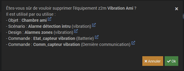

Hier führt das Entfernen dieses Vibrationssensors dazu :

- Löschen der im Design „Alarmzonen“ definierten Anzeigen',
- Löschen von Vibrationsinformationen, Batteriestand und Datum der letzten Kommunikation, einschließlich Verlauf,
- La suppression de l'équipement dans le scénario ‘Alarme détection intru'.

Und sobald dieses Gerät endgültig gelöscht wird, wird es in all diesen Einheiten durch seine alte ID-Nummer oder ein leeres Feld anstelle seines ursprünglichen Namens ersetzt :

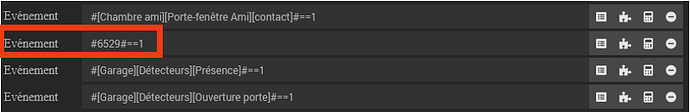
  

## Vor der Verwendung dieses Tools durchzuführende Vorgänge

Auch wenn das <kbd>Ersetzen-</kbd> Tool Ihnen vorschlägt, zunächst eine vorsorgliche Sicherung zu erstellen, wird dringend empfohlen, vor Beginn dieses Austauschvorgangs eine solche Sicherung durchzuführen. 
Bedenken Sie, dass dieses Tool in der Tat sehr leistungsstark ist, da es Ersetzungen auf allen Ebenen durchführt, auch auf solchen, an die Sie nicht gedacht oder die Sie einfach vergessen haben. Außerdem gibt es keine Funktion *rückgängig machen* abzubrechen oder zurückzukehren.  

Die nächste Phase wird die Umbenennung der alten Geräte sein. Ändern Sie dazu einfach den Namen und fügen Sie das Suffix hinzu '**_alt**' Zum Beispiel.

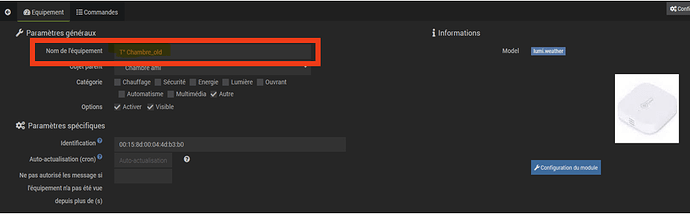
 

Vergessen Sie nicht zu speichern.
 

Sie müssen dann die Einbindung der neuen Ausrüstung, wenn es sich um eine physische Ausrüstung handelt, oder die Erstellung der neuen virtuellen Ausrüstung durchführen, indem Sie dem für jedes Plugin spezifischen Standardverfahren folgen.
Dieses Gerät wird mit seinem endgültigen Namen benannt, dann wird das übergeordnete Objekt und seine Kategorie definiert, bevor es aktiviert wird. 
 
Wir erhalten somit zwei Ausrüstungsgegenstände :

- Alte Ausrüstung, die möglicherweise nicht mehr physisch existiert, auf die aber dennoch in allen Jeedom-Strukturen mit ihren Geschichten Bezug genommen wird,
- Und die neue Ausrüstung, auf der es notwendig sein wird, die Historien zu kopieren und sie anstelle der alten zu referenzieren.
 

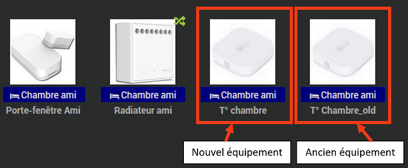
  

## Verwenden des <kbd>Ersetzen-</kbd> Tools>

Öffnen Sie das Werkzeug <kbd>„Ersetzen“</kbd> im Menü „ <kbd>Extras“</kbd>>.

 

Im Feld *Objekt*, Elternobjekt(e) auswählen.

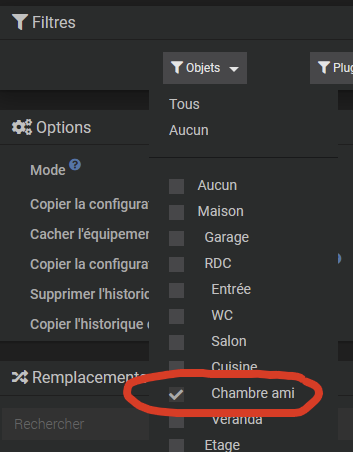
 

Wählen Sie in den Optionen den gewünschten Modus aus (*Ersetzen* Oder *Kopie*) in der Dropdown-Liste und je nach Bedarf die folgenden Optionen (die standardmäßig alle deaktiviert sind) oder zumindest :

- Konfiguration vom Quellgerät kopieren,
- Kopieren Sie die Konfiguration aus dem Quellbefehl.
 

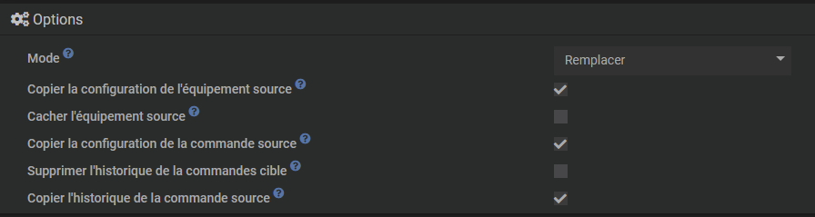
 

Klicken Sie dann auf <kbd>Filter</kbd>>

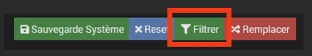
 

Im Feld *Ersatz*, Alle Entitäten, die sich auf das übergeordnete Objekt beziehen, werden angezeigt :

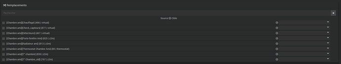
 

Überprüfen Sie das Quellgerät (umbenannt in '**_alt**'), das heißt diejenige, von der wir die Bestellungen, Informationen, Historie usw. kopieren möchten
Hier wird also die Quellausrüstung sein : [Zimmer eines Freundes][T°Chambre_old](767 | z2m). 
Klicken Sie auf die Zeile, um die verschiedenen zugehörigen Felder anzuzeigen.

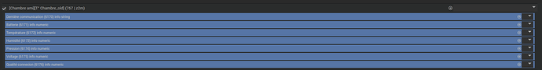
 

Im Spiel *Ziel* Scrollen Sie rechts in der Liste nach unten und wählen Sie das neue Gerät aus, das es ersetzen soll, in unserem Beispiel also [Gästezimmer][Raumtemperatur].

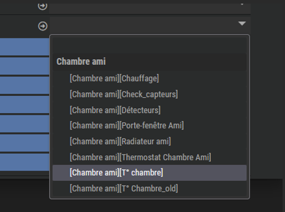
 

In den Dropdown-Listen, die dann rechts angezeigt werden, werden die Informationen auf blauem Hintergrund dargestellt, die Aktionen auf orangem Hintergrund (unten ein weiteres Beispiel an einer Leuchte, bei der es Aktionen und Informationen gibt)).

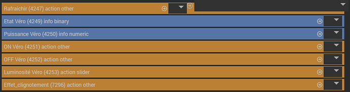
 

Und wenn eine direkte Übereinstimmung vorliegt (insbesondere der gleiche Name), werden die verschiedenen Parameter automatisch festgelegt.

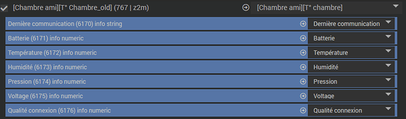
 

Hier wird alles automatisch erkannt.
Andernfalls ist das Feld leer und Sie müssen die entsprechende Information/Aktion ggf. manuell aus der Dropdown-Liste auswählen.

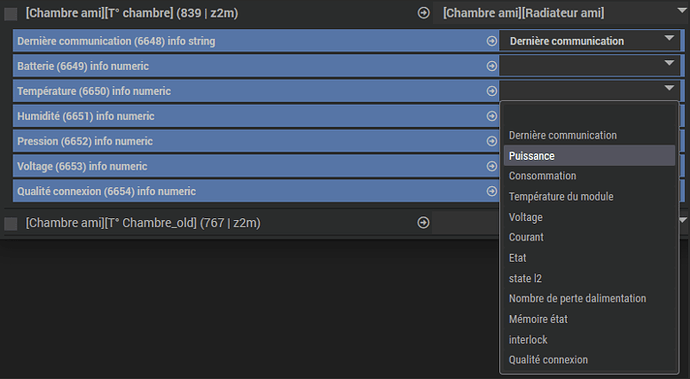
 

Klicken Sie auf <kbd>Ersetzen</kbd>>,

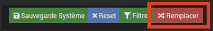
 

Bestätigen Sie den Austausch und prüfen Sie, ob zuvor ein Backup erstellt wurde (Vorsicht, es gibt kein Zurück) !).

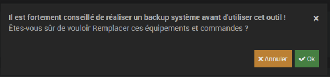
 

Darüber hinaus wird Ihnen das Tool dies zu diesem Zeitpunkt vorschlagen. Wenn Sie jedoch zu diesem Zeitpunkt diese Funktion verlassen, um dieses Backup zu erstellen, verwerfen Sie auch alle bereits vorgenommenen Einstellungen, weshalb das Interesse daran besteht, dieses Backup von Beginn des Vorgangs an zu erstellen.  

Nach dem Starten des Befehls erscheint nach einer kurzen Wartezeit ein Warn-Popup, das den erfolgreichen Abschluss des Vorgangs anzeigt.  

## Schecks

Stellen Sie sicher, dass die neuen Geräte in den Designs, Szenarien, Widgets, Virtuals, Plug-Ins etc. mit ihrer Konfiguration (Layout, Darstellung, Zuordnung von Widgets etc.) und (sofern zutreffend) den damit verbundenen Berücksichtigung finden Geschichte.

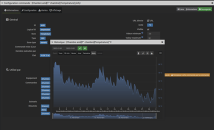
 

Um ordnungsgemäß zu überprüfen, dass nach dieser Ersetzung keine weiteren Probleme aufgetreten sind, kann die Funktion zur Erkennung verwaister Befehle verwendet werden.
Gehen Sie zu <kbd>Analyse</kbd> , <kbd>Ausrüstung</kbd> und klicken Sie auf die Registerkarte *Verwaiste Befehle*.

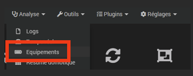
 

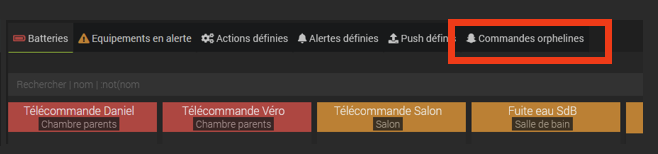
 

Wenn alles gut gelaufen ist, sollten in diesem Bericht keine Zeilen vorhanden sein.
 
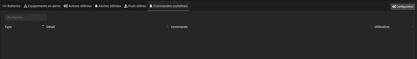
 

Andernfalls muss für jedes identifizierte Problem eine zeilenweise Analyse durchgeführt werden, um das Problem zu beheben.

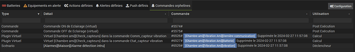
 

Wenn verwaiste Befehle jedoch vom <kbd>Ersetzen-</kbd> Tool nicht berücksichtigt werden, ist es dennoch möglich, mit dieser Funktion Ersetzungen vorzunehmen <kbd>. Dieser Befehl ersetzt die hier im Befehlskonfigurationsfenster gefundene ID</kbd> :

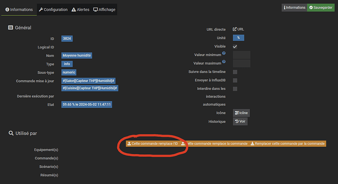
  

## Finalisation

Wenn alles korrekt ist, kann die alte Ausrüstung (im Beispiel T°Chambre_old) endgültig gelöscht werden. Während des Löschvorgangs sollten im Warn-Popup keine weiteren Verweise angezeigt werden, mit Ausnahme von Befehlen, die diesem Gerät eigen sind.

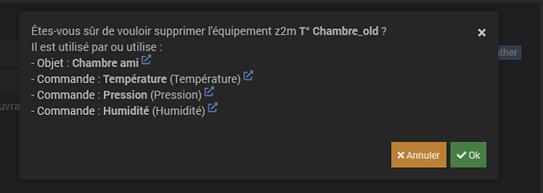
 

Hier wird dieses Gerät nur durch sein zugehöriges Objekt und seine eigenen Befehle referenziert, was normal ist. Wir können es daher ohne Reue löschen.  

## Conclusion

Dieses Tool ist praktisch, bei Missbrauch jedoch aufgrund seiner mehrstufigen Wirkungsweise ebenso gefährlich. 
Beachten Sie auch diese Grundlagen :

- Führen Sie systematisch eine vorsorgliche Sicherung durch, noch bevor Sie das <kbd>Ersetzen-</kbd> Tool verwenden>,
- Nach der Ausführung dieses Befehls ist kein Rückgängigmachen oder Zurücksetzen möglich,
- Und schließlich wird dringend empfohlen, sich zumindest mit der Verwendung dieses Tools vertraut zu machen.
