# Ersetzen

## Warum ein solches Tool?

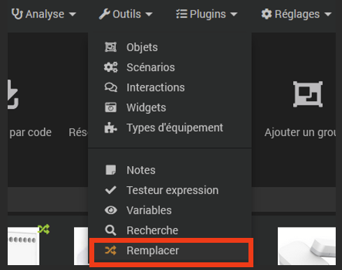

Jeedom bietet seit Version 4.3.2 ein neues Tool an <kbd>Ersetzen</kbd> die im Falle eines Problems oder der Notwendigkeit, ein physisches oder virtuelles Gerät (einen Temperatur- oder Präsenzsensor, einen Lautstärkeregler, einen Wasserstandsmesser usw.) auszutauschen, die Übertragung aller Befehle, Informationen, erweiterten Einstellungen und des Verlaufs dieses Geräts auf ein neues Gerät gewährleistet. 
Außerdem wird das System die ID des alten Geräts in allen Szenarien, Designs, virtuellen Umgebungen usw., in denen darauf verwiesen wurde, durch die des neuen Geräts ersetzen.

Wenn das alte Gerät entfernt wird, wird der Verweis auf seine ursprüngliche ID-Nummer endgültig gelöscht. In diesem Fall müssen alle Befehle neu erstellt und in alle Designs, Widgets usw. für das neue Modul wieder integriert werden – selbst wenn dieses vom Typ her genau dem Original entspricht oder sogar identisch ist, aber eine andere ID-Nummer hat. 
Bevor ein Gerät entfernt wird, weist Jeedom in einem Warnfenster auf die Folgen dieser Entfernung hin:

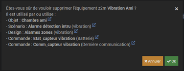

Wenn dieser Schwingungssensor hier entfernt wird, hat dies folgende Auswirkungen:

- Das Löschen der im Design „Zonenalarme“ definierten Anzeigen,
- Das Löschen von Informationen zu Vibration, Zustand der Batterie und Datum der letzten Kommunikation, einschließlich der entsprechenden Verlaufsdaten,
- Das Entfernen der Ausrüstung im Szenario „Einbruchalarm“.

Sobald dieses Gerät endgültig entfernt wird, wird es in allen diesen Einheiten durch seine alte ID-Nummer ersetzt, oder anstelle seiner ursprünglichen Bezeichnung erscheint ein leeres Feld:

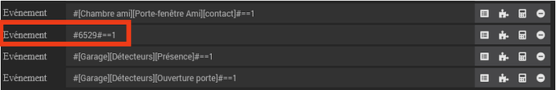
  

## Vorbereitende Schritte vor der Verwendung dieses Tools

Auch wenn das Tool <kbd>Ersetzen</kbd> wird Ihnen vorschlagen, zuvor eine Sicherheitskopie zu erstellen; es wird dringend empfohlen, dies zu tun, bevor Sie mit diesem Austauschvorgang beginnen. 
Beachten Sie, dass dieses Tool in der Tat sehr leistungsstark ist, da es Ersetzungen auf allen Ebenen vornimmt, auch an Stellen, an die Sie nicht gedacht oder die Sie einfach vergessen haben. Außerdem gibt es keine *Undo*-Funktion, um den Vorgang rückgängig zu machen oder zurückzugehen.  

Der nächste Schritt besteht darin, die alten Geräte umzubenennen. Dazu muss lediglich ihr Name geändert werden, indem beispielsweise das Suffix „**_old**“ hinzugefügt wird.

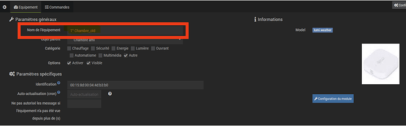
 

Vergessen Sie nicht, zu speichern.
 

Anschließend muss das neue Gerät hinzugefügt werden, wenn es sich um ein physisches Gerät handelt, oder das neue virtuelle Gerät erstellt werden, wobei das für jedes Plugin spezifische Standardverfahren zu befolgen ist.
Dieses Gerät erhält zunächst seinen endgültigen Namen, anschließend werden das übergeordnete Objekt und seine Kategorie festgelegt, bevor es aktiviert wird.
 
Man erhält somit zwei Geräte:

- Die alte Anlage, die zwar physisch vielleicht nicht mehr existiert, aber dennoch in allen Jeedom-Strukturen mit ihren Verlaufsdaten weiterhin aufgeführt ist,
- Und das neue Gerät, auf das die historischen Daten übertragen und das anstelle des alten Geräts registriert werden muss.
 

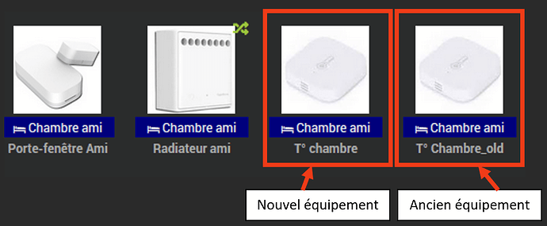
  

## Die Verwendung des Tools <kbd>Ersetzen</kbd>

Tool öffnen <kbd>Ersetzen</kbd>, im Menü <kbd>Tools</kbd>.

 

Wählen Sie im Feld *Objekt* das oder die übergeordneten Objekte aus.

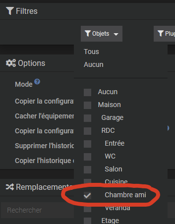
 

Wählen Sie in den Optionen den gewünschten Modus (*Ersetzen* oder *Kopieren*) aus der Dropdown-Liste aus und, je nach Bedarf, die folgenden Optionen (die standardmäßig alle deaktiviert sind), mindestens jedoch:

- Konfiguration des Quellgeräts kopieren,
- Konfiguration der Quellsteuerung kopieren.
 

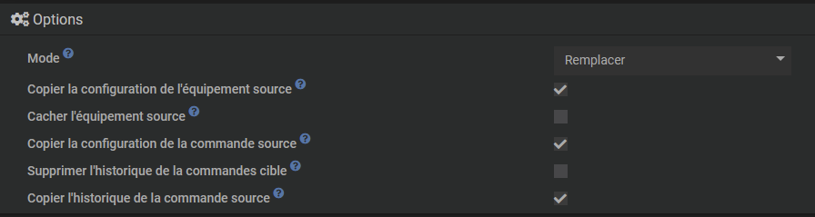
 

Klicken Sie anschließend auf <kbd>Filtern</kbd>

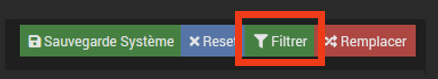
 

Im Feld *Ersetzungen* werden alle Elemente angezeigt, die sich auf das übergeordnete Objekt beziehen:

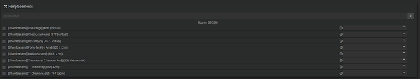
 

Markieren Sie das Quellgerät (umbenannt in „**_old**“), d. h. das Gerät, von dem Sie Befehle, Informationen, den Verlauf usw. kopieren möchten.
In diesem Fall lautet die Quellkonfiguration also: [Gästezimmer][Zimmertemperatur_alt] (767 | z2m). 
Klicken Sie auf die Zeile, um die verschiedenen zugehörigen Felder anzuzeigen.

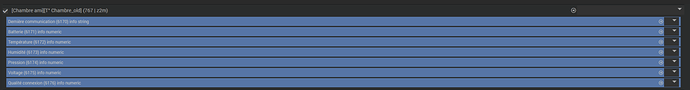
 

Öffnen Sie im Bereich *Ziel* auf der rechten Seite die Liste und wählen Sie das neue Gerät aus, das das alte ersetzen soll, in unserem Beispiel also [Gästezimmer][Zimmertemperatur].

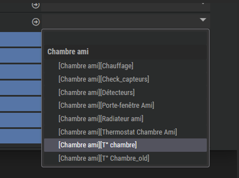
 

In den Dropdown-Listen, die anschließend auf der rechten Seite angezeigt werden, werden die Informationen auf blauem Hintergrund und die Aktionen auf orangefarbenem Hintergrund dargestellt (unten ein weiteres Beispiel für eine Leuchte, bei der es sowohl Aktionen als auch Informationen gibt).

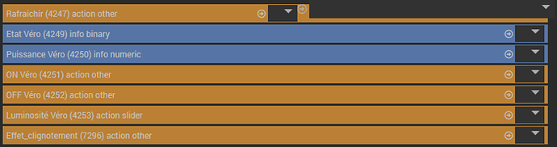
 

Und wenn eine direkte Übereinstimmung vorliegt (insbesondere bei gleichem Namen), werden die verschiedenen Parameter automatisch festgelegt.

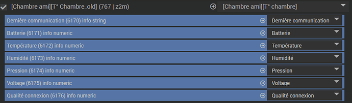
 

Hier wird alles automatisch erkannt.
Andernfalls bleibt das Feld leer, und die entsprechende Information/Aktion muss gegebenenfalls manuell aus der Dropdown-Liste ausgewählt werden.

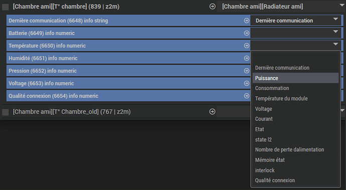
 

Klicken Sie auf <kbd>Ersetzen</kbd>,

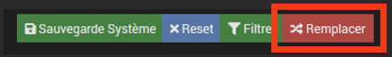
 

Bestätigen Sie den Austausch und vergewissern Sie sich, dass zuvor eine Sicherungskopie erstellt wurde (Achtung, ein Rückgängigmachen ist nicht möglich!).

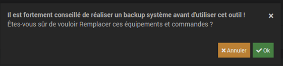
 

Das Tool wird Ihnen dies übrigens in diesem Schritt vorschlagen. Wenn Sie diese Funktion jedoch verlassen, um die Sicherung zu diesem Zeitpunkt durchzuführen, werden alle bereits vorgenommenen Einstellungen verworfen. Daher ist es sinnvoll, diese Sicherung gleich zu Beginn des Vorgangs durchzuführen.  

Nachdem Sie den Befehl ausgeführt haben, erscheint nach einer kurzen Wartezeit ein Pop-up-Fenster, das Ihnen anzeigt, dass der Vorgang erfolgreich verlaufen ist.  

## Die Überprüfungen

Stellen Sie sicher, dass die neuen Geräte in den Designs, Szenarien, Widgets, virtuellen Geräten, Plug-ins usw. mit ihrer Konfiguration (Anordnung, Anzeige, Widget-Zuweisung usw.) und (falls zutreffend) dem zugehörigen Verlauf berücksichtigt wurden.

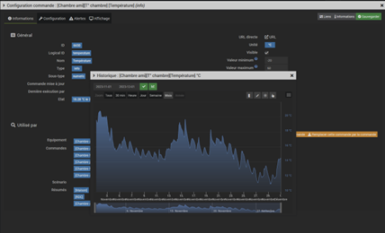
 

Um sicherzustellen, dass durch diesen Austausch keine weiteren Probleme entstanden sind, kann die Funktion zur Erkennung von „verwaisten“ Befehlen verwendet werden.
Weiter zu <kbd>Analyse</kbd>, <kbd>Ausstattung</kbd>, klicken Sie auf die Registerkarte *Waisensteuerbefehle*.

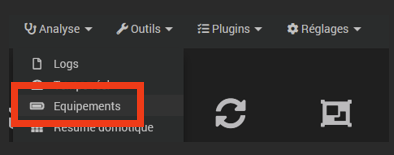
 

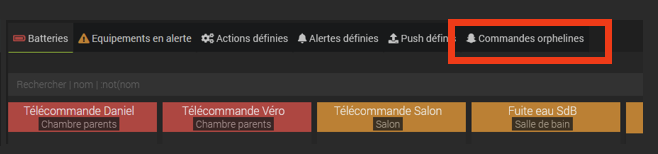
 

Wenn alles gut gelaufen ist, sollte dieser Bericht keine Einträge enthalten.
 
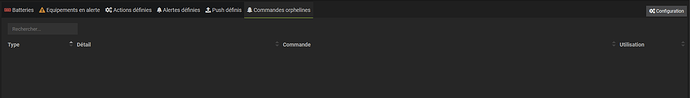
 

Andernfalls muss für jedes identifizierte Problem eine zeilenweise Analyse durchgeführt werden, um es zu beheben.

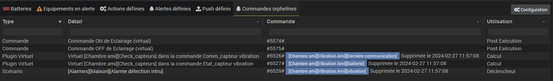
 

Wenn jedoch isolierte Befehle vom Tool nicht berücksichtigt werden <kbd>Ersetzen</kbd>, dennoch ist es möglich, mit dieser Funktion Änderungen vorzunehmen <kbd>Dieser Befehl ersetzt die ID</kbd> die hier im Konfigurationsfenster des Befehls zu finden ist:

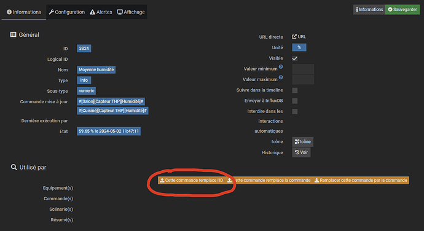
  

## Abschluss

Wenn alles korrekt ist, kann das alte Gerät (im Beispiel „Raumtemperatur_alt“) endgültig gelöscht werden. Beim Löschen dürfen im Warn-Popup keine Verweise mehr erscheinen, mit Ausnahme der diesem Gerät eigenen Befehle.

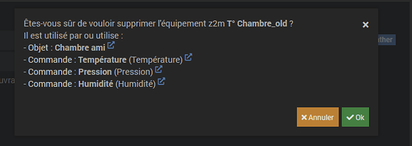
 

Hier wird dieses Gerät nur noch über die Zugehörigkeit zu einem Objekt und seine eigenen Befehle referenziert, was normal ist. Man kann es daher bedenkenlos entfernen.  

## Fazit

Dieses Tool ist praktisch, birgt jedoch aufgrund seiner vielschichtigen Auswirkungen ebenso große Gefahren, wenn es falsch eingesetzt wird. 
Behalten Sie daher diese Grundlagen unbedingt im Hinterkopf:

- Führen Sie systematisch eine Sicherheitskopie durch, und zwar noch bevor Sie das Tool verwenden <kbd>Ersetzen</kbd>,
- Nach Ausführung dieses Befehls ist keine Stornierung oder Rückgängigmachung mehr möglich,
- Und schließlich wird dringend empfohlen, sich zumindest grundlegend mit der Nutzung dieses Tools vertraut zu machen.
