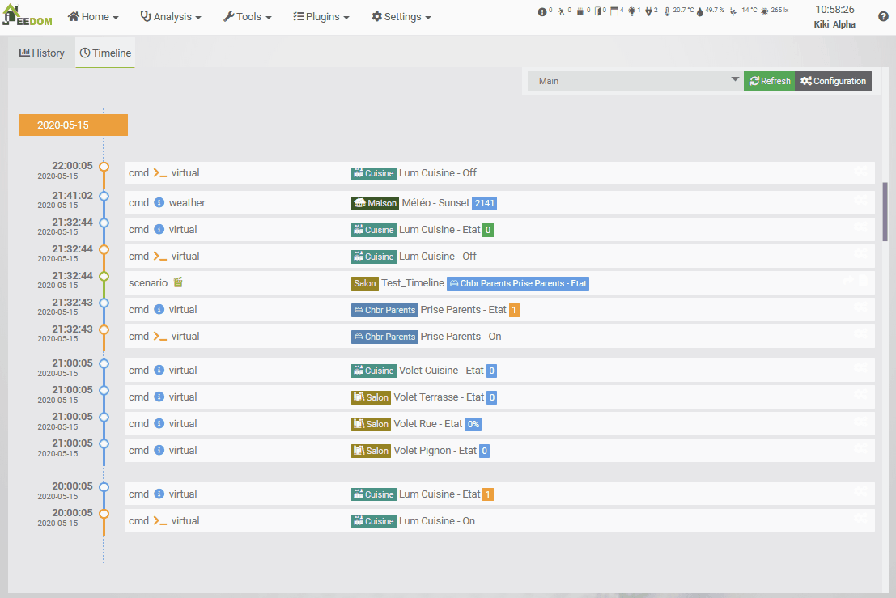

# Suche
**Menü „Analyse“ → „Suche“**

Jeedom verfügt über eine interne Suchfunktion.

Sie können verschiedene Arten von Suchanfragen durchführen:

## Nach Ausrüstung

Wählen Sie ein Gerät über das Symbol rechts neben dem Feld aus.

Die Engine zeigt in den folgenden Tabellen Folgendes an:

- Die **Szenarien**, in denen diese Geräte zum Einsatz kommen.
- Die **Designs**, die diese Ausstattung aufweisen.
- Die **Ansichten**, in denen diese Anlage angezeigt wird.
- Die **Interaktionen**, bei denen diese Geräte zum Einsatz kommen.
- Weitere **Geräte**, die dieses Gerät verwenden.
- Die **Befehle**, die dieses Gerät verwenden.

## Auf Bestellung

Wählen Sie einen Befehl über das Symbol rechts neben dem Feld aus.

Die Engine zeigt in den folgenden Tabellen Folgendes an:

- Die **Szenarien**, die diesen Befehl verwenden.
- Die **Designs**, die diesen Befehl enthalten.
- Die **Ansichten**, in denen dieser Befehl angezeigt wird.
- Die **Interaktionen**, die diesen Befehl verwenden.
- Die **Geräte**, die diesen Befehl verwenden.
- Andere **Befehle**, die diesen Befehl verwenden.

## Nach Variable

Wählen Sie eine Variable aus der Dropdown-Liste aus.

Die Engine zeigt in den folgenden Tabellen Folgendes an:

- Die **Szenarien**, die diese Variable verwenden.
- Die **Interaktionen**, die diese Variable verwenden.
- Die **Geräte**, die diese Variable verwenden.
- Die **Befehle**, die diese Variable verwenden.

## Per Plugin

Wählen Sie ein Plugin aus der Dropdown-Liste aus.

Die Engine zeigt in den folgenden Tabellen Folgendes an:

- Die **Szenarien**, die dieses Plugin verwenden.
- Die **Designs**, die dieses Plugin anzeigen.
- Die **Ansichten**, in denen dieses Plugin angezeigt wird.
- Die **Interaktionen**, die dieses Plugin nutzen.
- Die **Geräte**, die dieses Plugin verwenden.
- Die **Befehle**, die dieses Plugin verwenden.

## Nach Wort

Geben Sie eine Zeichenfolge in das Suchfeld ein. Bestätigen Sie mit *Enter* oder über die Schaltfläche *Suchen*.

Die Engine zeigt in den folgenden Tabellen Folgendes an:

- Die **Szenarien**, die diese Kette verwenden.
Suche in Ausdrücken, Kommentaren und Code-Blöcken.
- Die **Interaktionen**, die diese Zeichenfolge verwenden.
Suche in den Feldern *Anfrage*.
- Die **Geräte**, die diesen Kanal nutzen.
Suche in den Feldern *name*, *logicalId*, *eqType*, *comment*, *tags*.
- Die **Befehle**, die diese Zeichenfolge verwenden.
Suche in den Feldern *name*, *logicalId*, *eqType*, *generic_type*, .
- Die **Notizen**, die diese Zeichenfolge verwenden.
Suche im Text der Anmerkungen.

## Nach ID

Geben Sie im Suchfeld eine Zahl ein, die der gesuchten ID entspricht. Bestätigen Sie mit *Enter* oder mit der Schaltfläche *Suchen*.

Die Engine zeigt in den folgenden Tabellen Folgendes an:

- Das **Szenario** mit dieser ID.
- Das **Design** mit dieser ID.
- Die **Ansicht** mit dieser ID.
- Die **Interaktion** mit dieser ID.
- Das **Gerät** mit dieser ID.
- Der **Befehl** mit dieser ID.
- Die **Notiz** mit dieser ID.

## Ergebnisse

Für jede Art von Ergebnis ermöglicht es folgende Aktionen:
- **Szenarien**: Das Protokoll des Szenarios öffnen oder zur Seite des Szenarios wechseln, wobei die Suche nach dem gesuchten Begriff aktiv bleibt.
- **Designs**: Design anzeigen.
- **Ansichten**: Ansicht anzeigen.
- **Interaktionen**: Öffne die Konfigurationsseite der Interaktion.
- **Gerät**: Die Konfigurationsseite des Geräts öffnen.
- **Befehle**: Die Konfiguration des Befehls öffnen.
- **Notizen**: Notiz öffnen.

Jede dieser Optionen öffnet einen neuen Tab in Ihrem Browser, damit Sie die aktuelle Suche nicht verlieren.

