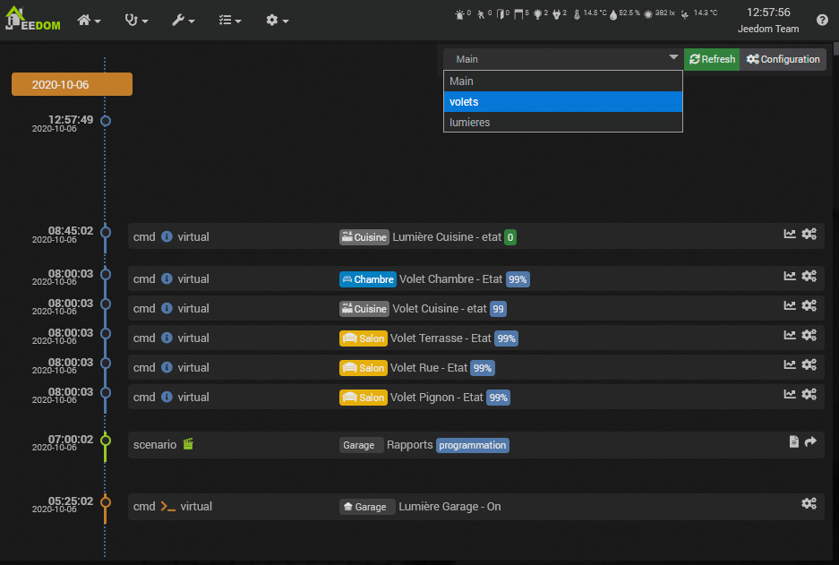

# Zeitleiste
**Analyse → Zeitleiste**

## Zeitleiste

Auf der Seite „Timeline“ werden Ereignisse chronologisch angezeigt, wie z. B. Änderungen von *Info*-Befehlen, Auslösungen von *Action*-Befehlen und die Ausführung von Szenarien.

Um sie zu sehen, müssen Sie zunächst die Nachverfolgung auf der Zeitleiste der gewünschten Befehle oder Szenarien aktivieren und dann abwarten, bis diese Ereignisse eintreten.

- **Szenario**: Entweder direkt auf der Seite eines Szenarios oder in der *Übersicht* der Szenarien.
- **Befehl**: Entweder in den erweiterten Einstellungen des Befehls oder in den Verlaufseinstellungen, um dies „massenweise“ durchzuführen.

Die Zeitleiste *Haupt* enthält immer alle Ereignisse. Sie können die Zeitleiste jedoch nach *Ordner* filtern. Überall dort, wo Sie die Zeitleiste aktivieren, steht Ihnen ein Feld zur Verfügung, in das Sie den Namen eines Ordners eingeben können – unabhängig davon, ob dieser bereits existiert oder nicht.
Sie können die Timeline dann nach diesem Ordner filtern, indem Sie ihn links neben der Schaltfläche *Aktualisieren* auswählen.

> **Hinweis**
>
> Wenn Sie einen Ordner nicht mehr verwenden, erscheint er so lange in der Liste, wie Ereignisse im Zusammenhang mit diesem Ordner vorhanden sind. Danach verschwindet er von selbst aus der Liste.

Sobald Sie die Nachverfolgung in der Zeitleiste für die gewünschten Befehle und Szenarien aktiviert haben, werden diese in der Zeitleiste angezeigt.

> **Wichtig**
>
> Nachdem Sie die Verfolgung auf der Zeitleiste aktiviert haben, müssen Sie warten, bis neue Ereignisse eintreffen, bevor diese angezeigt werden.

## Anzeige

Die Zeitleiste zeigt die aufgezeichneten Ereignisse an, die vertikal nach Tagen geordnet sind.

Für jedes Ereignis haben Sie:

- Datum und Uhrzeit des Ereignisses,
- Art des Ereignisses: Ein Info- oder Aktionsbefehl oder ein Szenario, wobei für die Befehle das entsprechende Befehls-Plugin verwendet wird.
- Der Name des übergeordneten Objekts, der Name und je nach Typ der Status oder der Auslöser.

- Bei einem Befehlsereignis wird rechts ein Symbol angezeigt, über das Sie die Konfiguration des Befehls öffnen können.
- Ein Szenario-Ereignis zeigt rechts zwei Symbole an, mit denen man zum Szenario navigieren oder das Szenario-Protokoll öffnen kann.

Oben rechts können Sie einen Timeline-Ordner auswählen. Dieser muss zuvor angelegt worden sein und Ereignisse enthalten.
