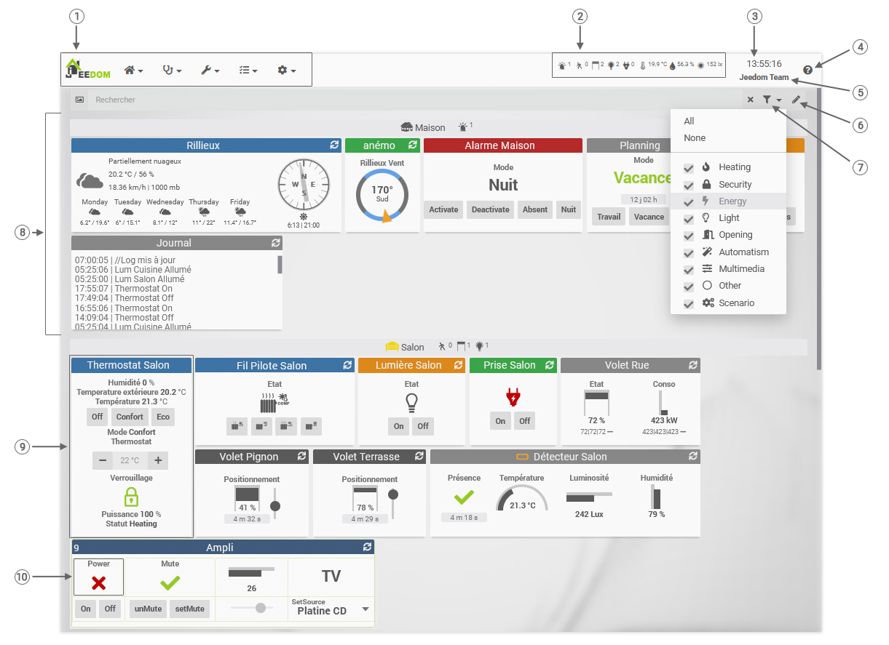

# Dashboard
**Home → Dashboard**

<small>[Raccourcis clavier/souris](shortcuts.md)</small>

The dashboard is one of the main pages of Jeedom, it displays a report of all your home automation.
This report (unlike views and designs) is self-generated by Jeedom, and includes all of the visible objects and their equipment.

- 1 : Jeedom main menu.
- 2 : Global Summary.
- 3 : Browser time, shortcut to Timeline.
- 4 : Button to access the documentation of the current page.
- 5 : Name of your Jeedom, shortcut to configuration.
- 6 : Edit mode (Reorder / resize tiles).
- 7 : Filter by categories.
- 8 : Object : Icon, name and summary, and its equipment.
- 9 : Equipment tile.
- 10 : Order widget.

> **Tip**
>
> The display order of objects on the Dashboard is visible in **Analysis → Home automation summary**. You can modify this order on this page by dragging and dropping.

For equipment to appear on the Dashboard, it must :
- To be active.
- To be visible.
- Have as parent object an object visible on the Dashboard.

When the equipment first appears on the Dashboard, Jeedom tries to correctly size its tile to display all of the commands and their widgets.
In order to keep a balanced dashboard, you can switch to Edit mode with the pencil at the top right of the search bar, in order to resize and / or reorder the equipment tiles.

By moving the mouse over a command, a colored marker appears at the bottom left of the tile:
- Blue for an info command. If it is logged, a click on it opens the log window.
- Orange for an action command. A click will trigger the action.

In addition, you can click on the title of the tile (the name of the equipment) to directly open the configuration page of this equipment.

> **Tip**
>
> It is possible to go directly to a single object in your home automation, via the menu **Home → Dashboard → Object name**.
> This allows you to have only the equipment that interests you, and to load the page faster.

- You have at the top left a small icon to show / hide the tree of objects.
- A search field allows you to search for equipment by name, category, plugin, tag, etc.
- The icon to the left of the search field allows you to filter the displayed equipment according to their category. A center click allows you to quickly select a single category.
- On the right, a button allows you to switch to edit mode, to modify the order of the tiles (click - drop on the widget), or resize them. You can also rearrange the order of commands in a tile.

- By clicking on an object summary, you filter to display only the equipment related to this object and which relate to this object summary.

- A click on an information type command displays the history of the command (if it is historizedl).
- A Ctrl + Click on an information type command displays the history of all (historical) commands for this tile.
- One click on the information *time* of an action command displays the history of the command (if it is historized).

> **Tip**
>
> It is possible, from your profile, to configure Jeedom so that the tree of objects and / or the scenarios are visible by default when you arrive on the Dashboard.

> **Tip**
>
> In mobile, pressing an info type command displays a menu offering you either to display the history of the command, or to put an alert on it so that Jeedom alerts you (once) as soon as that the value passes a certain threshold.

## Edit mode

In edit mode (*the pencil at the top right*), you can change the size of the tiles and their arrangement on the Dashboard.

You can also edit the internal layout of the controls on the tile :

- Either rearrange them by dragging and dropping.
- Either by right-clicking on the widget. You then access :
    - **Advanced configuration** : gives access to the advanced configuration of the command.
    - **Standard** : default layout, everything is automatic with just the possibility of rearranging the order of commands.
    - **Board** : allows to put the commands in a table : columns and rows are added and deleted by right click, then just move the commands in the desired boxes. You can put multiple commands per box
    - **Add column** : add a column to the table (accessible only if you are in table layout)
    - **Add line** : add a row to the table (accessible only if you are in table layout)
    - **Remove column** : remove a column from the table (accessible only if you are in table layout)
    - **Delete line** : delete a row in the table (accessible only if you are in table layout)

To the right of each object, an icon allows you to :

- Click : All the tiles of this object will adopt a height equal to the highest tile.
- Ctrl Click : All the tiles of this object will adopt a height equal to the lowest tile.

## Jeedom menu bar

> **Tip**
>
> - Click on the clock (menu bar) : Open the Timeline.
> - Click on the name of the Jeedom (menu bar) : Opens Settings → System → Configuration.
> - Click on ? (toolbar) : Opens help on the current page.
> - Escape on a research field : Clear the field and cancel this search .
