The interaction system in Jeedom makes it possible to carry out actions to
from text or voice commands.

These orders can be obtained by :

-   SMS : send an SMS to launch commands (action) or ask a
    question (info).

-   Cat : Telegram, Slack, etc.

-   Vocal : dictate a phrase with Siri, Google Now, SARAH, etc. For
    launch commands (action) or ask a question (info).

-   D'informations sont indispensables à la bonne compréhension de : launch an HTTP URL containing the text (ex. Tasker, Slack)
    To launch commands (action) or ask a question (info).

The interest of interactions lies in the simplified integration in
other systems like smartphone, tablet, other home automation box, etc.

To access the interaction page, go to Tools →
Interactions :

At the top of the page, there are 3 buttons :

-   **Add** : which allows to create new interactions.

-   **Regenerate** : which will recreate all the interactions (maybe
    très long &gt; 5mn).

-   **Test** : which opens a dialog for writing and
    test a sentence.

> **Tip**
>
> If you have an interaction that generates the sentences for the lights
> for example and you add a new command module of
> light, you will either have to regenerate all the interactions, or
> go to the interaction in question and save it again for
> create the sentences for this new module.

Principle 
========

The principle of creation is quite simple : we will define a sentence
generator model which will allow Jeedom to create one or more
hundreds of other sentences that will be possible combinations of the
model.

We will define responses in the same way with a model (this allows
Jeedom to have several answers for a single question).

We can also define a command to execute if for example
the interaction is not linked to an action but to information or if we
wish to carry out a specific action after it (it is also
possible to execute a scenario, to control several commands…).

D'actualité 
=============

The configuration page consists of several tabs and
buttons :

-   **Sentences** : Displays the number of sentences in the interaction (one click
    above shows them to you)

-   **Save** : records the current interaction

-   **Remove** : delete current interaction

-   **Duplicate** : duplicate the current interaction

General 
=======

-   **Last name** : name of the interaction (can be empty, the name replaces the
    request text in the interaction list).

-   **Group** : interaction group, it helps organize them
    (can be empty, so will be in the group "none").

-   **Active** : allows to activate or deactivate the interaction.

-   **Request** : The generating model sentence (required).

-   **Synonymous** : allows to define synonyms on names
    some orders.

-   **Reply** : the answer to provide.

-   **Wait before answering (s)** : add a delay of X seconds before generating the response. It allows for example to wait for the return of a lamp status before being answered.

-   **Binary conversion** : converts binary values to
    open / closed for example (only for type commands
    binary info).

-   **Authorized users** : limits interaction to certain
    users (logins separated by |).

Filters 
=======

-   **Limit to type commands** : allows to use only the
    types of actions, info or both types.

-   **Limit to orders with subtype** : allows to limit
    generation to one or more subtypes.

-   **Limit to orders with unit** : allows to limit the
    generation with one or more units (Jeedom creates the list
    automatically from the units defined in your orders).

-   **Limit to orders belonging to the object** : allows to limit
    generation to one or more objects (Jeedom creates the list
    automatically from the objects you created).

-   **Limit to plugin** : limits generation to one or more
    several plugins (Jeedom automatically creates the list from
    plugins installed).

-   **Limit to category** : limits generation to one
    or more categories.

-   **Limit to equipment** : limits generation to one
    single equipment / module (Jeedom automatically creates the list at
    from the equipment / modules you have).

ACTION 
======

Use if you want to target one or more specific commands
or pass particular parameters.

Examples 
========

> **NOTE**
>
> The screenshots may be different in view of developments.

Simple interaction 
------------------

The easiest way to set up an interaction is to use it
give a rigid generator model, without possible variation. This
method will target a command or a scenario very precisely.

In the example which follows, we can see in the field &quot;Request&quot; the sentence
exact to provide to trigger interaction. Here, to turn on the
living room ceiling light.

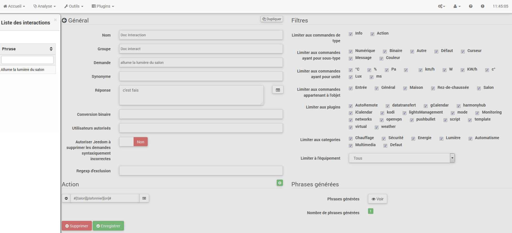

We can see, on this capture, the configuration to have a
interaction linked to a specific action. This action is defined in
the &quot;Action&quot; part of the page.

We can very well imagine doing the same with several actions to
turn on several lamps in the living room as the following example :

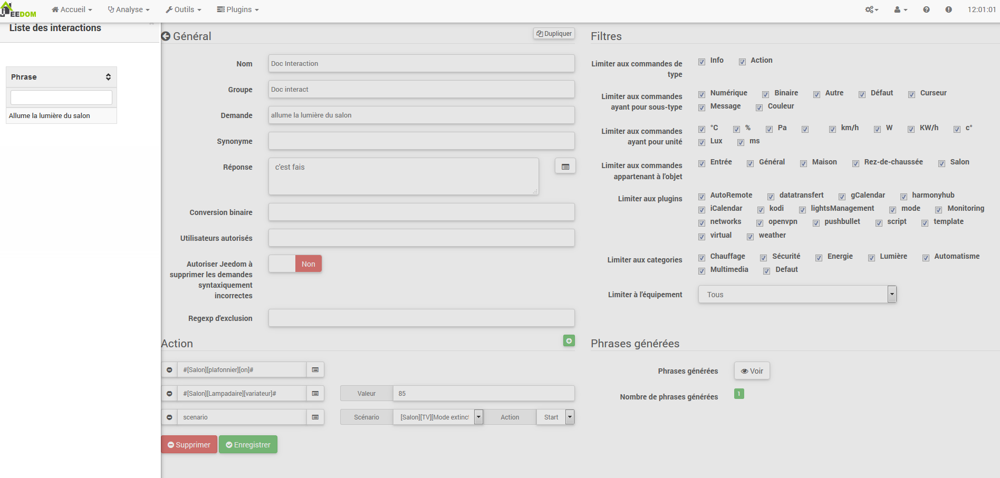

In the 2 examples above, the model sentence is identical but the
resulting actions change depending on what is configured
in the &quot;Action&quot; part, we can therefore already with a simple interaction to
single sentence imagine combined actions between various commands and
various scenarios (we can also trigger scenarios in the game
action of interactions).

> **Tip**
>
> To add a scenario, create a new action, write "scenario"
> without an accent, press the tab key on your keyboard to
> bring up the scenario selector.

Multiple command interaction 
------------------------------

Here we will see all the interest and all the power of
interactions, with a model sentence we will be able to generate
sentences for a whole group of commands.

We will resume what was done above, delete the actions that
we had added, and instead of the fixed sentence, in "Request",
we will use the tags **\#commande\#** and **\#equipement\#**.
Jeedom will replace these tags with the name of the commands and the name of
equipment (we can see the importance of having names of
consistent control / equipment).

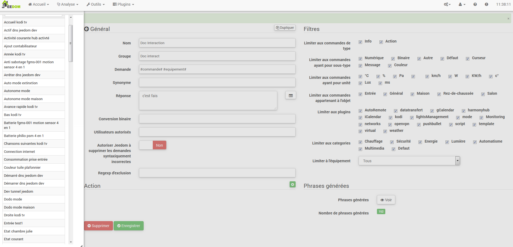

So we can see here that Jeedom generated 152 sentences from
our model. However, they are not very well built and we
has a little bit of everything.

To make order in all this, we will use the filters (part
right of our configuration page). In this example, we want
generate sentences to turn on lights. So we can uncheck the
command type info (if I save, I only have 95 sentences left
generated), then, in the subtypes, we can only keep checked
"default "which corresponds to the action button (so only 16 remain
phrases).

It&#39;s better, but we can make it even more natural. If I take
the generated example &quot;On entry&quot;, it would be nice to be able to transform
this sentence in "turn on the entry" or in "turn on the entry". To do
that, Jeedom has, under the request field, a synonymous field which will
allow us to name orders differently in our
&quot;generated&quot; sentences, here it is &quot;on&quot;, I even have &quot;on2&quot; in the modules
which can control 2 outputs.

In synonyms, we will therefore indicate the name of the command and the (s)
synonym (s) to use :

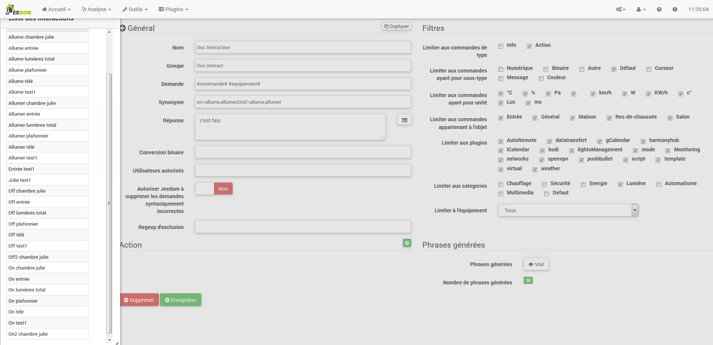

We can see here a somewhat new syntax for synonyms. A name
can have several synonyms, here &quot;on&quot; has as synonym
"turn on "and" turn on". The syntax is therefore "*Name of the order*"
***=*** "*synonym 1*"***,*** "*synonym 2*" (we can put as many
synonym that we want). Then, to add synonyms for another
command name, just add after the last synonym a bar
vertical "*|*" after which you can again name the
command which will have synonyms like for the first part, etc.

It&#39;s already better, but it is still missing for the "on" "input command"
the &quot;l&quot; and for others the &quot;the&quot; or &quot;the&quot; or &quot;a&quot;, etc. We could
changing the name of the equipment to add it would be a solution,
otherwise we can use variations in demand. It consists of
list a series of possible words at a location in the sentence, Jeedom
will generate sentences with these variations.

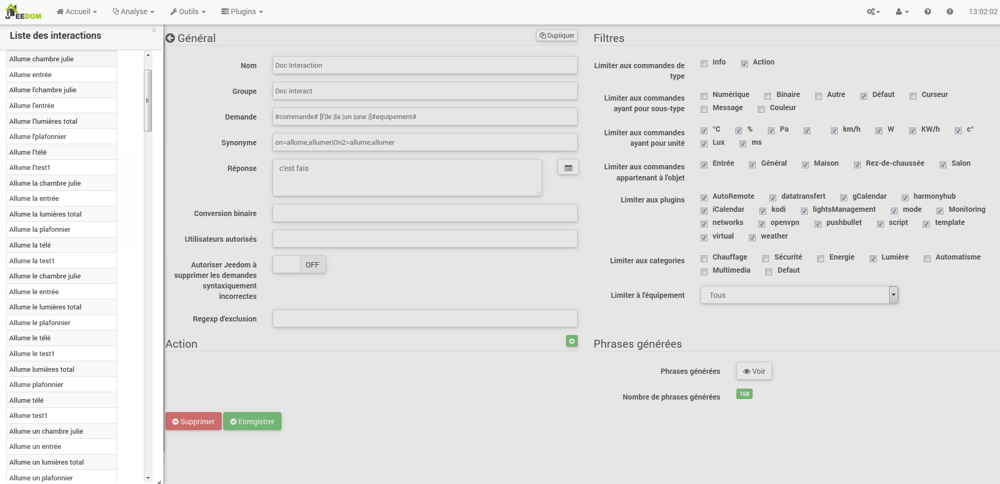

We now have slightly more correct sentences with sentences that
are not fair, for our example "on" "entry". so we find
"Switch on input "," Switch on input "," Switch on input "," Switch on
the entry &quot;etc. So we have all the possible variants with what we
added between &quot;\ [\]&quot; and this for each synonym, which generates
quickly a lot of sentences (here 168).

In order to refine and not have improbable things such as
"turn on the TV ", we can authorize Jeedom to delete requests
syntactically incorrect. So it will delete what is too far away
the actual syntax of a sentence. In our case, we go from 168
130 sentence sentences.

It therefore becomes important to build your model sentences well and
synonyms as well as selecting the right filters so as not to generate
too many unnecessary sentences. Personally, I find it interesting to have
some inconsistencies of the style &quot;an entry&quot; because if at home, you have
a foreign person who does not speak French correctly,
interactions will still work.

Customize responses 
--------------------------

Until now, as a response to an interaction, we had a simple
sentence that didn&#39;t say much except that something happened
past. The idea would be that Jeedom tells us what he did a little more
precisely. This is where the response field comes in
ability to customize return based on order executed.

To do this, we will again use the Jeedom Tag. For our
lights, we can use a phrase like : I lit well
\#equipement\# (see screenshot below).

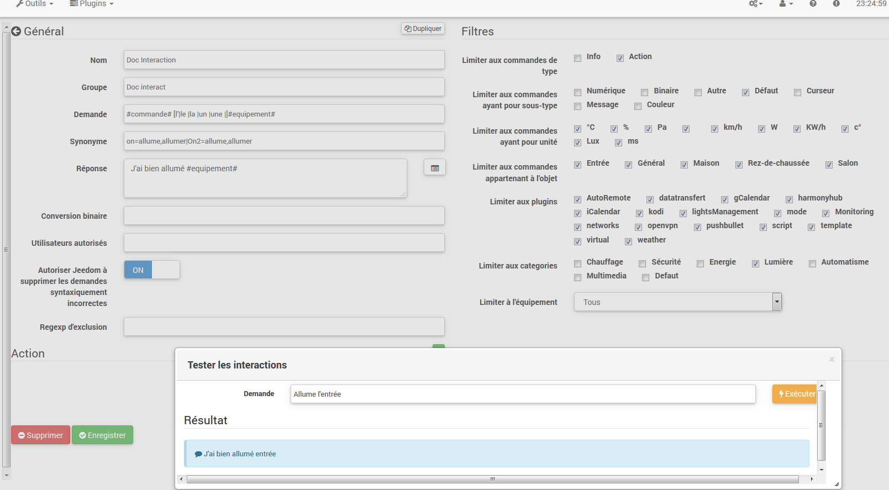

You can also add any value from another command like
temperature, number of people, etc.

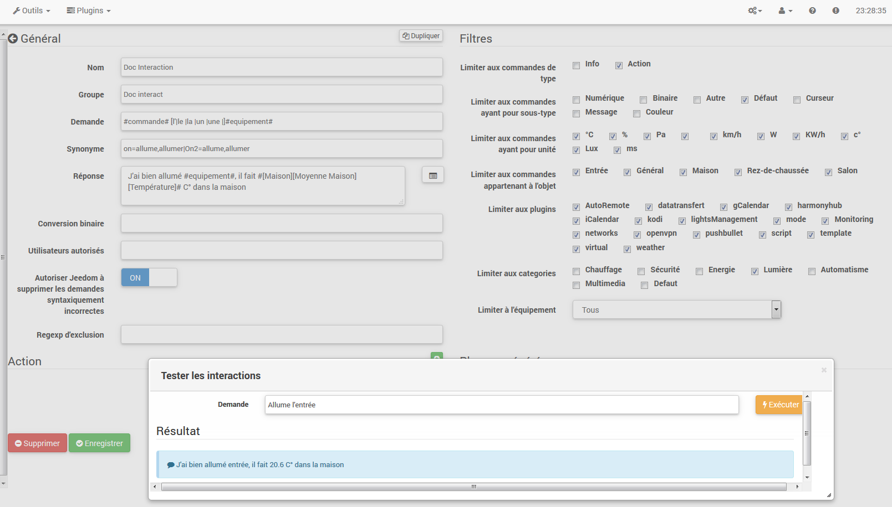

Binary conversion 
------------------

Binary conversions apply to info type orders whose
subtype is binary (returns 0 or 1 only). So you have to activate
the right filters, as you can see in the screenshot below
(for the categories, we can check all of them, for the example I have
kept that light).

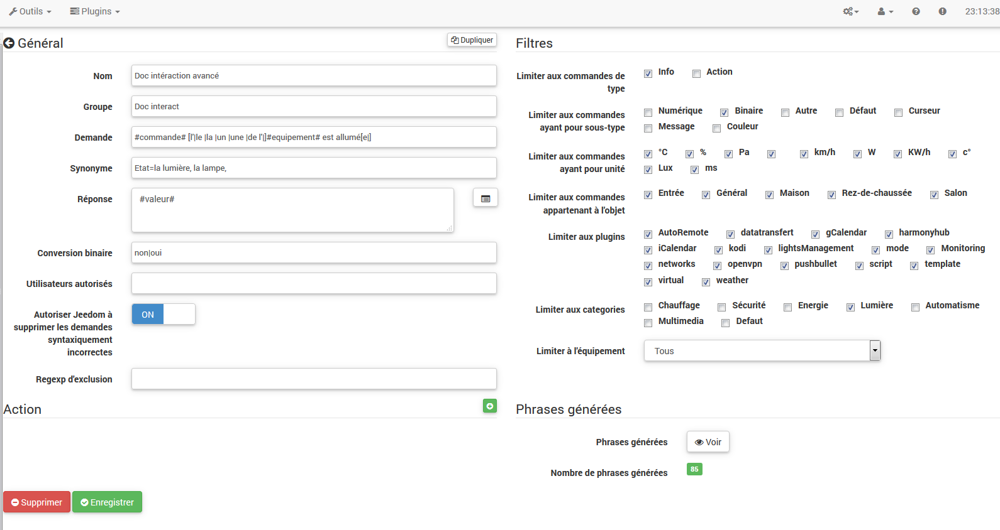

As you can see here, I have kept almost the same structure
for demand (it&#39;s voluntary to focus on
specificities). Of course, I adapted the synonyms to have some
coherent thing. However, for the answer, it is **imperative** de
put only \#valeur\# which represents the 0 or 1 that Jeedom is going
replace with the following binary conversion.

Field **Binary conversion** must contain 2 answers : first the
response if the value of the command is 0, then a vertical bar "|"
separation and finally the response if the command is worth 1. Here the
answers are simply no and yes but we could put a sentence
a little bit longer.

> **Warning**
>
> Tags do not work in binary conversions.

Authorized users 
----------------------

The &quot;Authorized users&quot; field allows you to authorize only certain
people to execute the command you can put multiple profiles
separating them with a "|".

Example : personne1|personne2

One can imagine that an alarm can be activated or deactivated by a
child or a neighbor who would come to water the plants in your absence.

Regexp exclusion 
------------------

It is possible to create
[Regexp](https://fr.wikipedia.org/wiki/Expression_rationnelle)
of exclusion, if a generated sentence corresponds to this Regexp it will be
deleted. The point is to be able to remove false positives,
to say a sentence generated by Jeedom which activates something which does not
does not correspond to what we want or which would interfere with another
interaction that would have a similar sentence.

We have 2 places to apply a Regexp :

-   in the interaction even in the "Regexp exclusion" field".

-   In the Administration → Configuration → Interactions menu → &quot;Regexp&quot; field
    general exclusion for interactions".

For the field &quot;General exclusion regex for interactions&quot;, this
rule will be applied to all interactions, which will be created or
saved again afterwards. If we want to apply it to all
existing interactions, interactions need to be regenerated.
Usually it is used to erase sentences incorrectly
found in most of the interactions generated.

For the &quot;Regexp exclusion&quot; field in the configuration page of
each interaction, we can put a specific Regexp that will act
only on said interaction. So it allows you to delete
more specifically for an interaction. It can also allow
delete an interaction for a specific command for which
does not want to offer this opportunity as part of a generation of
multiple orders.

The following screenshot shows the interaction without the Regexp. In the
left list, I filter the sentences to show you only the
sentences to be deleted. In reality there are 76 sentences generated
with the configuration of the interaction.

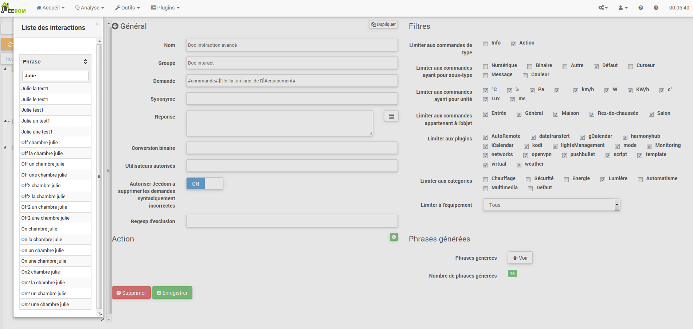

As you can see on the following screenshot, I added a
regexp simple which will search for the word &quot;Julie&quot; in the generated sentences
and delete them. However, we can see in the list on the left that there
always has sentences with the word &quot;julie&quot; in expressions
regular, Julie is not equal to julie, this is called a
case sensitivity or in good French a capital letter is different
of a tiny. As we can see in the following screenshot, it does not
only 71 sentences left, the 5 with a &quot;Julie&quot; have been deleted.

A regular expression is composed as follows :

-   First, a delimiter, here it is a slash &quot;/&quot; placed in
    beginning and end of expression.

-   The dot after the slash represents any
    character, space or number.

-   The &quot;\*&quot; indicates that there can be 0 or more times
    the character that precedes it, here a point, so in good French
    any item.

-   Then Julie, which is the word to look for (word or other diagram
    expression), followed by a dot again and a forward slash.

If we translate this expression into a sentence, it would give &quot;seek the
word Julie which is preceded by anything and followed by anything
quoi".

It&#39;s an extremely simple version of regular expressions but
already very complicated to understand. It took me a while to grasp it
the operation. As a slightly more complex example, a regexp for
verify a URL :

/\^(https?:\\ / \\ /)?(\ [\\ da-z \\ .- \] +) \\. (\ [az \\. \] {2,6}) (\ [\\ / \\ w
\\ .- \] \*)\*\\ /?\ $ /

Once you can write this, you understand the expressions
regular.

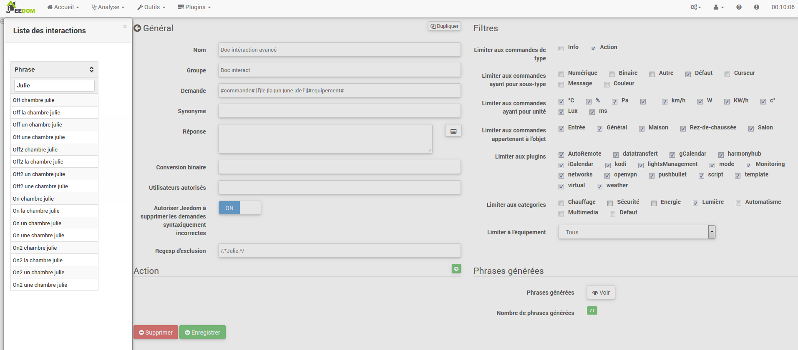

To solve the problem of upper and lower case, we can add to
our expression an option that will make it case-insensitive, or
in other words, which considers a lowercase letter equal to a capital letter;
to do this, we simply have to add at the end of our expression a
"i".

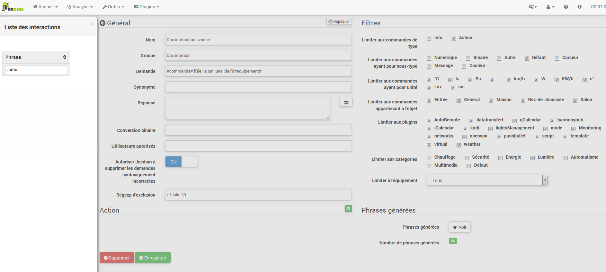

With the addition of the option &quot;i&quot; we see that there are only 55 left
generated sentences and in the list on the left with the julie filter for
look for the sentences that contain this word, we see that there are some
Much more.

As this is an extremely complex subject, I will not go further
detail here, there are enough tutorials on the net to help you, and
don&#39;t forget that Google is your friend too because yes, he is my friend,
it was he who taught me to understand Regexp and even to code. Therefore
if he helped me, he can also help you if you put good
volonté.

Useful links :

-   <http://www.commentcamarche.net/contents/585-javascript-l-objet-regexp>

-   <https://www.lucaswillems.com/fr/articles/25/tutoriel-pour-maitriser-les-expressions-regulieres>

-   <https://openclassrooms.com/courses/concevez-votre-site-web-avec-php-et-mysql/les-expressions-regulieres-partie-1-2>

Response composed of several pieces of information 
------------------------------------------

It is also possible to put several info commands in one
answer, for example to get a situation summary.

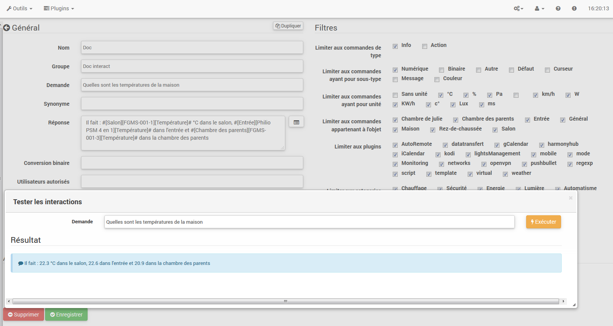

In this example we see a simple sentence that will return a
answer with 3 different temperatures, so here we can put a little
everything you want in order to have a set of information in one
one time.

Is there anyone in the room ? 
------------------------------------

### Basic version 

-   So the question is "is there anyone in the room"

-   The answer will be &quot;no there is no one in the room&quot; or &quot;yes there is
    has someone in the room"

-   The command that responds to that is &quot;\# \ [Chamber of
    julie \] \ [GSMF-001-2 \] \ [Presence \] \#"

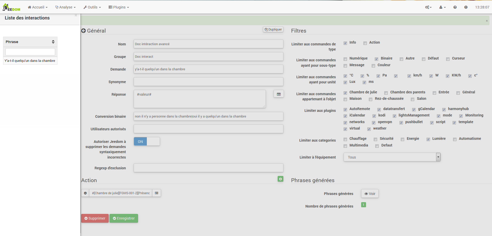

This example specifically targets specific equipment which allows
to have a personalized response. So we could imagine replacing
the example answer with &quot;no there is no one in the room
*julie*|yes there is someone in the room *julie*"

### Evolution 

-   So the question is "\#commande\# \[in the |in the\] \#objet\#"

-   The answer will be &quot;no there is no one in the room&quot; or &quot;yes there is
    someone in the room"

-   There is no command which answers that in the Action part seen
    that this is a Multiple commands interaction

-   By adding a regular expression, we can clean up the commands
    that we don&#39;t want to see to have only the sentences on the
    Presence commands".

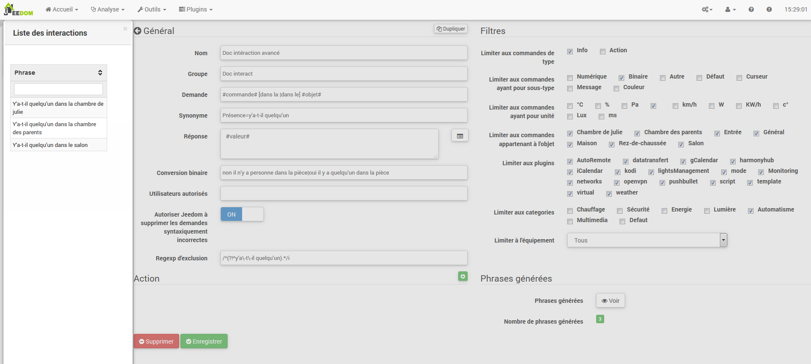

Without the Regexp, we get here 11 sentences, but my interaction is aimed
generate sentences only to ask if there is someone in
a room, so I don&#39;t need a lamp condition or anything like the
taken, which can be resolved with regexp filtering. To give back
even more flexible, synonyms can be added, but in this case it
don&#39;t forget to modify the regexp.

Know the temperature / humidity / brightness 
--------------------------------------------

### Basic version 

We could write the sentence hard like for example &quot;what is the
living room temperature &quot;, but one should be done for each sensor
of temperature, brightness and humidity. With the generation system of
Jeedom sentence, so we can generate with a single interaction
sentences for all the sensors of these 3 types of measurement.

Here a generic example which is used to know the temperature,
the humidity, the brightness of the different rooms (object in the Jeedom sense).

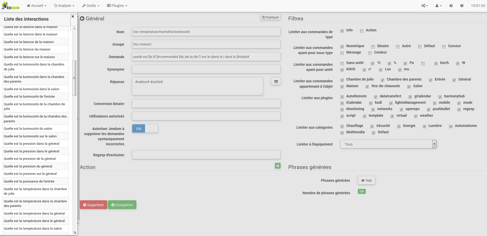

-   So we can see that a generic generic sentence &quot;What is the
    living room temperature "or" How bright is the bedroom"
    can be converted to : "what is the |l \\ '\] \#commande\# objet"
    (the use of \ [word1 | mot2 \] lets say this possibility
    or this one to generate all possible variations of the sentence
    with word1 or word2). When generating Jeedom will generate all
    possible combinations of sentences with all commands
    existing (depending on filters) by replacing \#commande\# par
    the name of the command and \#objet\# by the name of the object.

-   The answer will be "21 ° C" or "200 lux". Just put :
    \#valeur\# \#unite\# (the unit is to be completed in the configuration
    of each order for which we want to have one)

-   This example therefore generates a sentence for all the commands of
    type digital info that have a unit, so we can uncheck
    units in the right filter limited to the type that interests us.

### Evolution 

We can therefore add synonyms to the command name to have some
more natural thing, add a regexp to filter the commands that
have nothing to do with our interaction.

Adding a synonym, lets tell Jeedom that a command called
"X" can also be called "Y" and therefore in our sentence if we have "turn on
y &quot;, Jeedom knows it&#39;s turning on x. This method is very convenient
to rename command names which, when displayed at
the screen, are written in a way that is not natural vocally or
in a sentence written like "ON". A button written like this is
totally logical but not in the context of a sentence.

We can also add a Regexp filter to remove some commands.
Using the simple example, we see sentences &quot;battery&quot; or
"latency ", which have nothing to do with our interaction
temperature / humidity / brightness.

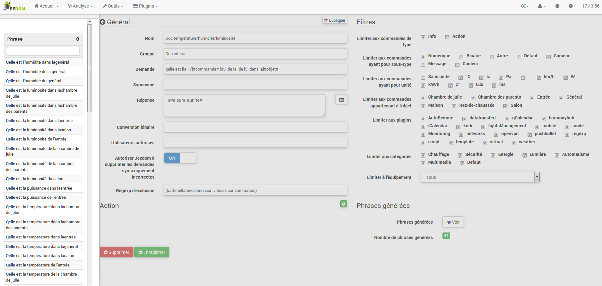

So we can see a regexp :

**(batterie|latence|pression|vitesse|consommation)**

This allows you to delete all orders that have one of these
words in their sentence

> **NOTE**
>
> The regexp here is a simplified version for easy use.
> So we can either use traditional expressions or
> use the simplified expressions as in this example.

Control a dimmer or a thermostat (slider) 
-------------------------------------------

### Basic version 

It is possible to control a percentage lamp (dimmer) or a
thermostat with interactions. Here is an example to control its
dimmer on a lamp with interactions :

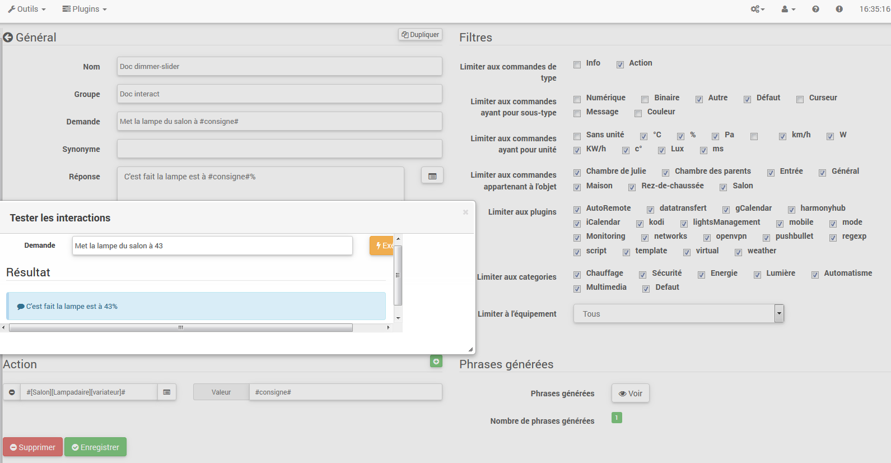

As we can see, there is here in the request the tag **\#consigne\#** (on
can put what you want) which is included in the order of the
dimmer to apply the desired value. To do this, we have 3 parts
: \* Request : in which we create a tag that will represent the value
which will be sent to the interaction. \* Reply : we reuse the tag for
the answer to make sure Jeedom understood the request correctly.
\* Action : we put an action on the lamp that we want to drive and in
the value we pass our tag *Instructions*.

> **NOTE**
>
> You can use any tag except those already used by
> Jeedom, there can be several to drive for example
> multiple orders. Also note that all tags are passed to
> scenarios launched by the interaction (however, the scenario
> either in "Run in foreground").

### Evolution 

We may want to control all cursor type commands with a
single interaction. With the example below, we will be able to order
several drives with a single interaction and therefore generate a
set of sentences to control them.

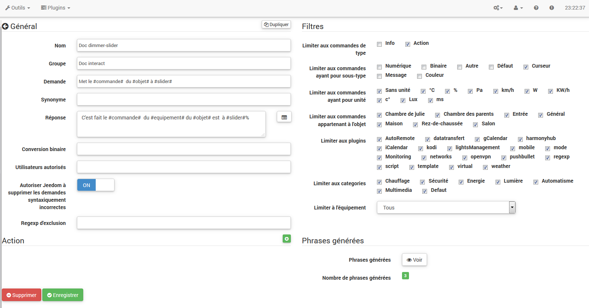

In this interaction, we have no command in the action part, we
let Jeedom generate from tags the list of sentences. We can
see the tag **\#slider\#**. It is imperative to use this tag for
instructions in a multiple command interaction it may not be
the last word of the sentence. We can also see in the example that we
can use in the response a tag which is not part of the
request. The majority of the tags available in the scenarios are
also available in interactions and therefore can be used
in an answer.

Result of the interaction :

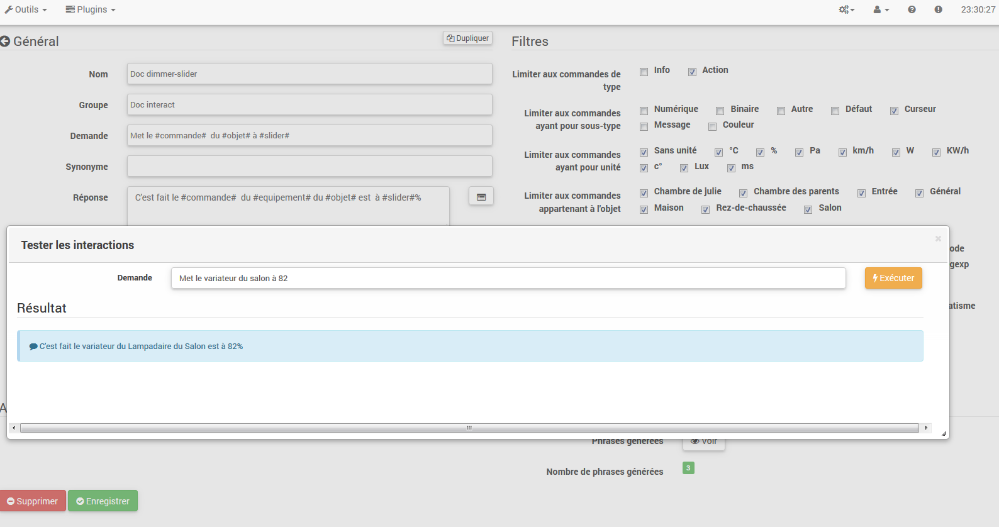

We can see that the tag **\#equipement\#** which is not used
in the request is well completed in the response.

Control the color of an LED strip 
--------------------------------------

It is possible to control a color command by the interactions in
asking Jeedom for example to light a blue LED strip.
This is the interaction to do :

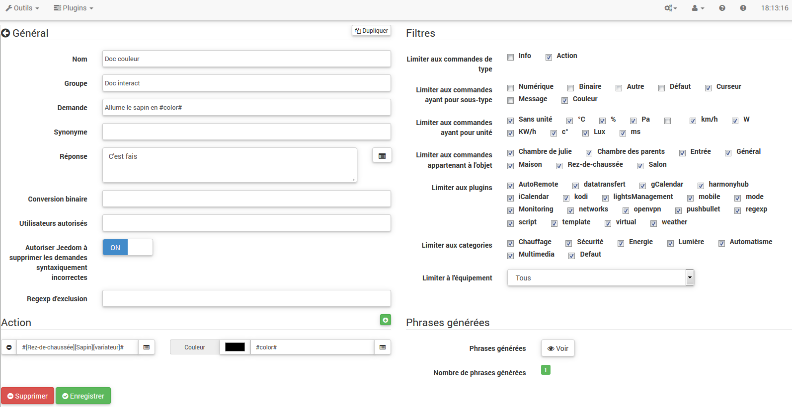

Until then nothing very complicated, it must however have configured
colors in Jeedom to make it work; go to the
menu → Configuration (top right) then in the section
"Configuring interactions" :

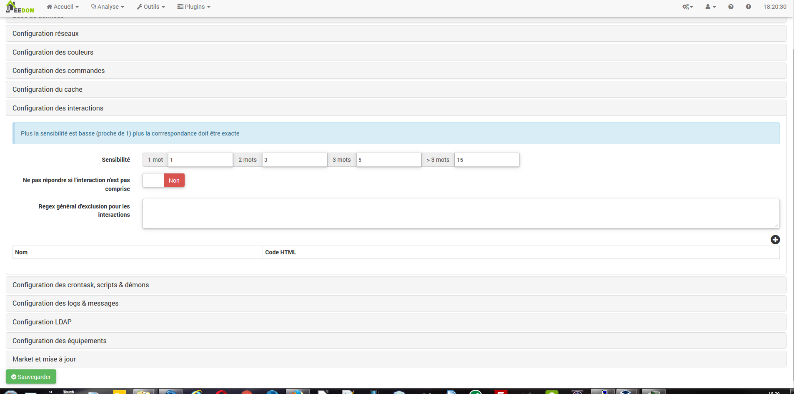

As we can see on the screenshot, there is no color
configured, so add colors with the &quot;+&quot; on the right. The
color name, this is the name you are going to pass to the interaction,
then in the right part (column &quot;HTML code&quot;), by clicking on the
black color you can choose a new color.

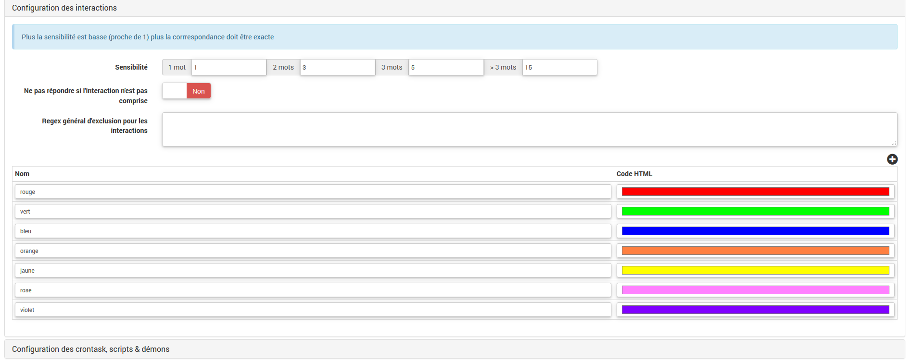

We can add as many as we want, we can put as a name
any one, so you could imagine assigning a color to
the name of each family member.

Once configured, you say &quot;Light the tree green&quot;, Jeedom will
find a color in the request and apply it to the order.

Use coupled with a scenario 
---------------------------------

### Basic version 

It is possible to couple an interaction to a scenario in order to
perform slightly more complex actions than performing a simple
action or request for information.

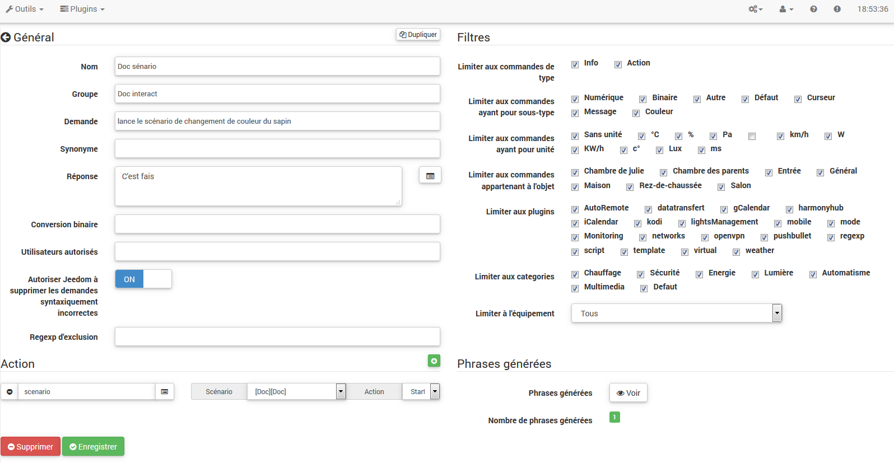

This example therefore makes it possible to launch the scenario which is linked in the
action part, we can of course have several.

Programming an action with interactions 
------------------------------------------------

Interactions do a lot of things in particular.
You can program an action dynamically. Example : "Put it on
heating at 10 p.m. for 2:50 p.m". Nothing could be simpler, just
to use tags \#time\# (if a specific time is defined) or
\#duration\# (for in X time, example in 1 hour) :

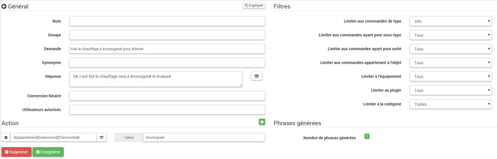

> **NOTE**
>
> You will notice in the response the tag \#value\# this one contains
> in the case of a scheduled interaction, the programming time
> effective
