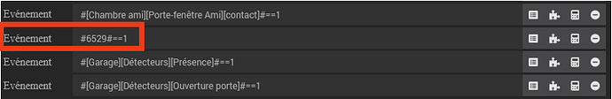
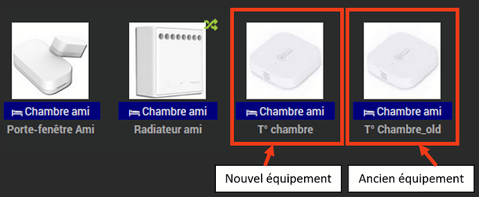
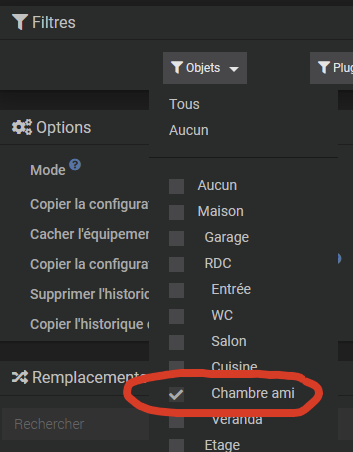
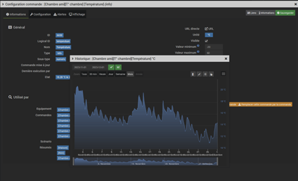
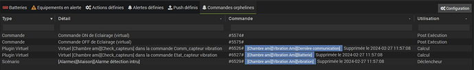
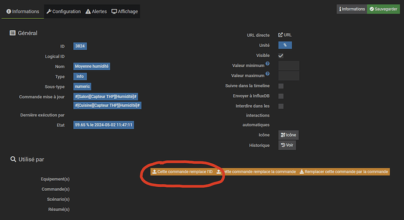

 # Remplacer

## Why such a tool ?

Jeedom has been offering since version 4.3.2 a new <kbd>Replace</kbd> tool which, in the event of a problem or the need to replace physical or virtual equipment (a temperature or presence sensor, a volume control, a water level, etc.), will ensure copying of all commands, information, advanced parameters and history of this equipment to new equipment. 
It will also be responsible for replacing the ID of the old equipment with the new one in all scenarios, designs, virtual, etc. that referred to it.

Indeed, if the old equipment is deleted, the reference to its original ID number will be permanently erased. It will then be necessary to recreate all the commands and reintegrate them into all the designs, widgets, etc. for the new module, even if it is strictly of the same type as the original, or even the same but with a number different ID. 
Also, before any deletion of equipment, Jeedom will warn of the consequences of this deletion in an alert window :

Here, removing this vibration sensor will cause :

- Deleting the displays defined in the 'Alarms zones' design',
- Deletion of vibration information, battery level, and date of last communication, including history,
- La suppression de l'équipement dans le scénario ‘Alarme détection intru'.

And from the moment this equipment is definitively deleted, it will be replaced in all these entities by its old ID number, or an empty field in place of its original name :

  

## Operations to carry out before using this tool

Even if the <kbd>Replace</kbd> tool will suggest that you make a precautionary backup first, it is strongly recommended to do one before starting this replacement procedure. 
Keep in mind that this tool is indeed really powerful in that it will perform replacements at all levels, including those that you had not thought of or simply forgotten. Additionally, there is no function *undo* to cancel or go back.  

The next phase will be the renaming of the old equipment. To do this, simply change its name, adding the suffix '**_old**' For example.

 

Don't forget to save.
 

You must then carry out the inclusion of the new equipment if it is physical equipment, or the creation of the new virtual equipment, following the standard procedure specific to each plugin.
This equipment will be named with its final name, then the parent object and its category defined before activating it. 
 
We thus obtain two pieces of equipment :

- Old equipment, which may no longer exist physically, but which nevertheless remains referenced in all Jeedom structures with its histories,
- And the new equipment, on which it will be necessary to copy the histories and reference it in place of the old one.
 

  

## Using the <kbd>Replace</kbd> tool>

Open the <kbd>Replace</kbd> tool, on the <kbd>Tools</kbd> menu>.

 

In the field *Object*, select parent object(s).

 

In the options, select the desired mode (*Replace* Or *Copy*) in the drop-down list, and depending on the needs, the following options (which are all unchecked by default), or at least :

- Copy configuration from source device,
- Copy configuration from source command.
 

 

Then click on <kbd>Filter</kbd>>

 

In the field *Replacements*, all entities relating to the parent object appear :

 

Check the source device (renamed to '**_old**'), that is to say the one from which we wish to copy the orders, information, history, etc
Here, the source equipment will therefore be : [Friend's room][T°Chambre_old](767 | z2m). 
Click on the line to display the different related fields.

 

In the game *Target* on the right, scroll down the list and select the new equipment which will replace it, i.e. [Guest room][Room temperature] in our example.

 

In the drop-down lists which are then displayed on the right, the information is presented on a blue background, the actions on an orange background (below another example on a luminaire where there are actions and information).

 

And if there is a direct match (same name in particular), the different parameters will be set automatically.

 

Here everything is automatically recognized.
Otherwise, the field will be empty, and you will have to manually select the corresponding information/action from the drop-down list if relevant.

 

Click on <kbd>Replace</kbd>>,

 

Validate the replacement, checking that a backup has been made before (be careful, there is no going back !).

 

Moreover, the tool will suggest it to you at this stage. But by leaving this function to make this backup at this time, you will also abandon all the settings already made, hence the interest in making this backup from the start of the procedure.  

After launching the command, after a brief wait, an alert pop-up will appear and indicate the successful completion of the procedure.  

## Checks

Make sure that the new equipment has been taken into account in the designs, scenarios, widgets, virtuals, plug-ins, etc. with its configuration (layout, display, assignment of widgets, etc.), and (if applicable) the associated history.

 

To properly verify that no additional problems have been generated following this replacement, it is possible to use the orphan command detection function.
Go to <kbd>Analysis</kbd> , <kbd>Equipment</kbd> , click on the tab *Orphan commands*.

 

 

If everything went well, there should be no lines present in this report.
 

 

Otherwise, it will be necessary to carry out a line-by-line analysis for each problem identified to remedy it.

 

But if orphaned commands are not taken into account by the <kbd>Replace</kbd> tool, it is still possible to make replacements with this function <kbd>This command replaces the ID</kbd> found here in the command configuration window :

  

## Finalisation

If everything is correct, the old equipment (T°Chambre_old in the example) can then be permanently deleted. No more references should appear in the warning pop-up during deletion, except for commands intrinsic to this equipment.

 

Here, this equipment is only referenced by its belonging object and its own commands, which is normal. We can therefore delete it without regrets.  

## Conclusion

This tool is practical, but it is just as dangerous if misused due to its multi-level implication. 
Also, keep these fundamentals in mind :

- Systematically perform a precautionary backup, even before using the <kbd>Replace</kbd> tool>,
- There is no undo or rollback possible after executing this command,
- And finally, it is strongly recommended to become at least familiar with the use of this tool.
