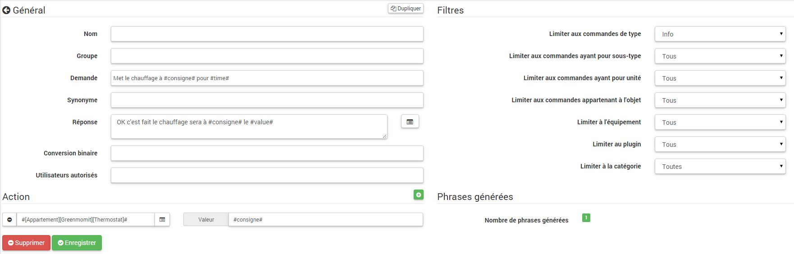

# Interactions
**Herramientas → Interacciones**

El sistema de interacción en Jeedom le permite realizar acciones desde texto o comandos de voz.

Estas órdenes pueden ser obtenidas por :

- SMS : enviar un SMS para iniciar comandos (acción) o hacer una pregunta (información).
- Gato : Telegram, Slack, etc.
- Vocal : dicta una frase con Siri, Google Now, SARAH, etc. Para iniciar comandos (acción) o hacer una pregunta (información).
- Http : lanzar una URL HTTP que contenga el texto (ej. Tasker, Slack) para iniciar comandos (acción) o hacer una pregunta (información).

El valor de las interacciones radica en la integración simplificada en otros sistemas como teléfonos inteligentes, tabletas, otras cajas de automatización del hogar, etc.

> **Punta**
>
> Puede abrir una interacción haciendo :
> - Haga clic en uno de ellos.
> - Ctrl Clic o Clic Center para abrirlo en una nueva pestaña del navegador.

Tiene un motor de búsqueda para filtrar la visualización de interacciones. La tecla Escape cancela la búsqueda.
A la derecha del campo de búsqueda, se encuentran tres botones en varios lugares de Jeedom:
- La cruz para cancelar la búsqueda.
- La carpeta abierta para desplegar todos los paneles y mostrar todas las interacciones.
- La carpeta cerrada para doblar todos los paneles.

Una vez en la configuración de una interacción, tiene un menú contextual con el botón derecho en las pestañas de la interacción. También puede usar Ctrl Click o Click Center para abrir directamente otra interacción en una nueva pestaña del navegador.

## Interactions

En la parte superior de la página, hay 3 botones :

- **Añadir** : Le permite crear nuevas interacciones.
- **Regenerado** : Recréer toutes les interactions (peut être très long &gt; 5mn).
- **Prueba** : Abre un diálogo para escribir y probar una oración.

> **Punta**
>
> Si tiene una interacción que genera las oraciones para las luces, por ejemplo, y agrega un nuevo módulo de control de luz, tendrá que regenerar todas las interacciones o ir a la interacción en cuestión y guardarla nuevamente para crear las oraciones de este nuevo módulo.

## Principe

El principio de la creación es bastante simple : definiremos una oración modelo generadora que permitirá a Jeedom crear una o más cientos de otras oraciones que serán posibles combinaciones del modelo.

Definiremos las respuestas de la misma manera con un modelo (esto le permite a Jeedom tener varias respuestas para una sola pregunta).

También podemos definir un comando para ejecutar si, por ejemplo, la interacción no está vinculada a una acción, sino a información o si deseamos llevar a cabo una acción en particular después (también es posible ejecutar un escenario, controlar varias órdenes).

## Configuration

La página de configuración consta de varias pestañas y botones :

- **Frases** : Muestra el número de oraciones de la interacción (un clic en ellas te muestra).
- **Registro** : Registra la interacción actual.
- **Remove** : Eliminar la interacción actual.
- **Duplicado** : Duplicar la interacción actual.

### Pestaña General

- **Apellido** : Nombre de interacción (puede estar vacío, el nombre reemplaza el texto de solicitud en la lista de interacción).
- **Grupo** : Grupo de interacción, esto permite organizarlos (puede estar vacío, por lo tanto estará en el grupo "ninguno").
- **Bienes** : Permite activar o desactivar la interacción.
- **Solicitud** : La oración modelo generadora (requerida).
- **Sinónimo** : Permite definir sinónimos en los nombres de los comandos.
- **Respuesta** : La respuesta para proporcionar.
- **Espere antes de responder)** : Agregue un retraso de X segundos antes de generar la respuesta. Permite, por ejemplo, esperar el regreso del estado de una lámpara antes de ser respondido.
- **Conversión binaria** : Convierte valores binarios en abiertos / cerrados, por ejemplo (solo para comandos de tipo de información binaria).
- **Usuarios autorizados** : Limita la interacción con ciertos usuarios (inicios de sesión separados por |).

### Pestaña Filtros

- **Límite para escribir comandos** : Le permite usar solo los tipos de acciones, información o los 2 tipos.
- **Limitar a pedidos con subtipo** : Limita la generación a uno o más subtipos.
- **Limitar a pedidos con unidad** : Le permite limitar la generación a una o más unidades (Jeedom crea automáticamente la lista a partir de las unidades definidas en sus pedidos).
- **Limitar a órdenes pertenecientes al objeto** : Limita la generación a uno o más objetos (Jeedom crea automáticamente la lista a partir de los objetos que ha creado).
- **Limitar al complemento** : Le permite limitar la generación a uno o más complementos (Jeedom crea automáticamente la lista a partir de los complementos instalados).
- **Limitar a categoría** : Limita la generación a una o más categorías.
- **Limite al equipo** : Limita la generación a un solo dispositivo / módulo (Jeedom crea automáticamente la lista de los dispositivos / módulos que tiene).

### Pestaña Acciones

Úselo si desea apuntar a uno o más comandos específicos o pasar parámetros específicos.

#### Exemples

> **Nota**
>
> Las capturas de pantalla pueden ser diferentes en vista de los desarrollos.

#### Interacción simple

La forma más sencilla de configurar una interacción es darle un modelo generador rígido, sin variación posible. Este método tendrá como objetivo muy preciso un pedido o un escenario.

En el siguiente ejemplo, podemos ver en el campo &quot;Solicitud&quot; la oración exacta que se debe proporcionar para activar la interacción. Aquí, para encender la luz del techo de la sala.

Podemos ver, en esta captura, la configuración para tener una interacción vinculada a una acción específica. Esta acción se define en la parte &quot;Acción&quot; de la página.

Podemos imaginar hacer lo mismo con varias acciones para encender varias lámparas en la sala de estar como el siguiente ejemplo :

En los 2 ejemplos anteriores, la oración modelo es idéntica pero las acciones que resultan de ella cambian de acuerdo con lo que está configurado en la parte "Acción", por lo tanto, ya con una simple interacción con una sola oración podemos imaginar acciones combinadas entre varios comandos y diversos escenarios (también podemos activar escenarios en la parte de acción de las interacciones).

> **Punta**
>
> Para agregar un escenario, cree una nueva acción, escriba &quot;escenario&quot; sin acento, presione la tecla de tabulación en su teclado para que aparezca el selector de escenario.

#### Interacción de comandos múltiples

Aquí veremos todo el interés y todo el poder de las interacciones, con una oración modelo podremos generar oraciones para un grupo completo de comandos.

Reanudaremos lo que se hizo anteriormente, eliminaremos las acciones que hemos agregado y, en lugar de la oración fija, en &quot;Solicitud&quot;, usaremos las etiquetas **\#commande\#** y **\#equipement\#**. Por lo tanto, Jeedom reemplazará estas etiquetas con el nombre de los comandos y el nombre del equipo (podemos ver la importancia de tener nombres de comando / equipo consistentes).

Entonces podemos ver aquí que Jeedom generó 152 oraciones de nuestro modelo. Sin embargo, no están muy bien construidos y tenemos un poco de todo.

Para ordenar todo esto, usaremos los filtros (parte derecha de nuestra página de configuración). En este ejemplo, queremos generar oraciones para encender las luces. Por lo tanto, podemos desmarcar el tipo de comando de información (si guardo, solo me quedan 95 oraciones), luego, en los subtipos, solo podemos mantener marcado "predeterminado" que corresponde al botón de acción ( así que solo quedan 16 oraciones).

Es mejor, pero podemos hacerlo aún más natural. Si tomo el ejemplo generado "En la entrada", sería bueno poder transformar esta oración en "activar la entrada" o "activar la entrada". Para hacer esto, Jeedom tiene, bajo el campo de solicitud, un campo sinónimo que nos permitirá nombrar el nombre de los comandos de manera diferente en nuestras oraciones &quot;generadas&quot;, aquí está &quot;on&quot;, incluso tengo &quot;on2 &quot;en módulos que pueden controlar 2 salidas.

Por lo tanto, en sinónimos, indicaremos el nombre del comando y los sinónimos para usar :

Podemos ver aquí una sintaxis algo nueva para sinónimos. Un nombre de comando puede tener varios sinónimos, aquí "on" tiene el sinónimo "encender" y "encender"". La sintaxis es por lo tanto "*Nombre de la orden*" ***=*** "*sinónimo 1*"***,*** "*sinónimo 2*" (podemos poner tantos sinónimos como queramos). Luego, para agregar sinónimos para otro nombre de comando, simplemente agregue una barra vertical después del último sinónimo "*|*" después de lo cual puede nombrar nuevamente el comando que tendrá sinónimos en la primera parte, etc.

Ya es mejor, pero aún le falta el comando &quot;en&quot; &quot;entrada&quot; la &quot;l&quot; y para otros la &quot;la&quot; o &quot;le&quot; o &quot;a&quot;, etc. Podríamos cambiar el nombre del equipo para agregarlo, sería una solución, de lo contrario, podemos usar las variaciones en la solicitud. Esto consiste en enumerar una serie de palabras posibles en un lugar de la oración, por lo tanto, Jeedom generará oraciones con estas variaciones.

Ahora tenemos oraciones un poco más correctas con oraciones que no son correctas, para nuestro ejemplo de entrada "on" "". así que encontramos &quot;Activar entrada&quot;, &quot;Activar entrada&quot;, &quot;Activar entrada&quot;, &quot;Activar entrada&quot;, etc. Entonces tenemos todas las variantes posibles con lo que agregamos entre "\ [\]" y esto para cada sinónimo, lo que rápidamente genera muchas oraciones (aquí 168).

Para refinar y no tener cosas improbables como &quot;encender el televisor&quot;, podemos permitir que Jeedom elimine solicitudes sintácticamente incorrectas. Por lo tanto, eliminará lo que está demasiado lejos de la sintaxis real de una oración. En nuestro caso, pasamos de 168 oraciones a 130 oraciones.

Por lo tanto, se vuelve importante construir bien sus oraciones y sinónimos modelo y seleccionar los filtros correctos para no generar demasiadas oraciones innecesarias. Personalmente, me parece interesante tener algunas inconsistencias del estilo &quot;una entrada&quot; porque si está en casa, tiene una persona extranjera que no habla francés correctamente, las interacciones seguirán funcionando.

### Personalizar respuestas

Hasta ahora, como respuesta a una interacción, teníamos una oración simple que no decía mucho, excepto que algo sucedió. La idea sería que Jeedom nos diga qué hizo con un poco más de precisión. Aquí es donde entra el campo de respuesta, donde podremos personalizar el retorno de acuerdo con el comando ejecutado.

Para hacer esto, nuevamente usaremos la etiqueta Jeedom. Para nuestras luces, podemos usar una frase del estilo : Encendí#equipement\# (ver captura de pantalla a continuación).

También puede agregar cualquier valor desde otro comando, como temperatura, número de personas, etc.

### Conversión binaria

Las conversiones binarias se aplican a los comandos de tipo de información cuyo subtipo es binario (solo devuelve 0 o 1). Por lo tanto, debe activar los filtros correctos, como podemos ver en la captura de pantalla un poco más abajo (para las categorías, podemos verificarlos todos, por ejemplo, solo mantuve la luz).

Como podemos ver aquí, he mantenido casi la misma estructura para la solicitud (es voluntario enfocarse en los detalles). Por supuesto, adapté los sinónimos para tener algo coherente. Sin embargo, para la respuesta, es **imperativo** para poner solo#valeur\# que representa el 0 o 1 que Jeedom reemplazará con la siguiente conversión binaria.

El campo **Conversión binaria** debe contener 2 respuestas : primero la respuesta si el valor del comando vale 0, luego una barra vertical "|" separación y finalmente la respuesta si el comando vale 1. Aquí las respuestas son simplemente no y sí, pero podríamos poner una oración un poco más larga.

> **Advertencia**
>
> Las etiquetas no funcionan en conversiones binarias.

### Usuarios autorizados

El campo "Usuarios autorizados" permite autorizar solo a ciertas personas para que ejecuten el comando, puede poner varios perfiles separándolos por "|".

Ejemplo : personne1|personne2

Podemos imaginar que una alarma puede ser activada o desactivada por un niño o un vecino que vendría a regar las plantas en su ausencia.

### Exclusión de expresiones regulares

Es posible crear [Regexp](https://fr.wikipedia.org/wiki/Expression_rationnelle) exclusión, si una oración generada coincide con esta expresión regular, se eliminará. El interés es poder eliminar los falsos positivos, es decir, una oración generada por Jeedom que activa algo que no corresponde a lo que queremos o que interferiría con otra interacción que tendría una oración similar.

Tenemos 2 lugares para aplicar un Regexp :
- En la interacción incluso en el campo "Exclusión de expresiones regulares"".
- En el campo Administración → Configuración → Interacciones → campo "Regexp de exclusión general para interacciones"".

Para el campo &quot;Regex de exclusión general para interacciones&quot;, esta regla se aplicará a todas las interacciones, que se crearán o guardarán nuevamente más tarde. Si queremos aplicarlo a todas las interacciones existentes, debemos regenerar las interacciones. Generalmente, se usa para borrar oraciones formadas incorrectamente que se encuentran en la mayoría de las interacciones generadas.

Para el campo &quot;Exclusión de Regexp&quot; en la página de configuración de cada interacción, puede poner un Regexp específico que actuará solo en dicha interacción. Por lo tanto, le permite eliminar con mayor precisión para una interacción. También puede permitir eliminar una interacción para un pedido específico para el que no se quiere ofrecer esta posibilidad en el marco de una generación de múltiples pedidos.

La siguiente captura de pantalla muestra la interacción sin Regexp. En la lista de la izquierda, filtro las oraciones para mostrar solo las oraciones que se eliminarán. En realidad hay 76 oraciones generadas con la configuración de la interacción.

Como puede ver en la siguiente captura de pantalla, agregué una expresión regular simple que buscará la palabra &quot;Julie&quot; en las oraciones generadas y las eliminará. Sin embargo, podemos ver en la lista de la izquierda que siempre hay oraciones con la palabra &quot;julie&quot;, en expresiones regulares, Julie no es igual a julie, esto se llama mayúsculas o minúsculas Francés una letra mayúscula es diferente de una minúscula. Como podemos ver en la siguiente captura de pantalla, solo quedan 71 oraciones, las 5 con una &quot;Julie&quot; se han eliminado.

Una expresión regular se compone de la siguiente manera :

- Primero, un delimitador, aquí hay una barra &quot;/&quot; colocada al principio y al final de la expresión.
- El punto después de la barra representa cualquier carácter, espacio o número.
- El &quot;\*&quot; indica que puede haber 0 o más veces el carácter que lo precede, aquí un punto, así que en buen francés cualquier elemento.
- Luego Julie, que es la palabra a buscar (palabra u otro patrón de expresión), seguido de un punto nuevamente y una barra inclinada.

Si traducimos esta expresión en una oración, daría "busque la palabra Julie que está precedida por cualquier cosa y seguida por cualquier cosa".

Es una versión extremadamente simple de expresiones regulares, pero ya es muy complicada de entender. Me tomó un tiempo entender cómo funciona. Como un ejemplo un poco más complejo, una expresión regular para verificar una URL :

/\^(https?:\\ / \\ /)?(\ [\\ da-z \\ .- \] +) \\. (\ [az \\. \] {2,6}) (\ [\\ / \\ w \\ .- \] \*)\*\\ /?\ $ /

Una vez que puedes escribir esto, entiendes las expresiones regulares.

Para resolver el problema de mayúsculas y minúsculas, podemos agregar a nuestra expresión una opción que no distinga entre mayúsculas y minúsculas, o en otras palabras, que considere una letra minúscula igual a una letra mayúscula; para hacer esto, simplemente tenemos que agregar al final de nuestra expresión un "i".

Con la adición de la opción &quot;i&quot; vemos que solo quedan 55 oraciones y en la lista de la izquierda con el filtro julie para encontrar las oraciones que contienen esta palabra, vemos que hay algunas mucho más.

Como este es un tema extremadamente complejo, no voy a entrar en más detalles aquí, hay suficientes tutoriales en la red para ayudarte, y no olvides que Google también es tu amigo porque sí, es mi amigo, fue él quien me enseñó a entender Regexp e incluso a codificar. Entonces, si él me ayudó, también puede ayudarte si pones buena voluntad.

Enlaces útiles :

- <http://www.commentcamarche.net/contents/585-javascript-l-objet-regexp>
- <https://www.lucaswillems.com/fr/articles/25/tutoriel-pour-maitriser-les-expressions-regulieres>
- <https://openclassrooms.com/courses/concevez-votre-site-web-avec-php-et-mysql/les-expressions-regulieres-partie-1-2>

### Respuesta compuesta de varias piezas de información

También es posible poner varios comandos de información en una respuesta, por ejemplo, para tener un resumen de la situación.

En este ejemplo, vemos una oración simple que devolverá una respuesta con 3 temperaturas diferentes, por lo que aquí podemos poner un poco lo que queramos para tener un conjunto de información a la vez.

### ¿Hay alguien en la sala? ?

#### Versión básica

- Entonces la pregunta es "¿hay alguien en la sala?"
- La respuesta será "no, no hay nadie en la habitación" o "sí, hay alguien en la habitación""
- El comando que responde a eso es "\#\[Chambre de julie\]\[FGMS-001-2\]\[Présence\]\#"

Este ejemplo se dirige específicamente a equipos específicos que permiten una respuesta personalizada. Entonces podríamos imaginar reemplazar la respuesta del ejemplo con "no, no hay nadie en la sala *Julie*|si hay alguien en la sala *Julie*"

#### Evolution

- Entonces la pregunta es "\#commande\# \[en la |en el\] \#objet\#"
- La respuesta será "no, no hay nadie en la habitación" o "sí, hay alguien en la habitación""
- No hay ningún comando que responda a eso en la parte Acción, ya que es una interacción de múltiples comandos
- Al agregar una expresión regular, podemos limpiar los comandos que no queremos ver para que solo tengamos las oraciones en los comandos de "Presencia"".

Sin Regexp, obtenemos aquí 11 oraciones, pero mi interacción tiene como objetivo generar oraciones solo para preguntar si hay alguien en una habitación, por lo que no necesito el estado de la lámpara u otros puntos de venta, que se pueden resolver con el filtrado regexp. Para hacerlo aún más flexible, puede agregar sinónimos, pero en este caso no debe olvidar modificar la expresión regular.

### Conoce la temperatura / humedad / brillo

#### Versión básica

Podríamos escribir la oración con fuerza como, por ejemplo, &quot;cuál es la temperatura de la sala de estar&quot;, pero sería necesario hacer una para cada sensor de temperatura, brillo y humedad. Con el sistema de generación de oraciones Jeedom, podemos generar oraciones para todos los sensores de estos 3 tipos de medición con una sola interacción.

Aquí un ejemplo genérico que se utiliza para conocer la temperatura, la humedad, el brillo de las diferentes habitaciones (objeto en el sentido Jeedom).

- Entonces podemos ver que una oración genérica como &quot;¿Cuál es la temperatura en la sala de estar&quot; o &quot;¿Cuál es el brillo de la habitación?&quot; Se puede convertir en : "Cuál es la |l \\ '\] \#commande\# objeto "(el uso de \ [word1 | word2 \] le permite decir esta posibilidad o aquella para generar todas las variantes posibles de la oración con word1 o word2). Al generar Jeedom generará todas las combinaciones posibles de oraciones con todos los comandos existentes (dependiendo de los filtros) reemplazando \#commande\# por el nombre del comando y \#objet\# por el nombre del objeto.
- La respuesta será "21 ° C" o "200 lux". Solo pon : \#valeur\# \#unite\# (la unidad se completará en la configuración de cada comando para el que queremos tener uno)
- Por lo tanto, este ejemplo genera una oración para todos los comandos de tipo de información digital que tienen una unidad, por lo que podemos desmarcar las unidades en el filtro derecho limitado al tipo que nos interesa.

#### Evolution

Por lo tanto, podemos agregar sinónimos al nombre del comando para tener algo más natural, agregar una expresión regular para filtrar los comandos que no tienen nada que ver con nuestra interacción.

Agregando un sinónimo, digamos a Jeedom que un comando llamado &quot;X&quot; también se puede llamar &quot;Y&quot; y, por lo tanto, en nuestra oración si tenemos &quot;activar y&quot;, Jeedom sabe que está activado x. Este método es muy conveniente para renombrar nombres de comandos que, cuando se muestran en la pantalla, se escriben de forma poco natural, vocalmente o en una oración escrita como "ON"". Un botón escrito así es completamente lógico pero no en el contexto de una oración.

También podemos agregar un filtro Regexp para eliminar algunos comandos. Usando el ejemplo simple, vemos oraciones &quot;batería&quot; o &quot;latencia&quot;, que no tienen nada que ver con nuestra interacción temperatura / humedad / luz.

Entonces podemos ver una expresión regular :

**(batterie|latence|pression|vitesse|consommation)**

Esto le permite eliminar todos los comandos que tienen una de estas palabras en su oración

> **Nota**
>
> La expresión regular aquí es una versión simplificada para un uso fácil. Por lo tanto, podemos usar expresiones tradicionales o expresiones simplificadas como en este ejemplo.

### Controle un atenuador o un termostato (control deslizante)

#### Versión básica

Es posible controlar una lámpara como un porcentaje (dimmer) o un termostato con las interacciones. Aquí hay un ejemplo para controlar su atenuador en una lámpara con interacciones :

Como podemos ver, aquí está en la solicitud la etiqueta **\#consigne\#** (puede poner lo que quiera) que se incluye en el control de la unidad para aplicar el valor deseado. Para hacer esto, tenemos 3 partes : \* Solicitud : en el que creamos una etiqueta que representará el valor que se enviará a la interacción. \* Respuesta : reutilizamos la etiqueta para la respuesta para asegurarnos de que Jeedom entendió correctamente la solicitud. \* Acción : ponemos una acción sobre la lámpara que queremos conducir y en el valor le pasamos nuestra etiqueta *Consigna*.

> **Nota**
>
> Podemos usar cualquier etiqueta, excepto las que ya usa Jeedom, puede haber varias para controlar, por ejemplo, varios comandos. Tenga en cuenta también que todas las etiquetas se pasan a los escenarios iniciados por la interacción (sin embargo, es necesario que el escenario esté en "Ejecutar en primer plano"").

#### Evolution

Es posible que queramos controlar todos los comandos de tipo cursor con una sola interacción. Con el siguiente ejemplo, podremos controlar varias unidades con una sola interacción y, por lo tanto, generar un conjunto de oraciones para controlarlas.

En esta interacción, no tenemos comando en la parte de acción, dejamos que Jeedom genere a partir de etiquetas la lista de oraciones. Podemos ver la etiqueta **\#slider\#**. Es imprescindible utilizar esta etiqueta para obtener instrucciones en un comando de interacción múltiple, puede que no sea la última palabra de la oración. También podemos ver en el ejemplo que podemos usar en la respuesta una etiqueta que no es parte de la solicitud. La mayoría de las etiquetas disponibles en los escenarios también están disponibles en las interacciones y, por lo tanto, se pueden usar en una respuesta.

Resultado de la interacción :

Podemos ver que la etiqueta **\#equipement\#** que no se utiliza en la solicitud se completa bien en la respuesta.

### Controla el color de una tira de LED

Es posible controlar un comando de color mediante las interacciones pidiéndole a Jeedom, por ejemplo, que encienda una tira de LED azul. Esta es la interacción para hacer :

Hasta ahora, nada complicado, sin embargo, debe haber configurado los colores en Jeedom para que funcione; vaya al menú → Configuración (arriba a la derecha) luego en la sección "Configuración de interacciones"" :

Como podemos ver en la captura de pantalla, no hay un color configurado, por lo que debe agregar colores con el &quot;+&quot; a la derecha. El nombre del color, es el nombre que pasará a la interacción, luego en la parte derecha (columna &quot;código HTML&quot;), al hacer clic en el color negro podemos elegir un nuevo color.

Podemos agregar tantos como queramos, podemos poner cualquier nombre como sea, para que podamos imaginar asignar un color al nombre de cada miembro de la familia.

Una vez configurado, dices &quot;Enciende el árbol en verde&quot;, Jeedom buscará en la solicitud un color y lo aplicará al pedido.
### Uso junto con un escenario

#### Versión básica

Es posible acoplar una interacción a un escenario para realizar acciones ligeramente más complejas que la ejecución de una acción simple o una solicitud de información.

Por lo tanto, este ejemplo permite lanzar el escenario que está vinculado en la parte de acción, por supuesto, podemos tener varios.

### Programando una acción con interacciones

Las interacciones hacen muchas cosas en particular. Puedes programar una acción dinámicamente. Ejemplo : "Enciende el calor a las 22 para las 2:50 p.m". Nada podría ser más simple, solo usa las etiquetas \#time\# (si se define un tiempo específico) o \#duration\# (para en X tiempo, ejemplo en 1 hora) :

> **Nota**
>
> Notará en la respuesta la etiqueta \#value\# esto contiene, en el caso de una interacción programada, el tiempo efectivo de programación
