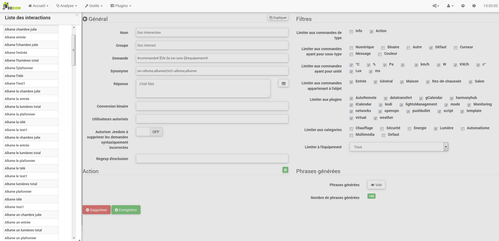
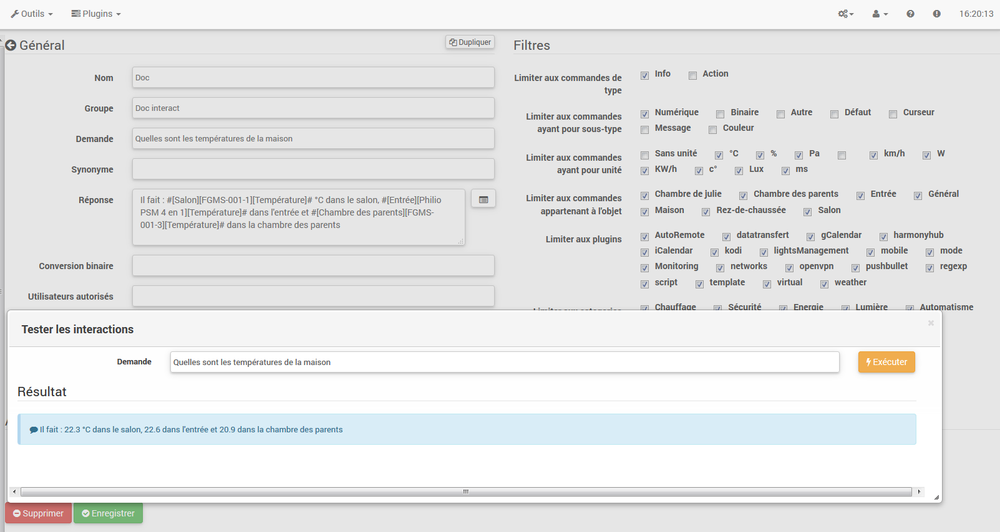
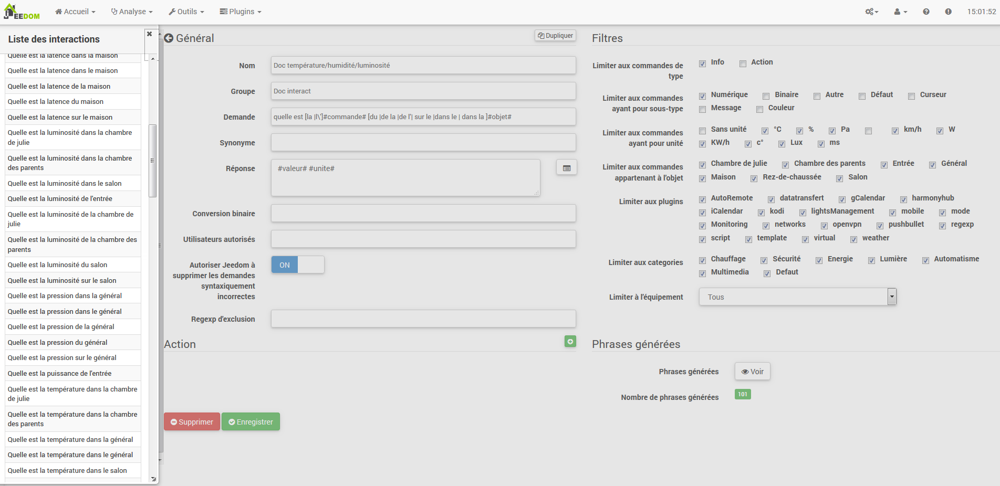

El sistema de interacción en Jeedom permite acciones
desde los comandos de voz o texto.

Estos comandos se pueden obtener por:

-   SMS: enviar un SMS para ejecutar comandos (acción) o pedir una
    tema (información).

-   Chat: Telegrama, Slack, etc.

-   Vocal: dictar una sentencia con Siri, Google Now, Sarah, etc. Para
    los comandos de marcha (acción) o hacer una pregunta (información).

-   HTTP: lanzar una URL HTTP que contiene el texto (por ejemplo, Tasker, Slack).
    para ejecutar comandos (acción) o hacer una pregunta (información).

El interés de la interacción reside en la integración simplificada en
otros sistemas, tales como teléfonos inteligentes, tabletas, otro cuadro de automatización del hogar, etc.

Pour accéder à la page d’interaction, il faut aller sur Outils →
Interactions :

En la parte superior, hay 3 botones:

-   ** ** Añadir a la creación de nuevas interacciones.

-   Regenerar ** **: que se vuelva a crear todas las interacciones (puede ser
    5mn a largo &gt;).

-   **Tester** : qui permet d’ouvrir une boîte de dialogue pour écrire et
    probar una frase.

> **Tip**
>
> Si vous avez une interaction qui génère les phrases pour les lumières
> par exemple et que vous ajoutez un nouveau module de commande de
> lumière, il vous faudra soit regénérer toutes les interactions, soit
> aller dans l’interaction en question et la sauvegarder de nouveau pour
> créer les phrases de ce nouveau module.

principio
========

Le principe de création est assez simple : on va définir une phrase
modèle génératrice qui va permettre à Jeedom de créer une ou plusieurs
centaines d’autres phrases qui seront des combinaisons possibles du
modèle.

Definiremos la misma manera que las respuestas con un modelo (que permite
Jeedom tener varias respuestas a una sola pregunta).

También podemos definir un comando para ejecutar si tal
la interacción no está relacionado con una acción o información pero si
quiere llevar a cabo una acción en particular después de él (que es también
posible ejecutar una secuencia de comandos para controlar múltiples órdenes ...).

configuración
=============

La página de configuración consta de varias pestañas y
botones:

-   ** ** frases: Muestra el número de sentencias de la interacción (un clic
    se muestra)

-   ** ** Guardar: guarda la interacción actual

-   ** ** Eliminar: Eliminar la interacción actual

-   **Dupliquer** : duplique l’interaction courante

general
=======

-   ** ** Nombre: nombre de la interacción (puede estar vacío, el nombre reemplaza
    texto de la aplicación en la lista de interacciones).

-   ** ** Grupo: la interacción del grupo, que ayuda a organizar
    (Puede estar vacío, estará en el grupo "no").

-   **activo**: Habilitar o deshabilitar la interacción.

-   ** ** Solicitud generador de frases (obligatorio).

-   **Synonyme** : permet de définir des synonymes sur les noms
    los comandos.

-   **Respuesta** : la respuesta a proporcionar.

-   **Attendre avant de répondre (s)** : permet d'ajouter un délai de X secondes avant de générer la réponse. Ca permet par exemple d'attendre que le retour d'état d'une lampe se fasse avant de répondre.

-   **Conversion binaire** : permet de convertir les valeurs binaires en
    ouvert/fermé par exemple (uniquement pour les commandes de type
    información binaria).

-   **Utilisateurs autorisés** : limite l’interaction à certains
    usuarios (los logins separados por los |).

Filtros 
=======

-   **Limiter aux commandes de type** : permet de n’utiliser que les
    types actions, infos ou les 2 types.

-   **Limiter aux commandes ayant pour sous-type** : permet de limiter
    la generación a uno o más subtipos.

-   **Limiter aux commandes ayant pour unité** : permet de limiter la
    génération à une ou plusieurs unités (Jeedom crée la liste
    automatiquement à partir des unités définies dans vos commandes).

-   **Limiter aux commandes appartenant à l’objet** : permet de limiter
    la génération à un ou plusieurs objets (Jeedom crée la liste
    automatiquement à partir des objets que vous avez créés).

-   **Limiter au plugin** : permet de limiter la génération à un ou
    plusieurs plugins (Jeedom crée la liste automatiquement à partir des
    plugins instalados).

-   **Limiter à la catégorie** : permet de limiter la génération à une
    o varias categorías.

-   **Limiter à l’équipement** : permet de limiter la génération à un
    seul équipement/module (Jeedom crée la liste automatiquement à
    partir des équipements/modules que vous avez).

Acción
======

A utiliser si vous voulez cibler une ou plusieurs commandes spécifiques
ou passer des paramètres particuliers.

Exemples 
========

> **Note**
>
> Les captures d’écran peuvent être différentes au vue des évolutions.

Interacción simple
------------------

La façon la plus simple de configurer une interaction, c’est de lui
donner un modèle générateur rigide, sans variation possible. Cette
méthode ciblera très précisément une commande ou un scénario.

Dans l’exemple qui suit, on peut voir dans le champ "Demande" la phrase
exacte à fournir pour déclencher l’interaction. Ici, pour allumer le
plafonnier du salon.

On peut voir, sur cette capture, la configuration pour avoir une
interaction liée à une action spécifique. Cette action est définie dans
la partie "Action" de la page.

On peut très bien imaginer faire de même avec plusieurs actions pour
allumer plusieurs lampes dans le salon comme l’exemple qui suit :

Dans les 2 exemples ci-dessus, la phrase modèle est identique mais les
actions qui en découlent changent en fonction de ce qui est configuré
dans la partie "Action", on peut donc déjà avec une interaction simple à
phrase unique imaginer des actions combinées entre diverses commandes et
divers scénarios (on peut aussi déclencher des scénarios dans la partie
action des interactions).

> **Tip**
>
> Pour ajouter un scénario, créer une nouvelle action, écrire "scenario"
> sans accent, appuyer sur la touche tabulation de votre clavier pour
> faire apparaitre le sélecteur de scénario.

Interaction multiple commandes 
------------------------------

Nous allons ici voir tout l’intérêt et toute la puissance des
interactions, avec une phrase modèle nous allons pouvoir générer des
phrases pour tout un groupe de commandes.

On va reprendre ce qui a été fait plus haut, supprimer les actions que
l’on avait ajoutées, et à la place de la phrase fixe, dans "Demande",
nous allons utiliser les tags **\#commande\#**et**\#equipement\#**.
Jeedom va donc remplacer ces tags par le nom des commandes et le nom de
l’équipement (on peut voir l’importance d’avoir des noms de
commande/équipement cohérents).

On peut donc constater ici que Jeedom a généré 152 phrases à partir de
notre modèle. Toutefois, elles ne sont pas très bien construites et l’on
a un peu de tout.

Pour faire de l’ordre dans tout cela, on va utiliser les filtres (partie
droite de notre page de configuration). Dans cet exemple, on veut
générer des phrases pour allumer des lumières. On peut donc décocher le
type de commande info (si je sauve, il ne me reste plus que 95 phrases
générées), puis, dans les sous-types, on peut ne garder coché que
"défaut" qui correspond au bouton d’action (ne reste donc plus que 16
phrases).

C’est mieux, mais on peut faire encore plus naturel. Si je prends
l’exemple généré "On entrée", il serait bien de pouvoir transformer
cette phrase en "allume l’entrée" ou en "allumer l’entrée". Pour faire
cela, Jeedom dispose, sous le champ demande, d’un champ synonyme qui va
nous permettre de nommer différemment le nom des commandes dans nos
phrases "générées", ici c’est "on", j’ai même des "on2" dans les modules
qui peuvent contrôler 2 sorties.

Dans les synonymes, on va donc indiquer le nom de la commande et le(s)
synonyme(s) à utiliser :

On peut voir ici une syntaxe un peu nouvelle pour les synonymes. Un nom
de commande peut avoir plusieurs synonymes, ici "on" a comme synonyme
"allume" et "allumer". La syntaxe est donc "*nom de la commande*"
***=*** "*synonyme 1*"***,*** "*synonyme 2*" (on peut mettre autant de
synonyme que l’on veut). Puis, pour ajouter des synonymes pour un autre
nom de commande, il suffit d’ajouter après le dernier synonyme une barre
verticale "*|*" à la suite de laquel vous pouvez à nouveau nommer la
commande qui va avoir des synonymes comme pour la première partie, etc.

C’est déjà mieux, mais il manque encore pour la commande "on" "entrée"
le "l' " et pour d’autres le "la" ou "le" ou "un", etc. On pourrait
modifier le nom de l’équipement pour l’ajouter, ce serait une solution,
sinon on peut utiliser les variations dans la demande. Cela consiste à
lister une série de mots possibles à un emplacement de la phrase, Jeedom
va donc générer des phrases avec ces variations.

On a maintenant des phrases un peu plus correctes avec des phrases qui
ne sont pas justes, pour notre exemple "on" "entrée". on trouve donc
"Allume entrée", "Allume un entrée", "Allume une entrée", "Allume
l’entrée" etc. On a donc toutes les variantes possibles avec ce que l’on
a ajouté entre les "\[ \]" et ceci pour chaque synonyme, ce qui génère
rapidement beaucoup de phrases (ici 168).

Afin d’affiner et de ne pas avoir des choses improbables telles que
"allume l’télé", on peut autoriser Jeedom à supprimer les demandes
syntaxiquement incorrectes. Il va donc supprimer ce qui est trop éloigné
de la syntaxe réelle d’une phrase. Dans notre cas, on passe de 168
phrases à 130 phrases.

Il devient donc important de bien construire ses phrases modèles et
synonymes ainsi que de sélectionner les bons filtres pour ne pas générer
trop de phrases inutiles. Personnellement, je trouve intéressant d’avoir
quelques incohérences du style "un entrée" car si chez vous, vous avez
une personne étrangère qui ne parle pas correctement le français, les
interactions fonctionneront tout de même.

Personnaliser les réponses 
--------------------------

Jusqu’à présent, comme réponse à une interaction, nous avions une simple
phrase qui n’indiquait pas grand chose à part que quelque chose s’est
passé. L’idée serait que Jeedom nous indique ce qu’il a fait un peu plus
précisément. C’est là qu’intervient le champ réponse dans lequel on va
pouvoir personnaliser le retour en fonction de la commande exécutée.

Pour ce faire, nous allons à nouveau utiliser les Tag Jeedom. Pour nos
lumières, on peut utiliser une phrase du style : J’ai bien allumé
\#equipement\# (voir capture ci-dessous).

On peut aussi ajouter n’importe quelle valeur d’une autre commande comme
une température, un nombre de personnes, etc.

Conversión binaria
------------------

Les conversions binaires s’appliquent aux commandes de type info dont le
sous-type est binaire (retourne 0 ou 1 uniquement). Il faut donc activer
les bons filtres, comme on peut le voir sur la capture un peu plus bas
(pour les catégories, on peut toutes les cocher, pour l’exemple je n’ai
gardé que lumière).

Comme on peut le voir ici, j’ai conservé quasiment la même structure
pour la demande (c’est volontaire pour se concentrer sur les
spécificités). Bien sûr, j’ai adapté les synonymes pour avoir quelque
chose de cohérent. Par contre, pour la réponse, il est **impératif** de
mettre uniquement \#valeur\# qui représente le 0 ou 1 que Jeedom va
remplacer par la conversion binaire qui suit.

Le champ **conversion binaire** doit contenir 2 réponses : en premier la
réponse si la valeur de la commande vaut 0, puis une barre verticale "|"
de séparation et enfin la réponse si la commande vaut 1. Ici les
réponses sont simplement non et oui mais on pourrait y mettre une phrase
un peu plus longue.

> **Warning**
>
> Les tags ne fonctionnent pas dans les conversions binaires.

Usuarios autorizados
----------------------

Le champ "Utilisateurs autorisés" permet de n’autoriser que certaines
personnes à exécuter la commande, vous pouvez mettre plusieurs profils
en les séparant par un "|".

Ejemplo: persona1|persona2

On peut imaginer qu’une alarme peut être activée ou désactivée par un
enfant ou un voisin qui viendrait arroser les plantes en votre absence.

Regexp d’exclusion 
------------------

Il est possible de créer des
[Regexp](https://fr.wikipedia.org/wiki/Expression_rationnelle)
d’exclusion, si une phrase générée correspond à cette Regexp elle sera
supprimée. L’intérêt c’est de pouvoir supprimer des faux positifs, c’est
à dire une phrase générée par Jeedom qui active quelque chose qui ne
correspond pas à ce que l’on veut ou qui viendrait parasiter une autre
interaction qui aurait une phrase similaire.

On a 2 endroits pour appliquer une Regexp :

-   dans l’interaction même dans le champ "Regexp d’exclusion".

-   Dans le menu Administration→Configuration→Interactions→champ "Regexp
    general de exclusión para las interacciones".

Pour le champ "Regex général d’exclusion pour les interactions", cette
règle sera appliquée à toutes les interactions, qui seront créées ou
sauvegardées de nouveau par la suite. Si on veut l’appliquer à toutes
les interactions existantes, il faut régénérer les interactions.
Généralement, on l’utilise pour effacer des phrases incorrectement
formées se retrouvant dans la plupart des interactions générées.

Pour le champ "Regexp d’exclusion" dans la page de configuration de
chaque interaction, on peut mettre une Regexp spécifique qui va agir
uniquement sur ladite interaction. Elle vous permet donc de supprimer
plus précisément pour une interaction. Cela peut aussi permettre
d’effacer une interaction pour une commande spécifique pour laquelle on
ne veut pas offrir cette possibilité dans le cadre d’une génération de
multiples commandes.

La capture d’écran qui suit montre l’interaction sans le Regexp. Dans la
liste de gauche, je filtre les phrases pour ne vous montrer que les
phrases qui vont être supprimées. En réalité il y a 76 phrases générées
avec la configuration de l’interaction.

Comme vous pouvez le voir sur la capture suivante, j’ai ajouté une
regexp simple qui va chercher le mot "Julie" dans les phrases générées
et les supprimer. Toutefois, on peut voir dans la liste de gauche qu’il y
a toujours des phrases avec le mot "julie", dans les expressions
régulières, Julie n’est pas égale à julie, on appelle cela une
sensibilité à la casse ou en bon français une majuscule est différente
d’une minuscule. Comme on peut le voir dans la capture suivante, il ne
reste plus que 71 phrases, les 5 avec un "Julie" ont été supprimées.

Une expression régulière se compose comme suit :

-   En premier, un délimiteur, ici c’est une barre oblique "/" placée en
    principio y fin de la expresión.

-   Le point qui suit la barre oblique représente n’importe quel
    carácter, espacio o número.

-   Le "\*" quant à lui indique qu’il peut y avoir 0 ou plusieurs fois
    le caractère qui le précède, ici un point, donc en bon français
    cualquier elemento.

-   Puis Julie, qui est le mot à rechercher (mot ou autre schéma
    d’expression), suivi à nouveau d’un point puis barre oblique.

Si on traduit cette expression en une phrase, cela donnerait "cherche le
mot Julie qui est précédé par n’importe quoi et suivi de n’importe
quoi".

C’est une version extrêmement simple des expressions régulières mais
déjà très compliquée à comprendre. Il m’a fallu un moment pour en saisir
le fonctionnement. Comme exemple un peu plus complexe, une regexp pour
vérifier une adresse URL :

/\^(https?:\\/\\/)?(\[\\da-z\\.-\]+)\\.(\[a-z\\.\]{2,6})(\[\\/\\w
\\.-\]\*)\*\\/?\$/

Une fois que vous pouvez écrire cela, vous avez compris les expressions
régulières.

Pour résoudre le problème de majuscule et minuscule, on peut ajouter à
notre expression une option qui va la rendre insensible à la casse, ou
autrement dit, qui considère une lettre minuscule égale à une majuscule;
pour ce faire, on doit simplement ajouter à la fin de notre expression un
"i".

Avec l’ajout de l’option "i" on constate qu’il ne reste plus que 55
phrases générées et dans la liste de gauche avec le filtre julie pour
rechercher les phrases qui contiennent ce mot, on constate qu’il y en a
bien plus.

Comme c’est un sujet extrêmement complexe, je ne vais pas aller plus en
détail ici, il y a suffisamment de tutos sur le net pour vous aider, et
n’oubliez pas que Google est votre ami aussi car oui, c’est mon ami,
c’est lui qui m’a appris à comprendre les Regexp et même à coder. Donc
s’il m’a aidé, il peut aussi vous aider si vous y mettez de la bonne
volonté.

Enlaces útiles :

-   <http://www.commentcamarche.net/contents/585-javascript-l-objet-regexp>

-   <https://www.lucaswillems.com/fr/articles/25/tutoriel-pour-maitriser-les-expressions-regulieres>

-   <https://openclassrooms.com/courses/concevez-votre-site-web-avec-php-et-mysql/les-expressions-regulieres-partie-1-2>

Réponse composée de plusieurs informations 
------------------------------------------

Il est aussi possible de mettre plusieurs commandes info dans une
réponse, par exemple pour avoir un résumé de situation.

Dans cet exemple on voit une phrase simple qui va nous retourner une
réponse avec 3 températures différentes, on peut donc ici mettre un peu
tout ce que l’on veut afin d’avoir un ensemble d’informations en une
seule fois.

Y a-t-il quelqu’un dans la chambre ? 
------------------------------------

### Version basica

-   La question est donc "y’a-t-il quelqu’un dans la chambre"

-   La réponse sera "non il n’y a personne dans la chambre" ou "oui il y
    a quelqu’un dans la chambre"

-   La commande qui répond à ça est "\#\[Chambre de
    julie\]\[FGMS-001-2\]\[Présence\]\#"

Cette exemple cible précisément un équipement spécifique ce qui permet
d’avoir une réponse personnalisée. On pourrait donc imaginer remplacer
la réponse de l’exemple par "non il n’y a personne dans la chambre de
*julie*|oui il y a quelqu’un dans la chambre de *julie*"

### Evolución

-   La question est donc "\#commande\# \[dans la |dans le\] \#objet\#"

-   La respuesta será "no, no hay nadie en la habitación" o "sí, hay
    alguien en la habitación"

-   Il n’y a pas de commande qui réponde à ça dans la partie Action vu
    que es una interacción Múltiple comandos

-   En ajoutant une expression régulière, on peut nettoyer les commandes
    que l’on ne veut pas voir pour n’avoir que les phrases sur les
    Comandos "Presencia".

Sans le Regexp, on obtient ici 11 phrases, or mon interaction a pour but
de générer des phrases uniquement pour demander s’il y a quelqu’un dans
une pièce, donc je n’ai pas besoin d’état de lampe ou autre comme les
prises, ce qui peut être résolu avec le filtrage regexp. Pour rendre
encore plus flexible, on peut ajouter des synonymes, mais dans ce cas il
ne faudra pas oublier de modifier la regexp.

Connaître la température/humidité/luminosité 
--------------------------------------------

### Version basica

On pourrait écrire la phrase en dur comme par exemple "quelle est la
température du salon", mais il faudrait en faire une pour chaque capteur
de température, luminosité et humidité. Avec le système de génération de
phrase Jeedom, on peut donc avec une seule interaction générer les
phrases pour tous les capteurs de ces 3 types de mesure.

Ici un exemple générique qui sert à connaître la température,
l’humidité, la luminosité des différentes pièces (objet au sens Jeedom).

-   On peut donc voir qu’une phrase générique type "Quelle est la
    température du salon" ou "Quelle est la luminosité de la chambre"
    peut être convertie en : "quelle est \[la |l\\'\]\#commande\# objet"
    (l’utilisation de \[mot1 | mot2\] permet de dire cette possibilité
    ou celle-là pour générer toutes les variantes possibles de la phrase
    avec mot1 ou mot2). Lors de la génération Jeedom va générer toutes
    les combinaisons possibles de phrases avec toutes les commandes
    existantes (en fonction des filtres) en remplaçant \#commande\# par
    le nom de la commande et \#objet\# par le nom de l’objet.

-   La respuesta será de tipo "21 °C" o "200 lux". Sólo tienes que poner :
    \#valeur\# \#unite\# (l’unité est à compléter dans la configuration
    de chaque commande pour laquelle on veut en avoir une)

-   Cette exemple génère donc une phrase pour toutes les commandes de
    type info numérique qui ont une unité, on peut donc décocher des
    unités dans le filtre de droite limité au type qui nous intéresse.

### Evolution 

On peut donc ajouter des synonymes au nom de commande pour avoir quelque
chose de plus naturel, ajouter un regexp pour filtrer les commandes qui
n’ont rien à voir avec notre interaction.

Ajout de synonyme, permet de dire à Jeedom qu’une commande s’appellant
"X" peut aussi s’appeler "Y" et donc dans notre phrase si on a "allume
y", Jeedom sait que c’est allumer x. Cette méthode est très pratique
pour renommer des noms de commande qui, quand elles sont affichées à
l’écran, sont écrites d’une façon qui n’est pas naturelle vocalement ou
dans une phrase écrite comme les "ON". Un bouton écrit comme cela est
totalement logique mais pas dans le contexte d’une phrase.

On peut aussi ajouter un filtre Regexp pour enlever quelques commandes.
En reprenant l’exemple simple, on voit des phrases "batterie" ou encore
"latence", qui n’ont rien à voir avec notre interaction
température/humidité/luminosité.

On peut donc voir un regexp :

**(batterie|latence|pression|vitesse|consommation)**

Celui-ci permet de supprimer toutes les commandes qui ont l’un de ces
mots dans leur phrase

> **Note**
>
> Le regexp ici est une version simplifiée pour une utilisation simple.
> On peut donc soit utiliser les expressions traditionnelles, soit
> utiliser les expressions simplifiées comme dans cet exemple.

Piloter un dimmer ou un thermostat (slider) 
-------------------------------------------

### Version basica

Il est possible de piloter une lampe en pourcentage (variateur) ou un
thermostat avec les interactions. Voici un exemple pour piloter son
variateur sur une lampe avec des interactions :

Comme on le voit, il y a ici dans la demande le tag **\#consigne\#** (on
peut mettre ce que l’on veut) qui est repris dans la commande du
variateur pour appliquer la valeur voulue. Pour ce faire, on a 3 parties
: \* Demande : dans laquelle on crée un tag qui va représenter la valeur
qui sera envoyée à l’interaction. \* Réponse : on réutilise le tag pour
la réponse afin d’être sûr que Jeedom a correctement compris la demande.
\* Action : on met une action sur la lampe que l’on veut piloter et dans
la valeur on lui passe notre tag *consigne*.

> **Note**
>
> On peut utiliser n’importe quel tag excepté ceux déjà utilisés par
> Jeedom, il peut y en avoir plusieurs pour piloter par exemple
> plusieurs commandes. A noter aussi que tous les tags sont passés aux
> scénarios lancés par l’interaction (il faut toutefois que le scénario
> soit en "Exécuter en avant plan").

### Evolución

On peut vouloir piloter toutes les commandes de type curseur avec une
seule interaction. Avec l’exemple qui suit, on va donc pouvoir commander
plusieurs variateurs avec une seule interaction et donc générer un
ensemble de phrases pour les contrôler.

Dans cette interaction, on n’a pas de commande dans la partie action, on
laisse Jeedom générer à partir des tags la liste de phrases. On peut
voir le tag **\#slider\#**. Il est impératif d’utiliser ce tag pour les
consignes dans une interaction multiple commandes, il peut ne pas être
le dernier mot de la phrase. On peut aussi voir dans l’exemple que l’on
peut utiliser dans la réponse un tag qui ne fait pas partie de la
demande. La majorité des tags disponibles dans les scénarios sont
disponibles aussi dans les interactions et donc peuvent être utilisés
dans une réponse.

Resultado de la interacción :

On peut constater que le tag **\#equipement\#** qui n’est pas utilisé
dans la demande est bien complété dans la réponse.

Piloter la couleur d’un bandeau de LED 
--------------------------------------

Il est possible de piloter une commande couleur par les interactions en
demandant par exemple à Jeedom d’allumer un bandeau de led en bleu.
Voilà l’interaction à faire :

Jusque là rien de bien compliqué, il faut en revanche avoir configuré
les couleurs dans Jeedom pour que cela fonctionne; rendez-vous dans le
menu → Configuration (en haut à droite) puis dans la partie
"Configuration des interactions" :

Comme on peut le voir sur la capture, il n’y a pas de couleur
configurée, il faut donc ajouter des couleurs avec le "+" à droite. Le
nom de la couleur, c’est le nom que vous allez passer à l’interaction,
puis dans la partie de droite (colonne "Code HTML"), en cliquant sur la
couleur noire on peut choisir une nouvelle couleur.

On peut en ajouter autant que bon nous semble, on peut mettre comme nom
n’importe lequel, ainsi on pourrait imaginer attribuer une couleur pour
le nom de chaque membre de la famille.

Une fois configuré, vous dites "Allume le sapin en vert", Jeedom va
rechercher dans la demande une couleur et l’appliquer à la commande.

Utilisation couplée à un scénario 
---------------------------------

### Version basica

Il est possible de coupler une interaction à un scénario afin de
réaliser des actions un peu plus complexes que l’exécution d’une simple
action ou d’une demande d’information.

Cette exemple permet donc de lancer le scénario qui est lié dans la
partie action, on peut bien sûr en avoir plusieurs.

Programmation d’une action avec les interactions 
------------------------------------------------

Les interactions permettent de faire beaucoup de choses en particulier.
Vous pouvez programmer dynamiquement une action. Exemple : "Met le
chauffage à 22 pour 14h50". Pour cela rien de plus simple, il suffit
d’utiliser les tags \#time\# (si on définit une heure précise) ou
\#duration\# (pour dans X temps, exemple dans 1 heure) :

> **Note**
>
> Vous remarquerez dans la réponse le tag \#value\# celui-ci contient
> dans le cas d’une interaction programmée l’heure de programmation
> effective
