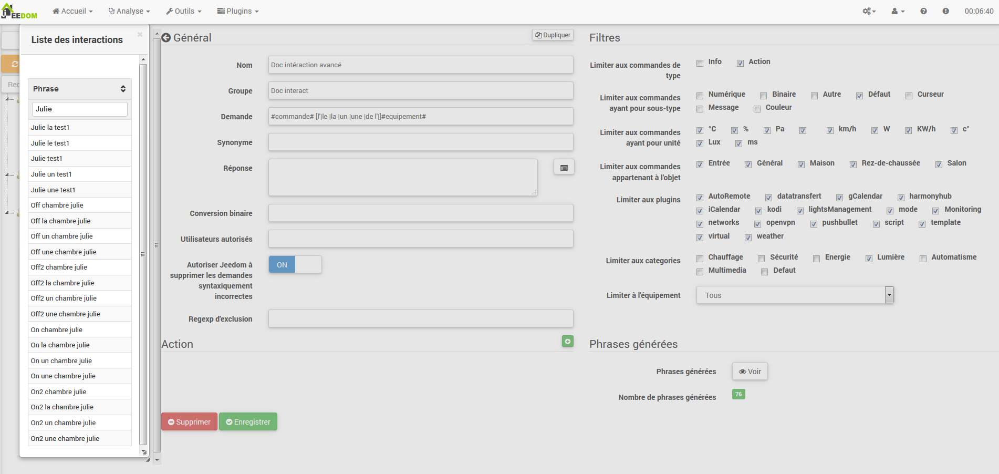
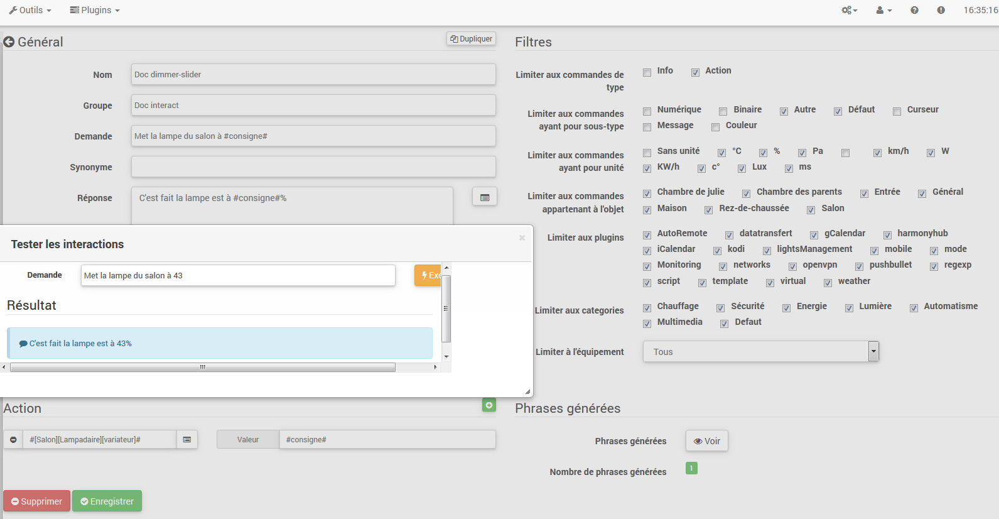

El sistema de interacción en Jeedom hace posible llevar a cabo acciones para
de texto o comandos de voz.

Estas órdenes pueden ser obtenidas por :

-   SMS : enviar un SMS para iniciar comandos (acción) o pedir un
    pregunta (información).

-   Gato : Telegram, Slack, etc.

-   Vocal : dicta una frase con Siri, Google Now, SARAH, etc. Para
    iniciar comandos (acción) o hacer una pregunta (información).

-   Http : lanzar una URL HTTP que contenga el texto (ej. Tasker, Slack)
    Para iniciar comandos (acción) o hacer una pregunta (información).

El interés de las interacciones radica en la integración simplificada en
Otros sistemas como teléfonos inteligentes, tabletas, otras cajas de automatización del hogar, etc.

Para acceder a la página de interacción, vaya a Herramientas →
Interacciones :

En la parte superior de la página, hay 3 botones :

-   **Añadir** : que permite crear nuevas interacciones.

-   **Regenerado** : que recreará todas las interacciones (tal vez
    très long &gt; 5mn).

-   **Prueba** : que abre un diálogo para escribir y
    prueba una oración.

> **Punta**
>
> Si tienes una interacción que genera las oraciones para las luces
> por ejemplo y agrega un nuevo módulo de comando de
> luz, tendrás que regenerar todas las interacciones, o
> vaya a la interacción en cuestión y guárdela nuevamente para
> crea las oraciones para este nuevo módulo.

Principio 
========

El principio de la creación es bastante simple : definiremos una oración
modelo de generador que permitirá a Jeedom crear uno o más
cientos de otras oraciones que serán posibles combinaciones de la
modelo.

Definiremos las respuestas de la misma manera con un modelo (esto permite
Jeedom tendrá varias respuestas para una sola pregunta).

También podemos definir un comando para ejecutar si, por ejemplo
la interacción no está vinculada a una acción sino a información o si
desea llevar a cabo una acción específica después de esto (también es
posible ejecutar un escenario, controlar varios comandos).

Configuración 
=============

La página de configuración consta de varias pestañas y
botones :

-   **Frases** : Muestra el número de oraciones en la interacción (un clic
    arriba te los muestra)

-   **Registro** : registra la interacción actual

-   **Remove** : eliminar la interacción actual

-   **Duplicado** : duplicar la interacción actual

General 
=======

-   **Apellido** : nombre de la interacción (puede estar vacío, el nombre reemplaza el
    solicitar texto en la lista de interacción).

-   **Grupo** : grupo de interacción, ayuda a organizarlos
    (puede estar vacío, por lo que estará en el grupo "ninguno").

-   **Bienes** : permite activar o desactivar la interacción.

-   **Solicitud** : La oración modelo generadora (requerida).

-   **Sinónimo** : permite definir sinónimos en nombres
    órdenes.

-   **Respuesta** : la respuesta para proporcionar.

-   **Espere antes de responder)** : agregue un retraso de X segundos antes de generar la respuesta. Permite, por ejemplo, esperar el regreso del estado de una lámpara antes de ser respondido.

-   **Conversión binaria** : convierte valores binarios a
    abierto / cerrado por ejemplo (solo para comandos de tipo
    información binaria).

-   **Usuarios autorizados** : limita la interacción a ciertos
    usuarios (inicios de sesión separados por |).

Filtros 
=======

-   **Límite para escribir comandos** : permite usar solo el
    tipos de acciones, información o ambos tipos.

-   **Limitar a pedidos con subtipo** : permite limitar
    generación a uno o más subtipos.

-   **Limitar a pedidos con unidad** : permite limitar el
    generación con una o más unidades (Jeedom crea la lista
    automáticamente de las unidades definidas en sus pedidos).

-   **Limitar a órdenes pertenecientes al objeto** : permite limitar
    generación a uno o más objetos (Jeedom crea la lista
    automáticamente de los objetos que creó).

-   **Limitar al complemento** : limita la generación a uno o más
    varios complementos (Jeedom crea automáticamente la lista desde
    complementos instalados).

-   **Limitar a categoría** : limita la generación a uno
    o más categorías.

-   **Limite al equipo** : limita la generación a uno
    equipo / módulo único (Jeedom crea automáticamente la lista en
    del equipo / módulos que tienes).

Acción 
======

Úselo si desea apuntar a uno o más comandos específicos
o pasar parámetros particulares.

Ejemplos 
========

> **Nota**
>
> Las capturas de pantalla pueden ser diferentes en vista de los desarrollos.

Interacción simple 
------------------

La forma más fácil de configurar una interacción es usarla
dar un modelo de generador rígido, sin posibles variaciones. Este
El método apuntará a un comando o un escenario con mucha precisión.

En el ejemplo que sigue, podemos ver en el campo &quot;Solicitar&quot; la oración
exacta para proporcionar para desencadenar la interacción. Aquí, para encender el
luz de techo de la sala de estar.

Podemos ver, en esta captura, la configuración para tener un
interacción vinculada a una acción específica. Esta acción se define en
la parte de &quot;Acción&quot; de la página.

Podemos imaginar hacer lo mismo con varias acciones para
encienda varias lámparas en la sala de estar como el siguiente ejemplo :

En los 2 ejemplos anteriores, la oración modelo es idéntica pero el
las acciones resultantes cambian según lo que esté configurado
en la parte &quot;Acción&quot;, por lo tanto, ya podemos con una simple interacción para
frase única imagina acciones combinadas entre varios comandos y
varios escenarios (también podemos desencadenar escenarios en el juego
acción de interacciones).

> **Punta**
>
> Para agregar un escenario, crear una nueva acción, escriba "escenario"
> sin acento, presione la tecla de tabulación en su teclado para
> abrir el selector de escenarios.

Interacción de comandos múltiples 
------------------------------

Aquí veremos todo el interés y todo el poder de
interacciones, con una oración modelo podremos generar
oraciones para todo un grupo de comandos.

Reanudaremos lo que se hizo anteriormente, eliminaremos las acciones que
agregamos, y en lugar de la oración fija, en "Solicitud",
usaremos las etiquetas **\#commande\#** y **\#equipement\#**.
Jeedom reemplazará estas etiquetas con el nombre de los comandos y el nombre de
equipo (podemos ver la importancia de tener nombres de
control / equipo consistente).

Entonces podemos ver aquí que Jeedom generó 152 oraciones a partir de
nuestro modelo. Sin embargo, no están muy bien construidos y nosotros
tiene un poco de todo.

Para hacer un orden en todo esto, usaremos los filtros (parte
derecho de nuestra página de configuración). En este ejemplo, queremos
generar oraciones para encender las luces. Entonces podemos desmarcar el
información del tipo de comando (si guardo, solo me quedan 95 oraciones
generado), luego, en los subtipos, solo podemos mantener marcados
"predeterminado "que corresponde al botón de acción (por lo que solo quedan 16
phrases).

Es mejor, pero podemos hacerlo aún más natural. Si tomo
el ejemplo generado &quot;Al entrar&quot;, sería bueno poder transformar
esta oración en "activar la entrada" o en "activar la entrada". Para hacer
eso, Jeedom tiene, bajo el campo de solicitud, un campo sinónimo que
permítanos nombrar pedidos de manera diferente en nuestro
oraciones &quot;generadas&quot;, aquí está &quot;on&quot;, incluso tengo &quot;on2&quot; en los módulos
que puede controlar 2 salidas.

En sinónimos, indicaremos el nombre del comando y el (s)
sinónimo (s) a utilizar :

Podemos ver aquí una sintaxis algo nueva para sinónimos. Un nombre
puede tener varios sinónimos, aquí &quot;on&quot; tiene como sinónimo
"encienda "y" encienda". La sintaxis es por lo tanto "*Nombre de la orden*"
***=*** "*sinónimo 1*"***,*** "*sinónimo 2*" (podemos poner tantos
sinónimo que queremos). Luego, agregar sinónimos para otro
nombre del comando, solo agregue después del último sinónimo una barra
vertical "*|*" después de lo cual puedes nombrar nuevamente
comando que tendrá sinónimos como para la primera parte, etc.

Ya es mejor, pero aún falta para el comando de entrada "on""
la &quot;l&quot; y para otros la &quot;la&quot; o &quot;la&quot; o &quot;a&quot;, etc. Podriamos
cambiar el nombre del equipo para agregarlo sería una solución,
de lo contrario podemos usar variaciones en la demanda. Consiste en
enumerar una serie de palabras posibles en un lugar de la oración, Jeedom
generará oraciones con estas variaciones.

Ahora tenemos oraciones un poco más correctas con oraciones que
no son justos, para nuestro ejemplo "en" "entrada". entonces encontramos
"Encienda la entrada "," Encienda la entrada "," Encienda la entrada "," Encienda
la entrada &quot;etc. Entonces tenemos todas las variantes posibles con lo que
agregado entre &quot;\ [\]&quot; y esto para cada sinónimo, lo que genera
rápidamente muchas oraciones (aquí 168).

Para refinar y no tener cosas improbables como
"encienda el televisor ", podemos autorizar a Jeedom a eliminar solicitudes
sintácticamente incorrecto. Entonces eliminará lo que está demasiado lejos
la sintaxis real de una oración. En nuestro caso, pasamos de 168
130 oraciones.

Por lo tanto, se vuelve importante construir bien sus oraciones modelo y
sinónimos, así como seleccionar los filtros correctos para no generar
demasiadas oraciones innecesarias. Personalmente, me parece interesante tener
algunas inconsistencias del estilo &quot;una entrada&quot; porque si estás en casa, tienes
una persona extranjera que no habla francés correctamente
las interacciones seguirán funcionando.

Personalizar respuestas 
--------------------------

Hasta ahora, como respuesta a una interacción, teníamos un simple
oración que no dijo mucho, excepto que algo sucedió
pasado. La idea sería que Jeedom nos cuenta lo que hizo un poco más
con precisión. Aquí es donde entra el campo de respuesta
posibilidad de personalizar la devolución según la orden ejecutada.

Para hacer esto, nuevamente usaremos la etiqueta Jeedom. Para nuestro
luces, podemos usar una frase como : Me ilumine bien
\#equipement\# (ver captura de pantalla a continuación).

También puede agregar cualquier valor desde otro comando como
temperatura, número de personas, etc.

Conversión binaria 
------------------

Las conversiones binarias se aplican a los pedidos de tipo de información cuyos
el subtipo es binario (solo devuelve 0 o 1). Entonces tienes que activar
los filtros correctos, como puedes ver en la captura de pantalla a continuación
(para las categorías, podemos verificarlas todas, para el ejemplo que tengo
mantuvo esa luz).

Como puede ver aquí, he mantenido casi la misma estructura
por demanda (es voluntario enfocarse en
especificidades). Por supuesto, adapté los sinónimos para tener algunos
cosa coherente. Sin embargo, para la respuesta, es **imperativo** de
poner solo \#valeur\# que representa el 0 o 1 que va Jeedom
reemplazar con la siguiente conversión binaria.

El campo **Conversión binaria** debe contener 2 respuestas : primero el
respuesta si el valor del comando es 0, entonces una barra vertical "|"
separación y finalmente la respuesta si el comando vale 1. Aquí el
las respuestas son simplemente no y sí, pero podríamos poner una oración
un poco mas largo.

> **Advertencia**
>
> Las etiquetas no funcionan en conversiones binarias.

Usuarios autorizados 
----------------------

El campo &quot;Usuarios autorizados&quot; le permite autorizar solo ciertos
personas para ejecutar el comando puede poner múltiples perfiles
separándolos con un "|".

Ejemplo : personne1|personne2

Uno puede imaginar que una alarma puede ser activada o desactivada por un
niño o un vecino que vendría a regar las plantas en su ausencia.

Exclusión de expresiones regulares 
------------------

Es posible crear
[Regexp](https://fr.wikipedia.org/wiki/Expression_rationnelle)
de exclusión, si una oración generada corresponde a esta expresión regular será
borrado. El punto es poder eliminar falsos positivos,
decir una oración generada por Jeedom que activa algo que no
no corresponde a lo que queremos o que interferiría con otro
interacción que tendría una oración similar.

Tenemos 2 lugares para aplicar un Regexp :

-   en la interacción incluso en el campo "Exclusión de expresiones regulares"".

-   En el menú Administración → Configuración → Interacciones → campo &quot;Regexp&quot;
    exclusión general para interacciones".

Para el campo &quot;Regex de exclusión general para interacciones&quot;, esto
la regla se aplicará a todas las interacciones, que se crearán o
guardado de nuevo después. Si queremos aplicarlo a todos
interacciones existentes, las interacciones necesitan ser regeneradas.
Por lo general, se usa para borrar oraciones incorrectamente
encontrado en la mayoría de las interacciones generadas.

Para el campo &quot;Exclusión de expresiones regulares&quot; en la página de configuración de
cada interacción, podemos poner un Regexp específico que actuará
solo en dicha interacción. Entonces te permite eliminar
más específicamente para una interacción. También puede permitir
eliminar una interacción para un comando específico para el cual
no quiere ofrecer esta oportunidad como parte de una generación de
pedidos múltiples.

La siguiente captura de pantalla muestra la interacción sin Regexp. En la
lista de la izquierda, filtro las oraciones para mostrarle solo el
oraciones a eliminar. En realidad hay 76 oraciones generadas
con la configuración de la interacción.

Como puede ver en la siguiente captura de pantalla, agregué un
regexp simple que buscará la palabra &quot;Julie&quot; en las oraciones generadas
y eliminarlos. Sin embargo, podemos ver en la lista de la izquierda que hay
siempre tiene oraciones con la palabra &quot;julie&quot; en expresiones
regular, Julie no es igual a Julie, esto se llama
mayúsculas o minúsculas en francés una letra mayúscula es diferente
de un pequeño. Como podemos ver en la siguiente captura de pantalla, no
solo quedan 71 oraciones, las 5 con &quot;Julie&quot; han sido eliminadas.

Una expresión regular se compone de la siguiente manera :

-   Primero, un delimitador, aquí hay una barra &quot;/&quot; colocada en
    principio y fin de expresión.

-   El punto después de la barra representa cualquier
    carácter, espacio o número.

-   El &quot;\*&quot; indica que puede haber 0 o más veces
    el personaje que lo precede, aquí un punto, así que en buen francés
    cualquier articulo.

-   Luego Julie, que es la palabra a buscar (palabra u otro diagrama
    expresión), seguido de un punto nuevamente y una barra diagonal.

Si traducimos esta expresión en una oración, daría &quot;buscar el
palabra Julie que está precedida por cualquier cosa y seguida por cualquier cosa
quoi".

Es una versión extremadamente simple de expresiones regulares pero
ya muy complicado de entender. Me tomó un tiempo comprenderlo
el funcionamiento. Como un ejemplo un poco más complejo, una expresión regular para
verificar una URL :

/\^(https?:\\ / \\ /)?(\ [\\ da-z \\ .- \] +) \\. (\ [az \\. \] {2,6}) (\ [\\ / \\ w
\\ .- \] \*)\*\\ /?\ $ /

Una vez que puedes escribir esto, entiendes las expresiones
regular.

Para resolver el problema de mayúsculas y minúsculas, podemos agregar a
nuestra expresión es una opción que hará que no distinga entre mayúsculas y minúsculas, o
en otras palabras, que considera una letra minúscula igual a una letra mayúscula;
para hacer esto, simplemente tenemos que agregar al final de nuestra expresión un
"i".

Con la adición de la opción &quot;i&quot; vemos que solo quedan 55
oraciones generadas y en la lista de la izquierda con el filtro julie para
buscamos las oraciones que contienen esta palabra, vemos que hay algunas
mucho más.

Como este es un tema extremadamente complejo, no iré más allá
detalle aquí, hay suficientes tutoriales en la red para ayudarlo, y
no olvides que Google también es tu amigo porque sí, él es mi amigo,
fue él quien me enseñó a entender Regexp e incluso a codificar. Entonces
si él me ayudó, él también puede ayudarte si pones bien
volonté.

Enlaces útiles :

-   <http://www.commentcamarche.net/contents/585-javascript-l-objet-regexp>

-   <https://www.lucaswillems.com/fr/articles/25/tutoriel-pour-maitriser-les-expressions-regulieres>

-   <https://openclassrooms.com/courses/concevez-votre-site-web-avec-php-et-mysql/les-expressions-regulieres-partie-1-2>

Respuesta compuesta de varias piezas de información 
------------------------------------------

También es posible poner varios comandos de información en uno
responder, por ejemplo, para obtener un resumen de la situación.

En este ejemplo, vemos una oración simple que devolverá un
responde con 3 temperaturas diferentes, así que aquí podemos poner un poco
todo lo que quieras para tener un conjunto de información en uno
sola vez.

¿Hay alguien en la sala? ? 
------------------------------------

### Versión básica 

-   Entonces la pregunta es "¿hay alguien en la sala?"

-   La respuesta será &quot;no, no hay nadie en la habitación&quot; o &quot;sí, hay
    tiene alguien en la habitación"

-   El comando que responde a eso es &quot;\# \ [Cámara de
    Julie \] \ [GSMF-001-2 \] \ [Presencia \] \#"

Este ejemplo se dirige específicamente a equipos específicos que permiten
tener una respuesta personalizada. Entonces podríamos imaginar reemplazar
el ejemplo responde con &quot;no, no hay nadie en la habitación
*Julie*|si hay alguien en la sala *Julie*"

### Evolución 

-   Entonces la pregunta es "\#commande\# \[en la |en el\] \#objet\#"

-   La respuesta será &quot;no, no hay nadie en la habitación&quot; o &quot;sí, hay
    alguien en la sala"

-   No hay un comando que responda que en la parte de Acción vista
    que esta es una interacción de comandos múltiples

-   Al agregar una expresión regular, podemos limpiar los comandos
    que no queremos ver para tener solo las oraciones en el
    Comandos de presencia".

Sin Regexp, obtenemos aquí 11 oraciones, pero mi interacción está dirigida
generar oraciones solo para preguntar si hay alguien en
una habitación, así que no necesito una lámpara ni nada parecido
tomado, que se puede resolver con el filtrado regexp. Para hacer
aún más flexible, se pueden agregar sinónimos, pero en este caso
no olvides modificar la expresión regular.

Conoce la temperatura / humedad / brillo 
--------------------------------------------

### Versión básica 

Podríamos escribir la oración con fuerza como, por ejemplo, &quot;¿cuál es el
temperatura de la sala &quot;, pero se debe hacer una para cada sensor
de temperatura, brillo y humedad. Con el sistema de generación de
Sentencia de libertad, por lo que podemos generar con una sola interacción
frases para todos los sensores de estos 3 tipos de medida.

Aquí un ejemplo genérico que se utiliza para conocer la temperatura,
la humedad, el brillo de las diferentes habitaciones (objeto en el sentido Jeedom).

-   Entonces podemos ver que una oración genérica genérica &quot;¿Cuál es el
    temperatura de la sala "o" Qué tan brillante es el dormitorio"
    se puede convertir a : "Cuál es la |l \\ '\] \#commande\# objet"
    (el uso de \ [word1 | mot2 \] digamos esta posibilidad
    o este para generar todas las variaciones posibles de la oración
    con word1 o word2). Al generar Jeedom generará todo
    posibles combinaciones de oraciones con todos los comandos
    existente (dependiendo de los filtros) reemplazando \#commande\# par
    el nombre del comando y \#objet\# por el nombre del objeto.

-   La respuesta será "21 ° C" o "200 lux". Solo pon :
    \#valeur\# \#unite\# (la unidad se completará en la configuración
    de cada pedido para el que queremos tener uno)

-   Por lo tanto, este ejemplo genera una oración para todos los comandos de
    escriba información digital que tenga una unidad, para que podamos desmarcar
    unidades en el filtro derecho limitado al tipo que nos interesa.

### Evolución 

Por lo tanto, podemos agregar sinónimos al nombre del comando para tener algunos
Lo más natural, agregue una expresión regular para filtrar los comandos que
no tiene nada que ver con nuestra interacción.

Agregando un sinónimo, digamos a Jeedom que un comando llamado
"X" también se puede llamar "Y" y, por lo tanto, en nuestra oración si tenemos "activar
y &quot;, Jeedom sabe que se está encendiendo x. Este método es muy conveniente
cambiar el nombre de los comandos que, cuando se muestran en
la pantalla, están escritos de una manera que no es vocal o natural
en una oración escrita como "ENCENDIDO". Un botón escrito como este es
totalmente lógico pero no en el contexto de una oración.

También podemos agregar un filtro Regexp para eliminar algunos comandos.
Usando el ejemplo simple, vemos oraciones &quot;batería&quot; o
"latencia ", que no tiene nada que ver con nuestra interacción
temperatura / humedad / brillo.

Entonces podemos ver una expresión regular :

**(batterie|latence|pression|vitesse|consommation)**

Esto le permite eliminar todos los pedidos que tengan uno de estos
palabras en su oración

> **Nota**
>
> La expresión regular aquí es una versión simplificada para un uso fácil.
> Entonces podemos usar expresiones tradicionales o
> use las expresiones simplificadas como en este ejemplo.

Controle un atenuador o un termostato (control deslizante) 
-------------------------------------------

### Versión básica 

Es posible controlar una lámpara de porcentaje (dimmer) o un
termostato con interacciones. Aquí hay un ejemplo para controlar su
atenuador en una lámpara con interacciones :

Como podemos ver, aquí está en la solicitud la etiqueta **\#consigne\#** (on
puede poner lo que quiera) que se incluye en el orden de
atenuador para aplicar el valor deseado. Para hacer esto, tenemos 3 partes
: \* Solicitud : en el que creamos una etiqueta que representará el valor
que será enviado a la interacción. \* Respuesta : reutilizamos la etiqueta para
la respuesta para asegurarse de que Jeedom entendió la solicitud correctamente.
\* Acción : ponemos una acción sobre la lámpara que queremos conducir y en
el valor le pasamos nuestra etiqueta *Consigna*.

> **Nota**
>
> Puede usar cualquier etiqueta excepto las que ya usa
> Jeedom, puede haber varios para conducir, por ejemplo
> pedidos múltiples. También tenga en cuenta que todas las etiquetas se pasan a
> escenarios lanzados por la interacción (sin embargo, el escenario
> ya sea en "Ejecutar en primer plano").

### Evolución 

Es posible que queramos controlar todos los comandos de tipo cursor con un
interacción única. Con el siguiente ejemplo, podremos ordenar
varias unidades con una sola interacción y, por lo tanto, generan un
conjunto de oraciones para controlarlos.

En esta interacción, no tenemos comando en la parte de acción, nosotros
deje que Jeedom genere a partir de etiquetas la lista de oraciones. Podemos
ver la etiqueta **\#slider\#**. Es imprescindible utilizar esta etiqueta para
instrucciones en una interacción de comandos múltiples puede no ser
la última palabra de la oración. También podemos ver en el ejemplo que nosotros
puede usar en la respuesta una etiqueta que no sea parte del
solicitud. La mayoría de las etiquetas disponibles en los escenarios son
también disponible en interacciones y, por lo tanto, puede usarse
en una respuesta.

Resultado de la interacción :

Podemos ver que la etiqueta **\#equipement\#** que no se usa
en la solicitud se completa bien en la respuesta.

Controla el color de una tira de LED 
--------------------------------------

Es posible controlar un comando de color mediante las interacciones en
pidiéndole a Jeedom por ejemplo que encienda una tira de LED azul.
Esta es la interacción para hacer :

Hasta entonces, nada muy complicado, sin embargo, debe haber configurado
colores en Jeedom para que funcione; ir al
menú → Configuración (arriba a la derecha) luego en la sección
"Configurar interacciones" :

Como podemos ver en la captura de pantalla, no hay color
configurado, así que agregue colores con el &quot;+&quot; a la derecha. la
nombre del color, este es el nombre que va a pasar a la interacción,
luego en la parte derecha (columna &quot;código HTML&quot;), haciendo clic en el
color negro puedes elegir un nuevo color.

Podemos agregar tantos como queramos, podemos poner como nombre
cualquiera, para que puedas imaginar asignar un color a
el nombre de cada miembro de la familia.

Una vez configurado, dices &quot;Enciende el árbol verde&quot;, Jeedom
encuentre un color en la solicitud y aplíquelo al pedido.

Uso junto con un escenario 
---------------------------------

### Versión básica 

Es posible acoplar una interacción a un escenario para
realizar acciones un poco más complejas que realizar un simple
acción o solicitud de información.

Por lo tanto, este ejemplo permite iniciar el escenario que está vinculado en el
parte de acción, por supuesto, podemos tener varios.

Programando una acción con interacciones 
------------------------------------------------

Las interacciones hacen muchas cosas en particular.
Puedes programar una acción dinámicamente. Ejemplo : "Poner el
calentamiento a las 10 p.m. para 2:50 p.m". Nada podría ser más simple, solo
usar etiquetas \#time\# (si se define un tiempo específico) o
\#duration\# (para en X tiempo, ejemplo en 1 hora) :

> **Nota**
>
> Notará en la respuesta la etiqueta \#value\# este contiene
> en el caso de una interacción programada, el tiempo de programación
> effective
