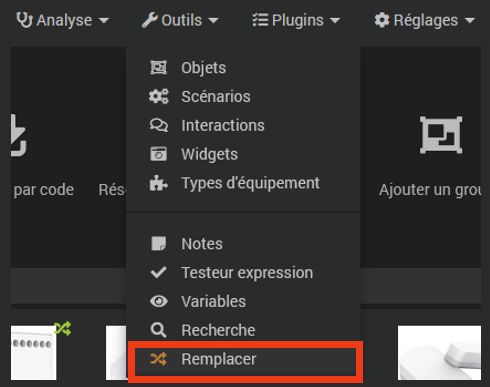
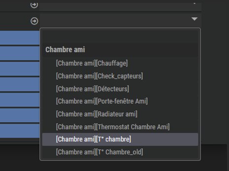
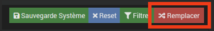
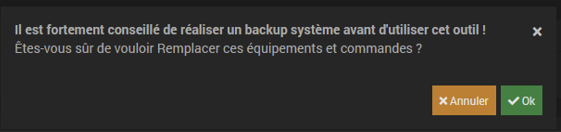

 # Remplacer

## ¿Por qué tal herramienta? ?

Jeedom ha estado ofreciendo desde la versión 4.3.2 una nueva herramienta <kbd>Reemplazar</kbd> que, en caso de problema o necesidad de reemplazar un equipo físico o virtual (un sensor de temperatura o presencia, un control de volumen, un nivel de agua, etc.), garantizará la copia de todos los comandos, informaciones, Parámetros avanzados e historial de este equipo a equipos nuevos. 
También será responsable de sustituir el ID del antiguo equipo por el nuevo en todos los escenarios, diseños, virtuales, etc. que le hagan referencia.

De hecho, si se elimina el equipo antiguo, la referencia a su número de identificación original se borrará permanentemente. Entonces será necesario recrear todos los comandos y reintegrarlos en todos los diseños, widgets, etc. del nuevo módulo, incluso si es estrictamente del mismo tipo que el original, o incluso el mismo pero con un número de ID diferente. 
Además, antes de cualquier eliminación de equipo, Jeedom avisará de las consecuencias de dicha eliminación en una ventana de alerta :

Aquí, quitar este sensor de vibración causará :

- Eliminación de las visualizaciones definidas en el diseño 'Zonas de alarmas'',
- Eliminación de información de vibración, nivel de batería y fecha de la última comunicación, incluido el historial,
- La suppression de l'équipement dans le scénario ‘Alarme détection intru'.

Y a partir del momento en que este equipo sea eliminado definitivamente, será sustituido en todas estas entidades por su antiguo número de identificación, o un campo vacío en lugar de su nombre original :

  

## Operaciones a realizar antes de utilizar esta herramienta

Incluso si la herramienta <kbd>Reemplazar</kbd> le sugerirá que primero haga una copia de seguridad preventiva, se recomienda encarecidamente hacer una antes de comenzar este procedimiento de reemplazo. 
Tenga en cuenta que esta herramienta es realmente poderosa porque realizará reemplazos en todos los niveles, incluidos aquellos en los que no había pensado o simplemente había olvidado. Además, no hay ninguna función *deshacer* cancelar o volver.  

La siguiente fase será el cambio de nombre del antiguo equipo. Para ello basta con cambiarle el nombre, añadiendo el sufijo '**_viejo**' por ejemplo.

 

No olvides guardar.
 

Luego deberás realizar la inclusión del nuevo equipo si es físico, o la creación del nuevo equipo virtual, siguiendo el procedimiento estándar específico de cada plugin.
Este equipo será nombrado con su nombre final, luego el objeto padre y su categoría definida antes de activarlo. 
 
Obtenemos así dos equipos :

- Equipo antiguo, que puede que ya no exista físicamente, pero que, sin embargo, permanece referenciado en todas las estructuras de Jeedom con sus historias,
- Y el nuevo equipo, en el que será necesario copiar los historiales y referenciarlos en lugar del antiguo.
 

  

## Usando la herramienta <kbd>Reemplazar</kbd>>

Abra la herramienta <kbd>Reemplazar</kbd> , en el menú <kbd>Herramientas</kbd>>.

 

En el campo *Objeto*, seleccionar objeto(s) padre(s).

 

En las opciones, seleccione el modo deseado (*Reemplazar* O *Copiar*) en la lista desplegable, y dependiendo de las necesidades, las siguientes opciones (que están todas desmarcadas de forma predeterminada), o al menos :

- Copiar la configuración del dispositivo de origen,
- Copie la configuración del comando fuente.
 

 

Luego haga clic en <kbd>Filtrar</kbd>>

 

En el campo *Reemplazos*, aparecen todas las entidades relacionadas con el objeto principal :

 

Verifique el dispositivo de origen (renombrado a '**_viejo**'), es decir aquel del que deseamos copiar las órdenes, información, historial, etc
En este caso, el equipo fuente será, por tanto, : [Habitación de un amigo][T°Chambre_old](767 | z2m). 
Haga clic en la línea para mostrar los diferentes campos relacionados.

 

En el juego *Objetivo* a la derecha, desplácese hacia abajo en la lista y seleccione el nuevo equipo que lo reemplazará, es decir [Habitación de invitados][Temperatura ambiente] en nuestro ejemplo.

 

En las listas desplegables que se muestran a continuación a la derecha, la información se presenta sobre un fondo azul, las acciones sobre un fondo naranja (abajo otro ejemplo de una luminaria donde hay acciones e información).

 

Y si hay una coincidencia directa (mismo nombre en particular), los diferentes parámetros se establecerán automáticamente.

 

Aquí todo se reconoce automáticamente.
De lo contrario, el campo estará vacío y tendrá que seleccionar manualmente la información/acción correspondiente de la lista desplegable, si es relevante.

 

Haga clic en <kbd>Reemplazar</kbd>>,

 

Validar la reposición, comprobando que se ha realizado una copia de seguridad antes (ojo, no hay vuelta atrás) !).

 

Además, la herramienta te lo sugerirá en esta etapa. Pero al salir de esta función para realizar esta copia de seguridad en este momento, también abandonarás todas las configuraciones ya realizadas, de ahí el interés de realizar esta copia de seguridad desde el inicio del procedimiento.  

Después de ejecutar el comando, después de una breve espera, aparecerá una ventana emergente de alerta que indicará la finalización exitosa del procedimiento.  

## Cheques

Asegúrese de que se haya tenido en cuenta el nuevo equipo en los diseños, escenarios, widgets, virtuales, plug-ins, etc. con su configuración (layout, display, asignación de widgets, etc.), y (si aplica) los asociados. historia.

 

Para verificar adecuadamente que no se hayan generado problemas adicionales después de este reemplazo, es posible utilizar la función de detección de comandos huérfanos.
Vaya a <kbd>Análisis</kbd> , <kbd>Equipo</kbd> , haga clic en la pestaña *Comandos huérfanos*.

 

 

Si todo salió bien, no debería haber líneas presentes en este informe.
 

 

En caso contrario, será necesario realizar un análisis línea por línea de cada problema identificado para solucionarlo.

 

Pero si la herramienta <kbd>Reemplazar</kbd> no tiene en cuenta los comandos huérfanos, aún es posible realizar reemplazos con esta función. <kbd>Este comando reemplaza la ID</kbd> que se encuentra aquí en la ventana de configuración de comandos :

  

## Finalisation

Si todo es correcto, el equipo antiguo (T°Chambre_old en el ejemplo) se puede eliminar definitivamente. No deberían aparecer más referencias en la ventana emergente de advertencia durante la eliminación, excepto los comandos intrínsecos a este equipo.

 

Aquí, este equipo sólo está referenciado por su objeto de pertenencia y sus propios comandos, lo cual es normal. Por lo tanto, podemos eliminarlo sin arrepentirnos.  

## Conclusion

Esta herramienta es práctica, pero igualmente peligrosa si se utiliza mal debido a sus implicaciones en múltiples niveles. 
Además, tenga en cuenta estos fundamentos :

- Realice sistemáticamente una copia de seguridad preventiva, incluso antes de utilizar la herramienta <kbd>Reemplazar</kbd>>,
- No es posible deshacer ni revertir después de ejecutar este comando,
- Y por último, se recomienda encarecidamente familiarizarse al menos con el uso de esta herramienta.
