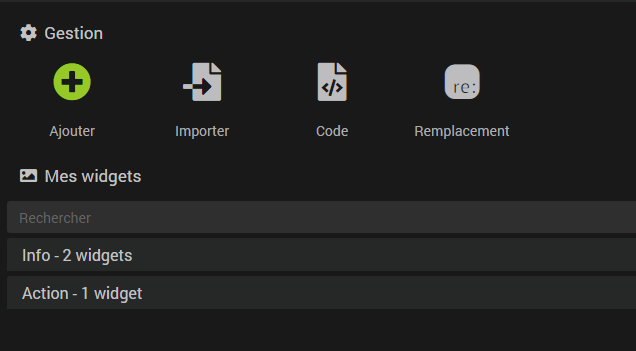
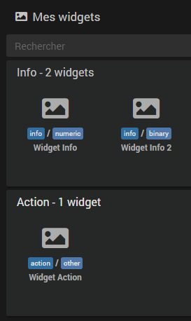
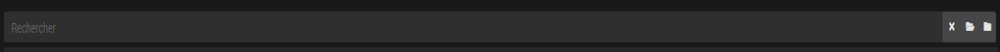
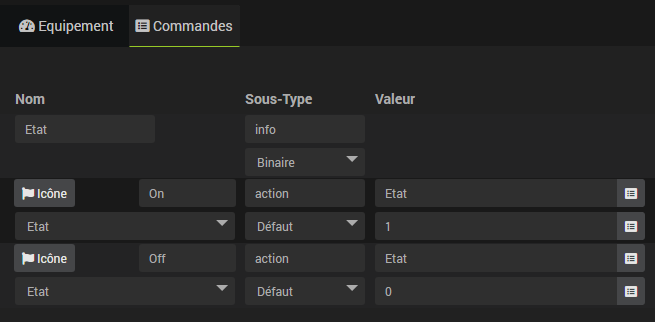

# Widgets

Un widget es la representación gráfica de un comando en el panel de control o en la versión móvil. El núcleo de Jeedom asigna automáticamente un widget según el tipo *(Información o Acción)* y el subtipo *(Binario, Numérico, Otro, Control deslizante, etc.)* del comando. Es posible seleccionar otro de entre los disponibles a través de la configuración avanzada del comando, en la pestaña «Visualización» → «**Widget**».

## Widgets predeterminados

A continuación se presentan los widgets integrados en el Core de Jeedom, sus usos y sus parámetros de personalización.

### Controles

La mayoría de los widgets ofrecen **parámetros opcionales** que permiten ajustar su aspecto sin necesidad de crear un widget personalizado: color, escala, comportamiento, etc. Se configuran en la configuración avanzada del comando, en la pestaña «Visualización» → sección «**Parámetros opcionales del widget**», en forma de pares nombre/valor. Los parámetros disponibles varían según el widget seleccionado y se enumeran a continuación.

El parámetro **`time`** (`duration`/`date`) es común a todos los widgets *(excepto el higrotermógrafo)* y muestra, respectivamente, el tiempo transcurrido o la fecha del último cambio de valor.

#### Información / Binario

| Widget | Descripción | Parámetros opcionales |
|--------|-------------|----------------------|
| Persiana | Representación visual de una persiana con su posición en % | `color` |
| Alerta | Coche verde (ENCENDIDO) / alerta roja (APAGADO) | |
| Puerta | Puerta cerrada: verde (ENCENDIDA) / puerta abierta: roja (APAGADA) | |
| Inundación | Gota de agua tachada en verde (ENCENDIDO) / gota de agua azul (APAGADO) | |
| Calefacción | Llama roja (ENCENDIDO) / cruz (APAGADO) | |
| Icono | Coche verde (ENCENDIDO) / cruz roja (APAGADO) | |
| Luz | Bombilla encendida (amarilla) (ON) / bombilla apagada (OFF) | |
| Línea | Coche verde (ENCENDIDO) / cruz roja (APAGADO), visualización en línea con el nombre | |
| Cerradura | Candado cerrado (ON) / candado abierto rojo (OFF) | |
| Presencia | Coche verde (ENCENDIDO) / icono de movimiento rojo (APAGADO) | |
| Enchufe | Icono de enchufe (ON) / cruz (OFF) | |
| Ventana | Ventana cerrada (verde, ON) / ventana abierta (roja, OFF) | |

#### Información / Tecnología digital

| Widget | Descripción | Parámetros opcionales |
|--------|-------------|----------------------|
| Etiqueta | Valor mostrado en una etiqueta de colores | `color`, `fontcolor` |
| Brújula | Brújula que indica una dirección en grados | `needle_color`, `ns_color`, `oe_color`, `scale` |
| Indicador | Indicador en forma de arco | `color` |
| Horizontal | Barra de progreso horizontal | `color` |
| Higromotermo | Pantalla combinada de temperatura y humedad *(widget con múltiples funciones, sin `time`)* | `scale` |
| Luz | Icono de bombilla (encendida/apagada según el valor) con valor y unidad | |
| Línea | Nombre, valor y unidad mostrados en una sola línea (formato compacto) | |
| Lluvia | Nivel de agua o precipitaciones | `color`, `scale`, `showRange`, `animate` |
| Persiana | Persiana con indicador de posición en % | `color`, `invert` |
| Tile | Nombre que aparece en el título, encima del valor y la unidad | |
| Vertical | Barra de progreso vertical | `color` |
| HeatPiloteWire | Cable de control de 4 estados: confort, protección contra heladas, modo eco, apagado | |
| HeatPiloteWireQubino | Cable de control Qubino: 6 niveles de confort/ahorro/protección contra heladas/apagado | |

#### Información / Otros

| Widget | Descripción | Parámetros opcionales |
|--------|-------------|----------------------|
| Etiqueta | Texto en una etiqueta de color | `color`, `fontcolor` |
| ButtonImage | Botón que abre en una ventana modal la imagen cuya URL es el valor del comando | |
| Color | Muestra el color correspondiente a un código hexadecimal | `showValue` |
| Línea | Nombre y valor de texto mostrados en una sola línea (formato compacto) | |
| Multilínea | Texto de varias líneas con desplazamiento | `maxHeight`, `minHeight`, `backgroundColor` |
| Tile | Nombre que aparece en el título, encima del valor de texto | |

#### Acción / Color

| Widget | Descripción | Parámetros opcionales |
|--------|-------------|----------------------|
| Predeterminado | Selector de color completo (rueda cromática + valor hexadecimal) | |
| Selector | Selector de color simplificado | |

#### Acción / Fallo

| Widget | Descripción | Parámetros opcionales |
|--------|-------------|----------------------|
| Alerta | Icono de campana que indica el estado del comando asociado (rojo = activo, verde tachado = inactivo) | |
| BinaryDefault | Icono que refleja el estado del comando asociado (marca verde = activo, cruz roja = inactivo) | |
| BinarySwitch | Interruptor basculante ON/OFF | `color`, `color_switch` |
| BtnAlert | Botón con icono de campana que refleja el estado del comando asociado | |
| Botón | Botón de ejecución simple | |
| Círculo | Círculo relleno (ENCENDIDO) / círculo vacío (APAGADO) | |
| Ventilador | Ventilador (ENCENDIDO) / cruz (APAGADO) | |
| Garaje | Garaje cerrado (verde, ON) / garaje abierto (rojo, OFF) | |
| Luz | Bombilla encendida (amarilla) (ON) / bombilla apagada (OFF) | |
| Cerradura | Candado cerrado (ON) / candado abierto naranja (OFF) | |
| Enchufe | Icono de enchufe (ON) / cruz (OFF) | |
| Riego | Riego azul (ENCENDIDO) / cruz (APAGADO) | |
| Toggle | Interruptor activado (amarillo, ON) / desactivado (OFF) | |
| ToggleLine | Interruptor encendido (ON) / apagado (OFF), pantalla integrada | |

#### Acción / Cursor

| Widget | Descripción | Parámetros opcionales |
|--------|-------------|----------------------|
| Botón | Cursor con botones + y − para un ajuste preciso | `step`, `width` |
| Persiana | Control deslizante específico para ajustar la posición de una persiana | `color`, `step`, `invert` |
| Control deslizante | Control deslizante horizontal | `color`, `step` |
| SliderVertical | Control deslizante vertical | `color`, `step` |
| Valor | Campo de introducción numérico directo | `color`, `step`, `noslider`, `width` |
| Luz | Bombilla encendida (amarilla) (ON) / bombilla apagada (OFF) | |

#### Acción / Lista

| Widget | Descripción | Parámetros opcionales |
|--------|-------------|----------------------|
| Seleccionar | Lista desplegable de valores predefinidos | |

#### Acción / Mensaje

| Widget | Descripción | Parámetros opcionales |
|--------|-------------|----------------------|
| Entrada | Formulario para enviar un mensaje con título y cuerpo | `title`, `title_placeholder`, `title_possibility_list`, `title_disable`, `message_placeholder`, `message`, `message_disable` |

### Equipos

Los dispositivos (o fichas) disponen de determinados parámetros de configuración a los que se puede acceder a través de la configuración avanzada del dispositivo, en la pestaña «Visualización» → «**Parámetros opcionales de la ficha**»:

- **dashboard_class/mobile_class**: permite añadir una clase al equipo. Por ejemplo `col2` para los dispositivos móviles permitirá duplicar el ancho del widget.

## Widgets personalizados

La página «Widgets», a la que se accede desde el menú **Herramientas → Widgets**, permite añadir widgets personalizados además de los que vienen por defecto en Jeedom.

Hay dos tipos de widgets personalizados:

- Los widgets *Core* basados en una plantilla. Estos widgets son gestionados por el núcleo de Jeedom y, por lo tanto, supervisados por el equipo de desarrollo. Se garantiza su compatibilidad con las futuras actualizaciones de Jeedom.
- Los widgets de *terceros* basados en código de usuario. A diferencia de los widgets Core, dado que el equipo de desarrollo de Jeedom no tiene control sobre el código incluido en estos widgets, no se garantiza su compatibilidad con futuras actualizaciones. Por lo tanto, estos widgets deben ser mantenidos por el usuario.

### Gestión



Tienes cuatro opciones a tu disposición:
- **Añadir**: Permite añadir un widget *Core*.
- **Importar**: Permite importar un widget en forma de archivo JSON exportado previamente.
- **Código**: Accede a la página de edición de los widgets *de terceros*.
- **Sustitución**: Abre una ventana que permite sustituir un widget por otro en todos los dispositivos que lo utilicen.

### Mis widgets

En esta sección encontrarás todos los widgets que has creado, clasificados por tipo.



>**INFORMACIÓN**
>
>Puedes abrir un widget haciendo lo siguiente:
>- `Clic` en uno de ellos.
>- `Ctrl+Clic` o `Clic+Centre` para abrirlo en una nueva pestaña del navegador.

El buscador permite filtrar la visualización de los widgets según diferentes criterios (nombre, tipo, subtipo, etc.). La tecla `Echap` cancela la búsqueda.



A la derecha del campo de búsqueda, hay tres botones que aparecen en varios lugares de Jeedom:

- **La cruz** para cancelar la búsqueda.
- **La carpeta abierta** para desplegar todos los paneles y mostrar los widgets.
- **La carpeta cerrada** para plegar todos los paneles y ocultar los widgets.

Una vez en la página de configuración de un widget, se puede acceder a un menú contextual desde el `Clic Droit` en las pestañas del widget. También puedes utilizar un `Ctrl+Clic` o `Clic+Centre` para abrir directamente otro widget en una nueva pestaña del navegador.

### Creación de un widget

Una vez en la página **Herramientas → Widgets**, debes hacer clic en el botón «**Añadir**» y asignar un nombre a tu nuevo widget.

A continuación:
- Tú eliges si se aplica a un comando de tipo **Acción** o **Información**.
- En función de la elección anterior, tendrás que **seleccionar el subtipo** del comando.
- Por último, **la plantilla** de entre las que estarán disponibles según las opciones anteriores.
- Una vez elegida la plantilla, Jeedom muestra las opciones de configuración de la misma justo debajo.

### Las plantillas

#### Definición de una plantilla

En pocas palabras, se trata de código (HTML/JS) integrado en el núcleo, cuyas partes pueden ser configuradas por el usuario a través de la interfaz gráfica del menú **Widgets**. A partir de la misma base y teniendo en cuenta los elementos que introduzcas en la plantilla, el núcleo generará widgets únicos que se ajusten a la visualización que desees obtener.

Dependiendo del tipo de widget, normalmente puedes personalizar los iconos, añadir las imágenes que quieras y/o insertar código HTML.

Hay dos tipos de plantillas:

- Los «**sencillos**»: como un icono o una imagen para «**ON**» y otro icono o imagen para «**OFF**».
- Los «**multistates**»: permiten definir, por ejemplo, una imagen si el valor del comando es «**XX**» y otra si es superior a «**YY**» o inferior a «**ZZ**». También funciona con valores de texto: una imagen si el valor es «**toto**», otra si es «**plop**», y así sucesivamente...

#### Sustitución

Esto es lo que se conoce como una plantilla sencilla; aquí solo tienes que indicar que «**ON**» corresponde a tal icono o imagen *(utilizando el botón «Seleccionar»)*, «**OFF**» a tal otro icono o imagen, etc...

Los widgets Core de tipo sustitución disponibles son:

| Widget | Tipos/Subtipos |
|--------|-----------------|
| Plantilla de icono | Información/Binario, Acción/Predeterminado, Acción/Cursor |
| Plantilla Iconline | Información/Binario, Acción/Predeterminado |
| Plantilla Img | Información/Binario, Acción/Predeterminado, Acción/Cursor |

El campo **Time widget**, si está disponible, equivale al parámetro `time: duration` (véase [Controles](#Commandes)).

En las plantillas que utilizan imágenes, se te ofrece la posibilidad de configurar el ancho del widget en píxeles en función del dispositivo (**Ancho en ordenador** y **Ancho en móvil**). También se pueden seleccionar imágenes diferentes según el tema activo de Jeedom *(claro u oscuro)*.

>**INFORMACIÓN**
>
>Los usuarios avanzados pueden incluir etiquetas en los valores de sustitución y especificar su valor en la configuración avanzada del comando.
>Si, por ejemplo, en **Ancho del escritorio** introduces como valor `#largeur_desktop#` (**cuidado, asegúrate de poner bien los** `#` **alrededor**) y, a continuación, en la configuración avanzada de un comando, en la pestaña «Visualización» → «**Parámetros opcionales del widget**», añades el parámetro `largeur_desktop` (**sin los** `#`) y le asignas el valor «**90**», este widget personalizado en ese comando tendrá una anchura de 90 píxeles. Esto permite adaptar el tamaño del widget a cada comando sin tener que  crear un widget específico cada vez.

#### Prueba

Esto es lo que se conoce como plantillas multistate *(varios estados)*. En lugar de poner una imagen para «**ON**» y/o para «**OFF**», como en el caso anterior, asignarás un icono en función de si se cumple una condición *(prueba)*. Si esta es verdadera, el widget mostrará el icono o la imagen en cuestión.

Los widgets Core de tipo multistate disponibles son:

| Widget | Tipos/Subtipos |
|--------|-----------------|
| Plantilla multistatal | Información/Digital, Información/Otros |
| Plantilla Multistateline | Información/Otros |

Al igual que antes, se pueden seleccionar diferentes imágenes en función del tema activo en Jeedom, y la casilla **Time widget** permite mostrar el tiempo transcurrido desde el último cambio de estado.

Las pruebas tienen el siguiente formato: `#value# == 1`, `#value#` se sustituirá automáticamente por el valor actual del comando. También puedes hacer, por ejemplo:

- `#value# > 1`
- `#value# >= 1 && #value# <= 5`
- `#value# == 'toto'`

>**IMPORTANTE**
>
>Es imprescindible incluir comillas (**'**) alrededor del texto que se va a comparar si el valor es un texto *(información/otro)*.

>**INFORMACIÓN**
>
>Es posible mostrar el valor del comando en el widget especificando `#value#` en el código HTML de la prueba. Para mostrar la unidad, añade `#unite#`.\
>Para los usuarios avanzados, también es posible utilizar funciones de JavaScript como `#value#.match("^plop")` para comprobar si el texto empieza por `plop`.

## Código del widget

### Etiquetas

En el modo de código, tienes acceso a diferentes etiquetas para los comandos; aquí tienes una lista (que no es necesariamente exhaustiva):

- **#name#**: nombre del comando
- **#valueName#**: nombre del valor del comando, y = #name# cuando se trata de un comando de tipo «info»
- **#minValue#**: valor mínimo que puede adoptar el control (si se trata de un control deslizante)
- **#maxValue#**: valor máximo que puede adoptar el control (si se trata de un control deslizante)
- **#hide_name#**: vacío u «hidden» si el usuario ha solicitado ocultar el nombre del widget; debe introducirse directamente en una etiqueta «class»
- **#id#**: identificador del pedido
- **#state#**: valor del comando; vacío en el caso de un comando de tipo «acción» si no está vinculado a un comando de estado
- **#uid#**: identificador único para esta generación del widget (si hay varios comandos iguales, como ocurre con los diseños, solo este identificador es realmente único)
- **#valueDate#**: fecha del valor del pedido
- **#collectDate#**: fecha de recogida del pedido
- **#alertLevel#**: nivel de alerta (ninguno, advertencia, peligro)
- **#hide_history#**: si se debe ocultar o no el historial (valor máximo, mínimo, media, tendencia). Al igual que con #hide_name#, su valor es «vacío» o «hidden», por lo que puede utilizarse directamente en una clase. IMPORTANTE: si Jeedom no encuentra esta etiqueta en tu widget, las etiquetas #minHistoryValue#, #averageHistoryValue#, #maxHistoryValue# y #tendencia# no serán sustituidas por Jeedom.
- **#minHistoryValue#**: valor mínimo durante el periodo (periodo definido por el usuario en la configuración de Jeedom)
- **#averageHistoryValue#**: valor medio durante el periodo (periodo definido por el usuario en la configuración de Jeedom)
- **#maxHistoryValue#**: valor máximo durante el periodo (periodo definido por el usuario en la configuración de Jeedom)
- **#tendencia#**: tendencia durante el periodo (periodo definido por el usuario en la configuración de Jeedom). Atención: la tendencia es directamente una clase para iconos: fas fa-arrow-up, fas fa-arrow-down o fas fa-minus

### Actualización de valores

Cuando se introduce un nuevo valor, Jeedom busca en la página si el comando está ahí y, en jeedom.cmd.update, si hay una función de actualización. Si es así, la llama con un único argumento, que es un objeto con el siguiente formato:

```
{display_value: '#state#', valueDate: '#valueDate#', collectDate: '#collectDate#', alertLevel: '#alertLevel#'}
```

Aquí tienes un ejemplo sencillo de código JavaScript para incluir en tu widget:

```
<script>
    jeedom.cmd.addUpdateFunction('#id#', function(_options) {
      if (is_object(cmd = document.querySelector('.cmd[data-cmd_id="#id#"]'))) {
        cmd.setAttribute('title', '{{Date de valeur}}: ' + _options.valueDate + '<br>{{Date de collecte}}: ' + _options.collectDate)
        cmd.querySelector('.value').innerHTML = _options.display_value
        cmd.querySelector('.unit').innerHTML = _options.unit
      }
    }
    jeedom.cmd.refreshValue([{ cmd_id: '#id#', value: '#value#', display_value: '#state#', valueDate: '#valueDate#', collectDate: '#collectDate#', alertLevel: '#alertLevel#', unit: '#unite#' }])
</script>
```

Aquí hay dos cosas importantes:

```
jeedom.cmd.addUpdateFunction('#id#', function(_options) {
  if (is_object(cmd = document.querySelector('.cmd[data-cmd_id="#id#"]'))) {
    cmd.setAttribute('title', '{{Date de valeur}}: ' + _options.valueDate + '<br>{{Date de collecte}}: ' + _options.collectDate)
    cmd.querySelector('.value').innerHTML = _options.display_value
    cmd.querySelector('.unit').innerHTML = _options.unit
  }
}
```
La función se activa cuando se actualiza el widget. A continuación, actualiza el código HTML de la plantilla del widget.

```
jeedom.cmd.refreshValue([{ cmd_id: '#id#', value: '#value#', display_value: '#state#', valueDate: '#valueDate#', collectDate: '#collectDate#', alertLevel: '#alertLevel#', unit: '#unite#' }])
```
La llamada a esta función sirve para inicializar el widget.

### Ejemplos

Encontrarás [aquí](https://github.com/Jeedom/core/tree/master/core/template) ejemplos de widgets (en las carpetas «dashboard» y «mobile»)

## Botón de encendido/apagado

En cuanto a los widgets para interruptores *(encendido/apagado, encender/apagar, abrir/cerrar, etc.)*, puede resultar más agradable a la vista mostrar únicamente un icono que refleje el estado del dispositivo que se desea controlar.

Esta función se puede utilizar tanto con los widgets predeterminados como con los widgets personalizados.

Para ello, hay que tener en cuenta dos requisitos previos:

- Los **2 comandos de acción/fallo** deben estar vinculados a un comando **informativo/binario** que se encargará de memorizar el estado actual del dispositivo.

>**Ejemplo**
>

>**Consejo**
>Desmarca la casilla *«Mostrar»* del comando de información/binario que no sea necesario mostrar.

- Para que el Core Jeedom pueda identificar qué comando corresponde a cada acción, es imprescindible respetar la siguiente nomenclatura para los **2 comandos de acción/fallo**:
```
    'on':'on',
    'off':'off',
    'monter':'on',
    'descendre':'off',
    'ouvrir':'on',
    'ouvrirStop':'on',
    'ouvert':'on',
    'fermer':'off',
    'activer':'on',
    'desactiver':'off',
    'désactiver':'off',
    'lock':'on',
    'unlock':'off',
    'marche':'on',
    'arret':'off',
    'arrêt':'off',
    'stop':'off',
    'go':'on'
```

>**INFORMACIÓN**
>
>Siempre que el nombre estandarizado siga siendo legible, es posible adaptar la nomenclatura, por ejemplo, *abrir_persiana* o *cerrar_persiana*, *encendido_2* y *apagado_2*, etc.
