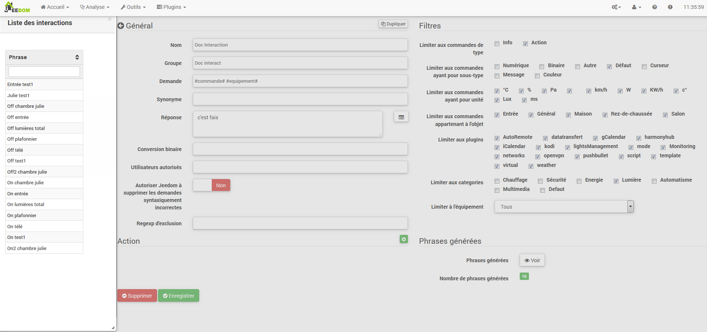
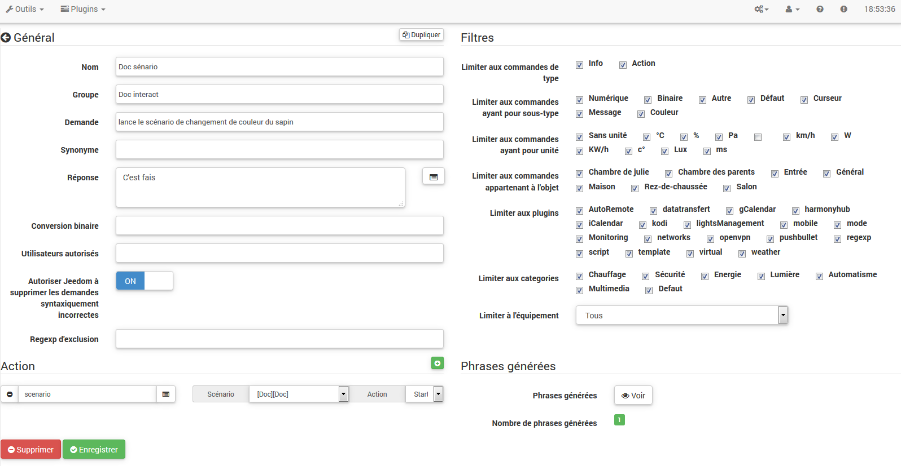

O sistema de interação no Jeedom torna possível realizar ações para
de comandos de texto ou voz.

Esses pedidos podem ser obtidos por :

-   SMS : envie um SMS para iniciar comandos (ação) ou peça a um
    pergunta (informações).

-   Cat : Telegrama, Slack, etc.

-   Vocal : dite uma frase com Siri, Google Now, SARAH etc. Para
    iniciar comandos (ação) ou fazer uma pergunta (informações).

-   HTTP : inicie uma URL HTTP contendo o texto (ex. Tasker, Slack)
    Para iniciar comandos (ação) ou fazer uma pergunta (informações).

O interesse das interações reside na integração simplificada em
outros sistemas como smartphone, tablet, outra caixa de automação residencial, etc.

Para acessar a página de interação, vá para Ferramentas →
Interações :

No topo da página, existem 3 botões :

-   **Adicionar** : o que permite criar novas interações.

-   **Regenerar** : que recriará todas as interações (talvez
    très long &gt; 5mn).

-   **Teste** : que abre uma caixa de diálogo para escrever e
    testar uma sentença.

> **Dica**
>
> Se você tem uma interação que gera as frases para as luzes
> por exemplo, e você adiciona um novo módulo de comando de
> luz, você terá que regenerar todas as interações ou
> vá para a interação em questão e salve-a novamente para
> crie as frases para este novo módulo.

Princípio 
========

O princípio da criação é bastante simples : vamos definir uma frase
modelo de gerador que permitirá à Jeedom criar um ou mais
centenas de outras frases que serão possíveis combinações do
modelo.

Definiremos as respostas da mesma maneira com um modelo (isso permite
Jeedom para ter várias respostas para uma única pergunta).

Também podemos definir um comando para executar se, por exemplo,
a interação não está vinculada a uma ação, mas a informações ou se
deseja realizar uma ação específica após esta (também é
possível executar um cenário, controlar vários comandos…).

Configuração 
=============

A página de configuração consiste em várias guias e
botões :

-   **Frases** : Exibe o número de frases na interação (um clique
    acima mostra para você)

-   **Registro** : registra a interação atual

-   **Remover** : excluir interação atual

-   **Duplicar** : duplicar a interação atual

Geral 
=======

-   **Nome** : nome da interação (pode estar vazio, o nome substitui o
    solicitar texto na lista de interação).

-   **Grupo** : grupo de interação, ajuda a organizá-los
    (pode estar vazio, então estará no grupo "none").

-   **Ativos** : permite ativar ou desativar a interação.

-   **Aplicação** : A sentença do modelo de geração (obrigatório).

-   **Sinônimo** : permite definir sinônimos em nomes
    pedidos.

-   **Réponse** : a resposta para fornecer.

-   **Aguarde antes de responder (s))** : adicione um atraso de X segundos antes de gerar a resposta. Permite, por exemplo, aguardar o retorno do status de uma lâmpada antes de ser atendido.

-   **Conversão binária** : converte valores binários em
    aberto / fechado, por exemplo (apenas para comandos de tipo
    informação binária).

-   **Usuários autorizados** : limita a interação a certos
    usuários (logins separados por |).

Filtros 
=======

-   **Limite para digitar comandos** : permite usar apenas o
    tipos de ações, informações ou ambos os tipos.

-   **Limite para os comandos que o subtipo** : permite limitar
    geração para um ou mais subtipos.

-   **Limite para os comandos dessa unidade** : permite limitar o
    geração com uma ou mais unidades (Jeedom cria a lista
    automaticamente a partir das unidades definidas em seus pedidos).

-   **Limite para pedidos pertencentes ao objeto** : permite limitar
    geração para um ou mais objetos (o Jeedom cria a lista
    automaticamente a partir dos objetos que você criou).

-   **Limitar ao plugin** : limita a geração a um ou mais
    vários plugins (o Jeedom cria automaticamente a lista a partir de
    plugins instalados).

-   **Limitar à categoria** : limita a geração a um
    ou mais categorias.

-   **Equipamentos limite** : limita a geração a um
    único equipamento / módulo (o Jeedom cria automaticamente a lista em
    dos equipamentos / módulos que você possui).

Ação 
======

Use se você deseja direcionar um ou mais comandos específicos
ou passar parâmetros específicos.

Exemplos 
========

> **NOTA**
>
> As capturas de tela podem ser diferentes em vista dos desenvolvimentos.

Interação simples 
------------------

A maneira mais fácil de configurar uma interação é usá-la
forneça um modelo de gerador rígido, sem variação possível. Isto
O método terá como alvo um comando ou um cenário com muita precisão.

No exemplo a seguir, podemos ver no campo "Solicitar" a sentença
exato para fornecer para acionar a interação. Aqui, para ativar o
plafon de sala.

Podemos ver, nesta captura, a configuração para ter um
interação vinculada a uma ação específica. Esta ação é definida em
a parte "Ação" da página.

Podemos muito bem imaginar fazendo o mesmo com várias ações para
acenda várias lâmpadas na sala como no exemplo a seguir :

Nos 2 exemplos acima, a sentença modelo é idêntica, mas a
as ações resultantes mudam dependendo do que está configurado
na parte "Ação", podemos, portanto, já com uma simples interação para
uma única frase imagine ações combinadas entre vários comandos e
vários cenários (também podemos ativar cenários no jogo
ação de interações).

> **Dica**
>
> Para adicionar um cenário, crie uma nova ação, escreva "cenário"
> sem sotaque, pressione a tecla Tab do teclado para
> exibir o seletor de cenário.

Interação com múltiplos comandos 
------------------------------

Aqui veremos todo o interesse e todo o poder de
interações, com uma sentença modelo poderemos gerar
frases para um grupo inteiro de comandos.

Vamos retomar o que foi feito acima, excluir as ações que
nós adicionamos e, em vez da frase fixa, em "Solicitação",
vamos usar as tags **\#commande\#** e **\#equipement\#**.
Jeedom substituirá essas tags pelo nome dos comandos e pelo nome de
equipamento (podemos ver a importância de ter nomes de
controle / equipamento consistente).

Então, podemos ver aqui que Jeedom gerou 152 frases de
nosso modelo. No entanto, eles não são muito bem construídos e nós
tem um pouco de tudo.

Para ordenar tudo isso, usaremos os filtros (parte
direito da nossa página de configuração). Neste exemplo, queremos
gerar sentenças para acender as luzes. Para que possamos desmarcar a
informações do tipo de comando (se eu salvar, só tenho 95 frases
gerado), então, nos subtipos, só podemos manter a verificação
"padrão ", que corresponde ao botão de ação (portanto, apenas 16 permanecem
phrases).

É melhor, mas podemos torná-lo ainda mais natural. Se eu tomar
o exemplo gerado "Na entrada", seria bom poder transformar
esta frase em "ativar a entrada" ou em "ativar a entrada". Fazer
que, Jeedom possui, sob o campo de solicitação, um campo sinônimo que
nos permitem nomear pedidos de maneira diferente em nossa
frases "geradas", aqui está "on", eu até tenho "on2" nos módulos
que pode controlar 2 saídas.

Nos sinônimos, portanto, indicaremos o nome do comando e o (s)
sinônimo (s) de usar :

Podemos ver aqui uma sintaxe um pouco nova para sinônimos. Um nome
pode ter vários sinônimos, aqui "on" tem como sinônimo
"ligue "e" ligue". A sintaxe é, portanto, "*nome do comando*"
***=*** "*sinônimo 1*"***,*** "*sinônimo 2*" (podemos colocar o máximo
sinônimo que queremos). Em seguida, adicione sinônimos para outro
nome do comando, basta adicionar após o último sinônimo uma barra
vertical "*|*" após o qual você pode novamente nomear o
comando que terá sinônimos como para a primeira parte, etc.

Já está melhor, mas ainda falta o comando de entrada "on" ""
o "l" e para outros o "the" ou "the" ou "a" etc. Nós poderíamos
alterar o nome do equipamento para adicioná-lo seria uma solução,
caso contrário, podemos usar variações na demanda. Consiste em
listar uma série de palavras possíveis em um local da sentença, Jeedom
irá gerar frases com essas variações.

Agora temos frases um pouco mais corretas com frases que
não são justos, por exemplo, na entrada "on" "". então encontramos
"Ligar a entrada "," Ligar a entrada "," Ligar a entrada "," Ligar
a entrada "etc. Portanto, temos todas as variantes possíveis com o que
adicionado entre "\ [\]" e este para cada sinônimo, o que gera
rapidamente muitas frases (aqui 168).

Para refinar e não ter coisas improváveis, como
"ligue a TV ", podemos autorizar o Jeedom a excluir solicitações
sintaticamente incorreto. Portanto, ele excluirá o que está muito longe
a sintaxe real de uma frase. No nosso caso, passamos de 168
130 frase sentenças.

Torna-se, portanto, importante criar bem suas frases de modelo e
sinônimos, bem como selecionar os filtros certos para não gerar
muitas frases desnecessárias. Pessoalmente, acho interessante ter
algumas inconsistências do estilo "uma entrada" porque se estiver em casa, você terá
uma pessoa estrangeira que não fala francês corretamente,
interações ainda funcionará.

Personalizar respostas 
--------------------------

Até agora, como resposta a uma interação, tivemos uma simples
frase que não falou muito, exceto que algo aconteceu
passado. A ideia seria que Jeedom nos dissesse o que ele fez um pouco mais
precisamente. É aqui que o campo de resposta entra
capacidade de personalizar o retorno com base na ordem executada.

Para fazer isso, usaremos novamente a tag Jeedom. Para o nosso
luzes, podemos usar uma frase como : Eu acendi bem
\#equipement\# (veja a captura de tela abaixo).

Você também pode adicionar qualquer valor de outro comando como
temperatura, número de pessoas, etc.

Conversão binária 
------------------

As conversões binárias se aplicam a pedidos do tipo info cujas
subtipo é binário (retorna 0 ou 1 apenas). Então você tem que ativar
os filtros certos, como você pode ver na captura de tela abaixo
(para as categorias, podemos verificar todas elas, por exemplo, eu tenho
manteve essa luz).

Como você pode ver aqui, eu mantive quase a mesma estrutura
demanda (é voluntário se concentrar em
específicos). Obviamente, eu adaptei os sinônimos para ter
coisa coerente. No entanto, para a resposta, é **imperativo** de
colocar apenas \#valeur\# que representa o 0 ou 1 que o Jeedom vai
substitua pela seguinte conversão binária.

O campo **Conversão binária** deve conter 2 respostas : primeiro o
resposta se o valor do comando for 0, uma barra vertical "|"
separação e, finalmente, a resposta se o comando vale 1. Aqui o
as respostas são simplesmente não e sim, mas poderíamos colocar uma frase
um pouco mais.

> **Aviso**
>
> Tags não funcionam em conversões binárias.

Usuários autorizados 
----------------------

O campo "Usuários autorizados" permite autorizar apenas determinadas
pessoas para executar o comando, você pode colocar vários perfis
separando-os com um "|".

Exemplo : personne1|personne2

Pode-se imaginar que um alarme pode ser ativado ou desativado por um
criança ou vizinho que viria a regar as plantas na sua ausência.

Exclusão regexp 
------------------

É possível criar
[Regexp](https://fr.wikipedia.org/wiki/Expression_rationnelle)
exclusão, se uma frase gerada corresponder a este Regexp, será
excluído. O ponto é ser capaz de remover falsos positivos,
para dizer uma frase gerada por Jeedom que ativa algo que não
não corresponde ao que queremos ou que interferiria com outra
interação que teria uma frase semelhante.

Temos 2 lugares para aplicar um Regexp :

-   na interação, mesmo no campo "Regexp exclusion"".

-   No menu Administração → Configuração → Interações → campo "Regexp"
    exclusão geral para interações".

Para o campo "Regex de exclusão geral para interações", este
A regra será aplicada a todas as interações que serão criadas ou
salvo novamente depois. Se queremos aplicá-lo a todos
interações existentes, as interações precisam ser regeneradas.
Geralmente é usado para apagar frases incorretamente
encontrado na maioria das interações geradas.

Para o campo "Regexp exclusion" na página de configuração de
a cada interação, podemos colocar um Regexp específico que atuará
somente na referida interação. Por isso, permite excluir
mais especificamente para uma interação. Também pode permitir
excluir uma interação para um comando específico para o qual
não deseja oferecer essa oportunidade como parte de uma geração de
pedidos múltiplos.

A captura de tela a seguir mostra a interação sem o Regexp. No
lista da esquerda, filtro as frases para mostrar apenas o
frases a serem excluídas. Na realidade, existem 76 frases geradas
com a configuração da interação.

Como você pode ver na captura de tela a seguir, adicionei um
regexp simple, que procurará a palavra "Julie" nas frases geradas
e exclua-os. No entanto, podemos ver na lista à esquerda que existem
sempre tem frases com a palavra "julie" em expressões
regular, Julie não é igual a julie, isso é chamado de
distinção entre maiúsculas e minúsculas ou em francês uma letra maiúscula é diferente
de um pequeno. Como podemos ver na captura de tela a seguir, ele não
apenas 71 frases restantes, as 5 com uma "Julie" foram excluídas.

Uma expressão regular é composta da seguinte maneira :

-   Primeiro, um delimitador, aqui está uma barra "/" colocada em
    início e fim da expressão.

-   O ponto após a barra representa qualquer
    caractere, espaço ou número.

-   O "\*" indica que pode haver 0 ou mais vezes
    o personagem que o precede, aqui um ponto, então, em bom francês
    qualquer item.

-   Julie, que é a palavra a procurar (palavra ou outro diagrama
    expressão), seguido por um ponto novamente e uma barra.

Se traduzirmos essa expressão em uma frase, daria "buscar o
Julie palavra que é precedida por qualquer coisa e seguida por qualquer coisa
quoi".

É uma versão extremamente simples de expressões regulares, mas
já é muito complicado de entender. Levei um tempo para entender
a operação. Como um exemplo um pouco mais complexo, uma regexp para
verificar um URL :

/\^(https?:\\ / \\ /)?(\ [\\ da-z \\ .- \] +) \\. (\ [az \\. \] {2,6}) (\ [\\ / \\ w
\\ .- \] \*)\*\\ /?\ $ /

Depois de escrever isso, você entende as expressões
regular.

Para resolver o problema de maiúsculas e minúsculas, podemos adicionar a
nossa expressão é uma opção que a diferencia de maiúsculas de minúsculas ou
em outras palavras, que considera uma letra minúscula igual a uma letra maiúscula;
Para fazer isso, basta adicionar no final de nossa expressão um
"i".

Com a adição da opção "i", vemos que restam apenas 55
sentenças geradas e na lista à esquerda com o filtro julie para
procurar as frases que contenham essa palavra, vemos que existem algumas
muito mais.

Como este é um assunto extremamente complexo, não irei além
Como detalhes aqui, existem tutoriais suficientes na rede para ajudá-lo e
não esqueça que o Google também é seu amigo, porque sim, ele é meu amigo,
foi ele quem me ensinou a entender o Regexp e até a codificar. Então
se ele me ajudou, ele também pode ajudá-lo se você colocar bem
volonté.

Links úteis :

-   <http://www.commentcamarche.net/contents/585-javascript-l-objet-regexp>

-   <https://www.lucaswillems.com/fr/articles/25/tutoriel-pour-maitriser-les-expressions-regulieres>

-   <https://openclassrooms.com/courses/concevez-votre-site-web-avec-php-et-mysql/les-expressions-regulieres-partie-1-2>

Resposta composta por várias informações 
------------------------------------------

Também é possível colocar vários comandos de informação em um
resposta, por exemplo, para obter um resumo da situação.

Neste exemplo, vemos uma frase simples que retornará um
responda com 3 temperaturas diferentes, então aqui podemos colocar um pouco
tudo o que você deseja para ter um conjunto de informações em um
tempo único.

Existe alguém na sala ? 
------------------------------------

### Versão básica 

-   Então a pergunta é "existe alguém na sala"

-   A resposta será "não, não há ninguém na sala" ou "sim, existe
    tem alguém na sala"

-   O comando que responde a isso é "\# \ [Chamber of
    julie \] \ [FGMS-001-2 \] \ [Presença \] \#"

Este exemplo visa especificamente equipamentos específicos que permitem
ter uma resposta personalizada. Então poderíamos imaginar substituir
o exemplo responde com "não, não há ninguém na sala
*julie*|sim tem alguém na sala *julie*"

### Evolução 

-   Então a pergunta é "\#commande\# \ [no |no \] \#objet\#"

-   A resposta será "não, não há ninguém na sala" ou "sim, existe
    alguém na sala"

-   Não existe um comando que responda que na parte Ação vista
    que esta é uma interação de múltiplos comandos

-   Adicionando uma expressão regular, podemos limpar os comandos
    que não queremos ver apenas as frases no
    Comandos de presença".

Sem o Regexp, chegamos aqui 11 sentenças, mas minha interação é direcionada
gerar sentenças apenas para perguntar se há alguém em
uma sala, então eu não preciso de uma condição de lâmpada ou algo parecido com o
tomadas, que podem ser resolvidas com a filtragem regexp. Fazer
ainda mais flexível, é possível adicionar sinônimos, mas, neste caso,
não esqueça de modificar o regexp.

Conheça a temperatura / umidade / brilho 
--------------------------------------------

### Versão básica 

Poderíamos escrever a frase com força, como por exemplo "qual é a
temperatura da sala ", mas um deve ser feito para cada sensor
de temperatura, brilho e umidade. Com o sistema de geração de
Sentença Jeedom, para que possamos gerar com uma única interação
sentenças para todos os sensores desses 3 tipos de medição.

Aqui está um exemplo genérico usado para saber a temperatura,
a umidade, o brilho das diferentes salas (objeto no sentido Jeedom).

-   Assim, podemos ver que uma frase genérica genérica "Qual é o
    temperatura da sala de estar "ou" quão brilhante é o quarto"
    pode ser convertido para : "o que é \ |l \\ '\] \#commande\# objet"
    (o uso de \ [word1 | mot2 \] digamos essa possibilidade
    ou este para gerar todas as variações possíveis da frase
    com word1 ou word2). Ao gerar o Jeedom irá gerar tudo
    combinações possíveis de frases com todos os comandos
    existente (dependendo dos filtros) substituindo \#commande\# par
    o nome do comando e \#objet\# pelo nome do objeto.

-   A resposta será "21 ° C" ou "200 lux". Basta colocar :
    \#valeur\# \#unite\# (a unidade deve ser concluída na configuração
    de cada ordem para a qual queremos ter uma)

-   Este exemplo, portanto, gera uma sentença para todos os comandos de
    digite informações digitais que possuem uma unidade, para que possamos desmarcar
    unidades no filtro certo limitadas ao tipo que nos interessa.

### Evolução 

Podemos, portanto, adicionar sinônimos ao nome do comando para que
coisa mais natural, adicione um regexp para filtrar os comandos que
não tem nada a ver com a nossa interação.

Adicionando um sinônimo, vamos dizer ao Jeedom que um comando chamado
"X" também pode ser chamado de "Y" e, portanto, em nossa frase, se tivermos "ativado
y ", Jeedom sabe que está ligando x. Este método é muito conveniente
renomear nomes de comando que, quando exibidos em
na tela, são escritos de uma maneira que não seja natural em termos vocais ou
em uma frase escrita como "ON". Um botão escrito assim é
totalmente lógico, mas não no contexto de uma frase.

Também podemos adicionar um filtro Regexp para remover alguns comandos.
Usando o exemplo simples, vemos as frases "bateria" ou
"latência ", que nada têm a ver com nossa interação
temperatura / umidade / brilho.

Então podemos ver uma regexp :

**(batterie|latence|pression|vitesse|consommation)**

Isso permite excluir todos os pedidos que possuem um destes
palavras em sua frase

> **NOTA**
>
> O regexp aqui é uma versão simplificada para fácil utilização.
> Portanto, podemos usar expressões tradicionais ou
> use as expressões simplificadas como neste exemplo.

Controlar um dimmer ou um termostato (controle deslizante) 
-------------------------------------------

### Versão básica 

É possível controlar uma lâmpada de porcentagem (dimmer) ou um
termostato com interações. Aqui está um exemplo para controlar sua
dimmer em uma lâmpada com interações :

Como podemos ver, existe aqui no pedido a tag **\#consigne\#** (on
pode colocar o que você deseja), que está incluído na ordem do
dimmer para aplicar o valor desejado. Para fazer isso, temos 3 partes
: \* Solicitação : em que criamos uma tag que representará o valor
que será enviado para a interação. \* Resposta : reutilizamos a tag para
a resposta para garantir que Jeedom entendeu a solicitação corretamente.
\* Ação : nós colocamos uma ação na lâmpada que queremos dirigir e
o valor que passamos nossa tag *ordem*.

> **NOTA**
>
> Você pode usar qualquer tag, exceto aquelas já usadas pelo
> Jeedom, pode haver vários para dirigir, por exemplo
> pedidos múltiplos. Observe também que todas as tags são passadas para
> cenários iniciados pela interação (no entanto, o cenário
> em "Executar em primeiro plano"").

### Evolução 

Podemos querer controlar todos os comandos de tipo de cursor com um
interação única. Com o exemplo abaixo, poderemos solicitar
várias unidades com uma única interação e, portanto, geram uma
conjunto de frases para controlá-los.

Nesta interação, não temos comando na parte de ação, nós
deixe o Jeedom gerar a partir de tags a lista de frases. Nós podemos
veja a tag **\#slider\#**. É imperativo usar essa tag para
instruções em uma interação de múltiplos comandos, pode não ser
a última palavra da frase. Também podemos ver no exemplo que
pode usar na resposta uma tag que não faz parte do
pedido. A maioria das tags disponíveis nos cenários são
também disponível em interações e, portanto, pode ser usado
em uma resposta.

Resultado da interação :

Podemos ver que a tag **\#equipement\#** que não é usado
na solicitação está bem concluída na resposta.

Controlar a cor de uma faixa de LED 
--------------------------------------

É possível controlar um comando de cor pelas interações em
pedindo à Jeedom, por exemplo, para acender uma faixa de LED azul.
Esta é a interação a ser feita :

Até então, nada muito complicado, porém deve ter configurado
cores no Jeedom para fazê-lo funcionar; vá para o
menu → Configuração (canto superior direito) e depois na seção
"Configurando interações" :

Como podemos ver na captura de tela, não há cores
configurado, adicione cores com o "+" à direita. O
nome da cor, este é o nome que você passará para a interação,
depois na parte direita (coluna "código HTML"), clicando no
cor preta você pode escolher uma nova cor.

Podemos adicionar quantos quisermos, podemos colocar como um nome
qualquer um, então você pode imaginar atribuir uma cor a
o nome de cada membro da família.

Uma vez configurado, você diz "Ilumine a árvore verde", o Jeedom
encontre uma cor na solicitação e aplique-a no pedido.

Use juntamente com um cenário 
---------------------------------

### Versão básica 

É possível acoplar uma interação a um cenário, a fim de
executar ações um pouco mais complexas do que executar uma simples
ação ou solicitação de informações.

Portanto, este exemplo possibilita iniciar o cenário vinculado no
parte da ação, é claro que podemos ter vários.

Programando uma ação com interações 
------------------------------------------------

As interações fazem muitas coisas em particular.
Você pode programar uma ação dinamicamente. Exemplo : "Coloque o
aquecimento às 22h às 14h50". Nada poderia ser mais simples, apenas
usar tags \#time\# (se um horário específico estiver definido) ou
\#duration\# (no tempo X, por exemplo, em 1 hora) :

> **NOTA**
>
> Você notará na resposta a tag \#value\# este contém
> no caso de uma interação agendada, o tempo de programação
> effective
