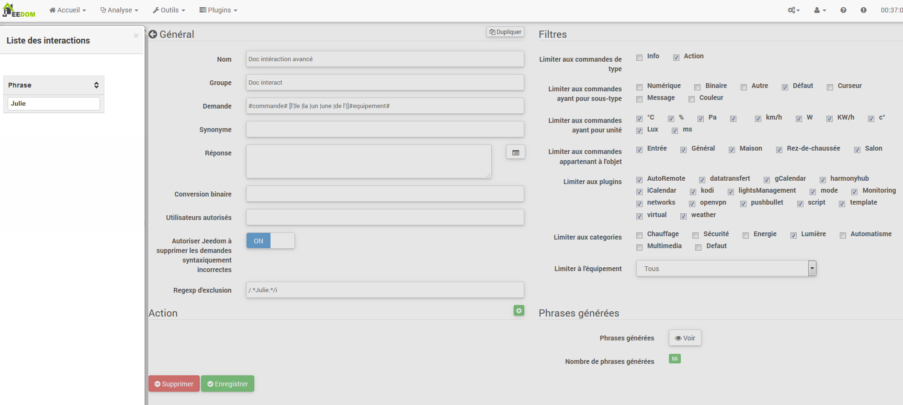

# Interactions
**Ferramentas → Interações**

O sistema de interação no Jeedom permite executar ações a partir de comandos de texto ou voz.

Esses pedidos podem ser obtidos por :

- SMS : envie um SMS para iniciar comandos (ação) ou faça uma pergunta (informações).
- Cat : Telegrama, Slack, etc.
- Vocal : dite uma frase com Siri, Google Now, SARAH etc. Para iniciar comandos (ação) ou fazer uma pergunta (informações).
- HTTP : inicie uma URL HTTP contendo o texto (ex. Tasker, Slack) para iniciar comandos (ação) ou fazer uma pergunta (informações).

O valor das interações reside na integração simplificada em outros sistemas, como smartphones, tablets, outras caixas de automação residencial, etc.

> **Dica**
>
> Você pode abrir uma interação fazendo :
> - Clique em um deles.
> - Ctrl Clic ou Clic Center para abri-lo em uma nova guia do navegador.

Você tem um mecanismo de pesquisa para filtrar a exibição de interações. A tecla Escape cancela a pesquisa.
À direita do campo de pesquisa, três botões encontrados em vários lugares no Jeedom:
- A cruz para cancelar a pesquisa.
- A pasta aberta para desdobrar todos os painéis e exibir todas as interações.
- A pasta fechada para dobrar todos os painéis.

Uma vez na configuração de uma interação, você tem um menu contextual com o botão direito do mouse nas guias da interação. Você também pode usar um Ctrl Click ou Click Center para abrir diretamente outra interação em uma nova guia do navegador.

## Interactions

No topo da página, existem 3 botões :

- **Adicionar** : Permite criar novas interações.
- **Regenerar** : Recréer toutes les interactions (peut être très long &gt; 5mn).
- **Teste** : Abra uma caixa de diálogo para escrever e testar uma frase.

> **Dica**
>
> Se você possui uma interação que gera sentenças para luzes, por exemplo, e adiciona um novo módulo de controle de luz, precisará regenerar todas as interações ou ir para a interação em questão e salvá-la novamente para criar as frases deste novo módulo.

## Principe

O princípio da criação é bastante simples : definiremos uma sentença de modelo geradora que permitirá ao Jeedom criar uma ou mais centenas de outras sentenças, que serão possíveis combinações do modelo.

Definiremos as respostas da mesma maneira com um modelo (isso permite que o Jeedom tenha várias respostas para uma única pergunta).

Também podemos definir um comando a ser executado se, por exemplo, a interação não estiver vinculada a uma ação, mas a informações ou se desejarmos executar uma ação específica após ela (também é possível executar um cenário, controlar várias ordens…).

## Configuration

A página de configuração consiste em várias guias e botões :

- **Frases** : Exibe o número de frases da interação (um clique nelas mostra a você).
- **Registro** : Registra a interação atual.
- **Remover** : Excluir interação atual.
- **Duplicar** : Duplicar a interação atual.

### Guia Geral

- **Nome** : Nome da interação (pode estar vazio, o nome substitui o texto da solicitação na lista de interação).
- **Grupo** : Grupo de interação, isso permite organizá-los (pode estar vazio, portanto estará no grupo "none").
- **Ativos** : Permite ativar ou desativar a interação.
- **Aplicação** : A sentença do modelo de geração (obrigatório).
- **Sinônimo** : Permite definir sinônimos nos nomes dos comandos.
- **Réponse** : A resposta para fornecer.
- **Aguarde antes de responder (s))** : Adicione um atraso de X segundos antes de gerar a resposta. Permite, por exemplo, aguardar o retorno do status de uma lâmpada antes de ser atendido.
- **Conversão binária** : Converte valores binários em abertos / fechados, por exemplo (apenas para comandos do tipo de informações binárias).
- **Usuários autorizados** : Limita a interação com determinados usuários (logins separados por |).

### Guia Filtros

- **Limite para digitar comandos** : Permite usar apenas os tipos de ações, informações ou os 2 tipos.
- **Limite para os comandos que o subtipo** : Limita a geração a um ou mais subtipos.
- **Limite para os comandos dessa unidade** : Permite limitar a geração a uma ou mais unidades (o Jeedom cria automaticamente a lista a partir das unidades definidas em seus pedidos).
- **Limite para pedidos pertencentes ao objeto** : Limita a geração a um ou mais objetos (o Jeedom cria automaticamente a lista a partir dos objetos que você criou).
- **Limitar ao plugin** : Permite limitar a geração a um ou mais plug-ins (o Jeedom cria automaticamente a lista a partir dos plug-ins instalados).
- **Limitar à categoria** : Limita a geração a uma ou mais categorias.
- **Equipamentos limite** : Limita a geração a um único dispositivo / módulo (o Jeedom cria automaticamente a lista a partir dos dispositivos / módulos que você possui).

### Guia Ações

Use se você deseja direcionar um ou mais comandos específicos ou passar parâmetros específicos.

#### Exemples

> **NOTA**
>
> As capturas de tela podem ser diferentes em vista dos desenvolvimentos.

#### Interação simples

A maneira mais simples de configurar uma interação é fornecer um modelo de gerador rígido, sem variação possível. Esse método terá como alvo muito preciso um pedido ou cenário.

No exemplo a seguir, podemos ver no campo "Solicitação" a sentença exata a ser fornecida para acionar a interação. Aqui, para ligar a luz do teto da sala.

Podemos ver, nessa captura, a configuração para ter uma interação vinculada a uma ação específica. Esta ação é definida na parte "Ação" da página.

Podemos muito bem imaginar fazendo o mesmo com várias ações para acender várias lâmpadas na sala, como no exemplo a seguir :

Nos 2 exemplos acima, a sentença modelo é idêntica, mas as ações resultantes dela mudam de acordo com o que está configurado na parte "Ação", portanto, já podemos, com uma interação simples com uma única frase, imaginar ações combinadas entre vários comandos e vários cenários (também podemos acionar cenários na parte de ação das interações).

> **Dica**
>
> Para adicionar um cenário, crie uma nova ação, escreva "cenário" sem acento, pressione a tecla Tab no teclado para abrir o seletor de cenário.

#### Interação com múltiplos comandos

Aqui veremos todo o interesse e todo o poder das interações. Com uma sentença modelo, poderemos gerar sentenças para todo um grupo de comandos.

Retomaremos o que foi feito acima, excluiremos as ações que adicionamos e, em vez da frase fixa, em "Solicitação", usaremos as tags **\#commande\#** e **\#equipement\#**. Portanto, a Jeedom substituirá essas tags pelo nome dos comandos e pelo nome do equipamento (podemos ver a importância de ter nomes consistentes de comando / equipamento).

Então, podemos ver aqui que o Jeedom gerou 152 frases do nosso modelo. No entanto, eles não são muito bem construídos e temos um pouco de tudo.

Para ordenar tudo isso, usaremos os filtros (parte direita da nossa página de configuração). Neste exemplo, queremos gerar sentenças para acender as luzes. Assim, podemos desmarcar o tipo de comando info (se eu salvar, só tenho 95 sentenças) e, nos subtipos, só podemos manter a opção "padrão" marcada, que corresponde ao botão de ação ( então só restam 16 frases).

É melhor, mas podemos torná-lo ainda mais natural. Se eu pegar o exemplo gerado "Na entrada", seria bom poder transformar essa frase em "ativar a entrada" ou "ativar a entrada". Para fazer isso, a Jeedom possui, no campo request, um campo sinônimo que nos permitirá nomear o nome dos comandos de maneira diferente em nossas frases "geradas", aqui está "on", eu até tenho "on2 "em módulos que podem controlar 2 saídas.

Nos sinônimos, indicaremos o nome do comando e os sinônimos a serem usados :

Podemos ver aqui uma sintaxe um pouco nova para sinônimos. Um nome de comando pode ter vários sinônimos, aqui "on" tem o sinônimo "ativar" e "ativar". A sintaxe é, portanto, "*nome do comando*" ***=*** "*sinônimo 1*"***,*** "*sinônimo 2*" (podemos colocar quantos sinónimos quisermos). Em seguida, para adicionar sinônimos para outro nome de comando, basta adicionar uma barra vertical após o último sinônimo "*|*" após o qual você pode novamente nomear o comando que terá sinônimos como para a primeira parte etc.

Já é melhor, mas ainda falta o comando "on" "input" the "l" e para outros o "la" ou "le" ou "a" etc. Poderíamos mudar o nome do equipamento para adicioná-lo, seria uma solução, caso contrário, podemos usar as variações na solicitação. Isso consiste em listar uma série de palavras possíveis em um local da sentença, portanto, o Jeedom irá gerar sentenças com essas variações.

Agora temos frases um pouco mais corretas com frases que não estão corretas, para o nosso exemplo "on" "entry". encontramos "Ativar entrada", "Ativar entrada", "Ativar entrada", "Ativar entrada" etc. Portanto, temos todas as variantes possíveis com o que adicionamos entre o "\ [\]" e este para cada sinônimo, o que gera rapidamente muitas frases (aqui 168).

Para refinar e não ter coisas improváveis como "ligar a TV", podemos permitir que o Jeedom exclua solicitações sintaticamente incorretas. Portanto, excluirá o que está muito longe da sintaxe real de uma frase. No nosso caso, passamos de 168 para 130 frases.

Torna-se, portanto, importante criar bem suas frases e sinônimos de modelo e selecionar os filtros corretos para não gerar muitas frases desnecessárias. Pessoalmente, acho interessante ter algumas inconsistências do estilo "uma entrada", porque se em casa você tiver uma pessoa estrangeira que não fala francês corretamente, as interações ainda funcionarão.

### Personalizar respostas

Até agora, como resposta a uma interação, tínhamos uma frase simples que não falava muito, exceto que algo aconteceu. A idéia seria que Jeedom nos diga o que ele fez um pouco mais precisamente. É aqui que entra o campo de resposta, onde poderemos personalizar o retorno de acordo com o comando executado.

Para fazer isso, usaremos novamente a tag Jeedom. Para nossas luzes, podemos usar uma frase do estilo : Eu liguei \#equipement\# (veja a captura de tela abaixo).

Você também pode adicionar qualquer valor de outro comando, como temperatura, número de pessoas, etc.

### Conversão binária

As conversões binárias se aplicam a comandos do tipo info cujo subtipo é binário (retorna apenas 0 ou 1). Então você precisa ativar os filtros certos, como podemos ver na tela um pouco mais baixo (para as categorias, podemos verificar todos eles, por exemplo, eu apenas mantive a luz).

Como podemos ver aqui, mantive quase a mesma estrutura para a solicitação (é voluntário focar nos detalhes). Claro, eu adaptei os sinônimos para ter algo coerente. No entanto, para a resposta, é **imperativo** colocar apenas \#valeur\# que representa o 0 ou 1 que o Jeedom substituirá pela seguinte conversão binária.

O campo **Conversão binária** deve conter 2 respostas : primeiro a resposta se o valor do comando vale 0, depois uma barra vertical "|" separação e, finalmente, a resposta se o comando vale 1. Aqui as respostas são simplesmente não e sim, mas poderíamos colocar uma frase um pouco mais longa.

> **Aviso**
>
> Tags não funcionam em conversões binárias.

### Usuários autorizados

O campo "Usuários autorizados" permite autorizar apenas determinadas pessoas a executar o comando. Você pode colocar vários perfis, separando-os por um "|".

Exemplo : personne1|personne2

Podemos imaginar que um alarme pode ser ativado ou desativado por uma criança ou um vizinho que viria a regar as plantas na sua ausência.

### Exclusão regexp

É possível criar [Regexp](https://fr.wikipedia.org/wiki/Expression_rationnelle) exclusão, se uma frase gerada corresponder a este Regexp, ela será excluída. O interesse é ser capaz de remover falsos positivos, ou seja, uma sentença gerada pelo Jeedom que ativa algo que não corresponde ao que queremos ou que interferiria em outra interação que teria uma sentença semelhante.

Temos 2 lugares para aplicar um Regexp :
- Na interação, mesmo no campo "Regexp exclusion"".
- No campo Administração → Configuração → Interações → campo "Regexp de exclusão geral para interações"".

Para o campo "Regex de exclusão geral para interações", essa regra será aplicada a todas as interações, que serão criadas ou salvas novamente mais tarde. Se queremos aplicá-lo a todas as interações existentes, precisamos regenerar as interações. Geralmente, é usado para apagar frases formadas incorretamente encontradas na maioria das interações geradas.

Para o campo "Exclusão de Regexp" na página de configuração de cada interação, você pode colocar um Regexp específico que atuará apenas na interação. Portanto, permite excluir com mais precisão uma interação. Também é possível excluir uma interação para uma ordem específica para a qual não se deseja oferecer essa possibilidade dentro da estrutura de uma geração de várias ordens.

A captura de tela a seguir mostra a interação sem o Regexp. Na lista à esquerda, filtro as frases para mostrar apenas as frases que serão excluídas. Na realidade, existem 76 frases geradas com a configuração da interação.

Como você pode ver na captura de tela a seguir, adicionei um regexp simples que procurará a palavra "Julie" nas frases geradas e as excluirá. No entanto, podemos ver na lista à esquerda que sempre existem frases com a palavra "julie". Em expressões regulares, Julie não é igual a julie, isso é chamado de distinção entre maiúsculas e minúsculas. Francês, uma letra maiúscula é diferente de uma minúscula. Como podemos ver na captura de tela a seguir, restam apenas 71 sentenças, as 5 com uma "Julie" foram excluídas.

Uma expressão regular é composta da seguinte maneira :

- Primeiro, um delimitador, aqui está uma barra "/" colocada no início e no final da expressão.
- O ponto após a barra representa qualquer caractere, espaço ou número.
- O "\*" indica que pode haver 0 ou mais vezes o caractere que o precede, aqui um ponto, portanto, em francês, qualquer elemento.
- Julie, que é a palavra a ser procurada (palavra ou outro padrão de expressão), seguida por um ponto novamente e uma barra.

Se traduzirmos esta expressão em uma frase, daria "procure a palavra Julie que é precedida por qualquer coisa e seguida por qualquer coisa".

É uma versão extremamente simples de expressões regulares, mas já muito complicada de entender. Demorei um pouco para entender como funciona. Como um exemplo um pouco mais complexo, uma regexp para verificar um URL :

/\^(https?:\\ / \\ /)?(\ [\\ da-z \\ .- \] +) \\. (\ [az \\. \] {2,6}) (\ [\\ / \\ w \\ .- \] \*)\*\\ /?\ $ /

Depois de escrever isso, você entende as expressões regulares.

Para resolver o problema das letras maiúsculas e minúsculas, podemos adicionar à nossa expressão uma opção que a tornará sem distinção entre maiúsculas e minúsculas, ou seja, que considere uma letra minúscula igual a uma letra maiúscula; Para fazer isso, basta adicionar no final de nossa expressão um "i".

Com a adição da opção "i", vemos que restam apenas 55 sentenças e, na lista à esquerda, com o filtro julie, para encontrar as sentenças que contêm essa palavra, vemos que existem algumas muito mais.

Como este é um assunto extremamente complexo, não entrarei em mais detalhes aqui, existem tutoriais suficientes na rede para ajudá-lo e não esqueça que o Google também é seu amigo, porque sim, é o meu amigo, foi ele quem me ensinou a entender o Regexp e até a codificar. Então, se ele me ajudou, ele também pode ajudá-lo se você colocar boa vontade nele.

Links úteis :

- <http://www.commentcamarche.net/contents/585-javascript-l-objet-regexp>
- <https://www.lucaswillems.com/fr/articles/25/tutoriel-pour-maitriser-les-expressions-regulieres>
- <https://openclassrooms.com/courses/concevez-votre-site-web-avec-php-et-mysql/les-expressions-regulieres-partie-1-2>

### Resposta composta por várias informações

Também é possível colocar vários comandos info em uma resposta, por exemplo, para ter um resumo da situação.

Neste exemplo, vemos uma frase simples que retornará uma resposta com três temperaturas diferentes; portanto, aqui podemos colocar um pouco do que quisermos para obter um conjunto de informações de uma só vez.

### Existe alguém na sala ?

#### Versão básica

- Então a pergunta é "existe alguém na sala"
- A resposta será "não, não há ninguém na sala" ou "sim, há alguém na sala"
- O comando que responde a isso é "\#\[Chambre de julie\]\[FGMS-001-2\]\[Présence\]\#"

Este exemplo visa especificamente equipamentos específicos que permitem uma resposta personalizada. Então, podemos imaginar substituir a resposta do exemplo por "não, não há ninguém na sala *julie*|sim tem alguém na sala *julie*"

#### Evolution

- Então a pergunta é "\#commande\# \ [no |no \] \#objet\#"
- A resposta será "não, não há ninguém na sala" ou "sim, há alguém na sala"
- Não há nenhum comando que responda a isso na parte Ação, pois é uma interação de Vários Comandos
- Ao adicionar uma expressão regular, podemos limpar os comandos que não queremos ver, para ter apenas as frases nos comandos "Presença"".

Sem o Regexp, obtemos aqui 11 sentenças, mas minha interação visa gerar sentenças apenas para perguntar se há alguém em uma sala, por isso não preciso do status da lâmpada ou de outro tipo. saídas, que podem ser resolvidas com a filtragem regexp. Para torná-lo ainda mais flexível, você pode adicionar sinônimos, mas, neste caso, não se esqueça de modificar o regexp.

### Conheça a temperatura / umidade / brilho

#### Versão básica

Poderíamos escrever a frase com força, como por exemplo "qual é a temperatura da sala", mas seria necessário criar uma para cada sensor de temperatura, brilho e umidade. Com o sistema de geração de sentenças Jeedom, podemos gerar sentenças para todos os sensores desses 3 tipos de medição com uma única interação.

Aqui está um exemplo genérico usado para conhecer a temperatura, umidade e brilho das diferentes salas (objeto no sentido Jeedom).

- Assim, podemos ver que uma frase genérica como "Qual é a temperatura na sala de estar" ou "Qual é o brilho do quarto" pode ser convertida em : "o que é \ |l \\ '\] \#commande\# objeto "(o uso de \ [word1 | word2 \] permite que você diga essa possibilidade ou que gere todas as variantes possíveis da frase com a palavra1 ou a palavra2). Ao gerar o Jeedom, todas as combinações possíveis de frases serão geradas com todos os comandos existentes (dependendo dos filtros) substituindo \#commande\# pelo nome do comando e \#objet\# pelo nome do objeto.
- A resposta será "21 ° C" ou "200 lux". Basta colocar : \#valeur\# \#unite\# (a unidade deve ser concluída na configuração de cada comando para o qual queremos ter um)
- Portanto, este exemplo gera uma sentença para todos os comandos do tipo de informação digital que possuem uma unidade, para que possamos desmarcar as unidades no filtro certo, limitadas ao tipo que nos interessa.

#### Evolution

Podemos, portanto, adicionar sinônimos ao nome do comando para ter algo mais natural, adicionar um regexp para filtrar os comandos que nada têm a ver com a nossa interação.

Adicionando um sinônimo, digamos ao Jeedom que um comando chamado "X" também pode ser chamado de "Y" e, portanto, em nossa sentença, se tivermos "ativado y", o Jeedom sabe que está ativado x. Este método é muito conveniente para renomear nomes de comandos que, quando exibidos na tela, são escritos de maneira não natural, vocalmente ou em uma frase escrita como "ON"". Um botão escrito assim é completamente lógico, mas não no contexto de uma frase.

Também podemos adicionar um filtro Regexp para remover alguns comandos. Usando o exemplo simples, vemos as frases "bateria" ou "latência", que nada têm a ver com nossa interação temperatura / umidade / luz.

Então podemos ver uma regexp :

**(batterie|latence|pression|vitesse|consommation)**

Isso permite que você exclua todos os comandos que possuem uma dessas palavras em suas frases

> **NOTA**
>
> O regexp aqui é uma versão simplificada para fácil utilização. Portanto, podemos usar expressões tradicionais ou expressões simplificadas, como neste exemplo.

### Controlar um dimmer ou um termostato (controle deslizante)

#### Versão básica

É possível controlar uma lâmpada como uma porcentagem (dimmer) ou um termostato com as interações. Aqui está um exemplo para controlar seu dimmer em uma lâmpada com interações :

Como podemos ver, existe aqui no pedido a tag **\#consigne\#** (você pode colocar o que deseja), incluído no controle do inversor, para aplicar o valor desejado. Para fazer isso, temos 3 partes : \* Aplicação : em que criamos uma tag que representará o valor que será enviado para a interação. \* Réponse : reutilizamos a tag da resposta para garantir que o Jeedom entenda corretamente a solicitação. \* Ação : colocamos uma ação na lâmpada que queremos acionar e, no valor que passamos, nossa tag *ordem*.

> **NOTA**
>
> Podemos usar qualquer tag, exceto as já usadas pelo Jeedom, pode haver várias para controlar, por exemplo, vários comandos. Observe também que todas as tags são passadas para os cenários iniciados pela interação (no entanto, é necessário que o cenário esteja em "Executar em primeiro plano"").

#### Evolution

Podemos querer controlar todos os comandos de tipo de cursor com uma única interação. Com o exemplo a seguir, poderemos controlar várias unidades com uma única interação e, portanto, gerar um conjunto de sentenças para controlá-las.

Nesta interação, não temos comando na parte de ação, deixamos o Jeedom gerar a partir de tags a lista de frases. Podemos ver a tag **\#slider\#**. É imperativo usar essa tag para obter instruções em um comando de interação múltipla, que pode não ser a última palavra da frase. Também podemos ver no exemplo que podemos usar na resposta uma tag que não faz parte da solicitação. A maioria das tags disponíveis nos cenários também está disponível nas interações e, portanto, pode ser usada em uma resposta.

Resultado da interação :

Podemos ver que a tag **\#equipement\#** que não é usado na solicitação está bem concluído na resposta.

### Controlar a cor de uma faixa de LED

É possível controlar um comando de cor pelas interações, pedindo ao Jeedom, por exemplo, para acender uma faixa de LED azul. Esta é a interação a ser feita :

Até agora nada complicado, no entanto, você deve ter configurado as cores no Jeedom para que funcione; vá ao menu → Configuração (canto superior direito) e depois na seção "Configuração das interações"" :

Como podemos ver na captura de tela, não há cores configuradas, então você deve adicionar cores com o "+" à direita. O nome da cor, é o nome que você passará para a interação e, na parte direita (coluna "código HTML"), clicando na cor preta, podemos escolher uma nova cor.

Podemos adicionar quantos quisermos, podemos colocar qualquer nome como qualquer outro, para que possamos imaginar atribuir uma cor ao nome de cada membro da família.

Uma vez configurado, você diz "Ilumine a árvore em verde", o Jeedom pesquisará na solicitação uma cor e aplicará à ordem.
### Use juntamente com um cenário

#### Versão básica

É possível acoplar uma interação a um cenário para executar ações um pouco mais complexas do que a execução de uma ação simples ou uma solicitação de informações.

Este exemplo, portanto, permite iniciar o cenário que está vinculado na parte da ação; é claro que podemos ter vários.

### Programando uma ação com interações

As interações fazem muitas coisas em particular. Você pode programar uma ação dinamicamente. Exemplo : "Liga o calor às 22 para 14:50". Nada poderia ser mais simples, basta usar as tags \#time\# (se um horário específico estiver definido) ou \#duration\# (no tempo X, por exemplo, em 1 hora) :

> **NOTA**
>
> Você notará na resposta a tag \#value\# isto contém, no caso de uma interação programada, o tempo efetivo de programação
