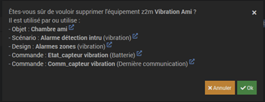
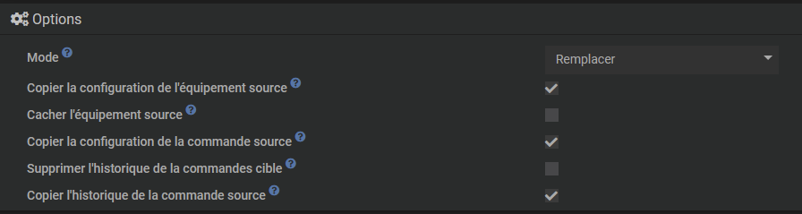
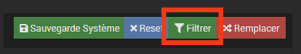
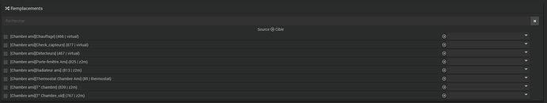
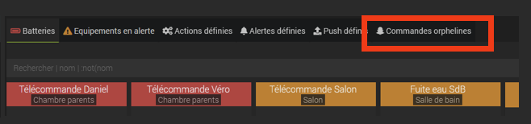
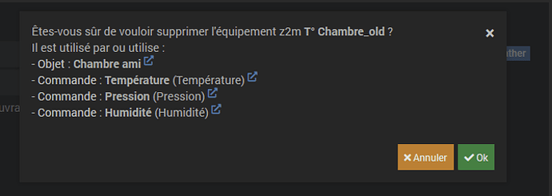

 # Remplacer

## Por que tal ferramenta ?

Jeedom oferece desde a versão 4.3.2 uma nova ferramenta <kbd>Substituir</kbd> que, em caso de problema ou necessidade de substituição de equipamentos físicos ou virtuais (sensor de temperatura ou presença, controle de volume, nível de água, etc.), garantirá a cópia de todos os comandos, informações, parâmetros avançados e histórico deste equipamento para novos equipamentos. 
Também será responsável por substituir o ID do equipamento antigo pelo novo em todos os cenários, designs, virtuais, etc.

Com efeito, se o equipamento antigo for eliminado, a referência ao seu número de identificação original será permanentemente apagada. Será então necessário recriar todos os comandos e reintegrá-los em todos os designs, widgets, etc. para o novo módulo, mesmo que seja estritamente do mesmo tipo do original, ou mesmo igual, mas com um número de ID diferente. 
Além disso, antes de qualquer exclusão de equipamento, Jeedom avisará sobre as consequências dessa exclusão em uma janela de alerta :

Aqui, a remoção deste sensor de vibração causará :

- Excluir as exibições definidas no design 'Zonas de alarmes'',
- Exclusão de informações de vibração, nível de bateria e data da última comunicação, incluindo histórico,
- La suppression de l'équipement dans le scénario ‘Alarme détection intru'.

E a partir do momento em que este equipamento for definitivamente eliminado, será substituído em todas estas entidades pelo seu antigo número de identificação, ou por um campo vazio no lugar do seu nome original :

  

## Operações a realizar antes de usar esta ferramenta

Mesmo que a ferramenta <kbd>Substituir</kbd> sugira que você faça primeiro um backup de precaução, é altamente recomendável fazer um antes de iniciar este procedimento de substituição. 
Tenha em mente que esta ferramenta é realmente muito poderosa porque irá realizar substituições em todos os níveis, incluindo aqueles que você não tinha pensado ou simplesmente esquecido. Além disso, não há função *desfazer* cancelar ou voltar.  

A próxima fase será a renomeação dos equipamentos antigos. Para isso, basta alterar seu nome, acrescentando o sufixo '**_velho**' Por exemplo.

 

Não se esqueça de salvar.
 

Deve-se então realizar a inclusão do novo equipamento caso seja um equipamento físico, ou a criação do novo equipamento virtual, seguindo o procedimento padrão específico de cada plugin.
Este equipamento será nomeado com seu nome final, depois o objeto pai e sua categoria definida antes de ativá-lo. 
 
Obtemos assim dois equipamentos :

- Equipamentos antigos, que podem já não existir fisicamente, mas que no entanto continuam referenciados em todas as estruturas Jeedom com as suas histórias,
- E os novos equipamentos, nos quais será necessário copiar os históricos e referenciá-los no lugar do antigo.
 

  

## Usando a ferramenta <kbd>Substituir</kbd>>

Abra a ferramenta <kbd>Substituir</kbd> , no menu <kbd>Ferramentas</kbd>>.

 

No campo *Objeto*, selecione objeto(s) pai(s).

 

Nas opções, selecione o modo desejado (*Substituir* Ou *Cópia*) na lista suspensa, e dependendo das necessidades, as seguintes opções (todas desmarcadas por padrão), ou pelo menos :

- Copiar configuração do dispositivo de origem,
- Copiar configuração do comando de origem.
 

 

Depois clique em <kbd>Filtrar</kbd>>

 

No campo *Substituições*, todas as entidades relacionadas ao objeto pai aparecem :

 

Verifique o dispositivo de origem (renomeado para '**_velho**'), isto é, aquele do qual desejamos copiar os pedidos, informações, histórico, etc
Aqui, o equipamento fonte será, portanto, : [Quarto do amigo][T°Chambre_old](767 | z2m). 
Clique na linha para exibir os diferentes campos relacionados.

 

No jogo *Alvo* à direita, role a lista para baixo e selecione o novo equipamento que irá substituí-lo, ou seja, [Quarto de hóspedes][Temperatura ambiente] em nosso exemplo.

 

Nas listas suspensas que são exibidas à direita, a informação é apresentada sobre um fundo azul, as ações sobre um fundo laranja (abaixo outro exemplo de uma luminária onde existem ações e informações).

 

E se houver uma correspondência direta (mesmo nome em particular), os diferentes parâmetros serão definidos automaticamente.

 

Aqui tudo é reconhecido automaticamente.
Caso contrário, o campo ficará vazio e você terá que selecionar manualmente a informação/ação correspondente na lista suspensa, se for relevante.

 

Clique em <kbd>Substituir</kbd>>,

 

Valide a substituição, verificando se um backup foi feito antes (atenção, não há como voltar atrás !).

 

Além disso, a ferramenta irá sugerir isso a você nesta fase. Mas ao sair desta função para fazer esse backup neste momento, você também abandonará todas as configurações já feitas, daí o interesse em fazer esse backup desde o início do procedimento.  

Após iniciar o comando, após uma breve espera, um pop-up de alerta aparecerá e indicará a conclusão bem-sucedida do procedimento.  

## Verificações

Certifique-se de que o novo equipamento foi levado em consideração nos designs, cenários, widgets, virtuais, plug-ins, etc. com sua configuração (layout, exibição, atribuição de widgets, etc.), e (se aplicável) o associado história.

 

Para verificar adequadamente se nenhum problema adicional foi gerado após esta substituição, é possível usar a função de detecção de comando órfão.
Vá em <kbd>Análise</kbd> , <kbd>Equipamento</kbd> , clique na aba *Comandos órfãos*.

 

 

Se tudo corresse bem, não deveria haver linhas presentes neste relatório.
 

 

Caso contrário, será necessário realizar uma análise linha por linha de cada problema identificado para solucioná-lo.

 

Mas se os comandos órfãos não forem levados em conta pela ferramenta <kbd>Substituir</kbd> , ainda é possível fazer substituições com esta função <kbd>Este comando substitui o ID</kbd> encontrado aqui na janela de configuração do comando :

  

## Finalisation

Se tudo estiver correto, o equipamento antigo (T°Chambre_old no exemplo) poderá então ser excluído permanentemente. Nenhuma outra referência deverá aparecer no pop-up de aviso durante a exclusão, exceto para comandos intrínsecos a este equipamento.

 

Aqui, este equipamento é referenciado apenas pelo seu objeto pertencente e pelos seus próprios comandos, o que é normal. Podemos, portanto, excluí-lo sem arrependimentos.  

## Conclusion

Esta ferramenta é prática, mas é igualmente perigosa se utilizada indevidamente devido às suas implicações em vários níveis. 
Além disso, mantenha esses fundamentos em mente :

- Execute sistematicamente um backup preventivo, mesmo antes de usar a ferramenta <kbd>Substituir</kbd>>,
- Não há possibilidade de desfazer ou reverter após executar este comando,
- E por último, é altamente recomendável que você se familiarize pelo menos com o uso desta ferramenta.
