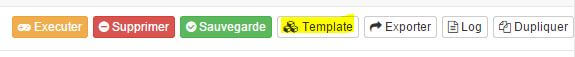
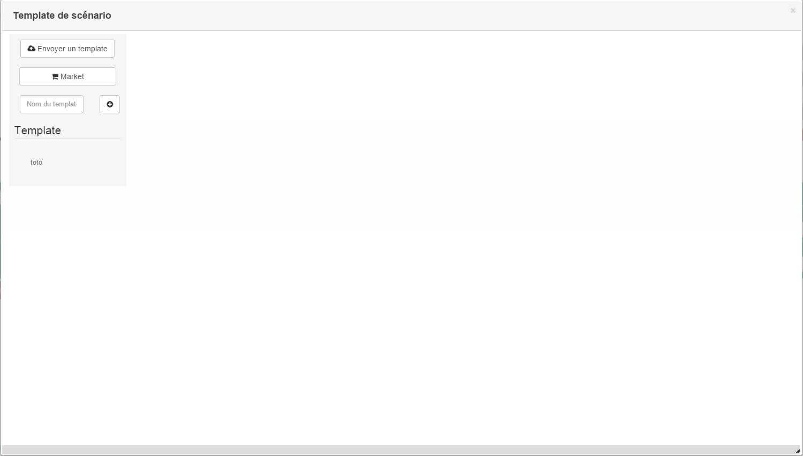
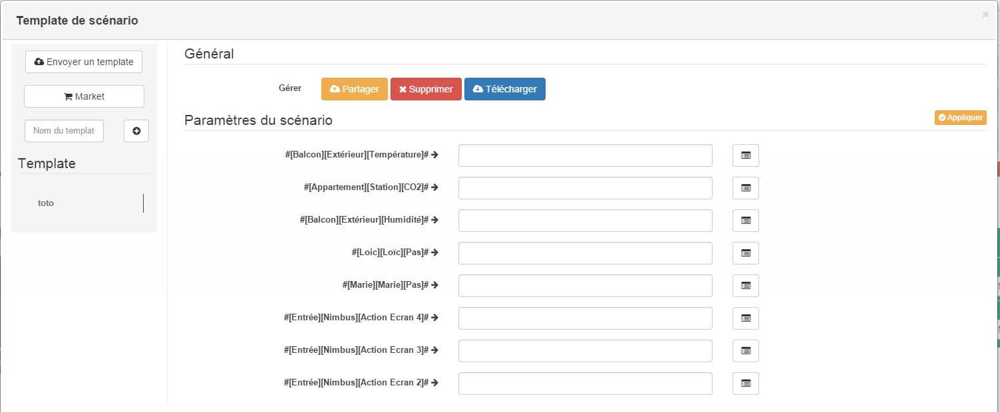

Aqui está a parte mais importante da automação residencial : os cenários.
Verdadeiro cérebro da domótica, é o que torna possível interagir com
o mundo real de uma "maneira inteligente".

A página de gerenciamento de cenários
================================

Gestion
-------

Para acessá-lo, nada mais simples, basta acessar Ferramentas ->
Cenários. Você encontrará a lista de cenários para o seu Jeedom também
apenas funciona para gerenciá-los melhor :

-   **Adicionar** : Crie um cenário. O procedimento é descrito
    no próximo capítulo.

-   **Desativar cenários** : Desativa todos os cenários.

-   **Veja variáveis** : Vamos ver as variáveis, seu valor também
    que o local onde eles são usados. Você também pode
    criar um. As variáveis são descritas em um capítulo da
    esta página.

-   **Visão global** : Permite que você tenha uma visão geral de todos
    os cenários. Você pode alterar os valores **Ativos**,
    **Visivél**, **Multi lançamento**, **Sincronicamente**, **Log** et
    **Cronograma** (esses parâmetros são descritos no capítulo a seguir).
    Você também pode acessar os logs para cada cenário e
    comece individualmente.

-   **Expressão Tester** : Permite executar um teste em um
    expressão de sua escolha e exiba o resultado.

Meus scripts
-------------

Nesta seção, você encontrará o **lista de cenários** que você
criaram. Eles são classificados de acordo com **grupos** que você tem
definido para cada um deles. Cada cenário é exibido com seus **Nome**
e o dele **Objeto pai**. O **cenários esmaecidos** são aqueles que são
desabilitado.

Como em muitas páginas Jeedom, coloque o mouse à esquerda de
a tela exibe um menu de acesso rápido (de
seu perfil, você sempre pode deixá-lo visível). Você pode
ENTÃO **pesquisar** seu cenário, mas também em **Adicionar** um por isso
menu.

Editando um Cenário
=====================

Depois de clicar em **Adicionar**, você deve escolher o nome do seu
cenário e você será redirecionado para sua página de configurações gerais.
No topo, existem algumas funções úteis para gerenciar nosso cenário
:

-   **ID** : Ao lado da palavra **Geral**, este é o identificador de cenário.

-   **Estado** : Estado atual do seu cenário.

-   **Variáveis** : Ver variáveis.

-   **Expressão** : Exibe o testador de expressão.

-   **Realizar** : Permite iniciar o cenário manualmente (lembre-se
    sem salvar de antemão !). Os gatilhos não são, portanto,
    não levado em consideração.

-   **Remover** : Excluir cenário.

-   **Salvar** : Salve as alterações feitas.

-   **Modelo** : Permite acessar e aplicar modelos
    para o script do mercado. (explicado na parte inferior da página).

-   **Exportação** : Obter uma versão em texto do script.

-   **Log** : Exibe os logs do cenário.

-   **Duplicar** : Copie o cenário para criar um
    novo com outro nome.

-   **Conexões** : Permite visualizar o gráfico dos elementos vinculados
    com o script.

Guia Geral
--------------

Na aba **Geral**, encontramos os principais parâmetros de
nosso cenário :

-   **Nome do cenário** : O nome do seu cenário.

-   **Display Name** : O nome usado para sua exibição.

-   **Grupo** : Permite organizar os cenários, classificando-os em
    grupos.

-   **Ativos** : Ativar o cenário.

-   **Visivél** : Usado para tornar o cenário visível.

-   **Objeto pai** : Atribuição a um objeto pai.

-   **Segundos de tempo limite (0 = ilimitado)** : O tempo máximo de execução
    autorizado

-   **Multi lançamento** : Marque esta caixa se desejar
    cenário pode ser iniciado várias vezes ao mesmo tempo.
>**IMPORTANTE**
>
>O multi-lançamento funciona a partir do segundo, ou seja, se você tiver 2 lançamentos no mesmo segundo sem a caixa marcada, ainda haverá 2 lançamentos do cenário (quando não deve). Da mesma forma, durante vários lançamentos no mesmo segundo, é possível que alguns lançamentos percam as tags. Conclusão: você DEVE ABSOLUTAMENTE evitar vários lançamentos nos mesmos segundos.
-   **Sincronicamente** : Inicie o cenário no segmento atual em vez de um segmento dedicado. Aumenta a velocidade de lançamento do cenário, mas pode tornar o sistema instável.

-   **Log** : O tipo de log desejado para o cenário.

-   **Siga na Timeline** : Acompanha o cenário
    na linha do tempo.

-   **Descrição** : Permite escrever um pequeno texto para descrever
    seu cenário.

-   **Modo de cenário** : O cenário pode ser programado, acionado ou
    ambos ao mesmo tempo. Você terá a opção de indicar o (s))
    gatilho (s) (tenha cuidado, há um limite para o número possível de gatilhos por cenário de 15) e a (s) programação (s)).

> **Dica**
>
> Atenção : você pode ter no máximo 28
> gatilhos / programação para um cenário.

Guia Cenário
---------------

É aqui que você criará seu cenário. Nós temos que começar
por **Adicionar bloco**, com o botão à direita. Uma vez um bloco
criado, você pode adicionar outro **Bloco** ou um **Ação**.

> **Dica**
>
> Em condições e ações, é melhor favorecer aspas simples (') em vez de aspas duplas (")

### Blocos

Aqui estão os diferentes tipos de blocos disponíveis :

-   **If / Then / Ou** : Permite que você execute ações
    sob condições).

-   **Ação** : Permite iniciar ações simples sem
    sem condições.

-   **Laço** : Permite executar ações repetidamente
    1 até um número definido (ou mesmo o valor de um sensor ou um
    número aleatório…).

-   **Dans** : Inicia uma ação em X minuto (s) (0 é um
    valor possível). A peculiaridade é que as ações são lançadas
    em segundo plano, para que eles não bloqueiem o restante do cenário.
    Portanto, é um bloco sem bloqueio.

-   **à** : Permite que o Jeedom inicie as ações do bloco em um momento
    tempo determinado (na forma hhmm). Este bloco é sem bloqueio. Ex :
    0030 para 00:30 ou 0146 para 1h46 e 1050 para 10h50.

-   **CÓDIGO** : Permite escrever diretamente no código PHP (solicitação
    algum conhecimento e pode ser arriscado, mas permite não ter
    sem restrições).

-   **COMMENTAIRE** : Permite adicionar comentários ao seu cenário.

Cada um desses blocos tem suas opções para lidar melhor com eles :

-   A caixa de seleção à esquerda permite desativar completamente o
    bloquear sem excluí-lo.

-   A seta dupla vertical à esquerda permite mover todo o
    bloquear por arrastar e soltar.

-   O botão, na extrema direita, permite excluir todo o bloco.

#### Se / Então / Caso contrário, bloqueia, Loop, In e A

> **NOTA**
>
> Nos blocos Si / Então / Caso contrário, setas circulares localizadas
> à esquerda do campo de condição permitem ativar ou não o
> repetição de ações se a avaliação da condição fornecer o mesmo
> resultado que a avaliação anterior.

Para as condições, Jeedom tenta garantir que possamos
escreva o máximo possível em linguagem natural enquanto permanece flexível. Três
botões estão disponíveis à direita deste tipo de bloco para
selecione um item para testar :

-   **Ordem de pesquisa** : Permite procurar um pedido em
    todos aqueles disponíveis no Jeedom. Uma vez que o pedido é encontrado,
    Jeedom abre uma janela para perguntar qual teste você deseja
    executar nele. Se você escolher **Não ponha nada**,
    Jeedom adicionará o pedido sem comparação. Você também pode
    Escolher **e** onde **onde** Na frente **Em seguida** para encadear testes
    em equipamentos diferentes.

-   **Pesquisa cenário** : Permite procurar um cenário
    testar.

-   **Procure equipamento** : O mesmo para equipamentos.

> **Dica**
>
> Há uma lista de tags que permitem acesso a variáveis
> do script ou de outro, ou por hora, data, um
> número aleatório,…. Veja mais os capítulos sobre comandos e
> Tags.

Depois de concluída a condição, você deve usar o botão
"adicionar ", à esquerda, para adicionar um novo **Bloco** ou um
**Ação** no bloco atual.

> **Dica**
>
> Você NÃO DEVE usar [] em testes de condição, apenas parênteses () são possíveis

#### Código de bloco

> **IMPORTANTE**
>
> Observe que as tags não estão disponíveis em um bloco de código.

Controles (sensores e atuadores):
-   cmd::byString ($ string); : Retorna o objeto de comando correspondente.
  -   $string : Link para o pedido desejado : #[objet][Equipamento][commande]# (ex : #[Appartement][Alarme][Ativos]#)
-   cmd::byId ($ id); : Retorna o objeto de comando correspondente.
  -   $id : ID do pedido
-   $cmd->execCmd($options = null); : Execute o comando e retorne o resultado.
  -   $options : Opções para execução de comandos (podem ser específicas do plug-in), opção básica (subtipo de comando) :
    -   Mensagem : $option = array('title' => 'titre du Mensagem , 'message' => 'Mon message');
    -   cor : $option = array('color' => 'couleur en hexadécimal');
    -   controle deslizante : $option = array('slider' => 'valeur voulue de 0 à 100');

Log :
-   log::add ('nome do arquivo', 'nível', 'mensagem');
  -   filename : Nome do arquivo de log.
  -   nível : [depuração], [informações], [erro], [evento].
  -   Mensagem : Mensagem para escrever nos logs.

Cenas :
-   $scenario->getName(); : Retorna o nome do cenário atual.
-   $scenario->getGroup(); : Retorna o grupo de cenários.
-   $scenario->getIsActive(); : Retorna o estado do cenário.
-   $scenario->setIsActive($active); : Permite ativar ou não o cenário.
  -   $active : 1 ativo, 0 inativo.
-   $scenario->setOnGoing($onGoing); : Vamos dizer se o cenário está em execução ou não.
  -   $onGoing => 1 en cours , 0 arrêté.
-   $scenario->save(); : Salvar alterações.
-   $scenario->setData($key, $value); : Salvar um dado (variável).
  -   $key : chave de valor (int ou string).
  -   $value : valor a armazenar (int, string, array ou objeto).
-   $scenario->getData($key); : Obter dados (variável).
  -   $key => chave de valor (int ou string).
-   $scenario->removeData($key); : Excluir dados.
-   $scenario->setLog($message); : Escreva uma mensagem no log de script.
-   $scenario->persistLog(); : Forçar a gravação do log (caso contrário, ele será gravado apenas no final do cenário). Cuidado, isso pode atrasar um pouco o cenário.

### Acções

As ações adicionadas aos blocos têm várias opções. Em ordem :

-   Uma caixa **paralelo** para que este comando seja lançado em paralelo
    outros comandos também selecionados.

-   Uma caixa **ativado** para que esse comando seja levado em consideração
    conta no cenário.

-   Um **seta dupla vertical** para mover a ação. Apenas
    arraste e solte a partir daí.

-   Um botão para excluir a ação.

-   Um botão para ações específicas, sempre com o
    descrição desta ação.

-   Um botão para procurar um comando de ação.

> **Dica**
>
> Dependendo do comando selecionado, podemos ver diferentes
> campos adicionais exibidos.

Possíveis substituições
===========================

Triggers
----------------

Existem gatilhos específicos (além dos fornecidos pelo
commandes) :

-   #start# : Acionado no (re) início do Jeedom,

-   #begin_backup# : Evento enviado no início de um backup.

-   #end_backup# : Evento enviado no final de um backup.

-   #begin_update# : Evento enviado no início de uma atualização.

-   #end_update# : Evento enviado no final de uma atualização.

-   #begin_restore# : Evento enviado no início de uma restauração.

-   #end_restore# : Evento enviado no final de uma restauração.

-   #user_connect# : Login do usuário

Você também pode disparar um cenário quando uma variável estiver definida como
dia colocando : #variable(nom_variable)# ou usando a API HTTP
descrito
[aqui](https://jeedom.github.io/core/pt_PT/api_http).

Operadores de comparação e links entre condições
-------------------------------------------------------

Você pode usar qualquer um dos seguintes símbolos para
comparações em condições :

-   == : Igual a,

-   \> : Estritamente maior que,

-   \>= : Maior ou igual a,

-   < : Estritamente menor que,

-   <= : Menor ou igual a,

-   != : Diferente de, não é igual a,

-   correspondências : contém (ex :
    [Banheiro] [Hidrometria] [condição] corresponde a "/ molhado /" ),

-   não (... corresponde) : não contém (ex :
    not ([Banheiro] [Hidrometria] [condição] corresponde a "/ molhado /")),

Você pode combinar qualquer comparação com operadores
seguindo :

-   && / ET / e / AND / e : et,

-   \|| / OU / ou / OU / ou : ou,

-   \|^ / XOR / xor : ou exclusivo.

Tags
--------

Uma tag é substituída durante a execução do cenário por seu valor. Você
pode usar as seguintes tags :

> **Dica**
>
> Para exibir os zeros à esquerda, use o
> Função Date (). Veja
> [aqui](http://php.net/manual/fr/function.date.php).

-   #seconde# : Segundo atual (sem zeros à esquerda, ex : 6 para
    08:07:06),

-   #heure# : Hora atual no formato 24h (sem zeros à esquerda),
    ex : 8 para 08:07:06 ou 17 para 17:15),

-   #heure12# : Hora atual no formato de 12 horas (sem zeros à esquerda),
    ex : 8 para 08:07:06),

-   #minute# : Minuto atual (sem zeros à esquerda, ex : 7 para
    08:07:06),

-   #jour# : Dia atual (sem zeros à esquerda, ex : 6 para
    07/06/2017),

-   #mois# : Mês atual (sem zeros à esquerda, ex : 7 para
    07/06/2017),

-   #annee# : Ano atual,

-   #time# : Hora e minuto atuais (ex : 1715 para 17h15),

-   #timestamp# : Número de segundos desde 1 de janeiro de 1970,

-   #date# : Dia e mês. Atenção, o primeiro número é o mês.
    (ex : 1215 para 15 de dezembro),

-   #semaine# : Número da semana (ex : 51),

-   #sjour# : Nome do dia da semana (ex : Samedi),

-   #njour# : Número do dia de 0 (domingo) a 6 (sábado),

-   #smois# : Nome do mês (ex : Janvier),

-   #IP# : IP interno da Jeedom,

-   #hostname# : Nome da máquina Jeedom,

-   #trigger# : Talvez o nome do comando que iniciou o cenário, 'api', se o lançamento foi iniciado pela API, 'schedule', se foi iniciado pela programação, 'user', se iniciado manualmente

Você também possui as seguintes tags adicionais se o seu script tiver sido
desencadeado por uma interação :

-   #query# : Interação que acionou o cenário,

-   #profil# : perfil do usuário que iniciou o cenário
    (pode estar vazio).

> **IMPORTANTE**
>
> Quando um cenário é acionado por uma interação, é
> necessariamente executado no modo rápido.

Funções de cálculo
-----------------------

Várias funções estão disponíveis para o equipamento :

-   average (order, period) and averageBetween (order, start, end)
    : Dê a média do pedido ao longo do período
    (período = [mês, dia, hora, min] ou [expressão
    PHP](http://php.net/manual/fr/datetime.formats.relative.php)) ou
    entre os 2 terminais necessários (no formato Ymd H:i:s ou
    [expressão
    PHP](http://php.net/manual/fr/datetime.formats.relative.php)) :

-   min (ordem, período) e minBetween (ordem, início, fim) :
    Dê o pedido mínimo durante o período
    (período = [mês, dia, hora, min] ou [expressão
    PHP](http://php.net/manual/fr/datetime.formats.relative.php)) ou
    entre os 2 terminais necessários (no formato Ymd H:i:s ou
    [expressão
    PHP](http://php.net/manual/fr/datetime.formats.relative.php)) :

-   max (ordem, período) e maxBetween (ordem, início, fim) :
    Forneça o máximo do pedido durante o período
    (período = [mês, dia, hora, min] ou [expressão
    PHP](http://php.net/manual/fr/datetime.formats.relative.php)) ou
    entre os 2 terminais necessários (no formato Ymd H:i:s ou
    [expressão
    PHP](http://php.net/manual/fr/datetime.formats.relative.php)) :

-   duração (ordem, valor, período) e
    durationbetween (comando, valor, início, fim) : Indique a duração em
    minutos durante os quais o equipamento teve o valor selecionado no
    período (período = [mês, dia, hora, min] ou [expressão
    PHP](http://php.net/manual/fr/datetime.formats.relative.php)) ou
    entre os 2 terminais necessários (no formato Ymd H:i:s ou
    [expressão
    PHP](http://php.net/manual/fr/datetime.formats.relative.php)) :

-   estatísticas (ordem, cálculo, período) e
    statisticsBetween (comando, cálculo, início, fim) : Dê o resultado
    cálculos estatísticos diferentes (soma, contagem, padrão,
    variação, média, mín. e máx.) durante o período
    (período = [mês, dia, hora, min] ou [expressão
    PHP](http://php.net/manual/fr/datetime.formats.relative.php)) ou
    entre os 2 terminais necessários (no formato Ymd H:i:s ou
    [expressão
    PHP](http://php.net/manual/fr/datetime.formats.relative.php)) :

-   tendência (ordem, período, limite) : Dá a tendência de
    ordem durante o período (período = [mês, dia, hora, min] ou
    [expressão
    PHP](http://php.net/manual/fr/datetime.formats.relative.php)) :

-   stateDuration (comando) : Dá duração em segundos
    desde a última mudança de valor. Retorna -1 se nenhum
    o histórico não existe ou se o valor não existe no histórico.
    Retorna -2 se o pedido não estiver registrado.

-   lastChangeStateDuration (comando, valor) : Indique a duração em
    segundos desde a última mudança de estado para o valor passado
    como parâmetro. Retorna -1 se nenhum
    o histórico não existe ou se o valor não existe no histórico.
    Retorna -2 se o pedido não estiver registrado

-   lastStateDuration (comando, valor) : Dá duração em segundos
    durante o qual o equipamento teve recentemente o valor escolhido.
    Retorna -1 se não houver histórico ou se o valor não existir no histórico.
    Retorna -2 se o pedido não estiver registrado

-   stateChanges (ordem, [valor], período) e
    stateChangesBetween (comando, [valor], início, fim) : Dê o
    número de alterações de estado (para um determinado valor, se indicado,
    ou no total, de outra forma) durante o período (período = [mês, dia, hora, min] ou
    [expressão
    PHP](http://php.net/manual/fr/datetime.formats.relative.php)) ou
    entre os 2 terminais necessários (no formato Ymd H:i:s ou
    [expressão
    PHP](http://php.net/manual/fr/datetime.formats.relative.php)) :

-   lastBetween (comando, início, fim) : Retorna o último valor
    registrado para o equipamento entre os 2 terminais necessários (sob o
    formulário Ymd H:i:s ou [expressão
    PHP](http://php.net/manual/fr/datetime.formats.relative.php)) :

-   variável (variável, valor padrão) : Obtenha o valor de um
    variável ou o valor padrão desejado :

-   cenário (cenário) : Retorna o status do cenário. 1 em andamento, 0
    se parado e -1 se desativado, -2 se o cenário não existir e -3
    se o estado não for consistente. Para ter o nome "humano" do cenário, você pode usar o botão dedicado à direita da pesquisa de cenário.

-   lastScenarioExecution (cenário) : Dá duração em segundos
    desde o lançamento do último cenário :

-   collectDate (cmd, [formato]) : Retorna a data dos últimos dados
    para o comando fornecido como parâmetro, o segundo parâmetro opcional
    permite especificar o formato de retorno (detalhes
    [aqui](http://php.net/manual/fr/function.date.php)). Um retorno de -1
    significa que o pedido não pode ser encontrado e -2 que o pedido não é
    nenhum tipo de informação

-   valueDate (cmd, [formato]) : Retorna a data dos últimos dados
    para o comando fornecido como parâmetro, o segundo parâmetro opcional
    permite especificar o formato de retorno (detalhes
    [aqui](http://php.net/manual/fr/function.date.php)). Um retorno de -1
    significa que o pedido não pode ser encontrado e -2 que o pedido não é
    nenhum tipo de informação

-   eqEnable (equipamento) : Retorna o status do equipamento. -2 se
    o equipamento não pode ser encontrado, 1 se o equipamento estiver ativo e 0 se não estiver
    está inativo

-   valor (cmd) : Retorna o valor de um pedido se ele não for fornecido automaticamente pelo Jeedom (caso ao armazenar o nome do pedido em uma variável)    

-   tag (montag, [padrão]) : Usado para recuperar o valor de uma tag ou
    o padrão se não existir :

-   nome (tipo, comando) : Usado para recuperar o nome do comando,
    equipamento ou objeto. O tipo vale cmd, eqLogic ou
    objeto.

-   lastCommunication (equipamento, [formato]) : Retorna a data da última comunicação
    para o equipamento dado como parâmetro, o segundo parâmetro opcional
    permite especificar o formato de retorno (detalhes
    [aqui](http://php.net/manual/fr/function.date.php)). Um retorno de -1
    significa que o equipamento não pode ser encontrado

-   color_gradient (start_colour, end_colour, min_value, max_value, value) : Retorna uma cor calculada com relação ao valor no intervalo color_start / color_end. O valor deve estar entre min_value e max_value

Os períodos e intervalos dessas funções também podem
use com [expressões
PHP](http://php.net/manual/fr/datetime.formats.relative.php) comme par
Exemplo :

-   Agora : maintenant

-   Hoje : 00:00 hoje (permite, por exemplo, obter
    resultados do dia se entre 'Hoje' e 'Agora')

-   Segunda-feira passada : segunda-feira passada às 00:00

-   5 dias atrás : 5 dias atrás

-   Ontem meio-dia : ontem ao meio dia

-   Etc.

Aqui estão exemplos práticos para entender os valores retornados por
essas diferentes funções :

| Soquete com valores :           | 000 (por 10 minutos) 11 (por 1 hora) 000 (por 10 minutos))    |
|--------------------------------------|--------------------------------------|
| média (captura, período)             | Retorna a média de 0 e 1 (pode  |
|                                      | ser influenciado por pesquisas)      |
| averageBetween(\#[Salle de bain][Hydrometrie][Humidité]\#,01-01 2015 00:00:00,2015-01-15 00:00:00) | Retorna o pedido médio entre 1 de janeiro de 2015 e 15 de janeiro de 2015                         |
| min (captura, período)                 | Retorna 0 : o plugue foi extinto durante o período              |
| minBetween(\#[Salle de bain][Hydrometrie][Humidité]\#,01-01 2015 00:00:00,2015-01-15 00:00:00) | Retorna o pedido mínimo entre 1 de janeiro de 2015 e 15 de janeiro de 2015                         |
| max (captura, período)                 | Retorna 1 : o plugue estava bem iluminado no período              |
| maxBetween(\#[Salle de bain][Hydrometrie][Humidité]\#,01-01 2015 00:00:00,2015-01-15 00:00:00) | Retorna o máximo do pedido entre 1 de janeiro de 2015 e 15 de janeiro de 2015                         |
| duração (tomada, 1, período)          | Retorna 60 : o plugue ficou (em 1) por 60 minutos no período                              |
| durationBetween(\#[Salon][Prise][Etat]\#,0, última segunda-feira, agora)   | Retorna a duração em minutos durante os quais o soquete estava desativado desde a última segunda-feira.                |
| estatísticas (captura, contagem, período)    | Retorna 8 : houve 8 escalações no período               |
| tendência (captura, período, 0.1)        | Retorna -1 : tendência descendente    |
| stateDuration (tomado)               | Retorna 600 : o plugue está em seu estado atual por 600 segundos (10 minutos)                             |
| lastChangeStateDuration (obtido, 0)   | Retorna 600 : o soquete saiu (mude para 0) pela última vez há 600 segundos (10 minutos)     |
| lastChangeStateDuration (take, 1)   | Retorna 4200 : a tomada ligada (mude para 1) pela última vez há 4200 segundos (1h10)                               |
| lastStateDuration (obtido, 0)         | Retorna 600 : o soquete está desligado por 600 segundos (10 minutos)     |
| lastStateDuration (tomado, 1)         | Retorna 3600 : o soquete foi ligado pela última vez por 3600 segundos (1 h)           |
| stateChanges (tomadas, período)        | Retorna 3 : o plugue mudou de estado 3 vezes durante o período            |
| stateChanges (take, 0, period)      | Retorna 2 : o soquete apagou (passando para 0) duas vezes durante o período                              |
| stateChanges (take, 1, period)      | Retorna 1 : o plugue está aceso (mude para 1) uma vez durante o período                              |
| lastBetween(\#[Salle de bain][Hydrometrie][Humidité]\#,Ontem Hoje) | Retorna a última temperatura registrada ontem.                    |
| variável (plop, 10)                  | Retorna o valor da variável plop ou 10 se estiver vazia ou não existir                         |
| scenario(\#[Salle de bain][Lumière][Auto]\#) | Retorna 1 em andamento, 0 se parado e -1 se desativado, -2 se o cenário não existir e -3 se o estado não for consistente                         |
| lastScenarioExecution(\#[Salle de bain][Lumière][Auto]\#)   | Retorna 300 se o cenário foi iniciado pela última vez há 5 minutos                                  |
| collectDate(\#[Salle de bain][Hydrometrie][Humidité]\#)     | Devoluções 01-01-2015 17:45:12          |
| valueDate(\#[Salle de bain][Hydrometrie][Humidité]\#) | Devoluções 01-01-2015 17:50:12          |
| eqEnable(\#[Aucun][Basilique]\#)       | Retorna -2 se o equipamento não for encontrado, 1 se o equipamento estiver ativo e 0 se estiver inativo          |
| tag (montag, toto)                   | Retorna o valor de "montag" se existir, caso contrário, retorna o valor "para"                               |
| nome (eqLogic, \#[Salle de bain][Hydrometrie][Humidité]\#)     | Retorna Hidrometria                  |

Funções matemáticas
---------------------------

Uma caixa de ferramentas de funções genéricas também pode ser usada para
realizar conversões ou cálculos :

-   rand(1,10) : Dê um número aleatório de 1 a 10.

-   randText (texto1; texto2; texto…..) : Retorna um dos
    textos aleatoriamente (separe os textos por um; ). Não existe
    limite no número de texto.

-   randomColor (min, max) : Dá uma cor aleatória entre 2
    terminais (0 => vermelho, 50 => verde, 100 => azul).

-   gatilho (comando) : Usado para descobrir o gatilho para o cenário
    ou para saber se é o pedido feito como um parâmetro que possui
    desencadeou o cenário.

-   triggerValue (comando) : Usado para descobrir o valor de
    gatilho de cenário.

-   round (valor, [decimal]) : Arredondar acima, [decimal]
    número de casas decimais após o ponto decimal.

-   ímpar (valor) : Permite saber se um número é ímpar ou não.
    Retorna 1 se ímpar 0, caso contrário.

-   mediana (comando1, comando2….commandeN) : Retorna a mediana
    valores.

-   time_op (hora, valor) : Permite que você execute operações no prazo,
    com time = time (ex : 1530) e value = value para adicionar ou adicionar
    subtrair em minutos.

-   `time_between (hora, início, fim)` : Permite testar se é uma hora
    entre dois valores com `time = time` (ex : 1530), `start = time`,` end = time`.
    Os valores inicial e final podem chegar à meia-noite.

-   `time_diff (data1, data1 [, formato])` : Usado para descobrir a diferença entre duas datas (as datas devem estar no formato AAAA / MM / DD HH:MM:SS).
    Por padrão (se você não colocar nada no formato), o método retornará o número total de dias. Você pode perguntar em segundos (s), minutos (m), horas (h). Exemplo em segundos `time_diff (02-02 2018 14:55:00,2018-02-25 14:55:00,s)``

-   `formatTime (time)` : Formata o retorno de uma cadeia
    ``#time#``.

-   andar (tempo / 60) : Converte de segundos para minutos ou
    minutos a horas (piso (tempo / 3600) por segundos
    em horas)

E exemplos práticos :

| Exemplo de função                  | Resultado retornado                    |
|--------------------------------------|--------------------------------------|
| randText (faz #[salon][oeil][température]#; A temperatura é #[salon][oeil][température]#; Atualmente, temos #[salon][oeil][température]#) | a função retornará um desses textos aleatoriamente a cada execução.                           |
| randomColor(40,60)                 | Retorna uma cor aleatória próxima ao verde.   
| trigger(#[Salle de bain][Hydrometrie][Humidité]#)   | 1 se isso é bom \#\[Salle de bain\]\[Hydrometrie\]\[Humidité\]\# quem iniciou o cenário caso contrário 0  |
| triggerValue(#[Salle de bain][Hydrometrie][Humidité]#) | 80 se a hidrometria de \#\[Salle de bain\]\[Hydrometrie\]\[Humidité\]\# é 80%.                         |
| round(#[Salle de bain][Hydrometrie][Humidité]# / 10) | Retorna 9 se a porcentagem de umidade e 85                     |
| odd(3)                             | Retorna 1                            |
| median(15,25,20)                   | Retorna 20                           |
| time_op(#time#, -90)               | se forem 16h50, retorne : 1 650 - 1 130 = 1520                          |
| formatTime(1650)                   | Retorna 16:50                        |
| floor(130/60)                      | Retorna 2 (minutos se 130s ou horas se 130m)                      |

Pedidos específicos
=========================

Além dos comandos de automação residencial, você tem acesso às seguintes ações :

-   **Pausa** (sleep) : Pausa de x segundo (s).

-   **Variável** (variable) : Criação / modificação de uma variável ou valor
    de uma variável.

-   **Remover variável** (delete_variable) : Permite excluir uma variável

-   **Cenas** (scenario) : Permite controlar cenários. A parte de tags
    permite enviar tags para o cenário, ex : montag = 2 (tenha cuidado lá
    use apenas letras de a a z. Sem letras maiúsculas, sem
    acentos e sem caracteres especiais). Recebemos a tag no
    cenário de destino com a função tag (montag). O comando "Redefinir para SI" permite redefinir o status de "SI" (esse status é usado para a não repetição das ações de um "SI" se você passar pela segunda vez consecutiva nele)

-   **Pare** (stop) : Pára o script.

-   **Esperar** (wait) : Aguarde até que a condição seja válida
    (máximo de 2h), o tempo limite é em segundos (s).

-   **Vai o projeto** (gotodesign) : Mude o design exibido em todos
    navegadores por design solicitado.

-   **Adicionar um registro** (log) : Permite adicionar uma mensagem no log.

-   **Criar mensagem** (message) : Adicione uma mensagem no centro
    de mensagens.

-   **Activar / Desactivar Hide / Show equipamentos** (equipement) : Deixa
    modificar as propriedades de um dispositivo
    visível / invisível, ativo / inativo.

-   **Aplicar** (ask) : Permite que você diga ao Jeedom para perguntar
    uma pergunta para o usuário. A resposta é armazenada em um
    variável, então apenas teste seu valor. Por enquanto,
    apenas plugins sms e slack são compatíveis. Tenha cuidado, isso
    função está bloqueando. Enquanto não houver resposta ou o
    timeout não for atingido, o cenário aguarda.

-   **Stop Jeedom** (jeedom_poweroff) : Peça ao Jeedom para desligar.

-   **Reiniciar o Jeedom** (jeedom_reboot) : Peça ao Jeedom para reiniciar.

-   **Retornar um texto / um dado** (scenery_return) : Retorna um texto ou um valor
    para uma interação, por exemplo.

-   **ícone** (icon) : Permite alterar o ícone de representação do cenário.

-   **Aviso** (alert) : Permite exibir uma pequena mensagem de alerta em todos
    navegadores que têm uma página Jeedom aberta. Você pode
    mais, escolha 4 níveis de alerta.

-   **Pop-up** (popup) : Permite exibir um pop-up que deve ser absolutamente
    validado em todos os navegadores que possuem uma página jeedom aberta.

-   **Relatório** (report) : Exportar uma visualização em formato (PDF, PNG, JPEG
    ou SVG) e envie-o através de um comando de tipo de mensagem.
    Observe que, se seu acesso à Internet estiver em HTTPS não assinado, isso
    funcionalidade não funcionará. HTTP ou HTTPS assinado é necessário.

-   **Excluir bloco IN / A agendado** (remove_inat) : Permite excluir o
    programação de todos os blocos IN e A do cenário.

-   **Evento** (event) : Permite inserir um valor em um comando de tipo de informação arbitrariamente

-   **Tag** (tag) : Permite adicionar / modificar uma marca (a marca existe apenas durante a execução atual do cenário, diferentemente das variáveis que sobrevivem ao final do cenário)

Template cenário
====================

Essa funcionalidade permite transformar um cenário em um modelo para
por exemplo, aplique-o em outro Jeedom ou compartilhe-o no
Mercado. É também a partir daí que você pode recuperar um cenário
do mercado.

Você verá esta janela :

A partir daí, você tem a possibilidade :

-   Envie um modelo para o Jeedom (arquivo JSON antecipadamente
    recuperado),

-   Consulte a lista de cenários disponíveis no mercado,

-   Crie um modelo a partir do cenário atual (não se esqueça de
    dê um nome),

-   Para consultar os modelos atualmente presentes no seu Jeedom.

Ao clicar em um modelo, você obtém :

No topo você pode :

-   **Compartilhe** : Compartilhe o modelo no mercado,

-   **Remover** : Excluir modelo,

-   **Baixar** : recuperar o modelo como um arquivo JSON
    para enviá-lo de volta para outro Jeedom, por exemplo.

Abaixo, você tem a parte para aplicar seu modelo a
cenário atual.

Desde de um Jeedom para outro ou de uma instalação para outra,
os pedidos podem ser diferentes, Jeedom solicita a
correspondência de ordens entre os presentes durante a criação
do modelo e os presentes em casa. Você só precisa preencher o
as ordens de correspondência se aplicam.

Adição da função php
====================

> **IMPORTANTE**
>
> A adição da função PHP é reservada para usuários avançados. O menor erro pode travar o seu Jeedom

## Configurar

Vá para a configuração do Jeedom, então OS / DB e inicie o editor de arquivos.

Vá para a pasta de dados, php e clique no arquivo user.function.class.php.

É nesta classe que você deve adicionar suas funções, você encontrará um exemplo de função básica.

> **IMPORTANTE**
>
> Se você tiver um problema, sempre poderá voltar ao arquivo original e copiar o conteúdo de user.function.class.sample.php em user.function.class.php
